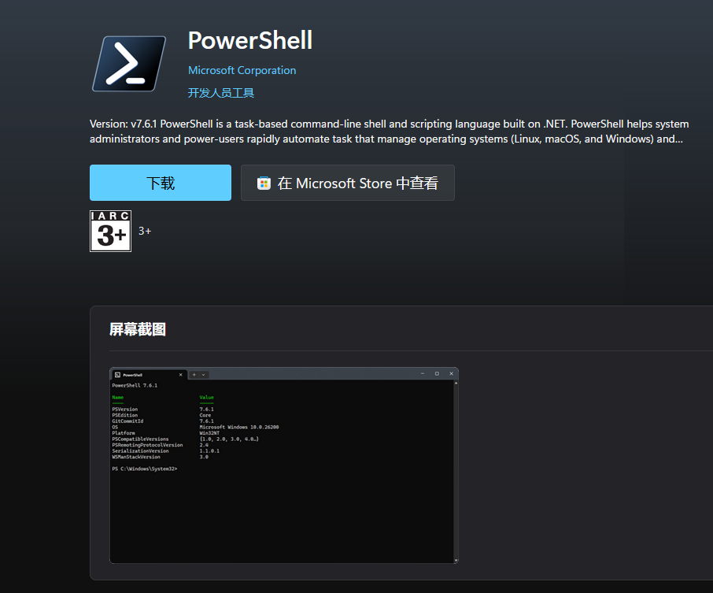
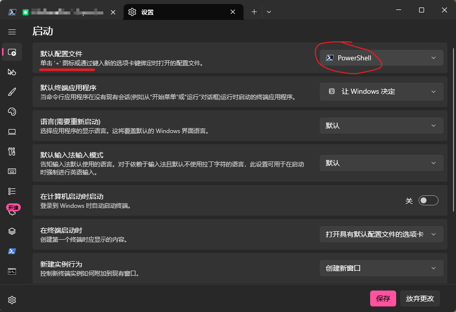
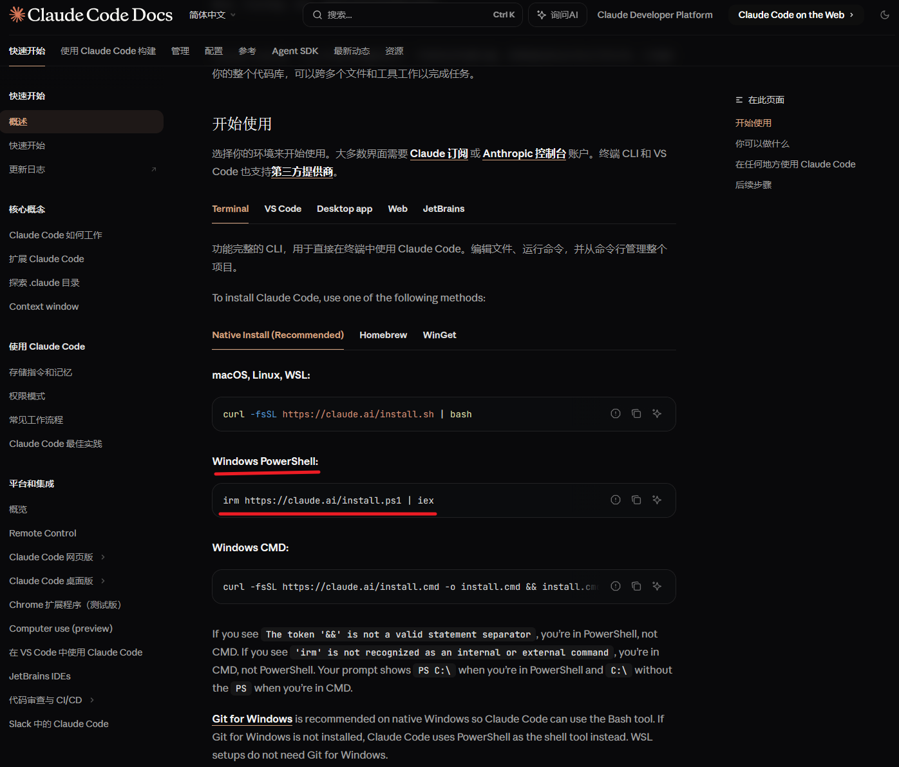
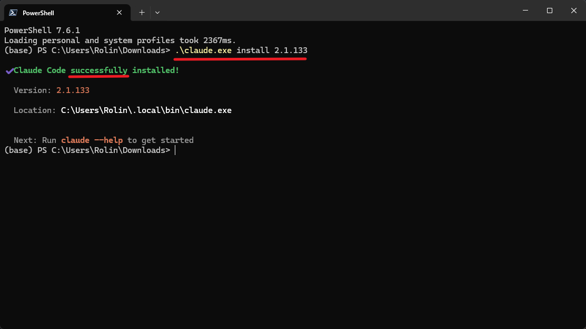
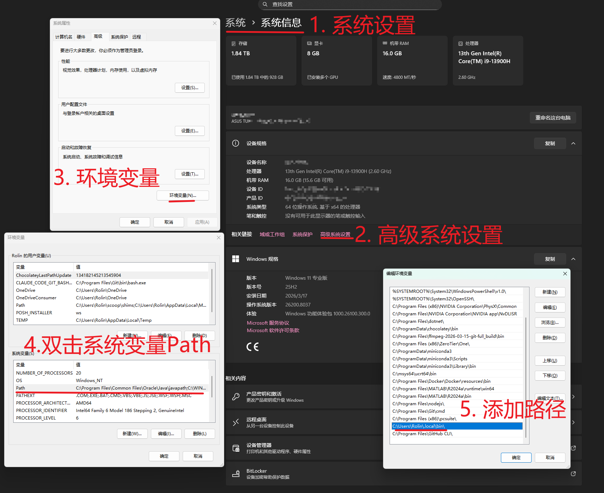
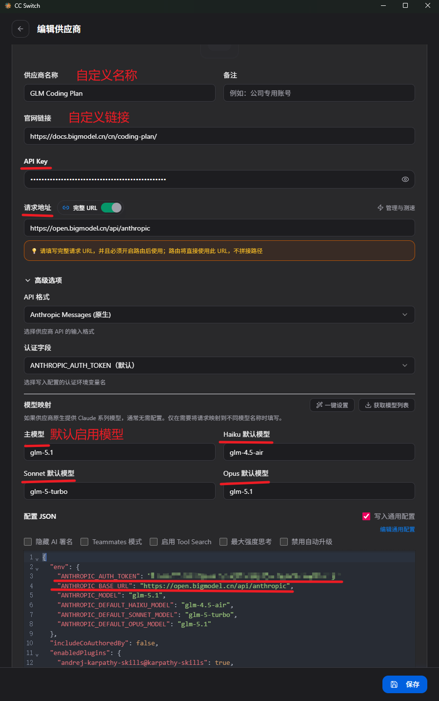
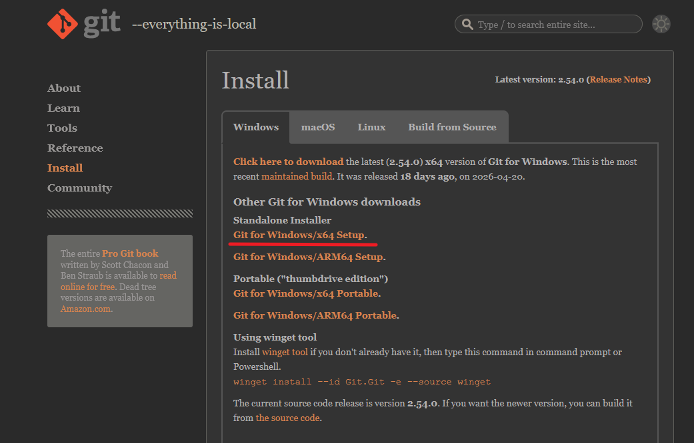

# 相关链接

- [Claude Code Docs 中文文档](https://code.claude.com/docs/zh-CN/overview)
- [Powershell - Microsoft Store](https://apps.microsoft.com/detail/9mz1snwt0n5d?hl=zh-CN&gl=SG)
- [CC-Switch](https://ccswitch.ai/)
- [Git For Windows](https://git-scm.com/install/windows)
- [Git Book中文版](https://git-scm.com/book/zh/v2)

本文基础平台为Windows操作系统。(WSL操作逻辑同Linux)

# Windows终端

按`win+x`组合键，点击**终端**会打开`Windows PowerShell`终端，但这是早期的`version5`版本，我们需要在[微软应用商店](https://apps.microsoft.com/)里下载`version7`版本，应用名称为`PowerShell`。




随后呼出终端，右键顶部选择设置，将默认终端选择为`PowerShell`，输入如下命令检查版本：

```bash
# 检查PowerShell版本
$PSVersionTable.PSVersion
```

# ClaudeCode安装



## Native原生安装解耦

在官方文档中，推荐的原生安装命令为：

```bash
irm https://claude.ai/install.ps1 | iex
```

但由于国内网络问题，通常是无法持续正常访问的，因此我对脚本进行了解耦：

```ps1
param(
    [Parameter(Position=0)]
    [ValidatePattern('^(stable|latest|\d+\.\d+\.\d+(-[^\s]+)?)$')]
    [string]$Target = "latest"
)

Set-StrictMode -Version Latest
$ErrorActionPreference = "Stop"
$ProgressPreference = 'SilentlyContinue'

# Check for 32-bit Windows
if (-not [Environment]::Is64BitProcess) {
    Write-Error "Claude Code does not support 32-bit Windows. Please use a 64-bit version of Windows."
    exit 1
}

$DOWNLOAD_BASE_URL = "https://downloads.claude.ai/claude-code-releases"
$DOWNLOAD_DIR = "$env:USERPROFILE\.claude\downloads"

# Use native ARM64 binary on ARM64 Windows, x64 otherwise
if ($env:PROCESSOR_ARCHITECTURE -eq "ARM64") {
    $platform = "win32-arm64"
} else {
    $platform = "win32-x64"
}
New-Item -ItemType Directory -Force -Path $DOWNLOAD_DIR | Out-Null

# Always download latest version (which has the most up-to-date installer)
try {
    $version = Invoke-RestMethod -Uri "$DOWNLOAD_BASE_URL/latest" -ErrorAction Stop
}
catch {
    Write-Error "Failed to get latest version: $_"
    exit 1
}

try {
    $manifest = Invoke-RestMethod -Uri "$DOWNLOAD_BASE_URL/$version/manifest.json" -ErrorAction Stop
    $checksum = $manifest.platforms.$platform.checksum

    if (-not $checksum) {
        Write-Error "Platform $platform not found in manifest"
        exit 1
    }
}
catch {
    Write-Error "Failed to get manifest: $_"
    exit 1
}

# Download and verify
$binaryPath = "$DOWNLOAD_DIR\claude-$version-$platform.exe"
try {
    Invoke-WebRequest -Uri "$DOWNLOAD_BASE_URL/$version/$platform/claude.exe" -OutFile $binaryPath -ErrorAction Stop
}
catch {
    Write-Error "Failed to download binary: $_"
    if (Test-Path $binaryPath) {
        Remove-Item -Force $binaryPath
    }
    exit 1
}

# Calculate checksum
$actualChecksum = (Get-FileHash -Path $binaryPath -Algorithm SHA256).Hash.ToLower()

if ($actualChecksum -ne $checksum) {
    Write-Error "Checksum verification failed"
    Remove-Item -Force $binaryPath
    exit 1
}

# Run claude install to set up launcher and shell integration
Write-Output "Setting up Claude Code..."
try {
    if ($Target) {
        & $binaryPath install $Target
    }
    else {
        & $binaryPath install
    }
}
finally {
    try {
        # Clean up downloaded file
        # Wait a moment for any file handles to be released
        Start-Sleep -Seconds 1
        Remove-Item -Force $binaryPath
    }
    catch {
        Write-Warning "Could not remove temporary file: $binaryPath"
    }
}

Write-Output ""
Write-Output "$([char]0x2705) Installation complete!"
Write-Output ""
```

根据脚本内容，我们先要获取版本号，访问`https://downloads.claude.ai/claude-code-releases/latest`即可。

然后获取`claude.exe`本体，下载链接(以x64平台为例)为`https://downloads.claude.ai/claude-code-releases/2.1.133/win32-x64/claude.exe`，如果后有更新，可以更改这里的版本号获取最新版。

随后指定版本号并执行程序即可(这一步仍需要科学上网TUN模式)：`.\claude.exe install 2.1.133`



这时，我们需要将Claude的程序目录`C:\Users\<yourname>\.local\bin\`添加进系统环境变量，以便于直接`claude`命令启动。



## ClaudeCode镜像安装脚本

根据上文解耦的内容，并结合[mitmproxy](https://www.mitmproxy.org/)分析，我制作了如下的镜像安装脚本，你只需要在`powershell7`中运行命令即可：

```bash
irm https://blog.srprolin.top/install-claude-mirror.ps1 | iex
```

目前，该脚本的`claude.exe`已经不再提供支持，仅给出如下的离线脚本内容：

```PowerShell
# Claude Code 国内镜像安装脚本
# 用法: irm https://blog.srprolin.top/install.ps1 | iex

Set-StrictMode -Version Latest
$ErrorActionPreference = "Stop"
$ProgressPreference = 'SilentlyContinue'

$VERSION = "2.1.181"
$DOWNLOAD_URL = "https://path/to/claude.exe"
$REFERER = "https://blog.srprolin.top"

if (-not [Environment]::Is64BitProcess) {
    Write-Error "Claude Code does not support 32-bit Windows."
    exit 1
}

# ─── 检测 PowerShell 版本 ───
if ($PSVersionTable.PSVersion.Major -lt 7) {
    Write-Host ""
    Write-Host "Warning: Windows PowerShell 5 CANNOT display Chinese characters." -ForegroundColor Yellow
    Write-Host "  PowerShell 7 is recommended: https://apps.microsoft.com/detail/9mz1snwt0n5d?hl=zh-CN&gl=SG" -ForegroundColor Cyan
    Write-Host ""
}

$installDir = "$env:USERPROFILE\.local\bin"
$binaryPath = "$installDir\claude.exe"
$settingsPath = "$env:USERPROFILE\.claude\settings.json"

function Ensure-Settings {
    $claudeDir = "$env:USERPROFILE\.claude"
    if (-not (Test-Path $claudeDir)) {
        New-Item -ItemType Directory -Force -Path $claudeDir | Out-Null
        Write-Host "    已创建 .claude 配置目录" -ForegroundColor DarkGray
    }
    if (Test-Path $settingsPath) {
        Write-Host "    settings.json 已存在，跳过配置" -ForegroundColor DarkGray
    }
    else {
        $settingsContent = @'
{
  "env": {
    "ANTHROPIC_BASE_URL": "",
    "ANTHROPIC_AUTH_TOKEN": "",
    "ANTHROPIC_MODEL": "claude-opus-4-8[1m]",
    "ANTHROPIC_DEFAULT_OPUS_MODEL": "claude-opus-4-8[1m]",
    "ANTHROPIC_DEFAULT_SONNET_MODEL": "claude-sonnet-4-6[1m]",
    "ANTHROPIC_DEFAULT_HAIKU_MODEL": "claude-haiku-4-5",
    "CLAUDE_CODE_AUTO_COMPACT_WINDOW": "1000000",
    "CLAUDE_CODE_DISABLE_NONESSENTIAL_TRAFFIC": "1"
  },
  "permissions": {
    "allow": [],
    "deny": []
  }
}
'@
        Set-Content -Path $settingsPath -Value $settingsContent -Encoding UTF8
        Write-Host "    已生成默认 settings.json" -ForegroundColor DarkGray
        Write-Host "    ⚠ 填入 API Key 和请求地址后即可使用，脚本末尾可打开编辑。" -ForegroundColor Yellow
    }
}
function Prompt-OpenSettings {
    if (-not (Test-Path $settingsPath)) { return }
    Write-Host ""
    $open = Read-Host "    是否用记事本打开 settings.json 进行编辑？ [Y/n]"
    if ($open -ne "n" -and $open -ne "N") {
        Notepad.exe $settingsPath
    }
}

# ─── 检测已安装 ───
$existingClaude = Get-Command claude -ErrorAction SilentlyContinue
if ($existingClaude) {
    $installedVersion = & $existingClaude.Source --version 2>&1
    Write-Host ""
    Write-Host "⚠ Claude Code 已安装" -ForegroundColor Yellow
    Write-Host "   当前版本: $installedVersion" -ForegroundColor DarkGray
    Write-Host "   最新镜像版本: $VERSION" -ForegroundColor Cyan
    Write-Host "   路径: $($existingClaude.Source)" -ForegroundColor DarkGray
    Write-Host ""
    Write-Host "    [1] 升级 (卸载后重新安装)" -ForegroundColor White
    Write-Host "    [2] 卸载" -ForegroundColor White
    Write-Host "    [3] 编辑配置文件" -ForegroundColor White
    Write-Host ""
    $action = Read-Host "    请选择操作 [1/2/3] (默认 1)"
    if ($action -eq "3") {
        Prompt-OpenSettings
        exit 0
    }

    # 卸载：同时处理 npm 安装和原生安装
    $uninstalled = $false

    # npm 安装方式
    $npmExe = Get-Command npm -ErrorAction SilentlyContinue
    if ($npmExe) {
        $npmList = & npm list -g @anthropic-ai/claude-code 2>&1
        if ($npmList -match "@anthropic-ai/claude-code") {
            Write-Host "==> 检测到 npm 安装，正在卸载 ..." -ForegroundColor Cyan
            & npm uninstall -g @anthropic-ai/claude-code
            $uninstalled = $true
        }
    }

    # 原生安装方式
    if (Test-Path $binaryPath) {
        Write-Host "==> 检测到原生安装，正在删除 ..." -ForegroundColor Cyan
        Remove-Item -Force $binaryPath
        $uninstalled = $true
    }

    if ($uninstalled) {
        Write-Host "    已卸载 ✓" -ForegroundColor Green
    }
    else {
        Write-Host "    未检测到安装文件，跳过卸载" -ForegroundColor DarkGray
    }

    if ($action -eq "2") { exit 0 }
    Write-Host ""
}

# ─── 检测 Node.js ───
$nodeExe = Get-Command node -ErrorAction SilentlyContinue
if ($nodeExe) {
    $nodeVersion = & $nodeExe.Source --version 2>&1
    Write-Host "    Node.js $nodeVersion 已就绪" -ForegroundColor DarkGray
    Write-Host ""
    Write-Host "    检测到 Node.js，可通过 npm 安装官方原版 Claude Code。" -ForegroundColor Cyan
    Write-Host ""
    Write-Host "    [1] npm 安装 (官方原版)" -ForegroundColor White
    Write-Host "    [2] 原生安装 (镜像)" -ForegroundColor White
    Write-Host ""
    $choice = Read-Host "    请选择安装方式 [1/2] (默认 1)"
    if ($choice -ne "2") {
        Write-Host ""
        Write-Host "==> 正在通过 npm 安装 Claude Code ..." -ForegroundColor Cyan
        try {
            & npm install -g @anthropic-ai/claude-code
            $npmClaude = Get-Command claude -ErrorAction SilentlyContinue
            if ($npmClaude) {
                Write-Host ""
                Write-Host "✅ 安装完成!" -ForegroundColor Green
                Write-Host "   $(& $npmClaude.Source --version 2>&1)" -ForegroundColor DarkGray
            }
        }
        catch {
            Write-Error "npm 安装失败: $_"
            exit 1
        }
        Ensure-Settings
        Prompt-OpenSettings
        exit 0
    }
}

# ─── 下载 ───
Write-Host "==> 正在下载 Claude Code v$VERSION ..." -ForegroundColor Cyan
$tempPath = "$env:TEMP\claude-code-install.exe"

try {
    $webClient = New-Object System.Net.WebClient
    $webClient.Headers.Add("Referer", $REFERER)

    # Get total size via HEAD request
    $totalBytes = 0
    $totalMB = "?"
    try {
        $headRequest = [System.Net.WebRequest]::Create($DOWNLOAD_URL)
        $headRequest.Method = "HEAD"
        $headRequest.Headers.Add("Referer", $REFERER)
        $headResponse = $headRequest.GetResponse()
        $totalBytes = $headResponse.ContentLength
        $headResponse.Close()
        if ($totalBytes -gt 0) { $totalMB = [math]::Round($totalBytes / 1MB, 1) }
    }
    catch { }

    # Download asynchronously without event handlers (avoids runspace threading issues)
    $webClient.DownloadFileAsync($DOWNLOAD_URL, $tempPath)

    $barLen = 30
    while ($webClient.IsBusy) {
        Start-Sleep -Milliseconds 300
        if (-not (Test-Path $tempPath)) { continue }
        $currentSize = (Get-Item $tempPath).Length
        $received = [math]::Round($currentSize / 1MB, 1)
        if ($totalBytes -gt 0) {
            $pct = [math]::Floor($currentSize / $totalBytes * 100)
            $filled = [math]::Floor($barLen * $pct / 100)
            $empty = $barLen - $filled
            $bar = ("█" * $filled) + ("░" * $empty)
            Write-Host "`r    [$bar] $pct%  $received/$totalMB MB" -NoNewline -ForegroundColor Yellow
        }
        else {
            Write-Host "`r    下载中 ... $received MB" -NoNewline -ForegroundColor Yellow
        }
    }

    Write-Host ""
    if (-not (Test-Path $tempPath)) { throw "下载完成但文件不存在" }
    Write-Host "    下载完成 ✓" -ForegroundColor Green
}
catch {
    Write-Error "下载失败: $_"
    if (Test-Path $tempPath) { Remove-Item -Force $tempPath }
    exit 1
}

# ─── 校验大小 ───
$size = (Get-Item $tempPath).Length
if ($size -lt 100MB) {
    Write-Error "文件异常 ($([math]::Round($size/1MB,1)) MB)，可能下载不完整或被拦截。"
    Remove-Item -Force $tempPath
    exit 1
}

# ─── 部署 ───
Write-Host "==> 正在部署到 $installDir ..." -ForegroundColor Cyan
New-Item -ItemType Directory -Force -Path $installDir | Out-Null
if (Test-Path $binaryPath) { Remove-Item -Force $binaryPath }
Copy-Item -Path $tempPath -Destination $binaryPath -Force
Remove-Item -Force $tempPath -ErrorAction SilentlyContinue

# ─── PATH ───
$machinePath = [Environment]::GetEnvironmentVariable("Path", "Machine")
$userPath = [Environment]::GetEnvironmentVariable("Path", "User")
$inMachine = $machinePath -like "*$installDir*"
$inUser = $userPath -like "*$installDir*"

if ($inMachine -or $inUser) {
    Write-Host "    PATH 已配置" -ForegroundColor DarkGray
}
else {
    $pathSet = $false
    try {
        [Environment]::SetEnvironmentVariable("Path", "$machinePath;$installDir", "Machine")
        Write-Host "    系统 PATH 已更新 (新终端生效)" -ForegroundColor DarkGray
        $pathSet = $true
    }
    catch {
        try {
            [Environment]::SetEnvironmentVariable("Path", "$userPath;$installDir", "User")
            Write-Host "    用户 PATH 已更新 (新终端生效)" -ForegroundColor DarkGray
            $pathSet = $true
        }
        catch { }
    }
    if ($pathSet) {
        $env:Path = "$env:Path;$installDir"
    }
    else {
        Write-Host "    ⚠ 自动设置 PATH 失败，请手动将以下路径添加到系统 PATH:" -ForegroundColor Yellow
        Write-Host "      $installDir" -ForegroundColor White
    }
}

Ensure-Settings

Write-Host ""
Write-Host "✅ 安装完成!" -ForegroundColor Green
Write-Host "   $(& $binaryPath --version 2>&1)" -ForegroundColor DarkGray
Write-Host "   $binaryPath" -ForegroundColor DarkGray

Prompt-OpenSettings
```

# CC-Switch应用

前往[CC-Switch](https://ccswitch.ai/)官网下载该应用，下面是该项目的简介：

> CC Switch 把供应商切换、MCP / Prompts / Skills、代理接管、会话检索和云同步收进同一个桌面应用，你不再需要反复手改 JSON、TOML 或 .env。



这里以`GLM Coding Plan`的配置为例，`API KEY`、**请求地址**和**主模型**是最重要的三个配置，这里也对应到`settings.json`文件中的配置，随后启动`ClaudeCode`就可以跳过登录了。

# ClaudeCode基础使用

```bash
# 进入项目文件夹
cd ./pjc1/

# 启动参数
# 新会话启动
claude
# 继续上次对话启动
claude -c
# 自动式(完全权限)启动
claude --dangerously-skip-permissions

# 使用过程中
# 检查安装情况
/doctor
# 加载之前的会话上下文
/resume
# 清除上下文
/clear
# 显示上下文占用
/context
# 适时压缩上下文
/compact
# 回滚历史会话与修改 (快捷键：两次Esc)
/rewind
# 审查做出的代码更改 (自动调优review)
/simplify
# 创建项目记忆文件 (CLAUDE.md)
/init
# 编辑记忆文件 (全局/项目/文件夹)
/memory
# 创建子agent (subagents)
/agent
# 指定文件
@anyfile.md
# 退出ClaudeCode会话 (快捷键：两次Ctrl+C)
/exit

# 命令帮助
/help
# 配置信息
/config
# 模型更改
/model
# Skill工具
/skills
# MCP工具
/mcp
# ClaudeCode插件
/plugin
```

| 快捷键          | 说明                          |
| --------------- | ----------------------------- |
| `Shift+Tab`   | 切换工作模式                  |
| `Ctrl+Enter`  | 换行                          |
| `Esc`         | 取消当前操作 / 退出           |
| `! <command>` | 直接执行 shell 命令并返回输出 |

# Git For Windows



请前往 [Git For Windows](https://git-scm.com/install/windows) 官网进行下载，关于`Git`相关的命令可以参考[Git Book中文版](https://git-scm.com/book/zh/v2)并结合`Agent`来学习应用。

首先，`Git`本身作为代码版本管理工具，具有非常大的作用，方便我们随时保存和恢复代码版本；

其次在Windows系统下，`Shell`工具只有`PowerShell`和`CMD`，像`Bash`工具就需要通过`WSL`在Linux子系统中使用；

但`Git Bash`随着`Git`安装也会被安装，这就很好的为`Agent`提供了良好的命令行`Shell`环境，这也是`ClaudeCode`官方文档中推荐安装的原因。
