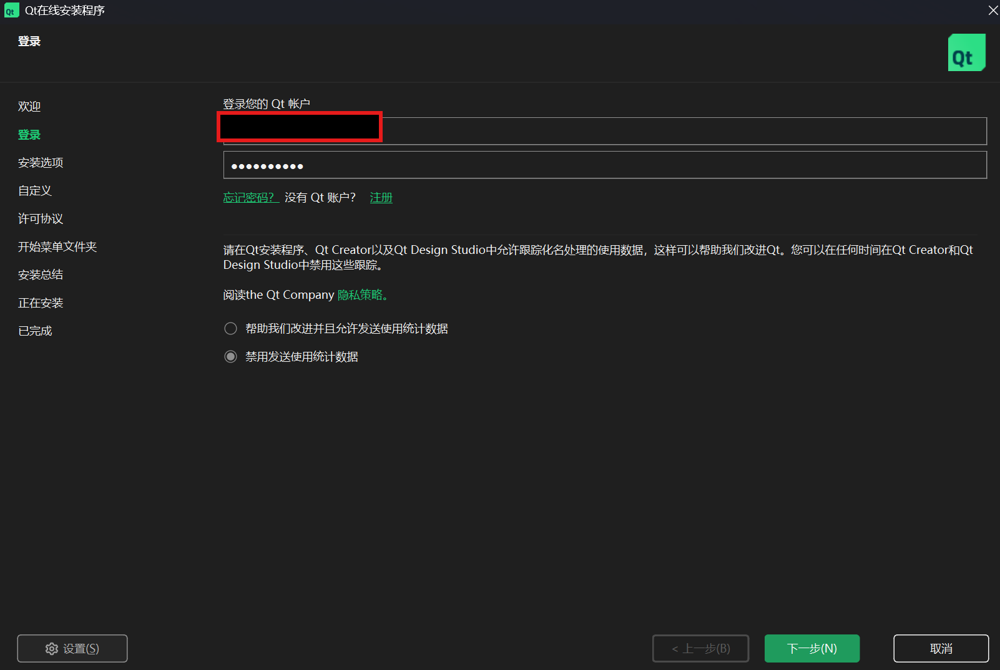

# 相关链接

- [Qt6 Online installer](https://www.qt.io/zh-cn/development/download)
- [Visual Studio 2022 Build Tools](https://visualstudio.microsoft.com/zh-hans/vs/older-downloads/)
- [Scoop](https://scoop.sh/)
- [Ninja](https://ninja-build.org/)
- [Cmake](https://cmake.org/)
- [VScode](https://code.visualstudio.com/)
- [Qt Extensions](https://marketplace.visualstudio.com/items?itemName=TheQtCompany.qt)
- [KDE frameworks](https://develop.kde.org/products/frameworks)

# Qt Online Installer

- [qt-online-installer-windows-x64-4.11.0.exe](https://qt.mirror.constant.com/archive/online_installers/4.11/qt-online-installer-windows-x64-4.11.0.exe)
上面是一个qt的下载直链，复制粘贴到地址栏即可直接进行下载。

## Qt Group

Qt是一个开源工具，提供商业许可与开源许可，使用Qt的Online-Installer，需要在QtGroup注册一个账号，在GUI界面也需要进行登录。




## GUI选项

仅选择Qt-SDK即可，其他可按需安装：


# VS2022-BuildTools

- [vs_BuildTools.exe](https://download.visualstudio.microsoft.com/download/pr/bc92e2cb-33de-4a0c-995d-efa817f16b16/985969f472caad75d993a5cb4c35a6a4271460cc12b343e2433b994d173aa990/vs_BuildTools.exe)

上面直链下载完成后，仅勾选MSVC编译器和Windows-SDK即可：


# Scoop (ninja+cmake)

 Scoop是一个Windows的包管理器，可以在powershell中使用命令快速安装软件包，为了更快速的安装，可以对scoop软件仓库进行换源，先安装一下scoop：

```powershell
# 官方安装命令
Set-ExecutionPolicy -ExecutionPolicy RemoteSigned -Scope CurrentUser
Invoke-RestMethod -Uri https://get.scoop.sh | Invoke-Expression

# 添加main仓库源(替换为南大的软仓)
scoop bucket add main https://mirror.nju.edu.cn/git/scoop-main.git
scoop bucket add extras https://mirror.nju.edu.cn/git/scoop-extras.git
scoop bucket add versions https://mirror.nju.edu.cn/git/scoop-versions.git
scoop bucket add nerd-fonts https://mirror.nju.edu.cn/git/scoop-nerd-fonts.git

# 社区仓库
scoop bucket add dorado https://github.com/chawyehsu/dorado

# 安装ninja和cmake
scoop install ninja 
scoop install cmake

# 安装python3.11(如果已安装可忽略)
scoop install python311
```

# VScode Settings

`.vscode/settings.json`

```json
{
  "cmake.generator": "Ninja",
  "cmake.preferredGenerators": [
    "Ninja"
  ],

  "cmake.cmakePath": "cmake",

  "cmake.buildDirectory": "${workspaceFolder}/build/${buildType}",

  "cmake.configureSettings": {
    "CMAKE_PREFIX_PATH": "C:/Qt/6.11.2/msvc2022_64",
    "CMAKE_EXPORT_COMPILE_COMMANDS": true
  },

  "C_Cpp.default.configurationProvider": "ms-vscode.cmake-tools",
  "C_Cpp.default.cppStandard": "c++17",
  "C_Cpp.intelliSenseEngine": "default"
}
```

`.vscode/launch.json`

```json
{
  "version": "0.2.0",
  "configurations": [
    {
      "name": "Launch (MSVC + Qt 6.11.2)",
      "type": "cppvsdbg",
      "request": "launch",
      // 动态跟踪 CMake 当前选择的激活目标程序
      "program": "${command:cmake.launchTargetPath}",
      "args": [],
      "stopAtEntry": false,
      "cwd": "${workspaceFolder}",
      "environment": [
        {
          // 注入 Qt bin 路径，确保运行时能正确寻址 Qt6 核心动态库
          "name": "PATH",
          "value": "C:/Qt/6.11.2/msvc2022_64/bin;${env:PATH}"
        }
      ],
      "console": "integratedTerminal"
    }
  ]
}
```

# KDE-Frameworks (Craft)


在 [KDE-Frameworks](https://develop.kde.org/products/frameworks/) 中，推荐使用这个craft来安装管理kde库，因此我们需要先安装craft（需要管理员权限`powershell`）:

```powershell
Set-ExecutionPolicy -Scope CurrentUser RemoteSigned
# 避免TLS证书问题
python.exe -m pip install --upgrade certifi
# 执行安装脚本
iex ((new-object net.webclient).DownloadString('https://invent.kde.org/packaging/craft/-/raw/master/setup/install_craft.ps1'))
```

下面是交互式终端的一些默认选项：

```powershell
@Rolin ➜ ~ iex ((new-object net.webclient).DownloadString('https://invent.kde.org/packaging/craft/-/raw/master/setup/install_craft.ps1'))
Start to boostrap Craft.
Where to you want us to install Craft
Craft install root: [C:\CraftRoot\]:
Downloading: https://raw.githubusercontent.com/KDE/craft/master/setup/CraftBootstrap.py
C:\Users\Rolin\scoop\apps\python311\current\python.exe C:\CraftRoot\download\CraftBootstrap.py --prefix C:\CraftRoot\ --branch master
Welcome to the Craft setup wizard!
Craft will be installed to: C:\CraftRoot
------------------------------------------------------------------------------------------------------------------------

Select compiler
[0] Mingw-w64, [1] Microsoft Visual Studio 2022 (Default is msvc2022): 1
------------------------------------------------------------------------------------------------------------------------
Craft will use C:_ to create shorter path during builds.
Specify short path root: [C:_]:
------------------------------------------------------------------------------------------------------------------------

Do you want to install a StartMenu entry
[0] Yes, [1] No (Default is Yes): 1
------------------------------------------------------------------------------------------------------------------------

Do you want to enable the support for colored logs
[0] Yes, [1] No (Default is Yes): 0
```

在后续使用craft时，都需要加载执行环境：

```powershell
C:\CraftRoot\craftenv.ps1
```

现在，可以安装常用的KDE Frameworks软件包了：

```powershell
# kconfig: 强大的配置管理系统 
# kcoreaddons: 提供文件操作、插件加载等核心功能扩展 
# ki18n: KDE 的多语言国际化支持 
craft kconfig kcoreaddons ki18n

# kirigami: KDE 旗舰级的跨平台现代自适应 UI 框架（QML 核心） 
# kitemmodels: 增强型的 QML/C++ 数据模型（如高级过滤、排序） 
# karchive: 高效处理 zip、tar 等压缩包的库 
craft kirigami kitemmodels karchive

# kio: 强大的网络与本地文件异步 VFS（虚拟文件系统）管理器 
# knotifications: 系统级通知提醒库 
# kconfigwidgets: 增强型的 UI 控件和菜单管理器 
craft kio knotifications kconfigwidgets
```

## Craft的卸载

```powershell
# 强制终止可能引用了 Craft 路径的后台子进程
Get-Process | Where-Object { $_.Path -like "C:\CraftRoot\*" } | Stop-Process -Force
# 删除文件夹即可(管理员权限)
Remove-Item -Recurse -Force "C:\CraftRoot"
Remove-Item -Recurse -Force "C:_"
```
