# Introduction

Bilibili video (in Chinese): [BV1n7C2BzE11](https://www.bilibili.com/video/BV1n7C2BzE11/)

This article walks you through, step by step:

- Finding where CFG files are stored, tailoring features to your taste, writing CFG files, and applying them successfully;
- Restoring your CFG when necessary, so a bad edit never leaves you stranded;
- Reading the commands behind the settings you changed straight from the files, as a reference while writing CFG files;
- Using or remixing the preset CFG I provide;
- Getting in touch so your own preset can be added to the repository and kept in sync.

# CFG Basics

`CFG` is short for config. Game settings can be written into a file as code, which is extremely handy when you sign in across multiple accounts and devices.

On top of that, some special commands can only be triggered quickly in-game through a `CFG`.

## Where CFG Files Live

First of all, `Steam Cloud` is Valve's feature for backing up save data for single-player players, but it is used in `CS2` as well.

Since a direct connection to Steam in mainland China often can't even open the store or the community, you can imagine how `Steam Cloud` performs — especially because `CS2` calls on it every time it launches. If the network hiccups at the wrong moment, you end up with a `sync failure` that messes up your game settings.

To avoid this chaos, I recommend saving your `CFG` in the local save location and disabling `Steam Cloud` for `CS2`.

Given the above, a `CFG` can live in one of two places:

- `game-wide CFG` (the `local save` mentioned above): `...\SteamLibrary\steamapps\common\Counter-Strike Global Offensive\game\csgo\cfg** or **...\Steam\steamapps\common\Counter-Strike Global Offensive\game\csgo\cfg`
- `per-user CFG` (the location `Steam Cloud` saves to, mentioned above): `...\Steam\userdata\123456789\730\local\cfg`

A few things to keep in mind:

1. Depending on where the game is installed, the `game-wide CFG` folder is one of two paths,
   - It comes down to whether `Steam` itself and the game are installed on the same drive. If the drive letter your game lives on differs from the one `steam` lives on, use the first path; if they match, use the latter.
   - I recommend putting the `CFG` files you actually use in the `game-wide CFG` location.
2. The `123456789` in the `per-user CFG` path is your `steamID` (which doubles as the folder name) and can be used to add friends. If several Steam accounts have signed in on your PC, you will see multiple user folders inside the `userdata` folder.
   - Check the current account's `steamID` under `Steam->Friends->Add Friend`
   - Unlike the `game-wide CFG`, the `per-user CFG` holds more than `CFG` files: it also contains a `cs2_video.txt` config file that controls the game's visual settings, which I will cover later.
   - Location of `cs2_video.txt`: `...\Steam\userdata\123456789\730\local\cfg\cs2_video.txt`

Here is the process for locating the `game-wide CFG` folder visually through the `Steam` app:

1. Open your Steam library, find `Counter-Strike 2`, right-click it and choose Properties

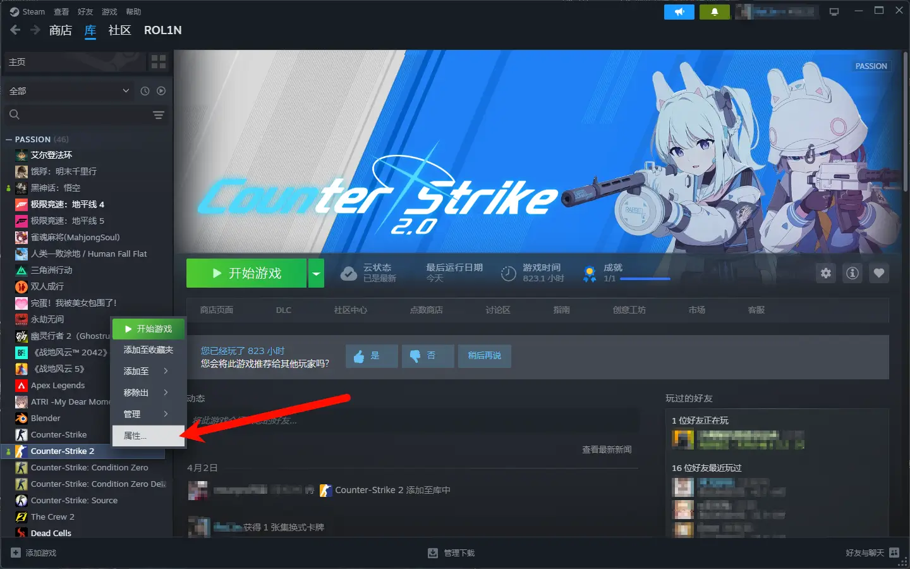

2. Select "Installed Files" and click Browse

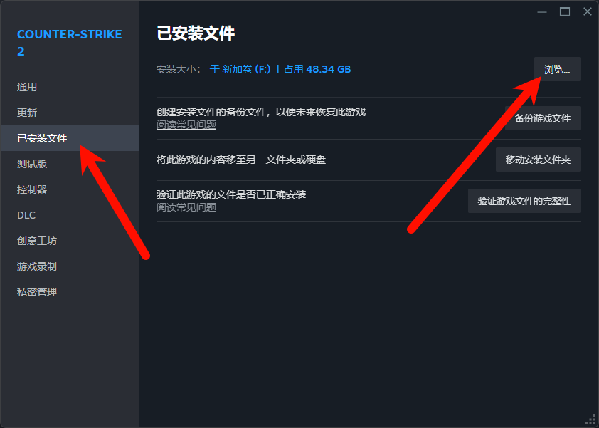

3. Open "`game`", open "`csgo`", select "`cfg`" — this directory is exactly where `cfg` files are stored

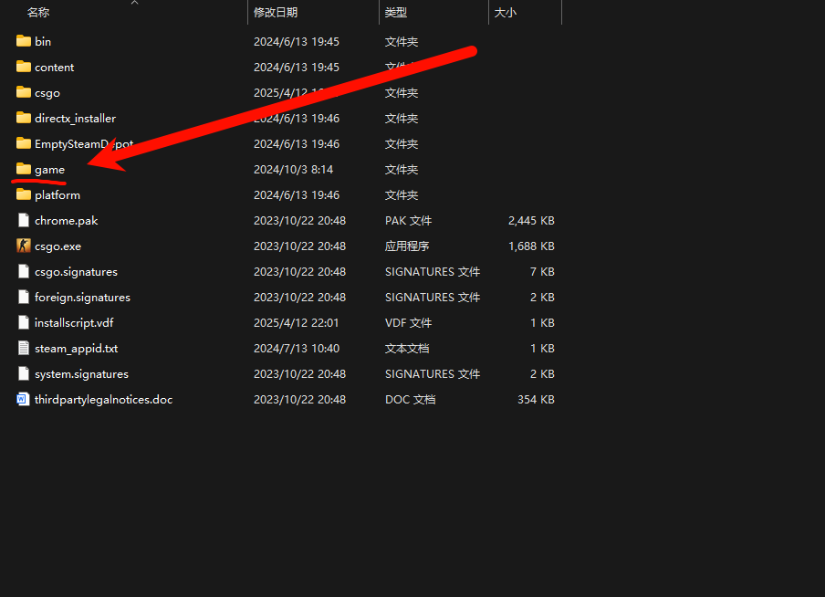

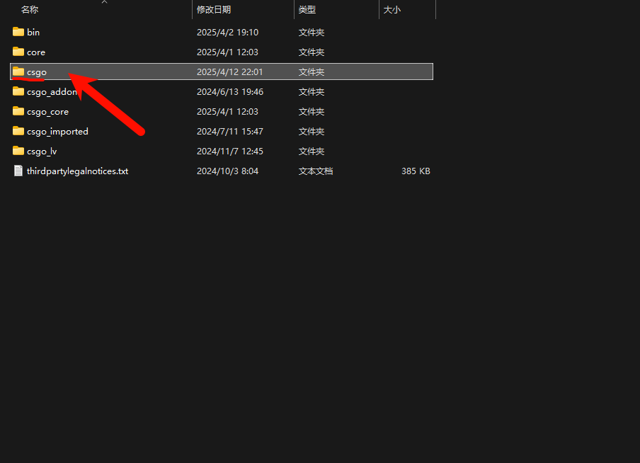

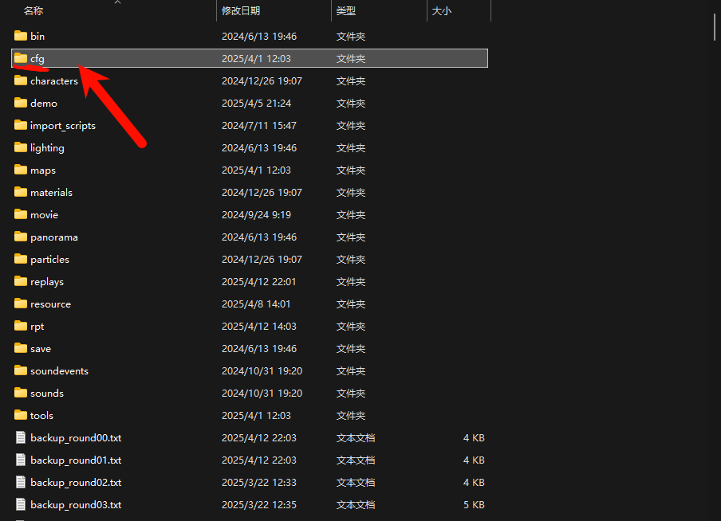

## A Special CFG Template

> `Steam launch options` are commands Steam automatically executes for the game when launching it, and they are found in the `game properties` window mentioned earlier.
> The `exec` command can be understood as `load`: `exec auto.cfg`, for example, loads the `auto.cfg` file. Only this way can the `CFG` actually take effect.

Among all the `CFG` files, one named `autoexec.cfg` is extremely special: whether or not you add an `exec` command to your `Steam` launch options, it is automatically loaded when the game starts, which makes it an ideal place for baseline features.

Here is a template for the `autoexec.cfg` file:

```ini
//keybinds
bind "w" "+forward" //move forward
bind "s" "+back" //move backward
bind "a" "+left" //strafe left
bind "d" "+right" //strafe right
bind "mouse1" "+attack" //primary attack
bind "mouse2" "+attack2" //secondary attack
bind "e" "+use" //use
bind "f" "+lookatweapon" //inspect weapon
bind "space" "+jump"  //jump
bind "ctrl" "+duck"  //crouch
bind "tab" "+showscores" //open the scoreboard
bind "g" "drop"   //drop equipment
bind "m" "teammenu" //choose a team
bind "shift" "+sprint" //walk
bind "b" "buymenu" //buy menu
bind "z" "slot6" //HE grenade
bind "x" "slot7" //flashbang
bind "c" "slot8" //smoke grenade
bind "6" "slot9" //decoy grenade
bind "v" "slot10" //molotov
bind "y" "+spray_menu" //open the graffiti menu
bind "i" "messagemode2"//team chat
bind "u" "messagemode"//all chat
bind "mouse4" "+voicerecord"//open your microphone
bind "mouse5" "player_ping"//player ping marker
bind "mwheeldown" "+jump" //jump with scroll down
bind "mwheelup" "+jump"//jump with scroll up
bind "`" "toggleconsole"//open the console
bind "t" "switchhands"//switch weapon hands
bind "h" "toggleradarscale" //toggle the minimap zoom
bind "ralt" "radio2;slot12" //radio and X-ray

//crosshair
cl_crosshair_drawoutline "0" // disable the crosshair outline
cl_crosshair_dynamic_maxdist_splitratio "1" // maximum split distance ratio of the dynamic crosshair
cl_crosshair_dynamic_splitalpha_innermod "0" // alpha of the inner split of the dynamic crosshair
cl_crosshair_dynamic_splitalpha_outermod "1" // alpha of the outer split of the dynamic crosshair
cl_crosshair_dynamic_splitdist "3" // split distance of the dynamic crosshair
cl_crosshair_friendly_warning "0" // disable the friendly-fire crosshair warning
cl_crosshair_outlinethickness "1" // crosshair outline thickness
cl_crosshair_sniper_show_normal_inaccuracy "0" // disable the sniper crosshair showing normal inaccuracy
cl_crosshair_t "0" // disable the T-shaped crosshair
cl_crosshairalpha "255" // crosshair alpha (255 is fully opaque)
cl_crosshaircolor 5 // set the crosshair color to custom (5 means a custom color)
cl_crosshaircolor_b "255" // blue component of the custom crosshair color (255 is the maximum)
cl_crosshaircolor_g "255" // green component of the custom crosshair color (255 is the maximum)
cl_crosshaircolor_r "0" // red component of the custom crosshair color (0 is the minimum)
cl_crosshairdot "0" // disable the crosshair center dot
cl_crosshairgap "-3.644676" // crosshair gap (a negative value pulls it inward)
cl_crosshairgap_useweaponvalue "0" // disable adjusting the crosshair gap per weapon value
cl_crosshairsize "0.901125" // crosshair size
cl_crosshairstyle "4" // crosshair style, classic static (4 means classic static)
cl_crosshairthickness "0.961664" // crosshair thickness
cl_crosshairusealpha "1" // enable the crosshair alpha setting

//sniper scope line width
cl_crosshair_sniper_width "2"

//mouse sensitivity
sensitivity 0.50

//viewmodel
viewmodel_fov 68 // set the first-person field of view (FOV); higher values widen your view
Viewmodel_offset_x 2.5 // adjust the weapon model offset horizontally (X-axis); positive values move right, negative values left
Viewmodel_offset_y 0 // adjust the weapon model offset vertically (Y-axis); positive values move up, negative values down
Viewmodel_offset_z -1.5 // adjust the weapon model offset in depth (Z-axis); positive values move forward, negative values back
viewmodel_presetpos 2 // use a preset weapon model position (2 means the classic position)

//radar
cl_radar_always_centered "0" // disable always centering the radar on the player, so the radar shows the whole map
cl_radar_scale "0.37" // set the radar zoom level; lower values show a larger area
cl_hud_radar_scale "1" // set the radar zoom level on the HUD; 1 is the default size
cl_teammate_colors_show 2 // set the teammate color display mode; 2 shows teammate outline colors
```

## How to Create a `CFG` File

Before touching `CFG` files, you may have rarely seen a file with the `.cfg` extension. It is a format created specifically for config files.

You can get a `CFG` file by creating a new `.txt` text file and changing its extension to `.cfg`:

1. Create a new text document (a `txt` file) on your desktop; you can write the config directly in this `txt` file (a `.cfg` file can of course also be opened and edited with `Notepad`)

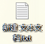

2. Once you are done writing, find the file and change its extension to `.cfg`.
   - If file extensions are not visible, follow the steps below:

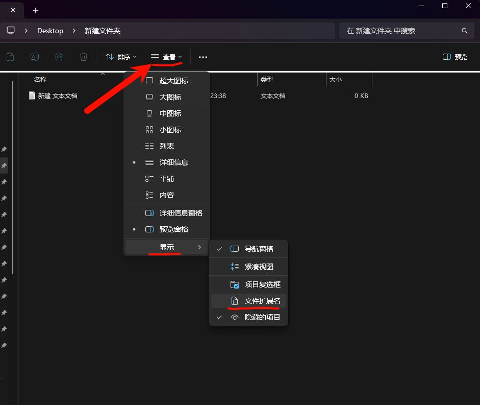

## The Video Settings File

Although the video settings file is saved in `.txt` format, it is also a `Config`, that is, a `CFG`.

Below is a template for the `cs2_video.txt` file. Keep in mind that:

- All comments must be deleted for the file to work properly.
- This file must be placed in the `per-user CFG` directory: `...\Steam\userdata\123456789\730\local\cfg`

```ini
"video.cfg"
{
	"Version"		"16"  // config file version number
	"VendorID"		"4318"  // GPU vendor ID, NVIDIA in this case
	"DeviceID"		"10464"  // GPU device ID, RTX 4060 in this case
	"setting.cpu_level"		"3" // CPU performance tier
	"setting.gpu_mem_level"		"3" // GPU memory performance tier
	"setting.gpu_level"		"3" // GPU performance tier
	"setting.knowndevice"		"0" // preferred GPU device (0 is the primary GPU)
	"setting.monitor_index"		"0" // monitor index (0 is the primary monitor)
	"setting.defaultres"		"1280" // resolution width
	"setting.defaultresheight"		"960" // resolution height
	"setting.aspectratiomode"		"0" // aspect ratio mode (0 is auto, 1 is 4:3, 2 is 16:9)
	"setting.refreshrate_numerator"		"0" // refresh rate numerator (0 means use the default)
	"setting.refreshrate_denominator"		"0" // refresh rate denominator (0 means use the default)
	"setting.fullscreen"		"0" // whether fullscreen mode is enabled (0 is no, 1 is yes)
	"setting.coop_fullscreen"		"1" // whether fullscreen is enabled in co-op mode (1 is yes)
	"setting.nowindowborder"		"1" // whether borderless windowed mode is enabled (1 is yes)
	"setting.fullscreen_min_on_focus_loss"		"0" // whether to minimize the fullscreen window on focus loss (0 is no)
	"setting.high_dpi"		"0" // whether high DPI scaling is enabled (0 is no)
	"setting.mat_vsync"		"0" // whether V-sync is enabled (0 is no, 1 is yes)
	"setting.r_low_latency"		"0" // whether low latency mode is enabled (1 is yes)
	"AutoConfig"		"2" // auto-config level (2 is a custom configuration)
	"setting.msaa_samples"		"2" // multisample anti-aliasing (MSAA) sample count (2 is 2x MSAA)
	"setting.r_csgo_cmaa_enable"		"1" // whether CMAA anti-aliasing is enabled (0 is no)
	"setting.videocfg_shadow_quality"		"3" // global shadow quality (0 is low, 1 is medium, 2 is high, 3 is very high)
	"setting.videocfg_dynamic_shadows"		"1" // whether dynamic shadows are enabled (1 is yes)
	"setting.videocfg_texture_detail"		"1" // model/texture detail (0 is low, 1 is medium, 2 is high)
	"setting.r_texturefilteringquality"		"3" // texture filtering mode (0-5: bilinear, trilinear, anisotropic 2X, 4X, 8X, 16X)
	"setting.shaderquality"		"0" // shader detail (0 is low, 1 is high)
	"setting.videocfg_particle_detail"		"0" // particle detail (0 is low, 1 is medium, 2 is high, 3 is very high)
	"setting.videocfg_ao_detail"		"0" // ambient occlusion (AO) detail (0 is disabled, 2 is medium, 3 is high)
	"setting.videocfg_hdr_detail"		"3" // high dynamic range (-1 is quality, 3 is performance)
	"setting.videocfg_fsr_detail"		"0" // super resolution FSR (0 is disabled; 1, 2, 3, 4 are ultra quality, quality, balanced, performance)
}
```

## Restoring and Backing Up

> Enter the `CS2` game and set `Enable Console` to `Yes` in `Settings`; by default you can then press `` ` `` to open the console
> If that does not work, switch to an `English input method` or press `CAPS` to toggle `Caps Lock`, until `` ` `` is correctly read by the game and opens the console

You tried a `CFG` preset from the internet and now have no idea how to restore your keys? Or you are wondering how you should try someone else's `CFG` preset?

Let's get into the game and open the `console` to solve both problems:

1. Enter `host_writeconfig backup` to generate `backup.cfg`
   - This is a backup of your current keybinds. You need to do it `before trying someone else's CFG preset`; when necessary, enter `exec backup` in the console to restore your original keybind settings
2. Enter `binddefaults` to reset your keybinds to the default keys.
   - At this point, entering `key_listboundkeys` lets you view every keybind in the console output

## Some Fun Console Commands

> Find all console commands in the [CS2 section of the Valve Developer Community](https://developer.valvesoftware.com/wiki/List_of_Counter-Strike_2_console_commands_and_variables)
> You can also enter `cvar list` in-game and the console will output every command.

Once you understand what console commands do, you can bind them to keys and write them into a `CFG` file to trigger them with a single press.

```ini
sv_cheats 1 // enable cheat mode, allowing cheat commands
bot_kick // kick all bots
mp_buy_anywhere 1 // allow buying equipment anywhere
mp_freezetime 0 // set the pre-round freeze time to 0 seconds
mp_maxmoney 99999 // set the maximum amount of money to 99999
mp_startmoney 99999 // set the starting amount of money to 99999
mp_buytime 99999 // set the buy time to 99999 seconds
mp_ignore_round_win_conditions 1 // rounds never end
mp_respawn_on_death_ct 1 // CT side respawns indefinitely
mp_respawn_on_death_t 1 // T side respawns indefinitely
mp_friendlyfire 1 // enable friendly fire
ammo_grenade_limit_total 6 // set the maximum number of grenades you can carry to 6
mp_spectators_max 9 // set the maximum number of spectators to 9
mp_autokick 0 // disable automatic kicking from the server
mp_restartgame 1 // restart the round after 1 second
sv_grenade_trajectory_prac_pipreview 1 // enable the grenade trajectory preview
sv_grenade_trajectory_prac_trailtime 8 // set the grenade trajectory to stay visible for 8 seconds
sv_infinite_ammo 2 // set infinite ammo mode (infinite utility), though reloading is still required
sv_showimpacts 1 // enable bullet impact markers
exec autoexec.cfg // execute the autoexec.cfg config file to load custom settings
key_listboundkeys // list every bound key and its corresponding command
toggle cl_teamid_overhead_mode 1 3 // toggle the teammate overhead ID mode (1 is a simple marker, 3 is detailed)
toggle cl_draw_only_deathnotices 1 0 // toggle whether only death notices are shown (1 is death notices only, 0 is the full HUD)
toggle cl_drawhud_force_radar 1 0 // toggle forcing the radar to show (1 is force show, 0 is normal)
cl_hud_color "11" // set the HUD color to pink
con_enable "1" // enable the console
fps_max 0 // remove the FPS cap and let the game run at its highest frame rate
cl_join_advertise "2" // show that the player plans to join the Counter-Terrorist team
cl_use_opens_buy_menu "0" // disable opening the buy menu by pressing the use key (E) near a buy zone
cl_dm_buyrandomweapons 0 // disable automatically buying random weapons in deathmatch mode
gameinstructor_enable "0" // disable the game instructor
cl_autohelp "false" // disable automatic help tips
mm_dedicated_search_maxping "70" // prefer servers with a ping under 70 milliseconds
func_break_max_pieces 0 // the game generates the default number of pieces based on the object's properties
r_drawtracers_firstperson 1 // enable bullet tracer display in first person
r_fullscreen_gamma 3.0 // adjust the game gamma to 3.0
cl_teamid_overhead_mode 3 // always show teammate names and equipment info
echo AutoConfig Enabled! // print the message "AutoConfig Enabled!" in the console
mp_damage_headshot_only 1 // only headshots deal damage; hits on other body parts do nothing
ent_create chicken // spawn a chicken in the game (just for fun)
custom_bot_difficulty 5 // set the custom BOT difficulty to the maximum (5 is the hardest)
mp_plant_c4_anywhere 1 // allow planting the C4 anywhere
mp_c4timer 40 // set the C4 countdown to 40 seconds
sv_regeneration_force_on 1 // enable automatic health regeneration
cl_showpos 1 // display the player's current position, speed and angles on screen
mp_weapons_glow_on_ground 1 // enable highlighting for weapons on the ground
```

## How to Look Up `CFG` Command Parameters on the Fly

> Since game settings can be `set` through `CFG` files, the parameters of those `game settings` must also be recorded in a `file`; here we want to find exactly those `parameters` to help us write `CFG` files.

Scenario 1: using a `CFG` file to configure your crosshair

`CS2` provides a way to change your crosshair by importing and exporting a `crosshair code`, but even then you still don't know which command's which parameter produced that crosshair's look, and a `CFG` file cannot set a crosshair from a `crosshair code` either;

If you looked closely at the `autoexec.cfg` content above, it is not hard to notice that we change the crosshair with commands like `cl_crosshair_.. "0"`. So where do you find these commands and parameters?

Scenario 2: the target feature is pressing `C` to switch to a smoke grenade, but you don't know which command is `switch to smoke grenade`, and where to find it?

Although the method used in this section to solve the problem is `viewing changed settings in real time`, Scenario 2 can have its corresponding command generated automatically on the [CS2BindGenerator](https://www.cs2bindsgenerator.com/) website.

Scenario 3: the game has a `quick radial menu` feature, and you want to customize the position of each voice command in it and save it. What are their commands?

For all three scenarios above, we can open the file that `saves settings in real time` to see what information the corresponding file holds after we perform an action in the game, so we can identify the command for a given feature:

1. Go to the following path `...\Steam\userdata\123456789\730\local\cfg` and find the file below to open it.

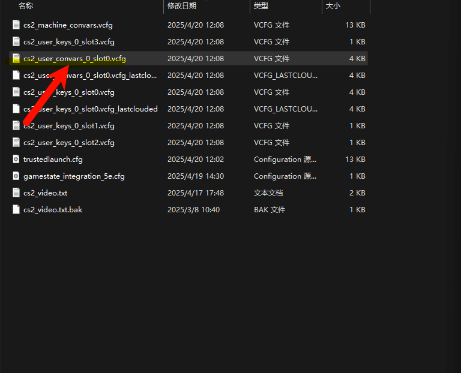

2. The parameters here are the crosshair parameters. After importing a `crosshair code`, reopen or refresh this file and this section of parameters will change; just save it at that point.

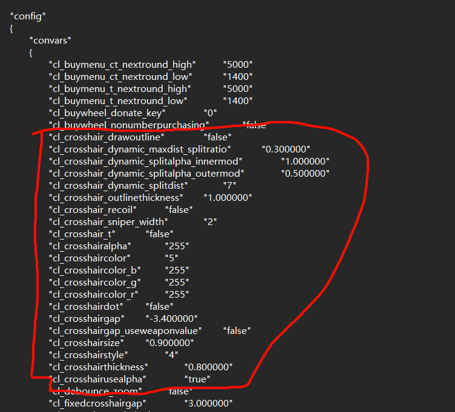

3. The file below holds all keybind operations in real time, so you can view every keybind you just changed.

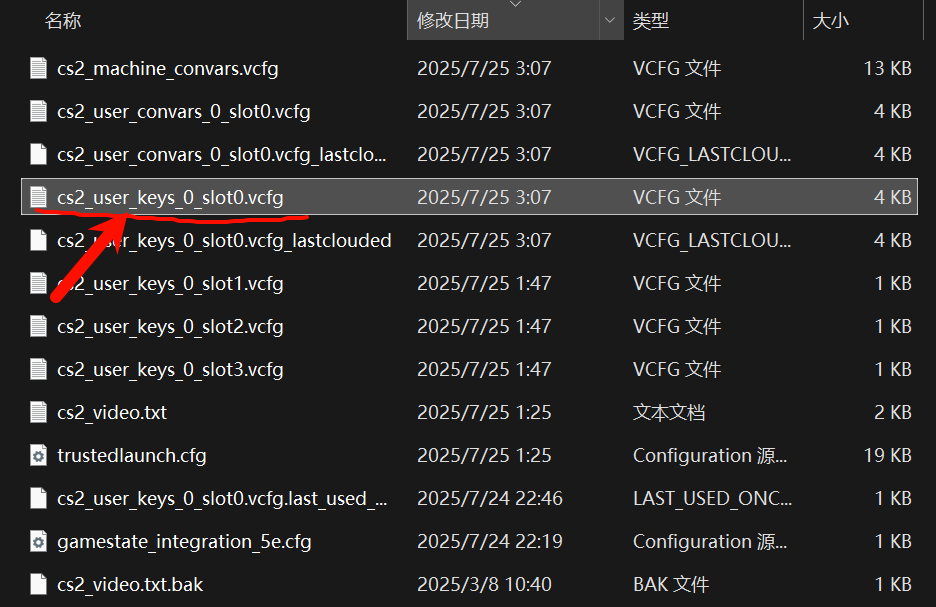

4. The file below contains the voice keyword codes for each slot of the `chatwheel` quick radial menu:

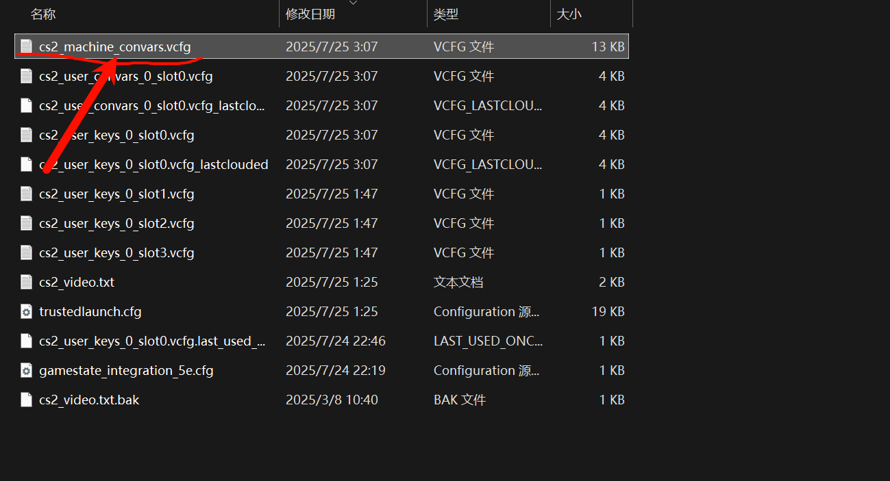

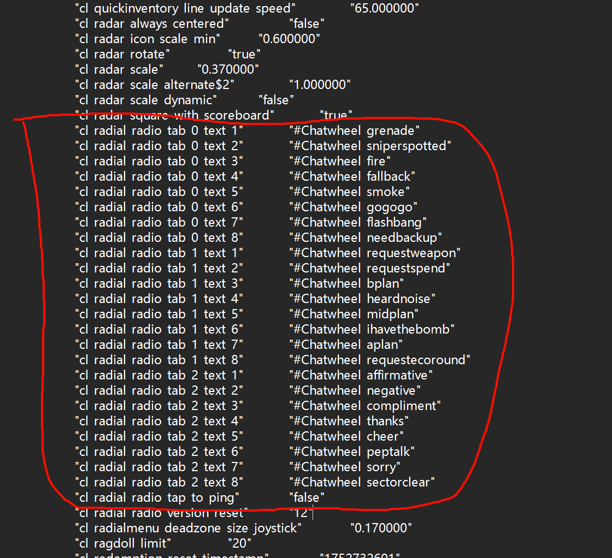

## Setting Launch Options

Launch options are commands executed immediately when the game runs; strictly speaking, this is also a kind of `Config`.

Below are some common launch options. Keep in mind that:

- Each command must be separated by a `space`.

```ini
-novid  //disable intro cutscenes; no longer works in CS2
-high  //raise the CSGO process priority; may actually hurt performance
-nojoy //disable controller support to reduce memory usage
-perfectworld  //connect directly to the Chinese (Perfect World) servers
-worldwide  //connect directly to international servers
-w 1920 -h 1080  //set the resolution to 1920x1080
-noborder //borderless windowed mode
+exec auto.cfg  //load auto.cfg
+fps_max 300  //limit the maximum FPS to 300
-allow_third_party_software  //allow third-party software such as OBS
-noreflex //disable the in-game Reflex feature, which can be enabled in the NVIDIA Control Panel instead
```

Below are my own launch options:

```ini
-allow_third_party_software -worldwide
```

Where to set launch options was covered earlier; below is an illustration of the location:

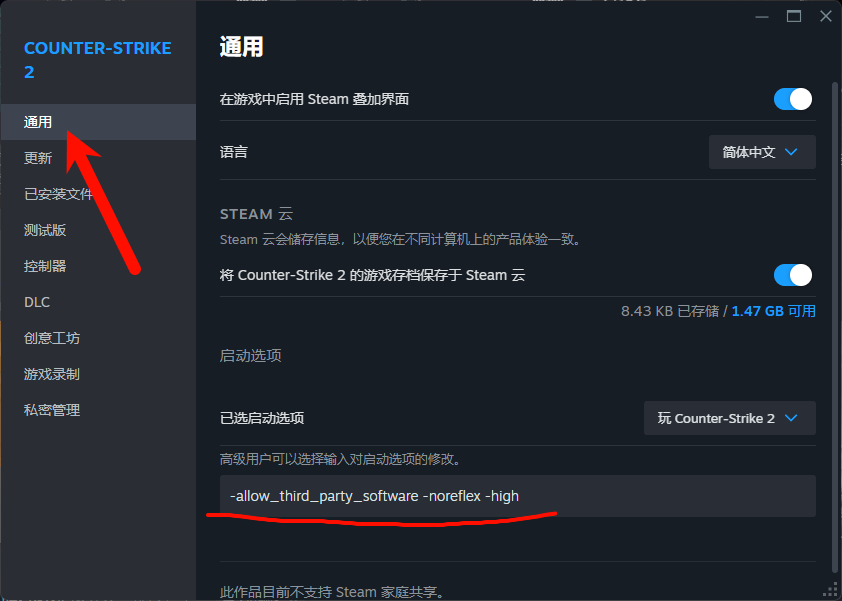

# SrP-CFG_ForCS2

> My `CFG` preset files have already been published in the `GitHub repository` [SrP-CFG_ForCS2](https://github.com/RolinShmily/SrP-CFG_ForCS2)

This is the set of `CFG` preset files I use, covering `CFG` needs across multiple scenarios. I have also developed an official website and a one-click installer for this `CFG` set, and I maintain and update it long-term to keep it reliable and usable.

::github{repo="RolinShmily/SrP-CFG_ForCS2"}

Links you will need:

- [Official website | cfg.srprolin.top](https://cfg.srprolin.top/)
- [Download page | cfg.srprolin.top](https://cfg.srprolin.top/download)
- [Documentation | cfg.srprolin.top](https://cfg.srprolin.top/docs)

Below are some program pages from the SrP-CFG-Installer-V3 version:

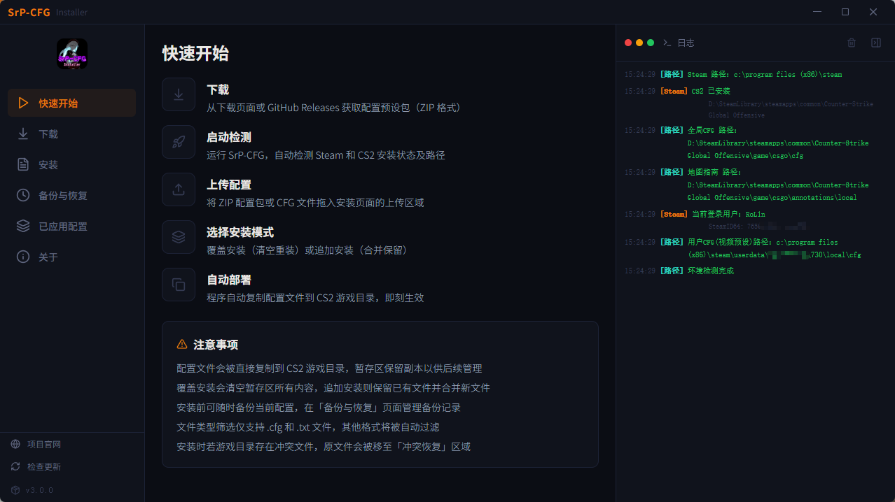
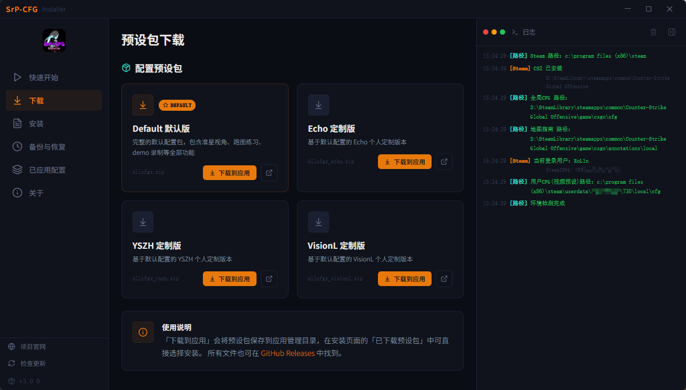
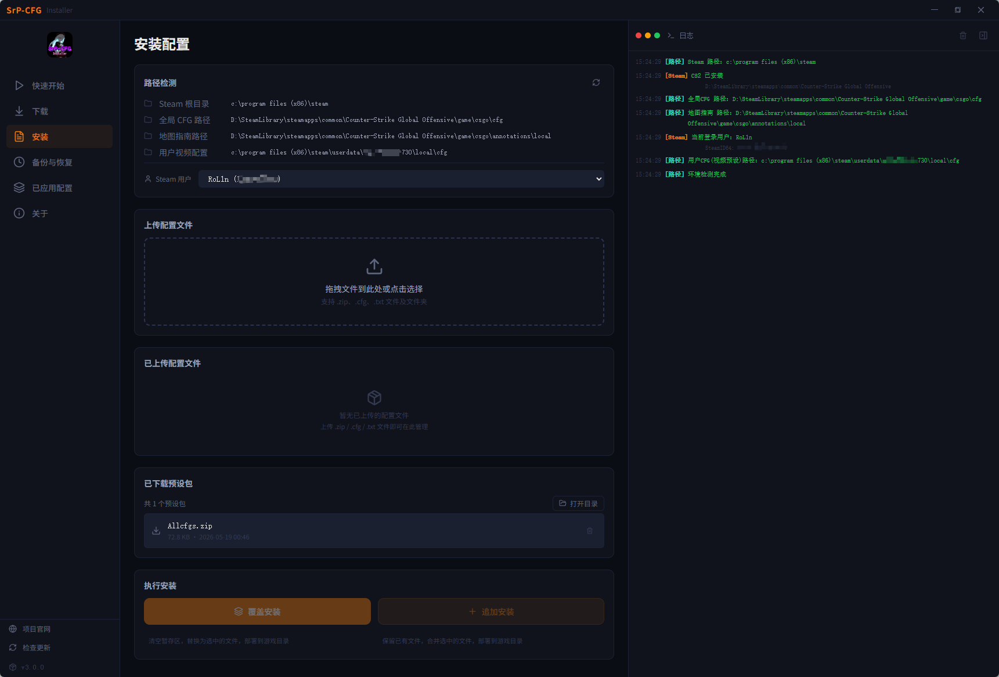
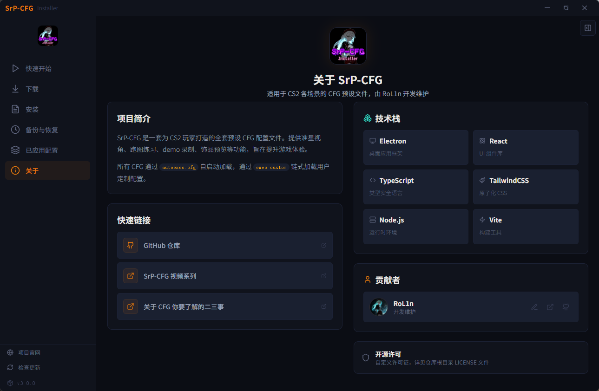
