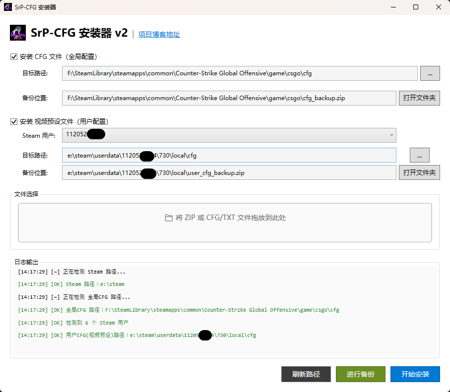
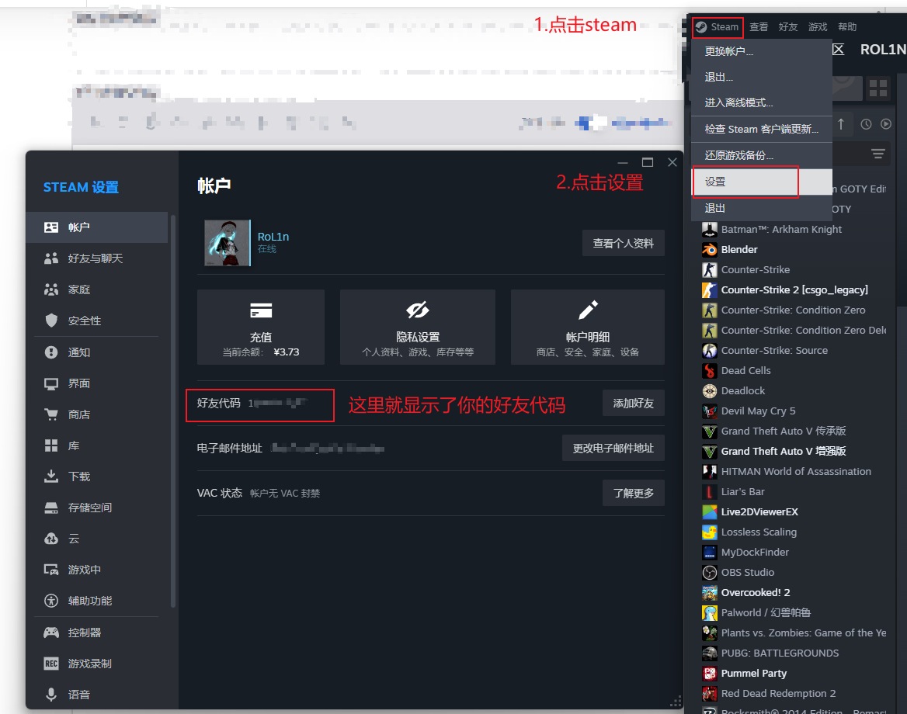
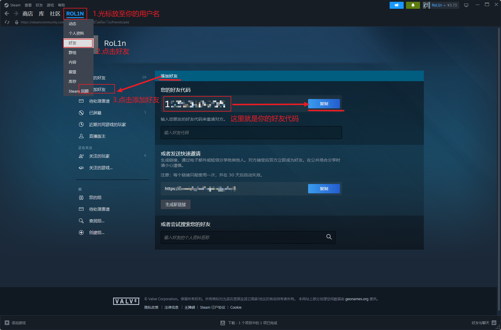

# 前言
为SrP-CFG预设打造，但不限于该预设的CFG安装器，GUI版v2发布，本文将简要描述使用指南。
请先阅读[前篇关于CFG的介绍](https://blog.srprolin.top/posts/srp-cfg/)，必要时阅读[SrP-CFG项目说明书](https://doc.srprolin.top/posts/SrP-CFG_CS2/srpcfg-1.html)。
# 项目地址
::github{repo="RolinShmily/SrP-CFG_ForCS2"}

该安装器仅适用于Windows_x64位系统使用。
# 界面展示

- 默认勾选安装 **CFG文件(全局配置)** 和 **视频预设文件(用户配置)** ，请按需勾选所需要安装的预设。

- 默认的CFG文件安装路径是全局生效(非730)，而视频预设文件只能在730文件夹的用户级目录生效，所以如果您需要安装视频预设文件`cs2_video.txt`,请选定你的steam用户，该码为**steam好友代码**，下一节将提供好友代码的查找细节。

- 文件选择处可以提供单文件形式`.zip`、`.cfg`、`.txt`，也可以选中多个文件/一整个文件夹，选择器会自动滤除掉非`.cfg`和`.txt`类型文件。

- 备份可以单独执行，在安装时也会强制执行一次备份；如果你的备份需要存档，请手动转移位置，或者更改备份文件名；备份位置右侧可以打开文件夹，并自动选中备份文件，便于用户查找。

- 刷新路径按钮，用于手动执行扫描steam安装路径、steam游戏路径、steam用户文件夹，当然如果仍未找到，你可以点击路径右侧的`...`手动指定路径。

- 当一切准备就绪，就可以点击**开始安装**。

- 你的每一步操作都会在日志输出中打印提示信息，如果遇到问题，请先查看日志。

# 你会需要的链接

- [项目说明书](https://doc.srprolin.top/posts/SrP-CFG_CS2/srpcfg-1.html) | 本项目的一些废话
- [下载地址](https://doc.srprolin.top/posts/SrP-CFG_CS2/srpcfg-2.html) | 顾名思义
- [使用指南](https://doc.srprolin.top/posts/SrP-CFG_CS2/srpcfg-3.html) | 按键、控制台命令功能表
- [更新日志](https://doc.srprolin.top/posts/SrP-CFG_CS2/srpcfg-4.html) | 查看最新更新

# steam好友代码查找

如果你有更多方便的查找好友代码的方式，欢迎反馈。

## steam客户端查找
方式1:

方式2:

## steam网页端查找

访问链接：[Steam社区](https://steamcommunity.com/)

请先在右上角登录你的steam账户，随后操作同**客户端**方式2查找一致。

