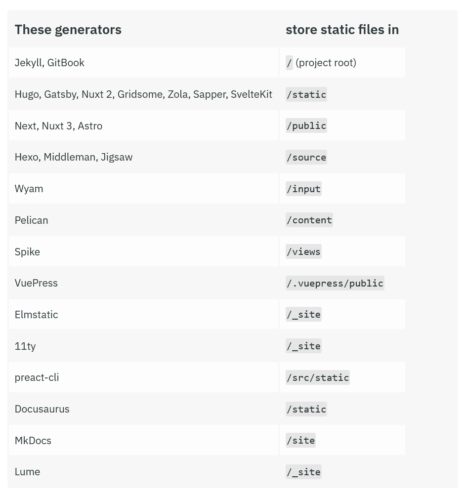

# CMS
> 内容管理系统（英语：content management system，缩写为 CMS）是指在一个合作模式下，用于管理工作流程的一套制度。———— 来自[维基百科](https://zh.wikipedia.org/wiki/%E5%86%85%E5%AE%B9%E7%AE%A1%E7%90%86%E7%B3%BB%E7%BB%9F)

对于静态网站，特别是博客，如果只是编写文章，却需要与Git仓库打交道，未免过于繁琐，因此有这么一类CMS系统，专对静态网站的文章进行管理，且只需要在Web端即可完成文章操作，便于随时随地随心记录点子/修改文章。

# DecapCMS
这是一个基于 Git 的静态站点生成器 CMS，相关链接：
- [GitHub仓库](https://github.com/decaporg/decap-cms)
- [官方文档页](https://decapcms.org/docs/intro/)

由于该CMS起源于NetlifyCMS，后独立出来，因此大多数教程适用于您的网站托管在Netlify的情况下。
但我这里是基于GitHub_OAuth的认证所做的教程，静态网站可托管至任意平台，当然所有的细枝末节都可以前往[官方文档页](https://decapcms.org/docs/intro/)查看请详情。

## Install | 安装
官方提供了两种安装方式：
- 通过静态路由下的`admin`文件夹内编写配置
- 通过npm将decap-cms以包的形式安装

这里首选第一种安装方式，基于静态网站所使用的框架，确定静态文件夹的所在地，在此目录下创建`admin`文件夹。



随后在`admin`文件夹下创建文件`index.html`，内容如下：
```html
<!DOCTYPE html>
<html>
  <head>
    <meta charset="utf-8" />
    <meta name="viewport" content="width=device-width, initial-scale=1.0" />
    <meta name="robots" content="noindex" />
    <title>Content Manager</title>
  </head>
  <body>
    <!-- Include the script that builds the page and powers Decap CMS -->
    <script src="https://unpkg.com/decap-cms@^3.0.0/dist/decap-cms.js"></script>
  </body>
</html>
```
再创建`config.yml`文件，按照[官方教程](https://decapcms.org/docs/configuration-options/#configuration-file)按需配置即可，下一节将展示我个人的一个模板。

当配置好config后，就可以通过`https://<yoursite>/admin`(将`<your-site>`替换为具体网站域名)来访问decap-cms系统。

## Configuration | 配置
首先放出适用于GitHub认证的模板：
```yaml
# 配置好您所选用的后端，这里我用的是GitHub_OAuth作为后端。
backend:
  name: github
  branch: main
  repo: <your-repo-name> # 替换为您的静态网站仓库名
  site_domain: <your-site-domain> # 替换为您的静态网站域名
  base_url: <github-oauth-site-url> # 替换为配置好的GitHub_oAuth后端网站链接(包含https协议头)
  auth_endpoint: auth
  
  # (可选项)自定义Decap-CMS每次操作的提交信息模板。
  commit_messages:
    create: "CMS:Create {{collection}} “{{slug}}”"
    update: "CMS:Update {{collection}} “{{slug}}”"
    delete: "CMS:Delete {{collection}} “{{slug}}”"
    uploadMedia: "CMS:Upload “{{path}}”"
    deleteMedia: "CMS:Delete “{{path}}”"
    openAuthoring: "CMS:{{message}}"

# Decap-CMS的首页logo
logo_url: https://blog.srprolin.top/favicon/favicon.ico

# 您的网站地址链接(带HTTPS协议头)
site_url: <your-site-url>
display_url: <your-site-url>

# 媒体文件夹，填写图片存放位置
media_folder: "<your-img-location>"
# 引用路由补全，在Decap-CMS选择图片时自动补全的路径头。
public_folder: "<your-img-head-url>"
# 例如你的图片为 "img.png"，存放在 "src/images/"(媒体文件夹)下，文章为 "index.md"，而文章存放在 "src/posts/"下，那么这时候就要补全路径头为 "../images"

# 文档夹(核心)
collections:

  # 分类1(按名称"name"分类)
  - name: "posts" # Used in routes, e.g., /admin/collections/blog
    # 在Decap-CMS网页上的分类名称(只影响web的展示文字)
    label: "Posts" # Used in the UI
    
    # 填写文章位置
    folder: "<your-posts-location>" # The path to the folder where the documents are stored
    create: true # Allow users to create new documents in this collection
    slug: "{{year}}-{{month}}-{{day}}-{{slug}}" # Filename template
    
    # CMS编辑器预置项(按需调整)
    fields: # The fields for each document, usually in front matter
      - { label: "标题", name: "title", widget: "string" }
      - {
          label: "发布日期",
          name: "published",
          widget: "datetime",
          format: "YYYY-MM-DD",
        }
      - {
          label: "置顶",
          name: "pinned",
          widget: "boolean",
          default: false,
          required: false,
        }
      - {
          label: "摘要",
          name: "description",
          widget: "string",
          required: false,
        }
      - { label: "封面", name: "image", widget: "image", required: false }
      - {
          label: "标签",
          name: "tags",
          widget: "list",
          minimize_collapsed: true,
          required: false,
        }
      - { label: "分类", name: "categories", widget: "list", required: false }
      - {
          label: "草稿",
          name: "draft",
          widget: "boolean",
          default: false,
          required: false,
        }
      - {
          label: "语言",
          name: "lang",
          widget: "string",
          default: "",
          required: false,
        }
      - { label: "正文", name: "body", widget: "markdown", required: false }

  # 分类2
  - name: "pages"
    label: "Pages"
    # 单文件陈列
    files:
      - file: "<your-pages-location-head>/about.md" # 替换为你的页面位置前缀
        name: "about"
        label: "关于"
        fields:
          - { label: "内容", name: "body", widget: "markdown", required: false }
      - file: "<your-pages-location-head>/friends.md" # 替换为你的页面位置前缀
        name: "friends"
        label: "友链"
        fields:
          - { label: "内容", name: "body", widget: "markdown", required: false }
```
在配置单中，除`backend`后端选项外，其他均为通用配置项。

GitHub_OAuth是需要自行申请，并配置后端的，在下一节中将给出教程。

这个后端，无非就是认证“你是你”这件事，DecapCMS同样也有[通过Netlify身份认证来做后端的配置](decapcms.org/docs/choosing-a-backend/)，但那就需要你的网站托管在Netlify了，更何况即使网站托管在Netlify，但多数静态站的源码还是在GitHub上的，那干脆就用GitHub_OAuth做认证后端好了。

## GitHub_OAuth应用配置
这里我们要用到Cloudflare的Workers做真实后端逻辑，(当然其他的CI/CD平台也可以，但我提供的是适用于Worker的代码) 选择从`hello,world!`开始，自定义`worker_name`后直接部署。


随后在部署好的worker中，选择 **编辑代码** ，内容如下：
```js
export default {
  async fetch(request, env) {
    const url = new URL(request.url);

    // 路由 1: 登录入口
    if (url.pathname === "/auth") {
      const state = crypto.randomUUID();
      const githubAuthUrl = `https://github.com/login/oauth/authorize?client_id=${env.GITHUB_CLIENT_ID}&scope=repo&state=${state}`;

      return new Response("Redirecting...", {
        status: 302,
        headers: {
          "Location": githubAuthUrl,
          "Set-Cookie": `sx_state=${state}; HttpOnly; Secure; Path=/; Max-Age=600; SameSite=Lax`,
        },
      });
    }

    // 路由 2: 回调处理
    if (url.pathname === "/callback") {
      const code = url.searchParams.get("code");
      const returnedState = url.searchParams.get("state");
      const cookies = request.headers.get("Cookie") || "";
      const savedState = cookies.match(/sx_state=([^;]+)/)?.[1];

      if (!returnedState || returnedState !== savedState) {
        return new Response("安全校验失败：State 不匹配，请求可能已被篡改。", { status: 403 });
      }

      const response = await fetch("https://github.com/login/oauth/access_token", {
        method: "POST",
        headers: { 
          "content-type": "application/json", 
          "accept": "application/json" 
        },
        body: JSON.stringify({
          client_id: env.GITHUB_CLIENT_ID,
          client_secret: env.GITHUB_CLIENT_SECRET,
          code,
        }),
      });

      const data = await response.json();

      if (!data.access_token) {
        return new Response("GitHub 授权失败", { status: 401 });
      }

      // 返回给 Decap CMS 的握手信号
      const content = `
        <html><body><script>
        (function() {
          function receiveMessage(e) {
            window.opener.postMessage(
              'authorization:github:success:${JSON.stringify({
                token: data.access_token,
                provider: "github"
              })}',
              e.origin
            );
          }
          window.addEventListener("message", receiveMessage, false);
          window.opener.postMessage("authorizing:github", "*");
        })()
        </script></body></html>`;

      return new Response(content, { 
        headers: { 
          "content-type": "text/html",
          "Set-Cookie": "sx_state=; HttpOnly; Secure; Path=/; Max-Age=0",
        } 
      });
    }

    return new Response("OAuth Proxy is running", { status: 200 });
  },
};
```
部署后，为该后端添加自定义域名，那么通过`https://<your-oauth>`即可访问，若配置成功，则会返回信息"OAuth Proxy is running"，此时后端中仍缺少两项环境变量。

前往[GitHub的开发者设置](https://github.com/settings/developers)中，选择`OAuth Apps`，并创建`New OAuth App`，按下图填写：


随后回到CloudflareWorker中，填写两个键值对环境变量，类型选择为`secret`(密钥)：
- `GITHUB_CLIENT_ID` : `<Client ID>`
- `GITHUB_CLIENT_SECRET` : `<Client secret>`

此时的GitHub_OAuth后端就算部署完成了。
