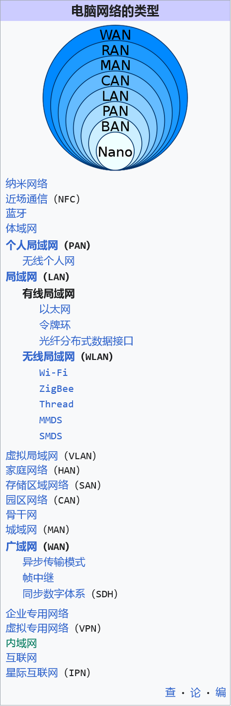

# 路由器与光猫
> 路由器（Router）是连接两个或多个网络的硬件设备，在网络间起网关的作用，是读取每一个数据包中的地址然后决定如何传送的专用智能性的网络设备。————来自[百度百科](https://baike.baidu.com/item/%E8%B7%AF%E7%94%B1%E5%99%A8/108294)

> 光调制解调器，也称为单端口光端机或光猫，是针对特殊用户环境而研发的一种三件一套的光纤传输设备。————来自[百度百科](https://baike.baidu.com/item/%E5%85%89%E8%B0%83%E5%88%B6%E8%A7%A3%E8%B0%83%E5%99%A8)

对于当前普遍光纤入户的家庭网络来说，光猫(光调制解调器)被特殊集成了路由器功能。

然而光猫的本职工作最初只是将光信号转换为电信号，因此家庭光猫也可以视作一个路由器对待。

# 网络分层与网络类型
> 图片内容来自 [维基百科](https://zh.wikipedia.org/wiki/%E8%AE%A1%E7%AE%97%E6%9C%BA%E7%BD%91%E7%BB%9C) 和 [菜鸟教程](https://www.runoob.com/w3cnote/summary-of-network.html)。

路由器是一个工作在网络层的硬件设备，只能作用于网络层及其之上的网络层级。

# 路由器工作方式

对于只有一台终端路由设备的家庭网络而言，通常光猫会工作在 **路由** 模式下，此时这就是一个带光电转换功能的路由器，核心功能是进行 **宽带PPPoE拨号** 和 **DHCP自动分配IP**，前者是让光猫通过数据链路层与服务商对接，后者是为家庭内网设备分配子网IP。没有IP的设备无法在广域网中准确接收信息，也就是无法上网，因此家庭网络中一定要有一个启用DHCP功能的设备。

WLAN无线局域网已然成为刚需，部分光猫尽管带有无线功能，但本身机能有限，因此配备一台无线路由器是针对WLAN下设备提升网络质量的一种方案。对于无线路由器来说，相比于上文中的光纤入户光猫，普遍没有光电转换功能，但拥有了更好的机能和自由度。

光猫与无线路由器的连接分为两种：
- 光猫的LAN口接路由器的WAN口
- 光猫的LAN口接路由器的LAN口

## 路由器WAN口入网

此时连入路由器的所有设备都与光猫处于不同网段，相应的光猫和路由器IP也不同。例如，光猫IP为`192.168.1.1`，分配给路由器的IP为`192.168.1.2`；而路由器也有DHCP功能，因此另找了一个网段，在路由器子域中，它的IP为`192.168.3.1`，所连接的设备IP就被分配为为`192.168.3.x`。

先讲正确的入网方式：
- 将光猫设置为 **桥接** 模式 | 一般需要咨询服务商/宽带师傅
- 将 **宽带PPPoE拨号**、**DHCP自动分配IP** 等功能迁移至路由器配置

光猫**桥接**后，就简单地“退化”成了一个光电转换设备，此时光猫的所有功能都迁移至无线路由器，因此需要进行拨号和宽带设置，DHCP一般会默认开启。

非正确入网：
- 光猫依然处于 **路由** 模式，关闭无线模块。
- 路由器仅设置 **DHCP自动分配IP**，开启无线功能。

这种模式下，所有连入路由器WLAN的设备，会处于二级子网下，如果想要连通广域网，就需要两次NAT转换：
> NAT旨在通过将一个外部 IP 地址和端口映射到更大的内部 IP 地址集来转换 IP 地址。 ————来自[百度百科](https://baike.baidu.com/item/nat/320024)

- 路由器将设备IP转换为光猫分配的IP
- 光猫将分配的IP转换为WAN口的服务商公网IP

如果是在游戏场景下(大多数为UDP数据传输)，网络层的NAT转换消耗了传输层的传输时间，在游戏中的表现为延迟不稳定，时常出现网络卡顿，这也是 **校园网** 的多数工作方式，导致风评极差。

## 路由器LAN口入网
> 这里默认大家的子网掩码为`255.255.255.0`，因此DHCP的全段分配地址为`192.168.1.2`到`192.168.1.254`。

对于开启**DHCP**功能的设备来说，下发的默认网关IP地址就是它本身，总之子网设备流量会经过被设置的网关设备；而DNS地址由光猫从运营商自动获取，但这里依旧整理了一些公共DNS地址：

| 服务商 | 首选地址 | 备选地址 |
| :---: | :---: | :---: |
| Google | `8.8.8.8` | `8.8.4.4` |
| Cloudflare | `1.1.1.1` | `1.0.0.1` |
| Microsoft | `4.2.2.1` | `4.2.2.2` |
| 阿里巴巴 | `233.5.5.5` | `233.6.6.6` |
| 腾讯 | `119.29.29.29` | `182.254.116.116` |

LAN口入网方式下，连入路由器的所有设备都与光猫处于同一网段，而与上文中的WAN口入网不同。例如，光猫IP为`192.168.1.1`，DHCP的范围为`192.168.1.2`到`192.168.1.100`，则设置路由器的IP为`192.168.1.101`，其他连入路由器的设备IP也由光猫的DHCP来分配，因此IP为`192.168.1.x`。(x从2~100)

路由器作为AP进行有线中继：
- 光猫保持 **路由** 模式，关闭无线模块。
- 进入光猫后台，破坏DHCP的全段分配，例如设置分配范围为`192.168.1.2`到`192.168.1.253`，留出`192.168.1.254`。
- 路由器关闭 **DHCP自动分配IP**，设置网关、DNS为光猫地址`192.168.1.1`，举例设置路由器IP为`192.168.1.254`。

此时就是 ***光猫无线信号不好*** 的针对性方案，仅将路由器作为无线模块。

### 旁路由模式
> 此部分比较硬核，笔者也涉猎不多，一般的家庭网络也没有必要如此。

基础设置：
- 光猫保持 **路由** 模式
- 进入光猫后台，破坏DHCP的全段分配，例如设置分配范围为`192.168.1.2`到`192.168.1.253`，留出`192.168.1.254`。
- 路由器关闭 **DHCP自动分配IP**，设置网关、DNS为光猫地址`192.168.1.1`，举例设置路由器IP为`192.168.1.254`。
- 旁路由系统(OpenWRT)防火墙开启入站、出站数据和转发。

旁路由的最直接应用就是zerotier搭建虚拟局域网和进行附魔操作。

如果只是单设备流量走旁路由，只需要在连入旁路由的网络设置中，IP分配改为手动，并设置：
- IP地址为例中`192.168.1.2`到`192.168.1.253`中未占用的IP
- 网关和DNS都指向旁路由例中的`192.168.1.254`
- 子网掩码为`255.255.255.0`

如果全部流量都想走旁路由(附魔)：
- 进入光猫后台，将DHCP的默认网关、DNS指向旁路由，即例中的`192.168.1.254`。
