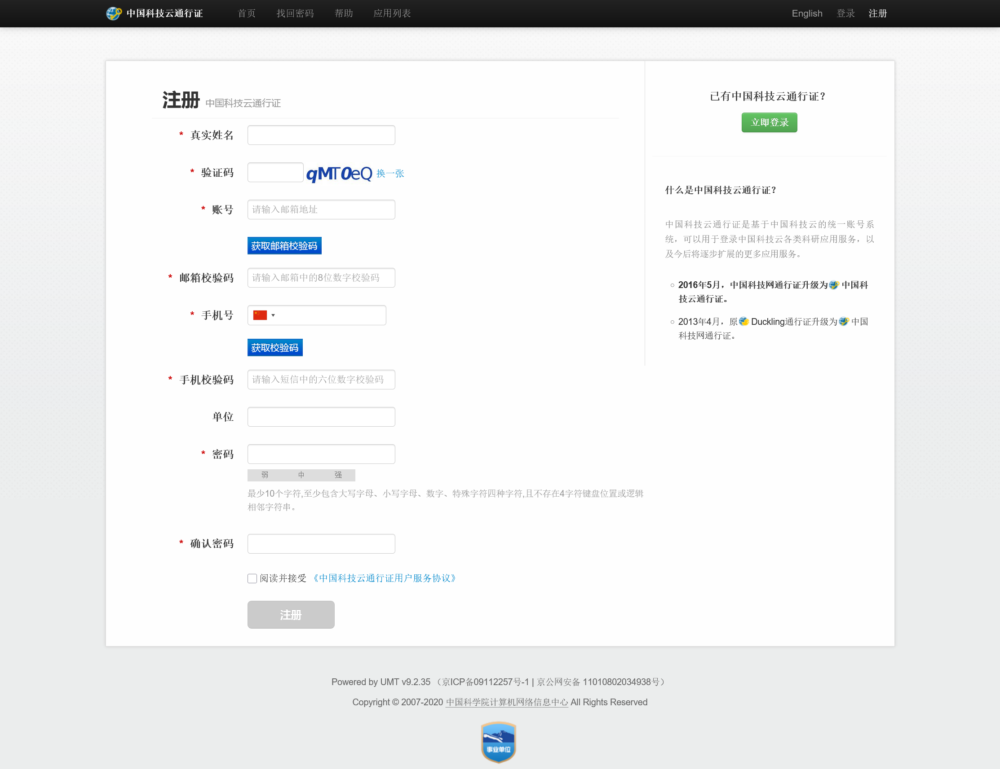
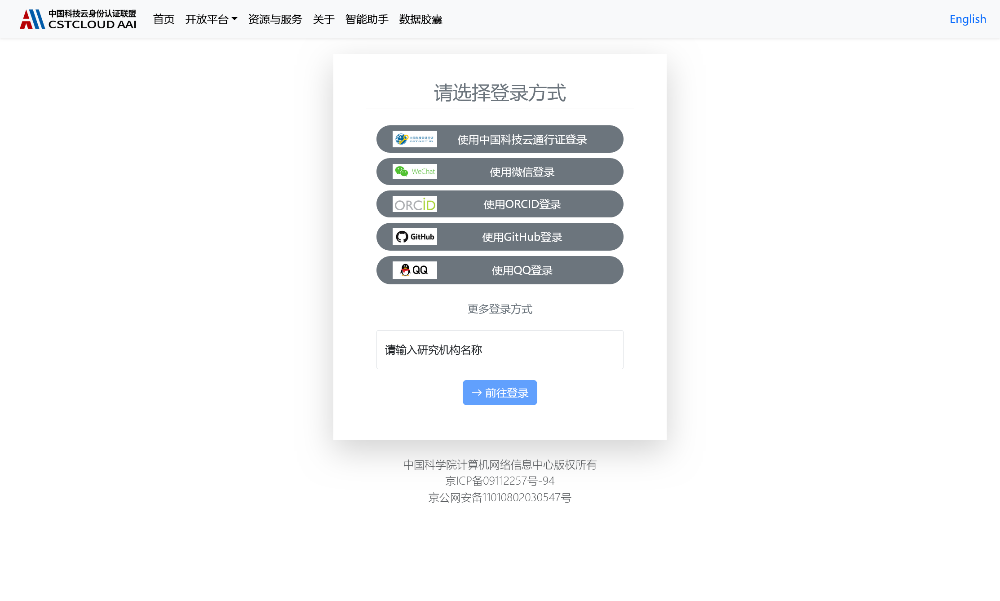
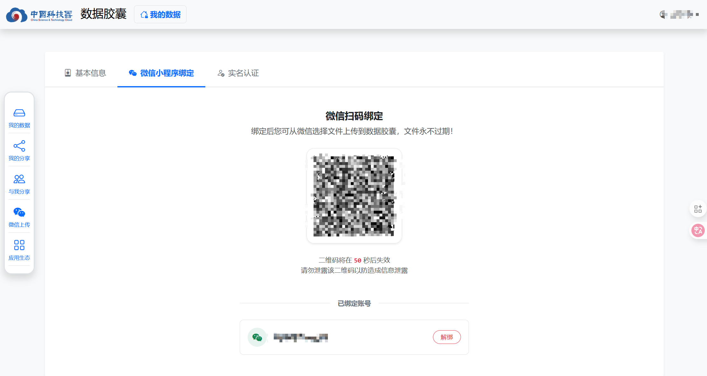
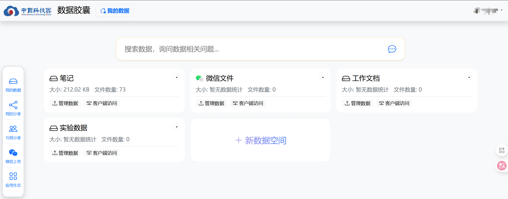
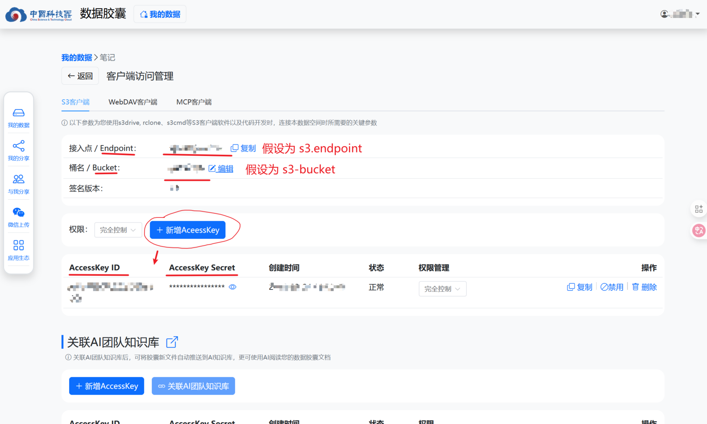
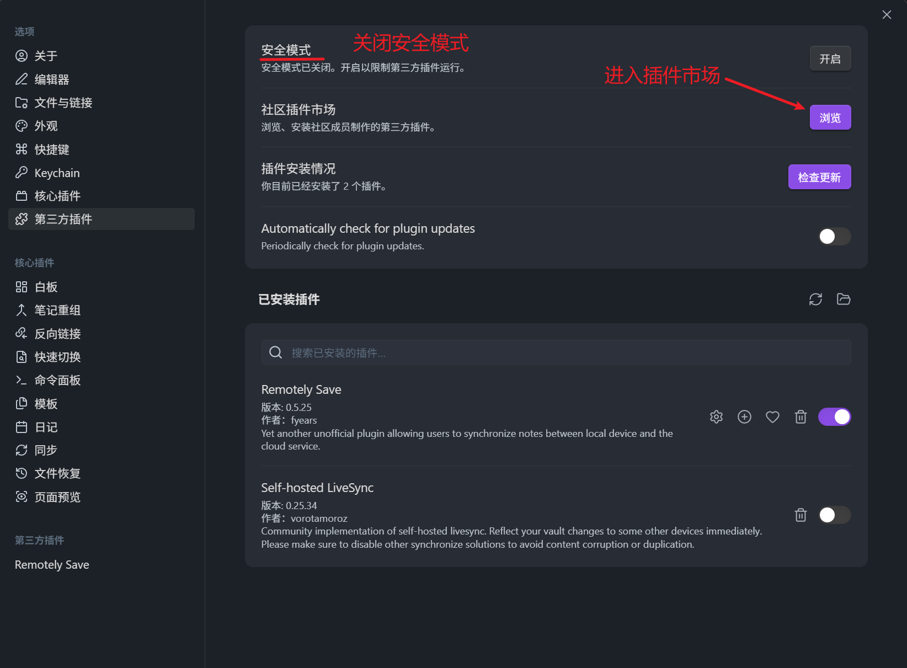
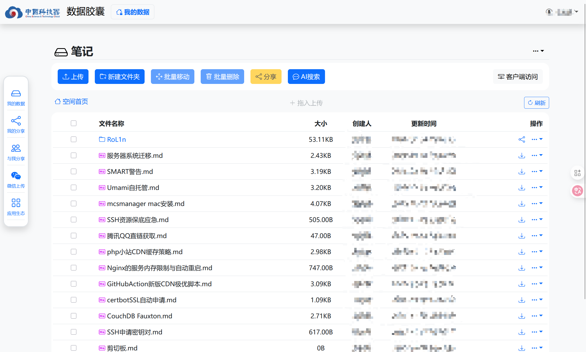

# 相关链接
- [中国科技云通行证](https://passport.escience.cn/)
- [中国科技云数据胶囊](https://data.cstcloud.cn/)
- [国家网络身份认证--百度百科](https://baike.baidu.com/item/%E5%9B%BD%E5%AE%B6%E7%BD%91%E7%BB%9C%E8%BA%AB%E4%BB%BD%E8%AE%A4%E8%AF%81/66719338)
- [国家网络身份认证公共服务管理办法--百度百科](https://baike.baidu.com/item/%E3%80%8A%E5%9B%BD%E5%AE%B6%E7%BD%91%E7%BB%9C%E8%BA%AB%E4%BB%BD%E8%AE%A4%E8%AF%81%E5%85%AC%E5%85%B1%E6%9C%8D%E5%8A%A1%E7%AE%A1%E7%90%86%E5%8A%9E%E6%B3%95%E3%80%8B/64707134?fromModule=lemma_inlink)
- [remotely-save](https://github.com/remotely-save/remotely-save)
- [obsidian](https://obsidian.md/download)

# 中科院国家队的对象存储--中科云数据胶囊
首先推荐注册 [中国科技云通行证](https://passport.escience.cn/) 

这里填写的 **手机号实名信息** 要与上边的 **真实姓名** 一致；账号邮箱地址填写国内邮箱，例如qq和163。

随后前往 [中国科技云数据胶囊](https://data.cstcloud.cn/) 选择 **中国科技云通行证** 进行登录。

未实名用户只有1GB存储空间，且无法使用客户端访问数据(S3、WebDav等)，因此需要进行实名认证，首先到 [中科云数据胶囊的账户信息](https://data.cstcloud.cn/my/account)，选择实名认证。

这里需要用到 **国家网络身份认证** APP申领网号来进行实名，在手机应用商店中直接搜索即可下载。

下面引用百度百科的申领教程：

这样就能成功领取到你的 **网号** ，相关法规科普见 [国家网络身份认证公共服务管理办法--百度百科](https://baike.baidu.com/item/%E3%80%8A%E5%9B%BD%E5%AE%B6%E7%BD%91%E7%BB%9C%E8%BA%AB%E4%BB%BD%E8%AE%A4%E8%AF%81%E5%85%AC%E5%85%B1%E6%9C%8D%E5%8A%A1%E7%AE%A1%E7%90%86%E5%8A%9E%E6%B3%95%E3%80%8B/64707134?fromModule=lemma_inlink)。

最后在 **国家网络身份认证** APP中扫描中科云数据胶囊的实名认证二维码，即可获得20GB免费存储空间。

这里也可以进行微信绑定，可以随时将微信中的文件上传到该数据胶囊。

中科云数据胶囊已经自动分成了几个类别空间，我们最终将使 **笔记** 作为obsidian云同步的基地。

# 获取中科云数据胶囊S3客户端信息

选择 **客户端访问** **笔记** ，来到S3客户端信息处：

记下信息(例)：
- Endpoint: s3.endpoint
- Bucket: s3-bucket
- AccessKey ID
- AccessKey Secret

# 使用Remotely Save云同步obsidian笔记

首先进入Obsidian的设置页面，选择 **第三方插件**，关闭 **安全模式** 后，浏览 **插件市场**。

搜索并安装 **Remotely Save** 插件，进入选项：

填写完必要信息后，进行连接测试，成功后自行选择同步策略。

回到obsidian仓库，随意编写一个markdown，在侧边快捷栏会出现 **Remotely Save** 的同步按钮。

同步之后，回到中科云数据胶囊的 **笔记**，即可看到被同步的文件：

