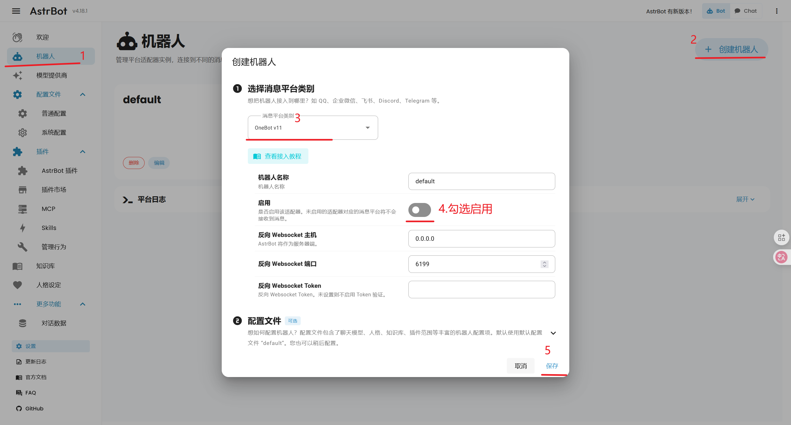
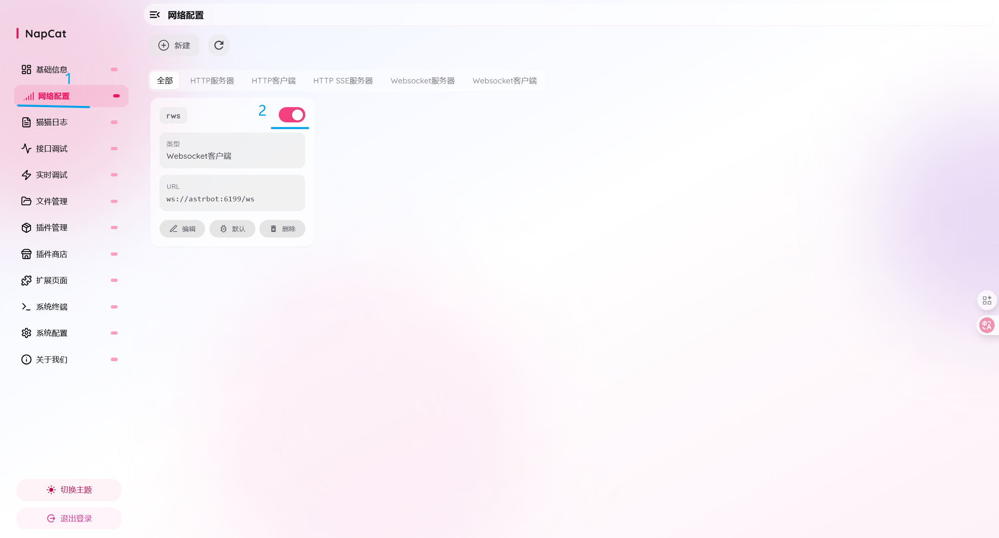
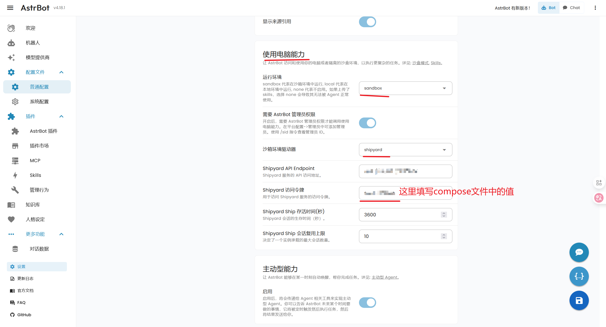
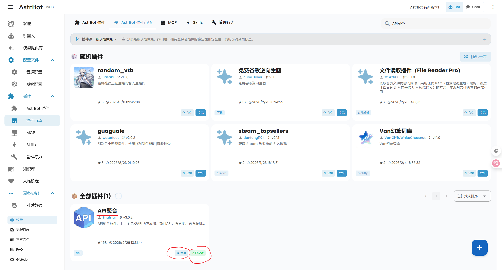
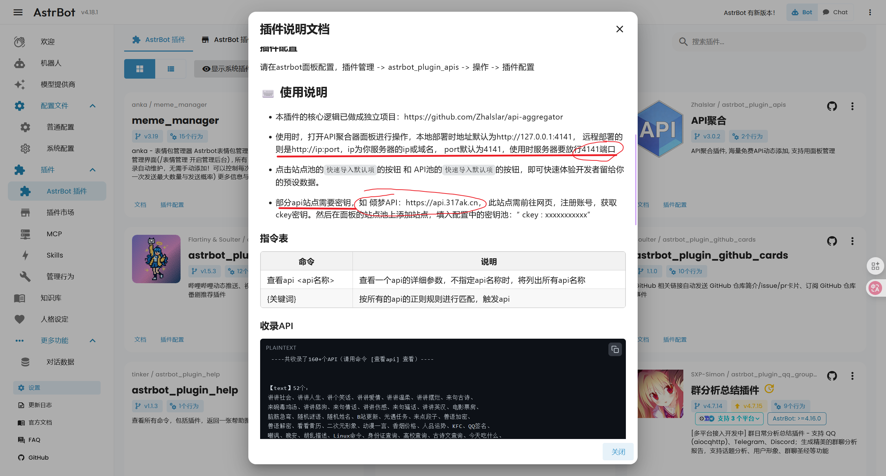

# 链接
- [AstrBot项目文档](https://docs.astrbot.app/what-is-astrbot.html)
- [NapCat项目文档](https://napcat.napneko.icu/guide/start-install)
- [orbstack项目文档](https://docs.orbstack.dev/)

# 精简docker安装

首先，确保你的macOS环境中安装了Homebrew：
```zsh
# 检查版本
brew --version
# 安装Homebrew
curl -o- https://raw.githubusercontent.com/Homebrew/install/HEAD/install.sh | bash
```
然后，安装orbstack作为docker的运行平台，再安装docker和compose：
```zsh
brew install --cask orbstack docker docker-compose
```
orbstack相关命令：
```zsh
# 开机
orb start
# 状态
orb status
# 下机
orb stop
# 配置docker
orb config docker
```
确保orbstack处于运行状态，最后运行命令 **配置docker**，设置一下镜像源：
```json
{
  "registry-mirrors": [
    "https://docker.m.daocloud.io",
    "https://docker.1panel.live/"
  ]
}
```
这里用到了vim编辑器，首次进入是 **查看** 模式，轻触 `I` 键进入写入模式，`ESC` 退出当前模式，键入 `:` 进入命令模式，输入 `wq` 进行保存和退出。

# 部署astrbot和napcat

这里使用官方文档自带的部署方式，同时安装napcat：
```zsh
mkdir astrbot
cd astrbot
wget https://raw.githubusercontent.com/NapNeko/NapCat-Docker/main/compose/astrbot.yml
sudo docker compose -f astrbot.yml up -d
```

如果网络问题获取不到compose文件，下面是官方的 `astrbot.yml`:
```yaml
# docker-compose.yml
# NAPCAT_UID=$(id -u) NAPCAT_GID=$(id -g) docker-compose -f ./compose/astrbot.yml up -d
services:
  napcat:
    environment:
      - NAPCAT_UID=${NAPCAT_UID:-1000}
      - NAPCAT_GID=${NAPCAT_GID:-1000}
      - MODE=astrbot
    ports:
      - 6099:6099
    container_name: napcat
    restart: always
    image: mlikiowa/napcat-docker:latest
    volumes:
      - ./data:/AstrBot/data
      - ./napcat/config:/app/napcat/config
      - ./ntqq:/app/.config/QQ
    networks:
      - astrbot_network
    #mac_address: "02:42:ac:11:00:02"
  astrbot:
    environment:
      - TZ=Asia/Shanghai
    image: soulter/astrbot:latest
    container_name: astrbot
    restart: always
    ports:
      - "6185:6185"
      #- "6195:6195"
      #- "6199:6199"
    volumes:
      - ./data:/AstrBot/data
    networks:
      - astrbot_network
networks:
  astrbot_network:
    driver: bridge
```

部署完成后，查看容器日志：
```zsh
sudo docker logs napcat
sudo docker logs astrbot
```
注意查看astrbot和napcat的WebUI地址和token信息：
- astrbot的账密默认为 `astrbot`
- napcat的默认token在日志中随机生成

随后进入astrbot的webui，设置适配器：



随后进入napcat的webui，登录要作为机器人的QQ号，进行网络设置:



至此，就可以在astrbot的平台日志中，看到机器人接收消息的logs了。

最后就是配置模型服务商，进行astrbot本体插件的必要设置后，就可以使用了。

## sandbox沙箱环境配置

在astrbot中，如果让大模型调用电脑能力来实现功能(python、matlab画图)，一般需要配置沙箱环境，让AI的操作不伤害到宿主机。

官方推荐使用 [Shipyard](https://github.com/AstrBotDevs/shipyard) 项目来实现沙箱环境：
```zsh
mkdir astrbot-shipyard
cd astrbot-shipyard
wget https://raw.githubusercontent.com/AstrBotDevs/shipyard/refs/heads/main/pkgs/bay/docker-compose.yml -O docker-compose.yml
# 修改 compose-with-shipyard.yml 文件中的环境变量配置，例如 Shipyard 的 access token 等
docker compose -f docker-compose.yml up -d
docker pull soulter/shipyard-ship:latest
```
这里还是给出compose文件的内容：
```yaml
version: '3.8'

services:
  shipyard:
    image: soulter/shipyard-bay:latest
    ports:
      # API port (public, for agent access)
      - "8156:8156"
      # Dashboard port (optional, can be hidden behind NAT)
      - "8157:8157"
    environment:
      - PORT=8156
      - DATABASE_URL=sqlite+aiosqlite:///./data/bay.db
      - ACCESS_TOKEN=secret-token
      - MAX_SHIP_NUM=10
      - BEHAVIOR_AFTER_MAX_SHIP=reject
      - CONTAINER_DRIVER=docker
      - DOCKER_IMAGE=soulter/shipyard-ship:latest
      - DOCKER_NETWORK=shipyard_network
      - SHIP_DATA_DIR=${PWD}/data/shipyard/ship_mnt_data
      - DEFAULT_SHIP_CPUS=1.0
      - DEFAULT_SHIP_MEMORY=512m
    volumes:
      - ${PWD}/data/shipyard/bay_data:/app/data
      - /var/run/docker.sock:/var/run/docker.sock:ro
    networks:
      - shipyard

networks:
  shipyard:
    name: shipyard_network
    external: true
```
可以在compose文件里设置 `ACCESS_TOKEN`：将 `secret-token` 改为预设值即可。

随后在astrbot的 **配置文件 -> 普通配置** 中即可设置启用sandbox环境：



## 插件的安装

在astrbot插件市场中有非常多各种各样的插件，这使得astrbot机器人的功能变得丰富多样，这里以 **API聚合** 插件为例。



一般来说点击安装即可，随后会弹出该插件的说明文档，这里通常有一些注意事项：



这里提到的 **倾梦API** 需要自行手动获取key，再去到webui界面进行配置。

由于我们的astrbot安装在docker中，docker的网络端口只有映射出来的，宿主机才能访问。

因此我们需要对 `astrbot.yml` 进行修改:
```yaml
# ...
  astrbot:
# ...
    ports:
      - "6185:6185"
# 在这里添加4141的端口映射
      - "4141:4141"
# ...
```
然后重新以docker-compose重启astrbot即可：
```
cd ~/astrbot
sudo docker stop astrbot
sudo docker compose -f astrbot.yml up -d
```
这时再访问4141端口就可以访问到 **API聚合** 插件的webUI界面了。
