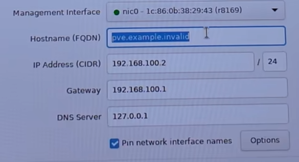
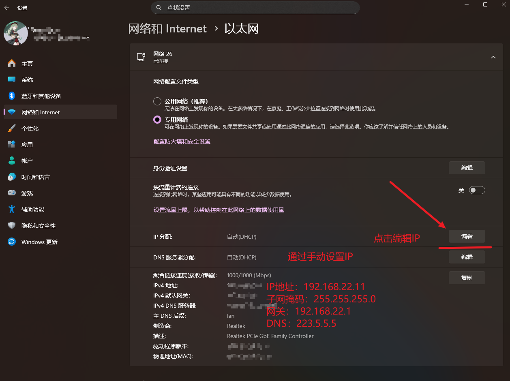
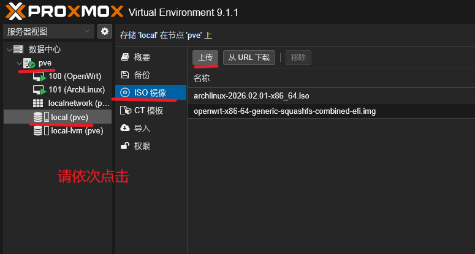
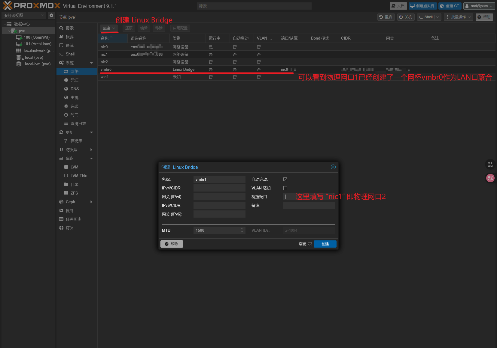
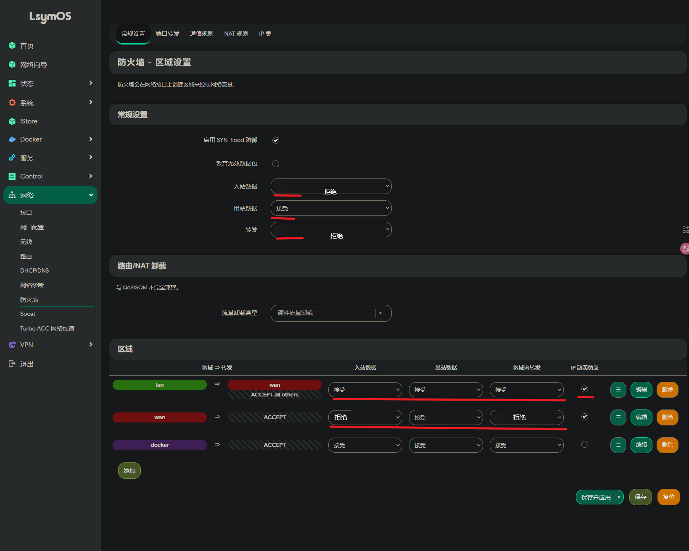
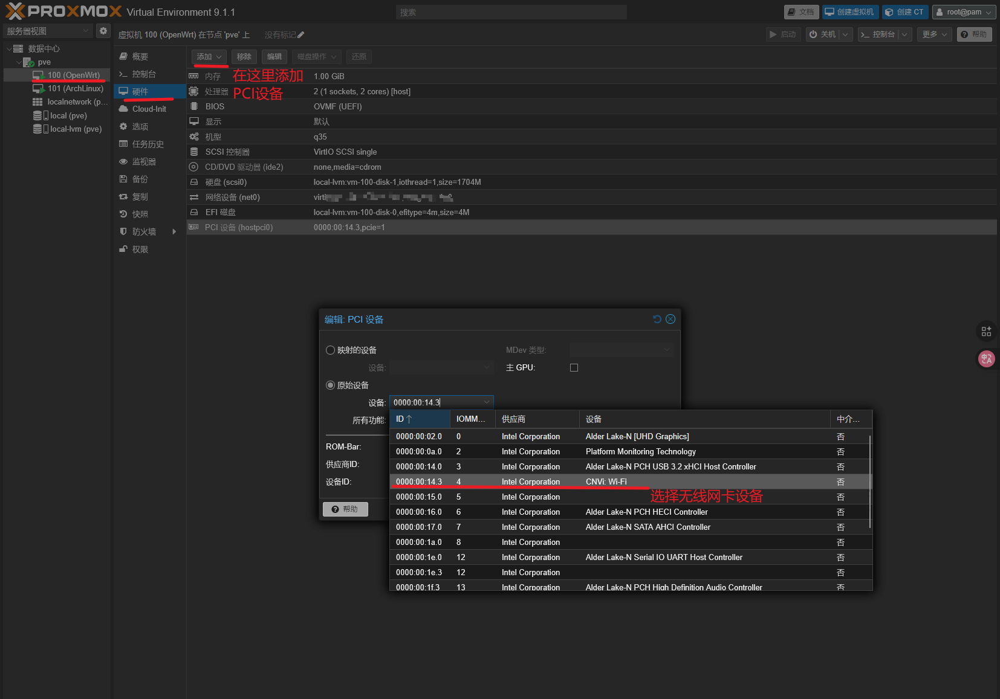
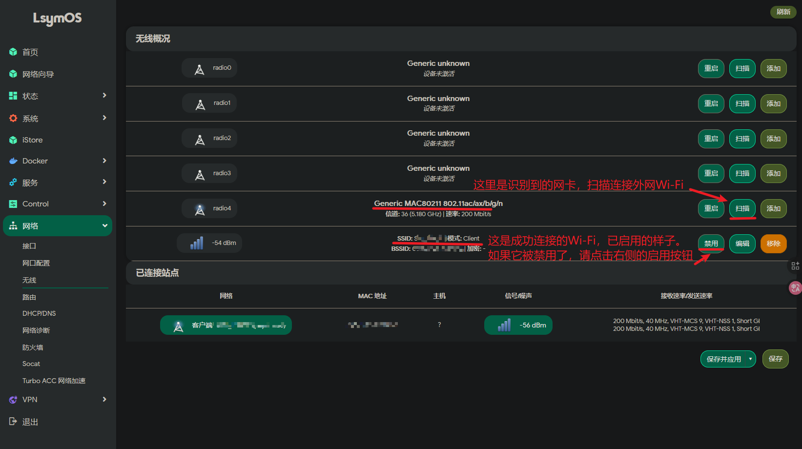
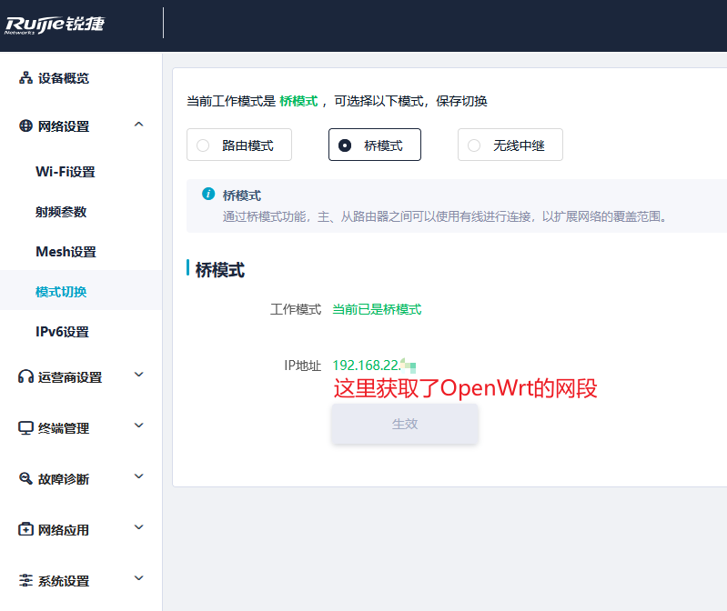

# 相关链接

- [BREN6M-N100迷你主机](https://www.buernuc.com/detail?did=9)
- [balenaEther 写盘工具](https://etcher.balena.io/)
- [Proxmox VE 虚拟环境系统](https://pve.proxmox.com/wiki/Main_Page)
- [恩山无线论坛](https://www.right.com.cn/forum/forum.php)
# PVE9.1的安装

进入 [Proxmox VE 虚拟环境系统 官方下载页](https://www.proxmox.com/en/downloads)，下载 **Proxmox VE 9.1 ISO Installer** 。

进入  [balenaEther 写盘工具](https://etcher.balena.io/) 官网，下载写盘工具，并准备一个不用的 U盘，存储 16G 左右。

下载完成后，将 U盘 插入个人PC中，打开 **balenaEther** 软件，选择 PVE9.1的ISO镜像文件，选择存储对象为 U盘，执行烧录。

请确保N100具有至少一块硬盘设备，用于安装PVE系统本体。

将刷好ISO的U盘插入 N100 小主机，再连接 显示设备 (HDMI/DP) 和 鼠标、键盘 (USB) 以及 将网口1 (RJ45)连接至PC，然后启动 N100 小主机，在屏幕点亮时，疯狂点按 `Delete` 键，进入主板 BIOS。

开启主板CPU核芯显卡的 **VT-d** 模式、**初始化iGPU** 和 **大于4G空间地址解码**。

进入BIOS启动项，将已插入的 U盘设备 设置为 **第一启动项**，保存并退出BIOS，进行自动重启。
## PVE界面安装向导


默认第一项，使用图形化安装方式，接下来依次是：
- 接收用户协议
- 选择安装硬盘
- 选择国家、时区
- 输入密码、邮箱



这里的第一项是选择管理网口，我们在启动小主机之前，已经将网口1(这里显示为绿色nic0)连接至PC，那么网口1就作为了PVE的管理网口。随后设置 hostname，可以设置为 `pve.local`.

我们独立设置一个网段用于All in One设备：
- IP Address(PVE的IP地址):`192.168.22.111`
- Gateway(网关):`192.168.22.1`
- DNS(阿里云):`223.5.5.5`

随后等待安装成功，然后 **拔掉U盘**，再点击 **reboot** 重启PVE。

等再次出现界面，就会有提示，Web管理页URL为：`http://192.168.22.111:8006`。

随后在PC的网络设置中，手动设置PC的IP处于和PVE同一网段：



这样设置后，便可在PC浏览器通过`http://192.168.22.111:8006`访问PVE后台，默认用户名为 `root`。

# OpenWrt软路由系统安装

首先，[OpenWrt官网](https://openwrt.org/) 中的系统镜像是非常纯净的，一些拓展包并没有直接放在系统镜像中，所以这里更推荐去 [恩山无线论坛](https://www.right.com.cn/forum/forum.php) 中寻找社区已经打包好的系统。

这里给到我所使用的一个OpenWrt镜像：
- [LsymOS: openwrt-x86-64-generic-squashfs-combined-efi.img](https://www.right.com.cn/forum/thread-8464111-1-1.html)

下载`img`镜像文件后，上传至PVE系统。



随后，点击 **创建虚拟机** ，注意虚拟机编号，首个虚拟机默认为 `100` ：

|  项目  | 子列表 |   说明    |
| :--: | :-: | :-----: |
|  常规  | 名称  | OpenWrt |
| 操作系统 |  -  | 不使用任何介质 |
|  系统  | 机型  |   q35   |
| 系统     | BIOS    | UEFI        |
| 系统 | UEFI存储 | local-lvm |
| 系统 | - | 请不要勾选 **预签名** |
| 磁盘 | - | 删除掉默认分配磁盘 |
| CPU | 核心 | 2 |
| CPU | 类别 | host |
| CPU | 内存 | 1024MB |
| 网络 | - | 默认网桥vmbr0 |

然后，进入PVE的shell中，为OpenWrt导入系统盘：

```shell
qm importdisk 100 /var/lib/vz/template/iso/openwrt-x86-64-generic-squashfs-combined-efi.img local-lvm
```

参数说明，一般情况下只需修改镜像文件名：

- `100`：虚拟机编号
- `openwrt-x86-64-generic-squashfs-combined-efi.img`：镜像文件名
- `local-lvm`：虚拟存储地址

等待导入完毕后，回到OpenWrt的 **硬件**：

双击未使用磁盘，点击确定以启用。

再前往 **选项** -> **引导顺序**：
仅勾选新添加的磁盘，例如 **scsi0** ，最后启动该虚拟机。

## OpenWrt系统配置

进入OpenWrt的控制台shell中后，输入如下命令更改基础网络配置：

```shell
vi /etc/config/network
```

修改LAN口的 **ip_address** 为 `192.168.22.1` ，这对应着PVE最初设置的网关地址。

注意，这里用到的vim编辑器：
- 键入`i`进入编辑模式
- 键入`esc`退出编辑模式，回到阅览模式
- 键入`:`进入命令模式，紧跟输入`wq`进行保存和退出

然后输入命令`reboot`或者点击PVE的重启按钮，来重启虚拟机。

等待重启完成，我们这时就可以用PC来访问OpenWrt的后台了，地址为：`http://192.168.22.1`

## 网络配置

现在我们仍有一个网口，甚至还有一个ax101网卡，那么就有两种方案：
- 用物理网口2来作为wan口连接外网
- 用无线网卡扫描连接外网Wi-Fi作为wan口上网

### 物理网口2上网

首先到PVE后台，创建WAN口网桥：



随后在OpenWrt虚拟机的硬件里，添加该网络 `vmbr1`，并在物理网口2上插上连接外网的网线。

进入OpenWrt的后台，进入 **网络** -> **网口配置**，将`eth0`(vmbr0、物理网口1)接入`LAN`,将`eth1`(vmbr1、物理网口2)接入`WAN`。

再进入 **网络** -> **防火墙**，打开数据接收：



等待网络连接成功，在PVE中将OpenWrt设置为开机自启动，并在PC网络中打开DHCP。

### 无线网卡上网

这次我们来到PVE后台，需要为OpenWrt直通AX101(例)无线网卡硬件，请先关闭OpenWrt系统：



然后启动OpenWrt系统，以便识别直通硬件。

再进入OpenWrt后台页面，进入 **网络** -> **无线**，选择识别到的网卡，进行连接Wi-Fi：



连接成功后，一般将直接分配一个`wwan`配置，作为外网的入点，随后配置防火墙。

进入 **网络** -> **防火墙**，打开数据接收：


等待网络连接成功，在PVE中将OpenWrt设置为开机自启动，并在PC网络中打开DHCP。

### 路由器AP无线WI-FI传播

这里我的机器只有两个物理网口，由于要连接路由器做AP，因此我这里以无线网卡上网为例。

这时我们会空余一个物理网口2，然后进入PVE后台的网络配置，将`nic1`(物理网口2)也添加进`vmbr0`(LAN)网桥。

我们要先对路由器进行一些设置，用网线连接PC与路由器，查看网关，在浏览器中输入网关地址，进入路由器后台。

随后可以参考之前的文章 [家庭网络连接 | 路由器接入方式 | 旁路由上网 | Router](https://blog.srprolin.top/posts/2026-02-11-router_1/) 中，关于 **LAN口入网** 的详细配置。

主流路由器现在都有工作模式选择的权利，以我使用的 **锐捷 RG-MA3063(中国移动)** 为例，就可以直接选择 **桥模式**，以避免繁杂的DHCP与IP设置。



## 深澜Srun校园网认证系统

笔者使用无线网卡上网，便是连接的校园网，有幸在 **GitHub** 上找到了HAUT的OpenWrt自动登录脚本，在此鸣谢：[HAUT Network Guard](https://github.com/yellowpeachxgp/HAUTNetworkGuard)

笔者在这里也找到了一些有关深澜Srun系统的项目：
- [BIT-srun-login-script](https://github.com/coffeehat/BIT-srun-login-script)
- [BitSrunLoginGo](https://github.com/Mmx233/BitSrunLoginGo)
