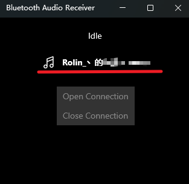

# 相关链接
- [Defender Remover / Defender Disabler](https://github.com/ionuttbara/windows-defender-remover)
- [Bluetooth Audio Receiver](https://apps.microsoft.com/detail/9n9wclwdqs5j)
# Defender Remover
前往GitHub的release页下载对应版本的程序，随后以管理员方式运行即可。
# Bluetooth Audio Receiver
打开PC的蓝牙和手机蓝牙，在手机端连接PC即可；

随后点击这里的设备，再点击`Open Connection`即可获取手机音频；

如果仍无声音，尝试切换一下PC的音频设备，一般就会恢复连接。
