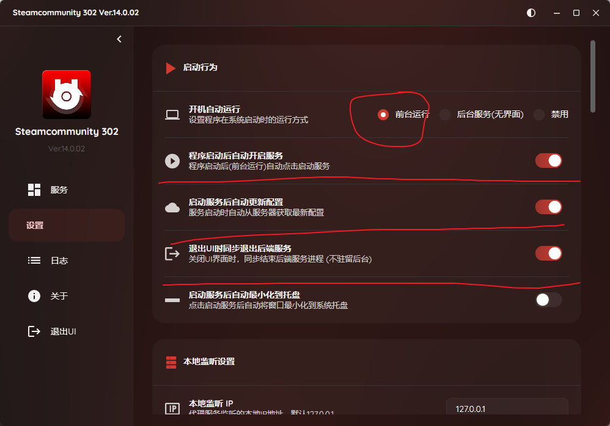
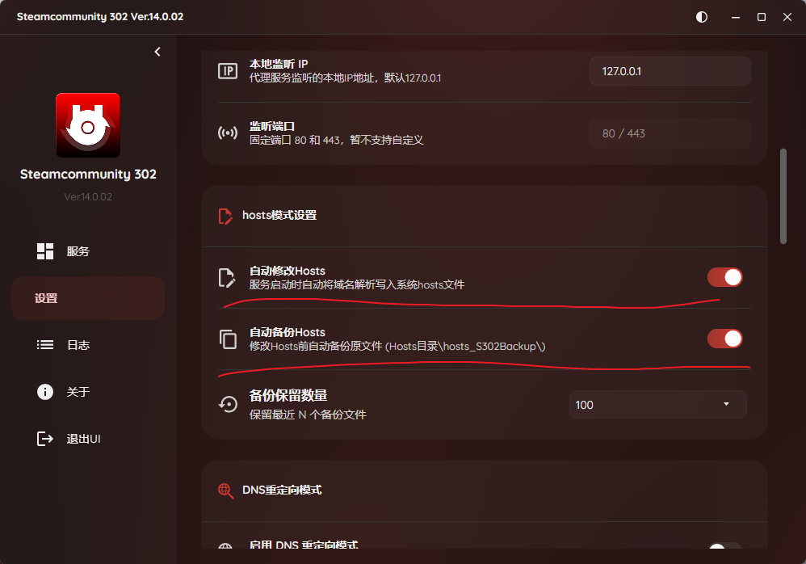
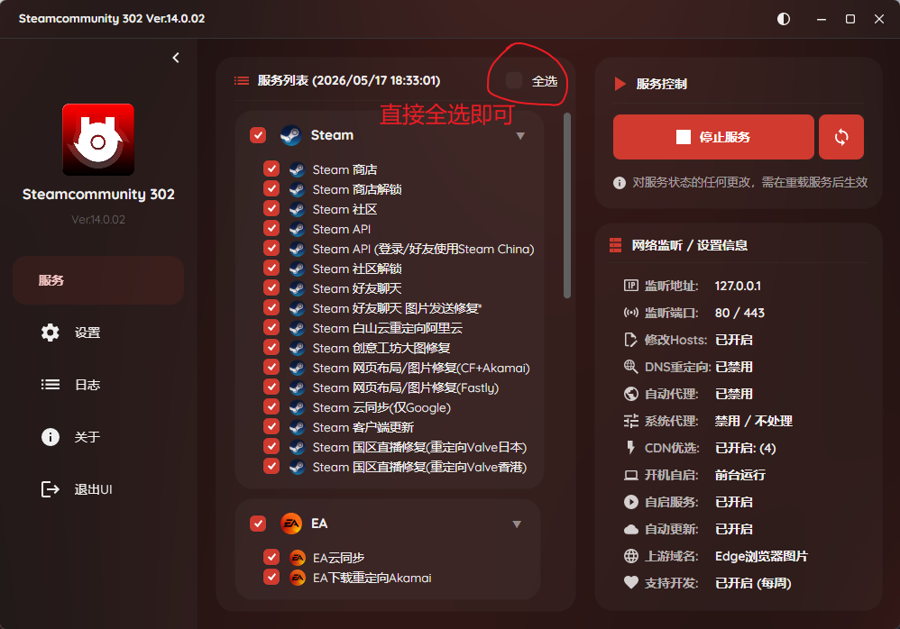
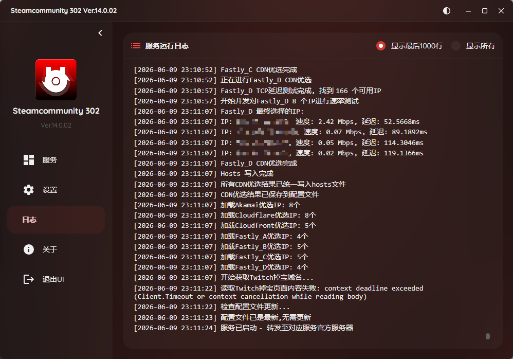

# 相关链接
- [软件官方下载地址](https://steamcommunity.net/)
- [Steamcommunity 302 官方说明](https://steamcommunity.net/) — 羽翼城出品，Ver.14 功能介绍

# 这是什么

[SteamCommunity 302](https://steamcommunity.net/) 是 **羽翼城** 开发的网络优化工具，面向 Steam、GitHub、Discord、Minecraft 等海外平台。

核心思路：**不翻墙，改路由**。它通过修改 hosts 文件，将目标域名指向响应最快的国内 CDN 节点，绕过运营商的拥堵路由，从而减少延迟和丢包。

与全局代理的区别在于——它只对特定域名生效，不影响其他网络连接，关掉软件后 hosts 自动还原，干净利落。

> 💡 **核心原理**：把 Steam/Discord 等域名指向响应最快的国内 CDN 节点，绕过运营商的拥堵路由。

# 你需要用到的功能（共3项）

本指南只涉及以下功能，不涉及 DNS 重定向和系统代理配置：

| 功能 | 作用 | 是否必开 |
|------|------|----------|
| Hosts 模式 | 修改 hosts 文件，将域名指向优选 CDN | ✅ 必开 |
| 开机自启动 | 重启电脑后自动运行，无需手动操作 | ✅ 推荐 |

# 配置步骤

## 第一步：解压并运行

1. 将 `steamcommunity_302.zip` 解压到任意文件夹（建议放一个不会被误删的位置）
2. 双击运行 `Steamcommunity 302.exe`
3. 可能会弹出 UAC 提示，点击「是」

## 第二步：设置开机自启动

1. 进入软件设置页面
2. 找到「开机自启动」选项，勾选开启
3. 以后重启电脑会自动运行，无需手动操作

## 第三步：开启 Hosts 模式

1. 在软件左侧服务列表中，找到并勾选「自动修改 Hosts」
2. 确认也勾选了 **自动备份 hosts**

> 💡 自动备份 hosts 是安全网——万一软件异常退出，系统也能在下次启动时还原 hosts 文件。

## 第四步：启动服务

1. 全选服务
2. 点击右上角「启动」按钮

启动后可以在日志区查看运行状态。如果启动有问题，`Ctrl+A` 全选日志、`Ctrl+C` 复制，先发给 AI 让它帮你诊断。

## IF 启动有问题
把所有日志先发给AI (ctrl+a全选ctrl+c复制)，让它先帮你诊断问题。

# 网络异常处理

如果某天发现连不上网（概率很低，但万一出现）：

1. 找到右下角托盘区的 Steamcommunity 302 图标
2. 右键点击 → 选择「停止」或直接退出软件
3. 网络会立即恢复正常
4. 排查完毕后可重新启动

一般情况下，当前配置不会导致断网。仅在极少数特殊网络环境下才可能出现问题。

# 常见问题

**Q：软件需要一直开着吗？**
A：是的，需要保持运行。建议设置开机自启动，这样就不用每次手动开。

**Q：关掉软件后一切配置可以恢复吗？**
A：可以。关掉后 hosts 文件会自动还原，网络恢复原始状态。

**Q：会影响其他软件吗？**
A：不会。它只修改特定域名的 hosts 指向，不影响其他网络连接。
