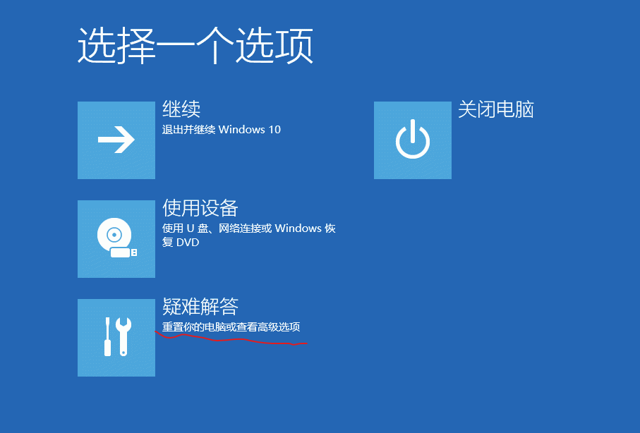
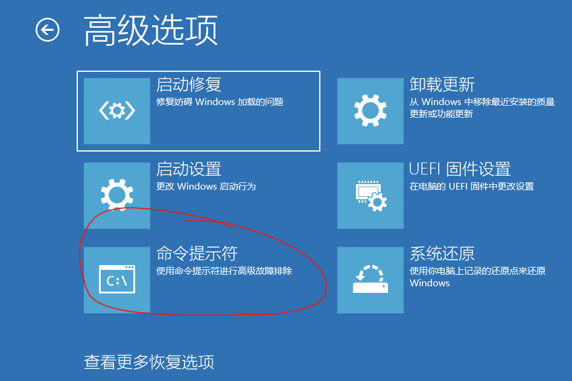

# 前情摘要
在过往的经历中，多次处理过同学Windows系统的密码丢失、账户出现问题导致桌面文件丢失等情况，在其中了解到Windows本地的超级管理员Administrator，这不同于在日常使用设备时的“管理员”概念，虽然推荐日常情况下将自己的用户分组到Administrators，但系统管理员和我这里提到的超级管理员是不同的，显然超级管理员拥有更高的权限。

许多情况下，我们不会在一个正常桌面环境用到超级管理员，但系统又已经是启动一部分的状态，将我们拒之门外，因此解决方法以进不去桌面但已经有登录界面为背景，进行阐述。

Ps: 如果有更多极客需求，可以直接安装一个PE系统，解决大多数情况下的系统问题，甚至自制一个微PE离线U盘系统，能更加优美解决装机、维护系统等问题，但这仍具备一定的知识门槛和物理限制。

# 系统高级启动(非BIOS)
在 Windows 11 系统的登录界面右下角，常见的关机键，我们可以按住`shift`键点击**重启**，这时便会进入Windows自带的PE系统，依次点击 **疑难解答** -> **高级选项** -> **命令提示符**



# PE系统下CMD命令操作
一般默认系统安装在`C`盘，但如果有特殊情况，可以输入如下命令查看系统盘符：
```cmd
for %i in (C D E F G H I J) do @if exist %i:\Windows\System32\cmd.exe echo 系统盘是 %i 盘
```
在得到系统盘符后(默认`C`盘)，使用命令将**辅助功能**程序替换成**命令提示符CMD**程序：
```cmd
# 备份原有程序
copy C:\Windows\System32\utilman.exe C:\Windows\System32\utilman.exe.bak

# 替换
copy /y C:\Windows\System32\cmd.exe C:\Windows\System32\utilman.exe

# 退出并重启电脑
exit
```

# Windows系统下CMD命令操作
现在到登录界面，点击**辅助功能**即可打开**命令提示符**(这里需要解释的是两次cmd的可操作范围和作用范围是不太相同的)
```cmd
# 激活超级管理员账户
net user Administrator /active:yes

# (可选)设置超级管理员账户密码(将“<pwd>替换成密码”)
# 这里如果你是忘了自己的密码，就可以将Administrator替换成账户名，然后设置密码
net user Administrator <pwd>
```
这样便可以在登录界面左下角看到`administrator`账户(也即超级管理员账户)

如果是账户有问题，这里可以创建一个新的本地管理员账户来登录(毕竟在日常使用中并不推荐超级管理员账户)：
```cmd
# 创建用户 test ，密码 123456
net user test 123456 /add
# 将用户 test 加入本地管理员组
net localgroup administrators test /add
```

# 成功进入桌面后
如果你是超级管理员登录，请手动解决账户问题后，按`Win`+`x`打开终端管理员，输入命令禁用超级管理员：
```cmd
net user Administrator /active:no
```
如果是正常本地管理员登录，需要回退辅助程序的真实作用程序(也可以不修改):
```cmd
# 夺取所有权
takeown /f C:\Windows\System32\utilman.exe
# 授予本地管理员组权限
icacls C:\Windows\System32\utilman.exe /grant administrators:F
# 恢复 辅助功能 程序
copy /y C:\Windows\System32\utilman.exe.bak C:\Windows\System32\utilman.exe

# 删除备份文件
del C:\Windows\System32\utilman.exe.bak
```
