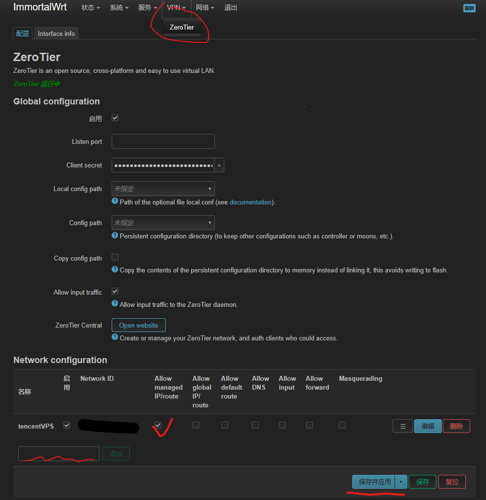
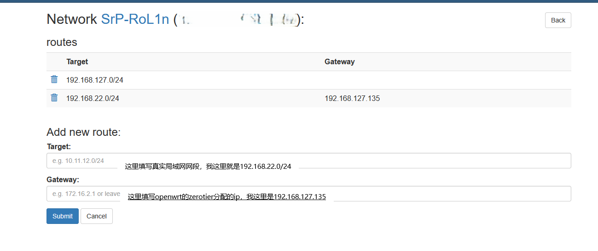

# 相关链接
- [略知Zerotier | 搭建虚拟局域网 ](https://blog.srprolin.top/posts/zerotier-1/)
- [PVE虚拟系统与OpenWrt配置](https://blog.srprolin.top/posts/2026-03-07-pve-1/)

# 正文

进入OpenWrt插件页面，加入虚拟局域网：

在网络接口中，创建一个新接口：

在网络防火墙中，新建一个zerotier区域：

在ztncui面板的网络中，选择routers(路由)，新建一个路由：

