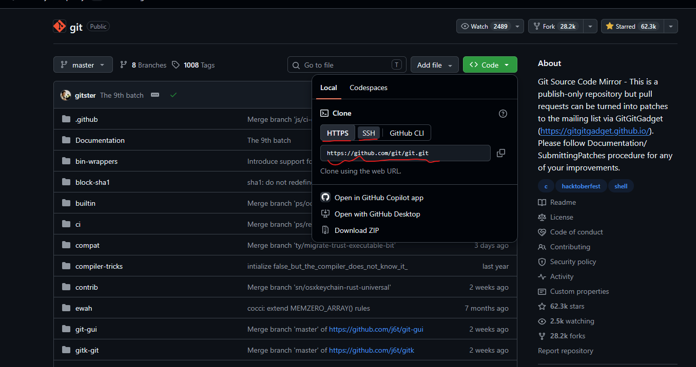
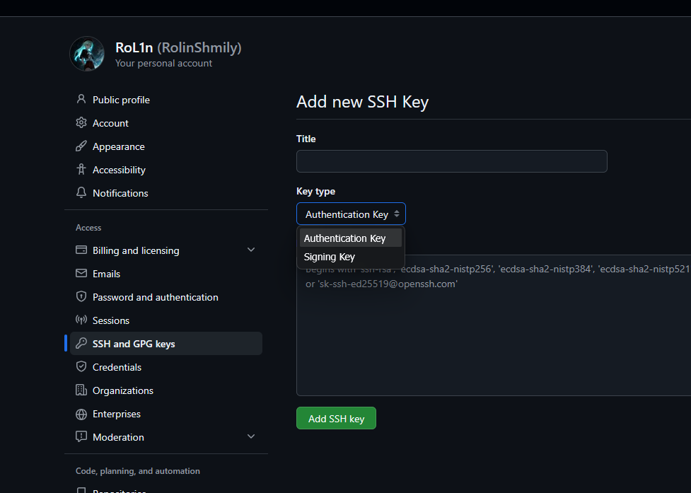

# 相关链接
- [《Pro Git》中文版](https://git-scm.com/book/zh/v2)
- [GitHub CLI](https://cli.github.com/)

# Git初始化配置
使用git管理代码仓库，可以进入项目根目录，进行初始化：
```zsh
git init
```
在之后进行代码的修改，需要手动调用git进行追踪文件更改、保存变化存档，这需要标明 **你是谁**，可以进行如下配置：
```zsh
git config --global user.name "Your Name"
git config --global user.email "your_email@example.com"
```
相关配置会保存在`~/.gitconfig`文件下，也可以对不同工作目录配置不同的身份：
```toml
# ~/.gitconfig (主配置)
[user]
  name = RoL1n
  email = personal@gmail.com
# ~/.gitconfig-gitea (副配置引用)
[includeIf "gitdir:~/Projects/gitea/"]
  path = ~/.gitconfig-gitea
```
下面是单独的`.gitconfig-gitea`配置：
```toml
[user]
  name = RoL1n-Work
  email = public@gmail.com
```

# GitHub等云平台配置
在GitHub平台拉取代码，会看到有两种链接，一种是`HTTPS`走443端口，一种是`SSH`走22端口。



需要在本地git中配置远程仓库：
```zsh
# 远程仓库名一般为origin
git remote add <远程仓库名> <远程git链接>
```

一般在编码场景，也就是个人远程仓库，推荐使用`SSH`链接，可以免密码进行代码推送。

根据博文 [如何安全地使用SSH、SFTP？ ](https://blog.srprolin.top/posts/ssh-1/)可以创建好一个SSH密钥对，只需要将公钥pub内容，在GitHub的 [SSH and GPG keys](https://github.com/settings/keys) 页面上传`Authentication Key`验证格式即可。

这里的 `GPG keys` 是用来验证每一条远程仓库的`Commit`是否属于账户本人签名过的提交，在GitHub上可以将SSH密钥也作为GPG来使用，只需在创建keys时，选择`Signing Key`签名格式，再将SSH公钥上传。



回到本地git，进行配置即可：
```zsh
# 将gpg方式改成ssh
git config --global gpg.format ssh
# 选择签名密钥文件
git config --global user.signingkey ~/.ssh/id_ed25519.pub
# 是否对每条本地commit启用gpg签名
git config --global commit.gpgsign true
```

## GPG签名生成
```zsh
gpg --full-generate-key
```
在交互式配置过程中，唯一需要注意的是`Email address`要与GitHub平台账户绑定邮箱一致；

且在最后需要设置一个密码，在之后第一次推送云平台时，需要密码来进行签名。

随后可以导出GPG公钥，导入GitHub等云平台：
```zsh
# 导出公钥内容
gpg --armor --export-secret-keys
```

接下来就是配置git使用gpg签名：
```zsh
# 查询密钥ID
gpg --list-secret-keys --keyid-format=long
# 将gpg方式改成ssh
git config --global gpg.format gpg
# 选择签名密钥文件，指定上文获取到密钥ID
git config --global user.signingkey <gpg_id>
# 是否对每条本地commit启用gpg签名
git config --global commit.gpgsign true
```

## GitHub CLI
安装gh-cli后，使用如下命令登录：
```zsh
gh auth login
```
在成功登录了GitHub之后，拉取和推送代码就可以不用输入密码了，一般也会在交互式中帮忙上传SSH密钥，但不包括GPG签名验证。

# zsh环境变量快捷命令
在`~/.zshrc`文件中可以定义别名和函数：
```zsh
# 定义一个 clone 函数，用来克隆并进入仓库
# 替代的命令：git clone <git链接> && cd <仓库名>
function clone() {
  if [[ -z $2 ]]; then
	git clone "$@" && cd "$(basename "$1" .git)"
  else
	git clone "$@" && cd "$2"
  fi
}

# 定义一个 gcam 别名，用来快速提交commit
# 替代的命令：git add -A && git commit -m
alias gcam='git add -A && git commit -m'
```
因此可以定义出如下非常多的简化常用命令：

| 分类 | 缩写 / 函数 | 完整指令 / 实现逻辑 | 作用说明 | 最佳使用场景 |
| :--- | :--- | :--- | :--- | :--- |
| **📁 仓库导航** | `proj [name]` | `cd ~/Projects/[name]` | 快速跳转到统一的项目根目录或指定子项目 | 开始工作或切换项目时 |
| **📁 仓库导航** | `grt` | `cd "$(git rev-parse --show-toplevel)"` | 无论处于多深的子目录下，一键切回当前 Git 仓库根目录 | 在深层子目录想回到仓库根路径 |
| **📁 仓库导航** | `clone <url>` | `git clone <url> && cd <repo>` | 克隆仓库并在下载完成后**自动 `cd` 切入新项目目录** | 临时下载并查看新项目 |
| **📝 暂存与提交** | `gs` | `git status` | 查看当前工作区改动与暂存状态 | 准备提交或切分支前确认状态 |
| **📝 暂存与提交** | `gd` | `git diff` | 查看尚未暂存的具体代码改动 | 提交前自查（Code Review） |
| **📝 暂存与提交** | `gdc` | `git diff --cached` | 查看已经暂存（`git add`）的改动差异 | 确认暂存区内容是否正确 |
| **📝 暂存与提交** | `ga <file>` | `git add <file>` | 暂存指定文件 | 仅打包部分修改文件 |
| **📝 暂存与提交** | `gA` | `git add -A` | 暂存全仓库所有改动（含新增、修改、删除） | 准备无死角全部打包暂存 |
| **📝 暂存与提交** | `gc` | `git commit` | 调出文本编辑器提交暂存区 | 需要编写多行详细 Commit 描述 |
| **📝 暂存与提交** | `gcm "msg"` | `git commit -m "msg"` | 带简短提交信息提交暂存区代码 | 提交已暂存的代码 |
| **📝 暂存与提交** | `gca` | `git commit -a` | 自动暂存已追踪改动并提交（无法捕获未追踪新文件） | 仅修改了已有文件，无新建文件 |
| **📝 暂存与提交** | `gcam "msg"` | `git add -A && git commit -m "msg"` | **最高频**：一键暂存全仓库所有改动并提交 | 完成一个逻辑功能单元后提交 |
| **🌿 分支与变基** | `main` | `git checkout main` | 一键切回主分支 `main` | 完成特性开发或修复后返回主干 |
| **🌿 分支与变基** | `gb` | `git branch` | 列出本地所有分支 | 检查当前处于哪个分支 |
| **🌿 分支与变基** | `gbd <bname>`| `git branch -d <bname>` | 安全删除指定的本地分支 | 清理已合并的废弃特性分支 |
| **🌿 分支与变基** | `gco <bname>`| `git checkout <bname>` | 切换到指定分支 | 在不同开发分支间切换 |
| **🌿 分支与变基** | `gcob <bname>`|`git checkout -b <bname>` | **新建并立即切换**到新分支 | 开始开发新 Feature 或修复 Bug |
| **🌿 分支与变基** | `gpl` | `git pull --rebase` | **推荐**：采用变基方式拉取远端更新（避免 Merge 节点）| 日常拉取远端最新代码 |
| **🌿 分支与变基** | `grb <bname>`| `git rebase <bname>` | 将当前分支变基合并到目标分支 | 整理分支提交线 |
| **🌿 分支与变基** | `grbc` | `git rebase --continue` | 解决完冲突后继续完成 rebase | 处理完 rebase 冲突后继续 |
| **🌿 分支与变基** | `grbom` | 识别远程主干并 `rebase` | 将当前特性分支变基合并到最新的 `origin/main` | 准备提交 PR 前对齐远端主干 |
| **🌿 分支与变基** | `gfrb` | `git fetch origin && grbom` | **推荐**：抓取远程最新分支并自动变基合并最新主干 | 推送代码前快速对齐远端主干 |
| **🚀 推送与清理** | `gp` | `git push` | 推送当前分支代码到远程仓库 | 完成提交后同步到云端 |
| **🚀 推送与清理** | `gpf` | `git push --force` | 强制推送（仅限个人特性分支重构后使用，严禁在主干用）| 个人特性分支 rebase 后更新远端 |
| **🚀 推送与清理** | `gpft` | `git push --follow-tags` | 连同本地 Tag 一起推送到远端 | 发布新版本切 Tag 时 |
| **🚀 推送与清理** | `gst` | `git stash` | **草稿箱**：将工作区半成品封存存盘，恢复干净工作区 | 紧急切分支修 Bug 或拉代码冲突时 |
| **🚀 推送与清理** | `grh` | `git reset HEAD` | 撤销暂存区文件状态（保留本地修改） | 误 add 了不该提交的文件 |
| **🚀 推送与清理** | `grh1` | `git reset HEAD~1` | 撤销最近一次 Commit，改动退回暂存区 | 提交信息写错或漏提交了文件 |
| **🚀 推送与清理** | `gxn` | `git clean -dn` | **安全预览**：预览即将被清理的未跟踪文件 | 清理垃圾临时文件前的安全预览 |
| **🚀 推送与清理** | `gx` | `git clean -df` | 强制清理所有未跟踪的垃圾文件与目录 | 彻底还原干净的工作区 |
| **🚀 推送与清理** | `gl` | `git log` | 查看提交历史日志 | 查阅历史提交 |
| **🚀 推送与清理** | `glo` | `git log --oneline --graph` | 图形化单行精简展示分支树 | 快速直观查看分支提交历史 |
| **🚀 推送与清理** | `glp [n]` | `git --no-pager log [-n]` | 无分页打印最近 n 条日志 | 管道命令分析日志时 |
| **🚀 推送与清理** | `gsha` | `git rev-parse HEAD \| clip` | 自动复制当前 HEAD 的 Commit SHA 到系统剪贴板 | 需要引用当前提交 Commit ID 时 |
| **🛠️ `gh-cli` 交互**| `ghci` | `gh run list -L 1` | 一键查看最近 1 次 GitHub Actions 流水线运行状态 | push 代码后快速监控 CI 结果 |
| **🛠️ `gh-cli` 交互**| `pr ls` | `gh pr list` | 列出当前仓库所有待处理的 Pull Request 列表 | 查看等待 Review 的 PR |
| **🛠️ `gh-cli` 交互**| `pr <id>` | `gh pr checkout <id>` | **一键拉取并切入**指定编号的 PR 代码到本地分支 | Code Review 同事提交的代码时 |
| **🔐 密钥防伪** | `ggpg <id>` | 函数：一键设置 `gpg.format gpg` & key & true | 一键配置全局 GPG 自动签名 | 生成 GPG 密钥后快速开启签名 |

