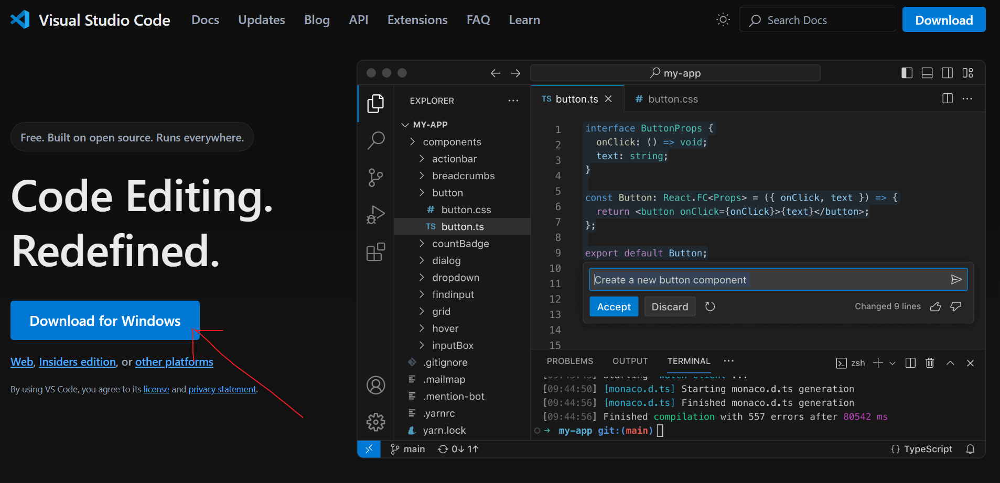
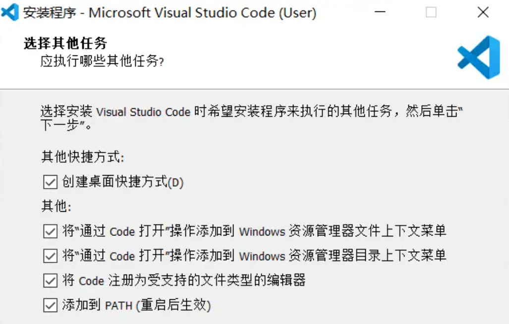
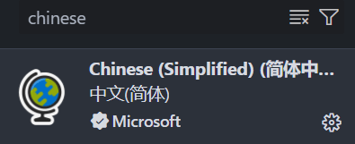
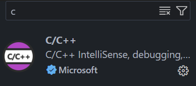
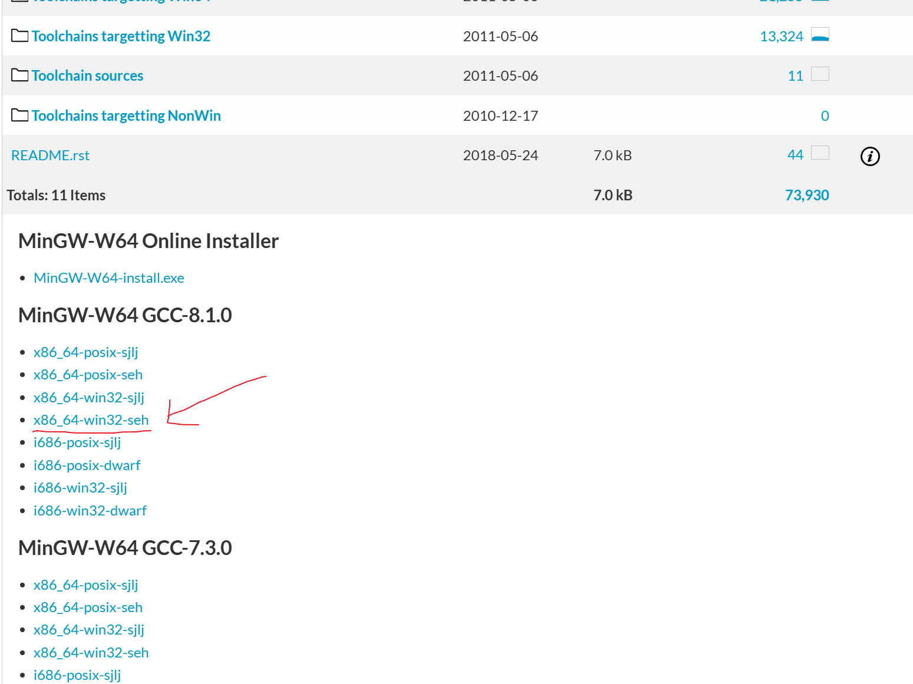
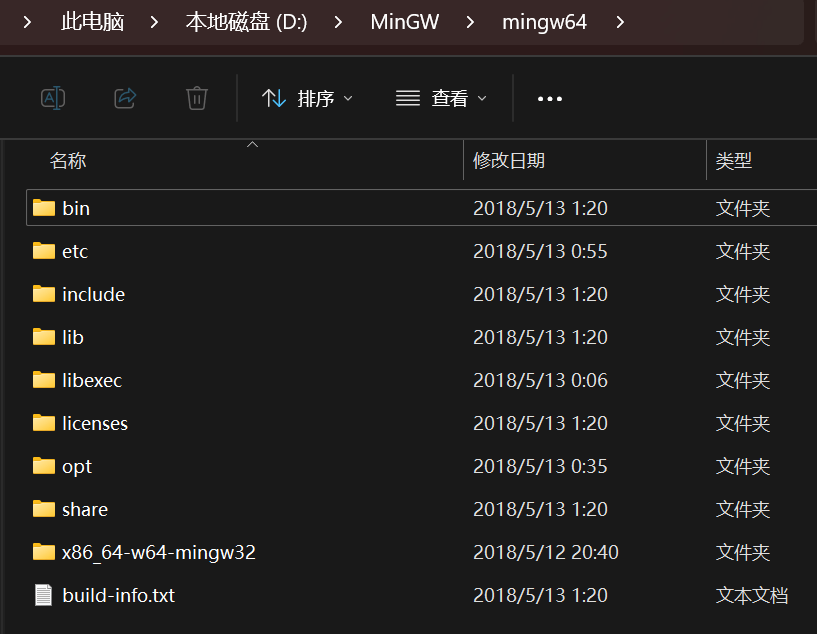
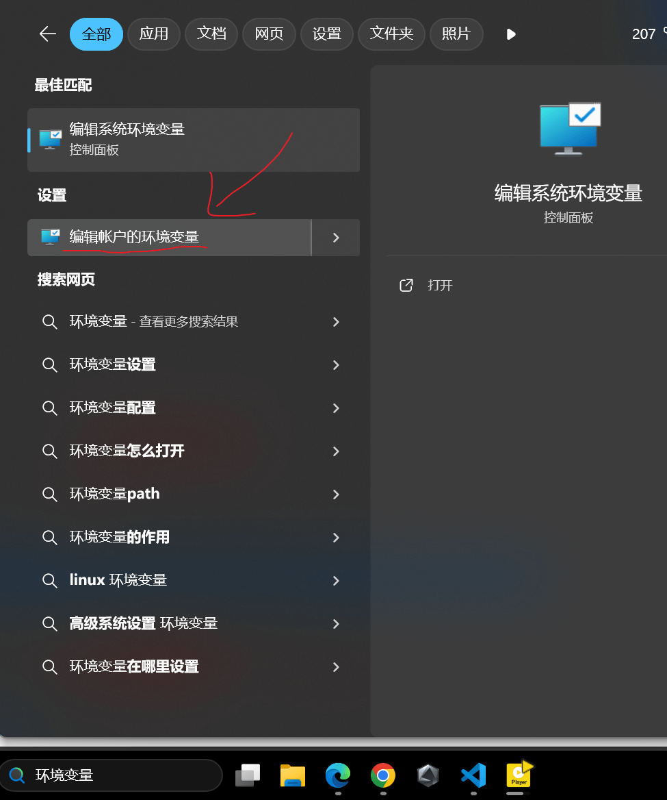
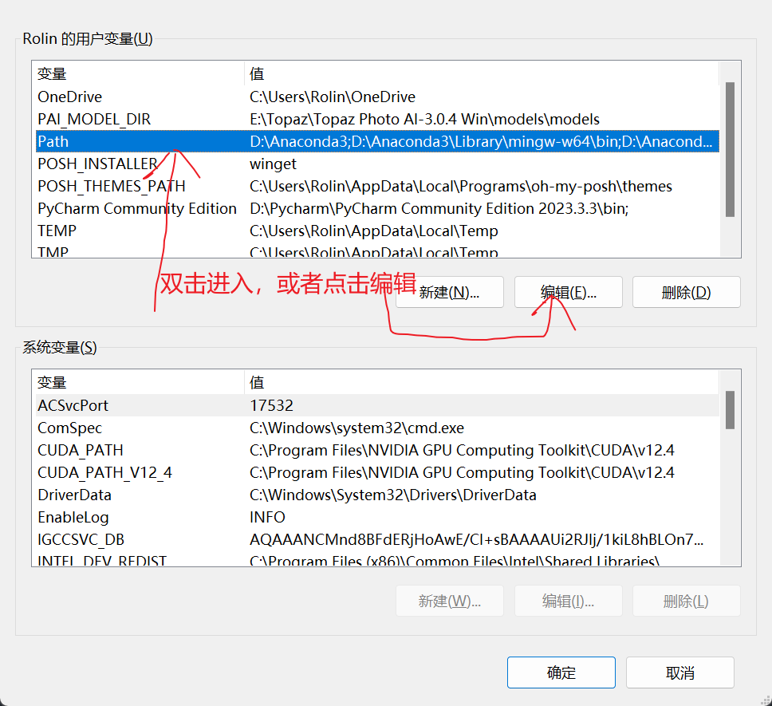
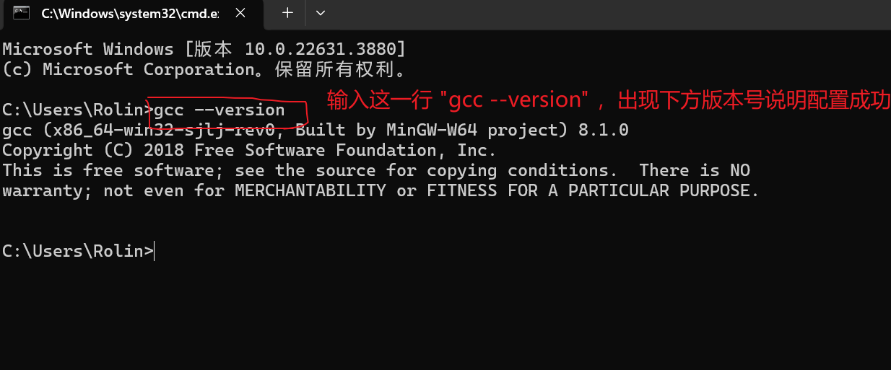
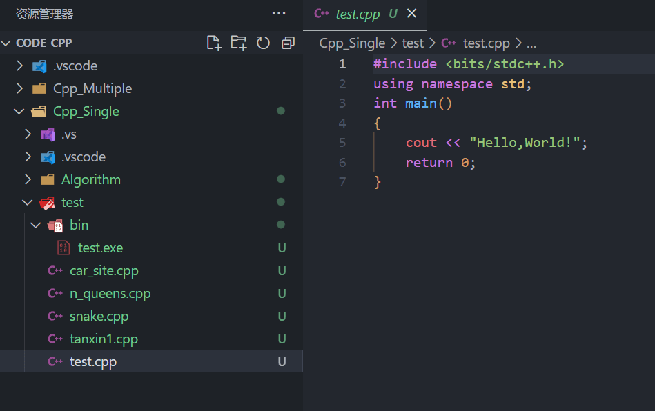

# 前言

- 针对准备学习编程的新人，一般是从 c 语言开始，当然 c++是可以兼容 c 语言的，且环境配置上差不太多，在这里一起讲。
- 编程所用必备的工具一般是 **IDE（集成开发环境）**，其中包含了代码 **_编辑器_**、**_编译器_**、**_调试器_** 和图形化操作界面，方便使用。
- 而因为 **_VScode_** 它本质上是一个 **_编辑器_**，而非 **_IDE_**，也即只能写代码而不能直接编译运行，所以我们要配置环境，使得它能够完成代码生产的完整工具链。
- 因此我们在这里需要安装 **_编辑器_**，**_编译器_**，写配置文件 **_搭建环境_**。

> **_编辑器_** -- **_Visual Studio Code_** > **_编译器_** -- **_GCC(GNU Compiler Collection)_**

# 手把手从 0 开始构建 IDE 环境

下面将分步骤，详细说明每一步在干什么，以及需要做什么，从而搭建起我们编写代码的环境。

## 1.**_宇宙最强编辑器--Visual Studio Code_**

- 下载地址： https://code.visualstudio.com/




- 全部勾选即可
- 打开后在左侧，选择拓展


- 搜索 **_chinese_** 和 **_c_** 安装这两个拓展，**_C/C++_** 拓展是个包，只需安装一个，另外几个都会自动安装。




## 2.**_Windows 系统下的 GCC 编译器--MinGW-w64_**

> 最初的原版 **_gcc_** 编译器并不能在现如今更流行的 **_windows 系统_** 下使用，因此我们用的是 **_MinGW(全称 Minimalist GNU on Windows)_**
> 其下有两个版本 **_MinGW_** 和 **_MinGW-w64_**，前者只能编译生成 32 位程序，而后者能够编译生成 32 位或 64 位程序，因此我们选择后者。

- **_MinGW-w64_** 下载地址： https://sourceforge.net/projects/mingw-w64/files/
- 进去之后向下滑动找到如下版本：



- 下载完成后会得到一个压缩包，在任意盘符下创建文件夹，名为 **_MinGW_**，将压缩文件拖进该文件夹中解压，我这里在 **_D 盘_** 中演示



- 打开 **_bin_** 文件夹后，里面的 **gcc.exe**是 **C 语言**的编译器，**_g++.exe_** 是 **_C++语言_** 的编译器，**_gdb.exe_** 是用来调试程序的 **_debug 工具_**

## 3.**_配置帐户环境变量_**

- 打开 **_windows 搜索栏_**，输入 **_环境变量_**





- 此后我们打开 **_cmd 命令行_**



- 此时需要重新启动电脑

## 4.**_文件结构_**

- **_学习阶段_** 大多数文件都是独立运行，或者是非拓展性文件间的互相访问，这是一种使用环境。
- 而在 **_项目工作_** 中的文件夹中，有许多为了方便管理的拓展性文件，这又是一种使用环境。
- 这两种环境我们要单独为其编写配置文件，分成 **_单文件结构_** 和 **_多文件结构_**
- 我们可以在一个名为 **_project_** 的文件夹中创建名为 **_CODE_C_** 的文件夹来管理 c 语言文件，再在 **_CODE_C_**文件夹下创建 **_C_Single_** 和 **_C_Multiple_** 来区分单文件与多文件结构。
- 此时在 **_C_Single_** 文件夹下就可以创建用于测试的项目文件夹，比如名为 **_test_v_** 的文件夹，在此文件夹下创建 **_test.c_** 文件来编写代码，当我们去编译执行代码时，将会产生一个 **_exe 可执行程序文件_**，我们可以在项目文件夹 **_test_v_** 下创建 **_bin_** 文件夹来存放生成的程序文件。
- example：



- 在多文件结构中，只需要在单文件结构中存放代码文件的位置，替换成存放文件夹就好，源代码和 exe 文件均在这个文件夹中。

## 5.**_基于文件结构的 VScode 配置文件_**

- 简单来说，我们需要创建两个文件 **_tasks.json_** 文件和 **_launch.json_** 文件来分别实现 **_build_** 构建功能和 **_debug_** 调试功能
- 创建文件的位置要求是，在存放源文件的文件夹的根目录，以 c 语言单文件为例，也就是在 **C_Single**文件夹下创建。
- 注意请大致看一看 json 文件的内容，要注意修改 **_某些路径_**，配置默认编译器是调用 gcc 也即 c 语言编译器，若用 c++语言请在 json 文件中修改对应参数。

1. **_单文件结构_**
   **_tasks.json_**

```json
{
  "version": "2.0.0",
  "tasks": [
    {
      //这个大括号里是‘构建（build）’任务
      "label": "build", //任务名称，可以更改，不过不建议改
      "type": "shell", //任务类型，process是vsc把预定义变量和转义解析后直接全部传给command；shell相当于先打开shell再输入命令，所以args还会经过shell再解析一遍
      "command": "gcc", //编译命令，这里是gcc，编译c++的话换成g++
      "args": [
        //方括号里是传给gcc命令的一系列参数，用于实现一些功能
        "${file}", //指定要编译的是当前文件
        "-o", //指定输出文件的路径和名称
        "${fileDirname}\\bin\\${fileBasenameNoExtension}.exe", //承接上一步的-o，让可执行文件输出到源码文件所在的文件夹下的bin文件夹内，并且让它的名字和源码文件相同
        "-g", //生成和调试有关的信息
        "-Wall", // 开启额外警告
        "-static-libgcc", // 静态链接libgcc
        "-fexec-charset=GBK", // 生成的程序使用GBK编码，不加这一条会导致Win下输出中文乱码
        "-std=c11" // 语言标准，可根据自己的需要进行修改，写c++要换成c++的语言标准，比如c++11
      ],
      "group": {
        //group表示‘组’，我们可以有很多的task，然后把他们放在一个‘组’里
        "kind": "build", //表示这一组任务类型是构建
        "isDefault": true //表示这个任务是当前这组任务中的默认任务
      },
      "presentation": {
        //执行这个任务时的一些其他设定
        "echo": true, //表示在执行任务时在终端要有输出
        "reveal": "always", //执行任务时是否跳转到终端面板，可以为always，silent，never
        "focus": false, //设为true后可以使执行task时焦点聚集在终端，但对编译来说，设为true没有意义，因为运行的时候才涉及到输入
        "panel": "new" //每次执行这个task时都新建一个终端面板，也可以设置为shared，共用一个面板，不过那样会出现‘任务将被终端重用’的提示，比较烦人
      },
      "problemMatcher": "$gcc" //捕捉编译时编译器在终端里显示的报错信息，将其显示在vscode的‘问题’面板里
    },
    {
      //这个大括号里是‘运行(run)’任务，一些设置与上面的构建任务性质相同
      "label": "run",
      "type": "shell",
      "dependsOn": "build", //任务依赖，因为要运行必须先构建，所以执行这个任务前必须先执行build任务，
      "command": "${fileDirname}\\bin\\${fileBasenameNoExtension}.exe", //执行exe文件，只需要指定这个exe文件在哪里就好
      "group": {
        "kind": "test", //这一组是‘测试’组，将run任务放在test组里方便我们用快捷键执行
        "isDefault": true
      },
      "presentation": {
        "echo": true,
        "reveal": "always",
        "focus": true, //这个就设置为true了，运行任务后将焦点聚集到终端，方便进行输入
        "panel": "new"
      }
    }
  ]
}
```

**_launch.json_**

```json
{
  "version": "0.2.0",
  "configurations": [
    {
      //这个大括号里是我们的‘调试(Debug)’配置
      "name": "Debug", // 配置名称
      "type": "cppdbg", // 配置类型，cppdbg对应cpptools提供的调试功能；可以认为此处只能是cppdbg
      "request": "launch", // 请求配置类型，可以为launch（启动）或attach（附加）
      "program": "${fileDirname}\\bin\\${fileBasenameNoExtension}.exe", // 将要进行调试的程序的路径
      "args": [], // 程序调试时传递给程序的命令行参数，这里设为空即可
      "stopAtEntry": false, // 设为true时程序将暂停在程序入口处，相当于在main上打断点
      "cwd": "${fileDirname}", // 调试程序时的工作目录，此处为源码文件所在目录
      "environment": [], // 环境变量，这里设为空即可
      "externalConsole": false, // 为true时使用单独的cmd窗口，跳出小黑框；设为false则是用vscode的内置终端，建议用内置终端
      "internalConsoleOptions": "neverOpen", // 如果不设为neverOpen，调试时会跳到“调试控制台”选项卡，新手调试用不到
      "MIMode": "gdb", // 指定连接的调试器，gdb是minGW中的调试程序
      "miDebuggerPath": "D:\\MinGW\\mingw64\\bin\\gdb.exe", // 指定调试器所在路径，如果你的minGW装在别的地方，则要改成你自己的路径，注意间隔是\\
      "preLaunchTask": "build" // 调试开始前执行的任务，我们在调试前要编译构建。与tasks.json的label相对应，名字要一样
    }
  ]
}
```

2. **_多文件结构_**
   **_tasks.json_**

```json
{
  "version": "2.0.0",
  "tasks": [
    {
      "label": "build",
      "type": "shell",
      "command": "gcc", //写c++换成g++
      "args": [
        "${fileDirname}\\*.c", //写c++把 *.c 换成 *.cpp
        "-o",
        "${fileDirname}\\${fileBasenameNoExtension}.exe",
        "-g",
        "-Wall",
        "-static-libgcc",
        "-fexec-charset=GBK",
        "-std=c11" //写c++换成c++标准
      ],
      "group": {
        "kind": "build",
        "isDefault": true
      },
      "presentation": {
        "echo": true,
        "reveal": "always",
        "focus": false,
        "panel": "new"
      },
      "problemMatcher": "$gcc"
    },
    {
      "label": "run",
      "type": "shell",
      "dependsOn": "build",
      "command": "${fileDirname}\\${fileBasenameNoExtension}.exe",
      "group": {
        "kind": "test",
        "isDefault": true
      },
      "presentation": {
        "echo": true,
        "reveal": "always",
        "focus": true,
        "panel": "new"
      }
    }
  ]
}
```

**_launch.json_**

```json
{
  "version": "0.2.0",
  "configurations": [
    {
      "name": "Debug",
      "type": "cppdbg",
      "request": "launch",
      "program": "${fileDirname}\\${fileBasenameNoExtension}.exe",
      "args": [],
      "stopAtEntry": false,
      "cwd": "${fileDirname}",
      "environment": [],
      "externalConsole": false,
      "internalConsoleOptions": "neverOpen",
      "MIMode": "gdb",
      "miDebuggerPath": "D:\\MinGW\\mingw64\\bin\\gdb.exe",
      "preLaunchTask": "build"
    }
  ]
}
```

- 至此，在 VScode 中编写一个 Hello,World! 并编译执行，也就不成问题了。
