# Java版Minecraft下载
## 一、启动器 ***HMCL*** 、 ***PCL2*** 、 ***官方启动器***

- ***HMCL*** --由 ***huangyuhui*** 制作
  主页: https://hmcl.huangyuhui.net/
  GitHub项目地址:https://github.com/HMCL-dev/HMCL

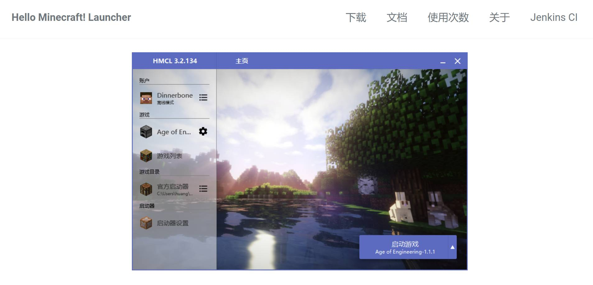

- ***PCL2*** --由 ***龙腾猫跃*** 制作
  爱发电文件地址: https://afdian.com/p/0164034c016c11ebafcb52540025c377
  GitHub项目地址: https://github.com/Hex-Dragon/PCL2

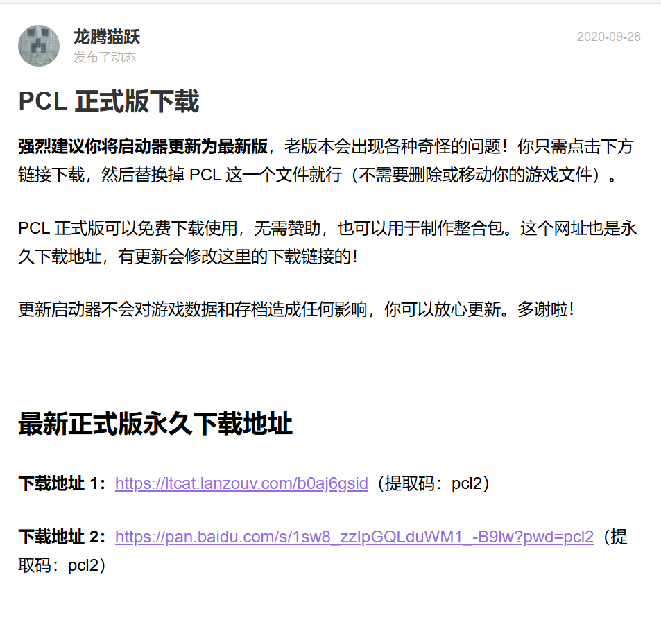

> - 一般通过这种途径下载，将会得到一个 ***.zip*** 压缩包文件，然后找到一个文件夹解压下来，将会得到两个程序文件：

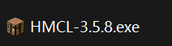

- ***官方启动器*** --由 ***Mojang*** 制作（当然游戏也是人家做的）
  网址：https://www.minecraft.net/zh-hans

> - 在这里我们能找到购买游戏的途径（Minecraft游戏其实是付费的），购买之后就能够得到 ***Java版*** 和 ***基岩版***，如果不行的话，可以去 ***Microsoft Store***（俗称微软商店）中购买

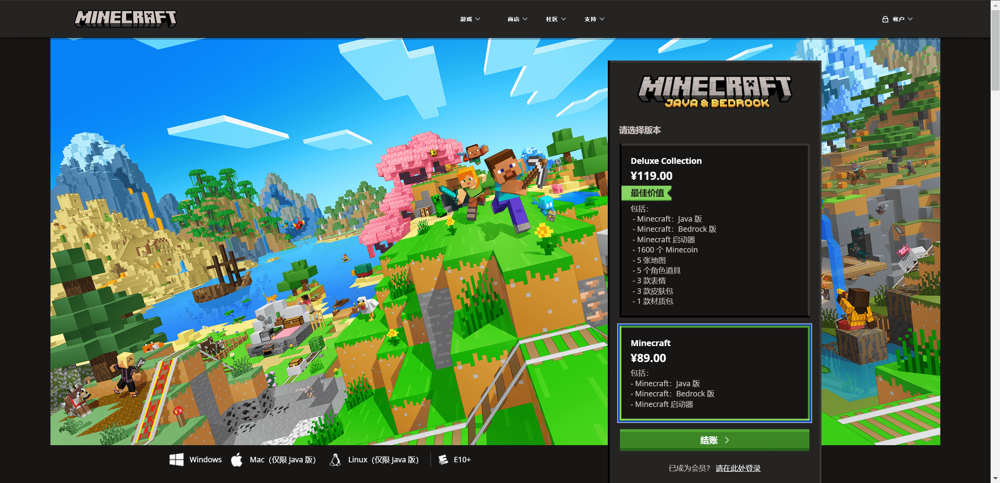
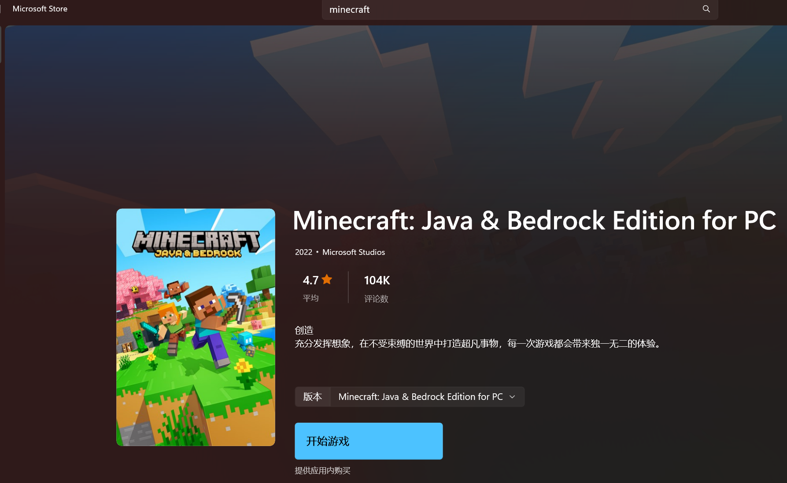

> - 购买游戏其实对 ***Java版*** 影响不大，因为微软接手后大力发展的是 在自家 ***XBox*** 平台上的 ***基岩版*** minecraft，但是购买了游戏后，***Java版*** 用户将会被分配一个唯一的 ***uuid***，用于 ***Java*** 服务器的 ***正版验证*** ，从而进行有效 ***联机***
> - ***uuid*** 查询网站：https://mcuuid.net/

## 二、游戏本体下载

> - 打开非官方启动器后都是可视化操作界面，接下来提一下游戏本体的下载。
> - 在启动器中的下载版块里，首先 ***选择游戏版本***，接下来选择模组加载器

1. ***Forge***  ：具有大量老牌大型模组社区，可供下载。游戏光影一般搭配 ***OptiFine*** 使用，不过如今 ***Forge*** 优化模组中也出现了 ***Fabric*** 里类似 ***iris*** 的存在，但不安装 ***OptiFine*** 也不影响游戏本体的下载与游玩。
2. ***Fabric***   ： 小鲜肉，起初是大多小型模组的生态圈，如今也有很多大型模组，因 ***Fabric*** 的许多优化都比 ***Forge*** 更好，而被做了一些移植。下载时要搭配 ***Fabric API*** ， 这是必要的，启动器里一般默认自动勾选。

> - 之后通过启动器的一键式安装，你就得到了游戏本体了。但是众所周知 ***Java版Minecraft*** 是需要 ***Java环境*** 来运行的，因此你需要下载 ***Java***

## 三、Java下载

> - 下面有两种方法下载 ***Java***，一个是通过 ***官网*** 安装Java，另一个是通过 ***Oracle中国*** 的Java整合版，由于后者是国内的，我更推荐通过Oracle下载。

- ***Java官网*** ： https://www.java.com/zh-CN/
- ***Oracle地址*** ： https://www.oracle.com/cn/java/technologies/downloads/

> - 下面是 ***Oracle*** 的下载界面：

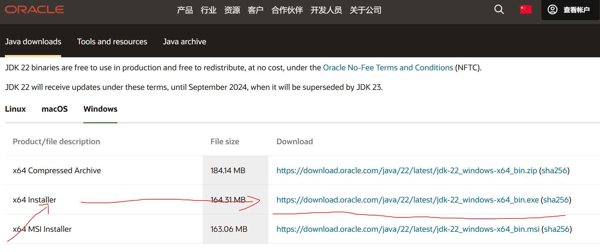

> - 一般选择 ***Installer***，下载好之后双击都是安装程序。

> - 安装好 ***Java*** 后，通过启动器启动游戏就可以开始游玩了。

# 联机

## 一、联机工具下载

> - 我们使用的工具是 ***ZeroTier***  一个专门用来建立点对点虚拟专用网(***P2P VPN***)
> - 以 ***Windows*** 系统为例

1. 下载地址：https://www.zerotier.com/

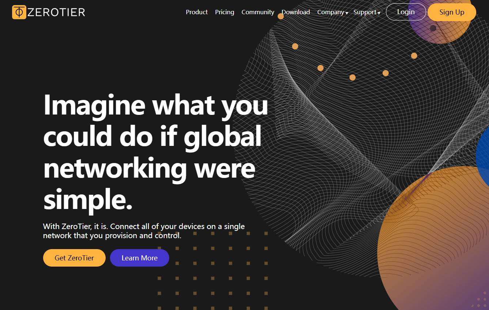

2. 点击 ***Download***

3. 一般情况下直接点击 ***MSI Installer (x86/x64)*** 下载完成如图

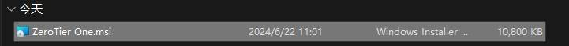

4. 安装前请把 ***杀毒软件*** 全部关闭，尽量不要出现被拦截的情况。
5. 双击进行安装后，在右下角 ***托盘*** 处，你会看到如图图标。

## 二、网络创建者（房主）的操作：

1. 回到 ***ZeroTier*** 官网：https://www.zerotier.com/
2. 选择 ***Sign Up*** 注册一个账号，然后 ***Log In*** 登录

3. ***Create A Network***，点击进一个 ***Network*** 中

4. 复制 ***Network ID*** 给你的朋友

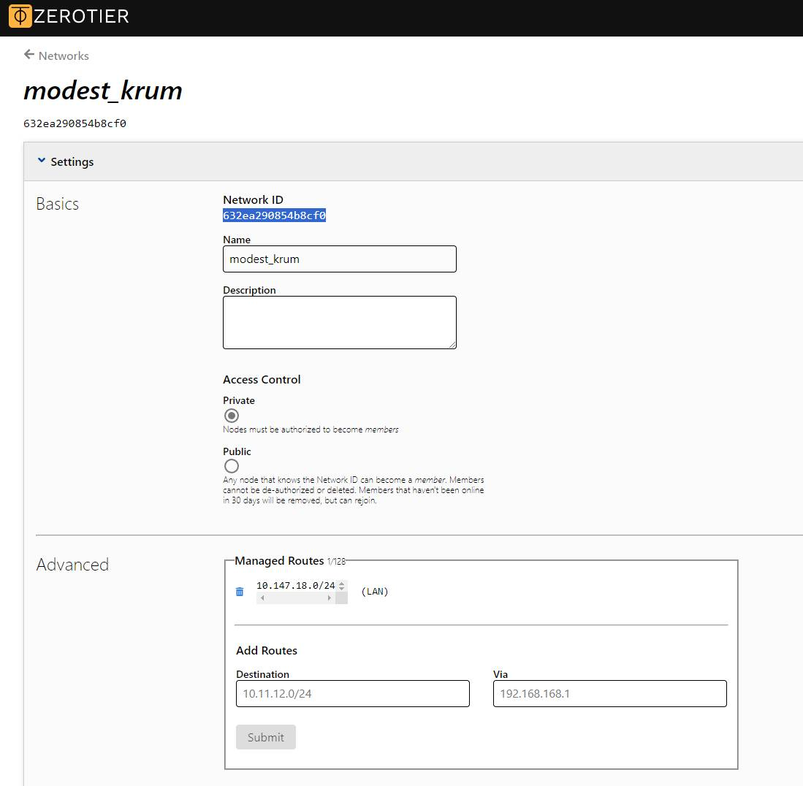

5. 等待朋友发来请求，下拉找到请求，***勾选***

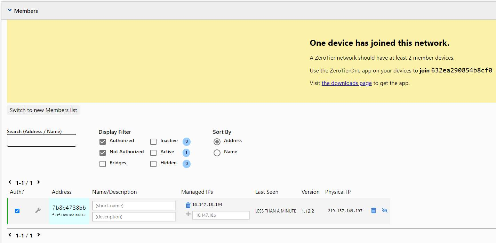

6. 对此网络的管理均在此网页内进行

## 三、网络连接者：

1. 点击托盘图标，点击 ***Join New Network***

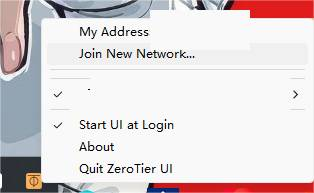

2. 将代码输入，点击 ***Join***

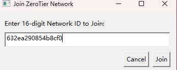

3. 等待创建者同意加入网络

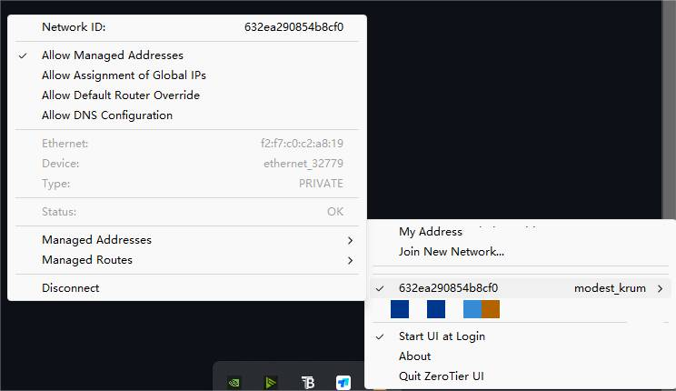

- ***注意*** : 请把 ***Windows防火墙*** 中的公用网络关闭，防止连接失败。

## 四、游戏房主：

1. 任意界面下按 ***win键*** + ***R键*** ，输入 ***cmd***

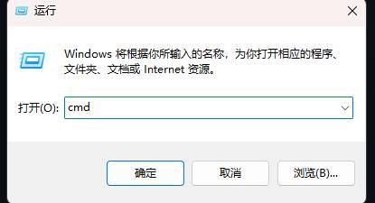

2. 输入 ***ipconfig*** 找到以太网Zerotier下的描述，复制 ***IPv4地址***

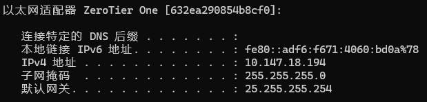

3. 打开任意世界，***对局域网开放*** ，注意如果朋友是离线用户，一定要关闭 ***在线验证***

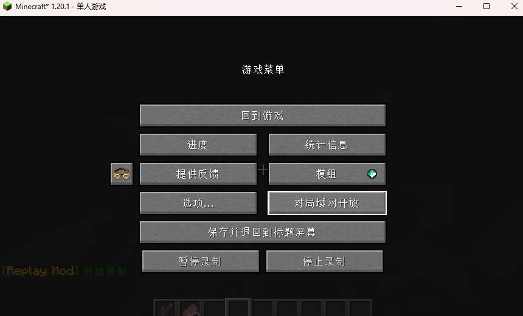
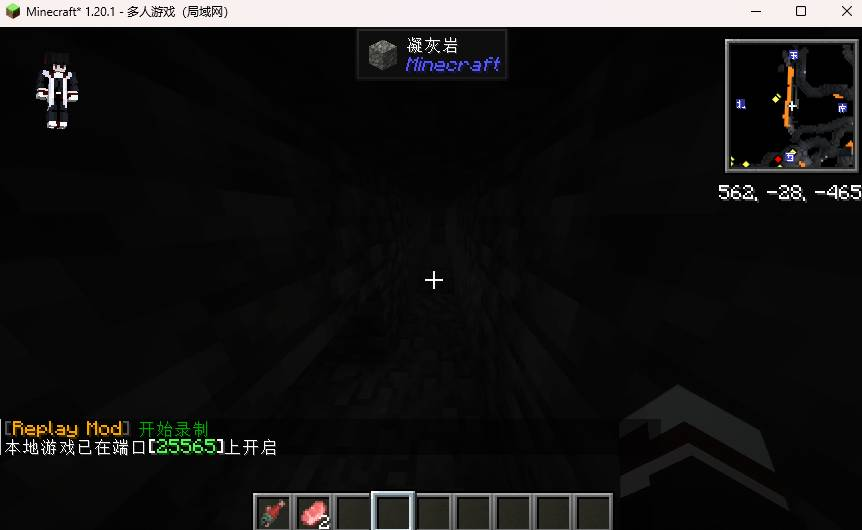

4. 将 ***端口号*** 和 ***IPv4地址*** 发给你的朋友

## 五、游戏玩家：

1. 多人游戏，添加服务器
2. 输入 ***IPv4地址*** ***:*** ***端口号*** ,注意 ***“:”*** 一定是英文输入法下的

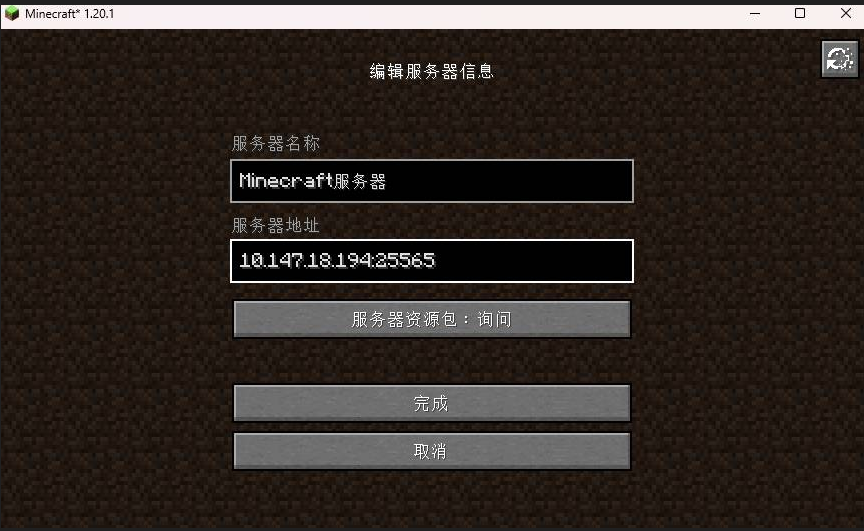

3. 连接进入

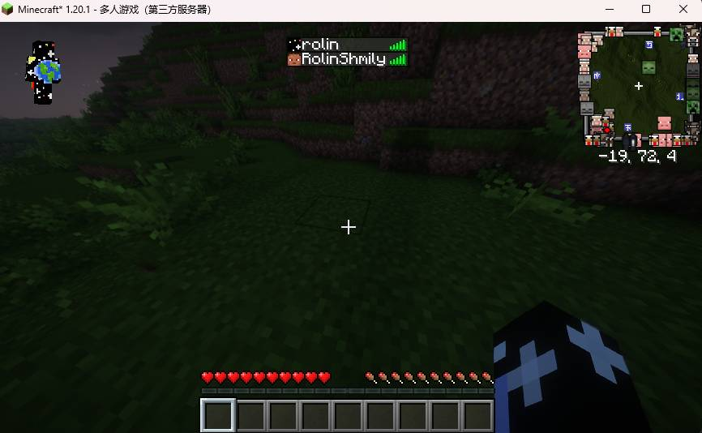