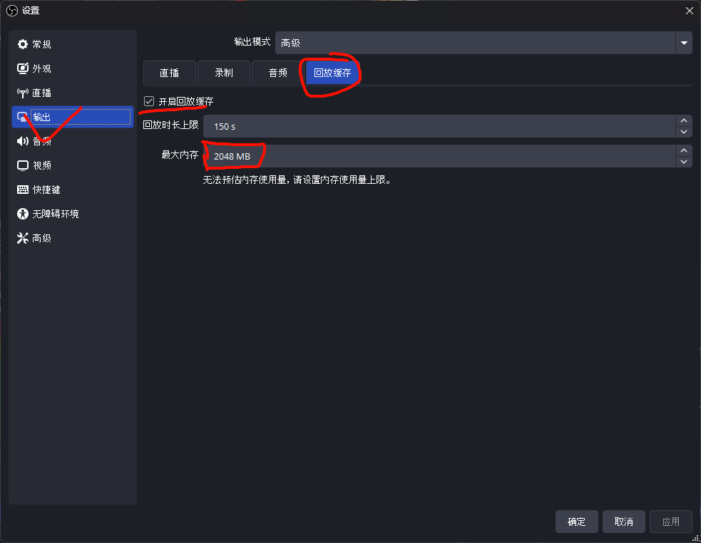

# 前言与摘要
首先，OBS的功能是非常强大的，可以用于**直播推流**、**视频录制**、**即时回放**、**多机位画面切换**。另外其自带的**虚拟摄像机**可以将准备好的画面，作为伪装好的摄像头画面在通讯软件中输出。其次，OBS作为开源软件，具有庞大的插件社区和脚本数量，使用OBS丰富的插件可以实现非常多的功能，而编写脚本可以实现自定义功能。
本篇主要介绍OBS的下载、录制与直播设置、虚拟摄像头的使用案例、及时回放的设置、好用的插件教程。
# 下载与手册
官网下载地址: https://obsproject.com/download ，选择对应系统和方式下载。

如果打不开，这里提供下载链接：
- Windows：[OBS-Studio-31.1.1-Windows-x64-Installer.exe](https://cdn-fastly.obsproject.com/downloads/OBS-Studio-31.1.1-Windows-x64-Installer.exe)
- MacOS：[obs-studio-31.1.1-macos-intel.dmg](https://cdn-fastly.obsproject.com/downloads/obs-studio-31.1.1-macos-intel.dmg)
- Linux：
	下载：`flatpak install flathub com.obsproject.Studio`
	运行：`flatpak run com.obsproject.Studio`
- 官方的帮助页面(全英)：[Knowledge Base](https://obsproject.com/kb/)
# 快速开始
## 录屏基础设置

1. 进入设置，点击左侧**视频**，设置**基础(画布)分辨率**为你想要录制的分辨率，默认推荐`1920×1080`；选择帧率，推荐为`30帧`或`60帧`。

2. 点击输出，选择输出模式为**高级**，点击录制选项：设置你的录像路径、选择录像格式为`MPEG-4(.mp4)`；选择音频编码器为`FFmpeg AAC`。
3. 选择视频编码器为`x264`或`QuickSync H.264`或`NVIDIA NVENC H.264`或`AMD HW H.264(AVC)`，如果存在多个，后两个更优，其次为第二个。
4. 将上述编码器的设置中，**比特率控制**分别对应设置为`CRF`、`CQP`、`恒定QP`、`恒定QP`，并将**值**设置为`20`。

5. 返回主页面，添加源，请选择**显示器采集**，随后自定义名称；然后选择你的显示器，确保画布中出现了显示器的画面；如果画布中显示不完全，请选择对应源右击，进行变换。

至此，可以进行正常的录制屏幕了。
6. 在添加源选项中，推荐更多的使用“窗口采集”，可以管理不同的图层表现，是比较灵活的选择。
后面的详解配置将以此作为基础，进行优化和不同用法的介绍。
## 混音器与录音预设
当在“源”处选择，添加“应用程序音频”，或者添加“窗口采集”时勾选“音频采集功能”，那么均可在混音器中发现，并可在高级音频选项里选择音轨，最多6条独立音轨。

想要录制多条音轨，需要在输出录制中勾选你想要输出的音轨及数量，推荐使用mkv格式封装

在这种情况下，如果你需要录制实况视频，你可能会有私人语音、BGM、游戏声音、个人麦克风等多种声音，在后期剪辑时，可以做到特定音频分离，从而只获得干净的游戏声音。
- 需要注意的是，推荐将所有“源”都分给1号音轨，再开一条用于分离，原因有二：首先，默认的视频播放器对于多音轨视频会默认应用第一条音轨，这样在回看时可以获取所有的声音；其次，对于直播和录制场景不分离的用户，直播输出是只能一条音轨的，那么这个时候就可以在直播时勾选一号音轨，从而不用新建场景、新建源等操作。

音频的录制，想要获得更好的效果，需要对音频编码器、音频码率、音频采样进行设置：

现在的音频设备，能够做到PCM24位的解析，应该是相当小众了，对于只是想进一步提升音频效果，我认为FLAC16位已经足够。

音频码率，可以对每条音轨单独设置，单位是`kbps`，推荐192起步。

采样率48kHz和44.1kHz均可；声道请不要选择单声道，他并不是“单声道”，他是将两只耳朵里的声音设置成一模一样的，推荐“立体声”，也即“双声道”，能够更好还原音频本来的空间效果。
## 视频编码器的使用场景
- x264：此编码器为CPU编码，如果追求高质量的教程视频，对于CPU负担不重的场景，可以选用该编码器，它非常慢，但效果很好，不过一般有显卡就不要用这个了，显卡中有单独的编码单元就是为视频编码所设计的，而CPU，他只是能做这件事，但他要做的事情非常多。
- QuickSync：这是IntelCPU的集成显卡的独立视频编码器，现在多数的游戏笔记本有两个显卡，一个称为独显，另一个称为核显，而这个就是核显，它可能会对CPU的性能有一定影响，如果确定不使用，可以选择禁用该显卡，只需要在Windows搜索栏搜索“设备管理器”，按照图示操作即可。

- NVENC：这是NVIDIA显卡的视频编码器，一般情况下的录屏都可以使用该编码器，显卡的性能在多数情况下都是盈余的。但需要注意，在一些大型3A单机游戏、深度学习模型训练的场景下，显卡占用会被拉满，虽然视频编码器是被隔离开的，但这种情况下的录屏效果一般不会太好，推荐使用核显来录制，但同时，对于共享GPU内存会有占用，也会影响使用独显的应用性能表现。
- HW：AMD显卡的视频编码器，你不会既有A卡又有N卡吧？那么你会是双机推流的用户，但如果不是迫不得已，N卡的适用场景还是远超A卡，但AMD的CPU是真的比Intel香。
- 编码器的后缀`h.264`是最常见的编码格式，在某些场景下，`h.264`可以是`mp4`的代称，虽然混淆，但是足够经典；`h.265`和`hevc`都是NVIDIA提出的新型编码格式，他是对`h.264`的一种优化，在追求高质量的同时缩小文件大小，同时也是直播常用的编码格式，可惜bilibili仍然不支持`h.265`直播，；`AV1`也是NVIDIA推出的新编码格式，可以认为是效果最好的一种格式了，但因为比较新，很多视频播放器并不支持，`h.265`也有很多情况下不是被默认支持的。

总之，优先选择NVENC和`h.264`在大多数场景下是不会错的。

需要注意的是，独显或集显的录制选择，需要看CPU、GPU的使用率，如果GPU已经要吃满了，那么集显的录制是比较优的。

现在大多聊天软件自带的视频预览播放器，仅支持`h.264`,如果只是单纯录屏分享，还是推荐`h.264`。
## 直播设置(bilibili为例)

这里是哔哩哔哩直播姬，在bilibili更新后，网页推流需要一定的粉丝基础才能开播，所以选择用直播姬，但本质上还是用的obs来直播。

复制服务器和推流码，接着打开obs：

将服务器和推流码填入即可，此时obs会代理直播姬，在obs选择开播与下播。

接下来是直播的输出设置：

- 如果直播和录制场景不分离，音轨就要选择上文提到的1号音轨；
- 对于bilibili直播，选择`h.264`编码格式，独显和集显的使用按需选择，默认用独显；
- 音频编码器选择`AAC`；
- 比特率设置选择`CBR`，码率`8000kbps`起步，但其实已经够用，如果设置过高，主播需要更大的上行带宽来传输画面，观众也需要更高的下行带宽来下载画面，清晰度与流畅度的均衡，在超高码率情况下的性价比并不高。
- 关键帧间隔，很多直播平台会要求`2s`，这里的间隔时间越短，文件越大，但是后期剪辑越流畅，对于录制而言。
- 预设：根据obs的显示，越高质量对于编码器的性能要求越高，但视频文件越小，如果直播时略感吃力，可以调低预设。
- 调节：默认即可。
- 多次编码：`二次编码1/4`即可，均衡的选择。
- 配置文件：默认用`high`。
- B帧：数字越大，文件越小，但会影响质量，有的直播平台会要求`2`，视频录制也可参考。
# 额外小功能与插件
## 虚拟摄像头
现在的OBS软件，已经内置了虚拟摄像头，以前是需要独立安装的，简单来说，就是将你的画布画面，作为摄像头采集的画面，输出给各种通话软件中，常见的就是腾讯会议。

而OBS本身就可以添加“摄像头”源，这时虚拟摄像头就是个二级输出，你可以为你本身的摄像头添加额外图层，用于遮挡、背景替换、添加注释信息等，将这些集成了信息的摄像头画面，通过虚拟摄像头发送给会议。

腾讯会议的默认共享屏幕，只能单独程序的输出，如果全屏，会在展示者显示器上显示边框，影响体验，这时可以用OBS的外接源“虚拟摄像头”

这里就可以设置“虚拟摄像头”了，可以看到背景已经是OBS里的壁纸画面了，但他被认为是“摄像头”捕捉的视频。

## 回放缓存（及时回放）

这里的回放缓存，是用的视频输出的设置，最大内存请依照时间和编码设置进行调整。

这个回放缓存是可以完全做到NVIDIA的及时回放效果的，可以设置快捷键，也可以用插件实现同NVIDIA一样的通知提示。

需要注意的是，启用回放缓存后，才能保存回放。这是当然的，挺废话的，但是我就经常在打游戏前忘记开启回放缓存，哈哈😄。

## notifier插件
一款OBS指令操作提示的软件，基于WebSocket，[仓库地址](https://github.com/DmitriySalnikov/OBSNotifier/tree/1.3.4)
下载完成后，在OBS的WebSocket服务器处，获取地址和密码：

在工具->WebSocket中，打开服务器，勾选身份认证，生成密码，点击“显示连接信息”复制密码。

启动`OBS Notifier`，如图所示填写地址：

随后点击开始连接，可在obs处查看连接是否成功。

点击“从OBS开始”勾选“退出OBS退出程序”，就可以和OBS同步了，将其融为一体。

在通知样式中选择“Nvidia样式”，就可以得到和NVIDIA一模一样的通知风格了，并且它是显示在显示器上的，理论上不会被任何全屏应用覆盖。

虽然这样做到了和NVIDIA一模一样的及时回放效果，但OBS程序只要启用，他就会占用一部分的GPU性能，而NVIDIA录制几乎是没有性能损失的，所以并不是能够替代NVIDIA的及时回放，但他拥有高度自定义录制，这是一项独特的优势，不同的应用场景应有不同的取舍。