# ***使用VScode搭建Python与Pytorch环境***

## 1.***Anaconda***

- ***Anaconda*** 是一个开源的Python发行版本，其包含了conda、Python等180多个科学包及其依赖项。(详见百科)
- 总之，当你安装了Anaconda，就不用去Python官网下载解释器了，因为Anaconda内置有Python解释器。
- 当然了，为确保Anaconda完美安装，请务必将电脑中的Python卸载干净。
- ***Anaconda官网下载地址***：https://www.anaconda.com/download/success

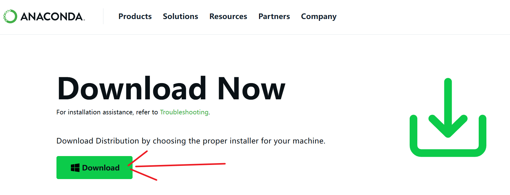
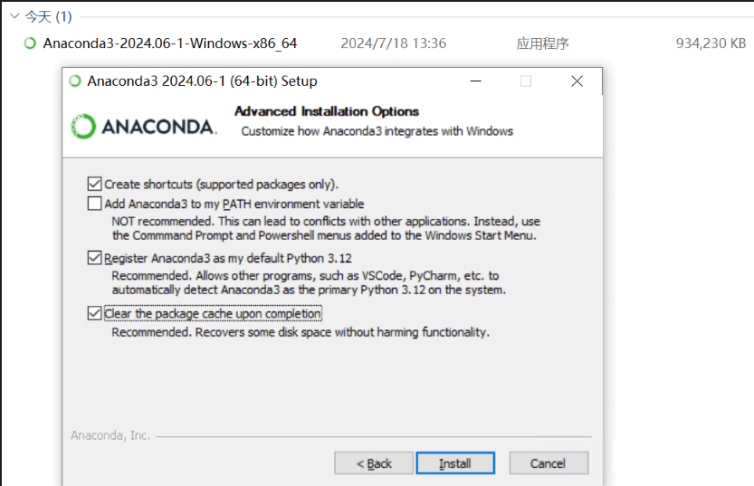

- 安装完成后再配置一下 ***帐户环境变量***

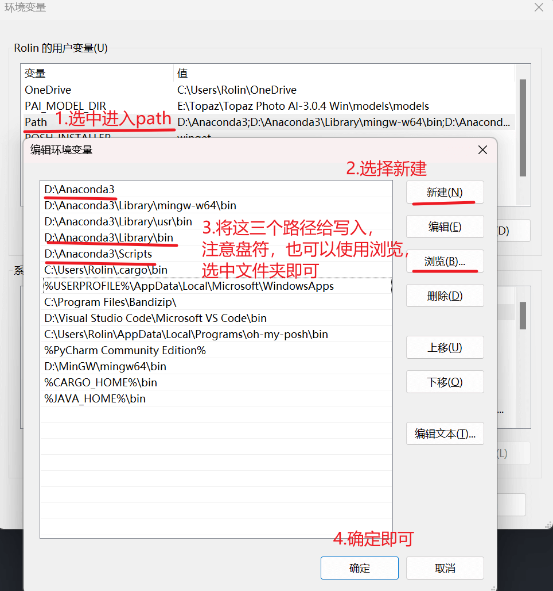

## 2.***Cuda*** (需要Nvidia显卡)

-  **CUDA（Compute Unified Device Architecture）**，是显卡厂商NVIDIA推出的运算平台。 CUDA是一种由NVIDIA推出的通用并行计算架构，该架构使GPU能够解决复杂的计算问题。 它包含了CUDA指令集架构（ISA）以及GPU内部的并行计算引擎。(详见百科)
- 下载地址：https://developer.nvidia.com/cuda-toolkit-archive

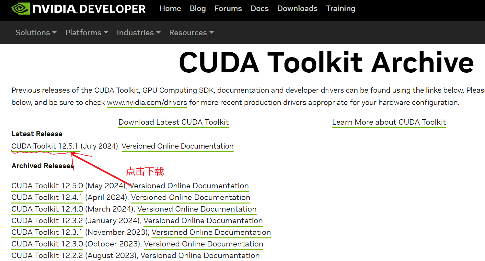
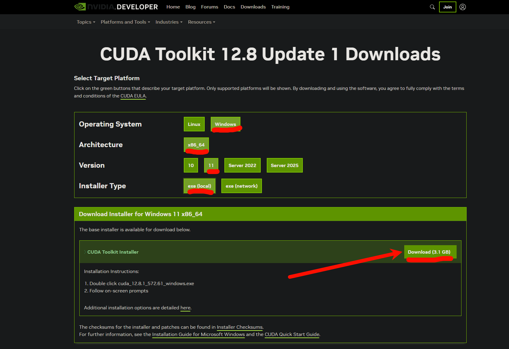

- 之后双击打开，一路点击下一步等待安装完成即可。

## 3.***cuDNN***

- **NVIDIA cuDNN**是用于深度神经网络的GPU加速库。它强调性能、易用性和低内存开销。NVIDIA cuDNN可以集成到更高级别的机器学习框架中，如谷歌的Tensorflow、加州大学伯克利分校的流行caffe软件。简单的插入式设计可以让开发人员专注于设计和实现神经网络模型，而不是简单调整性能，同时还可以在GPU上实现高性能现代并行计算。
- 下载地址：https://developer.nvidia.com/cudnn-downloads

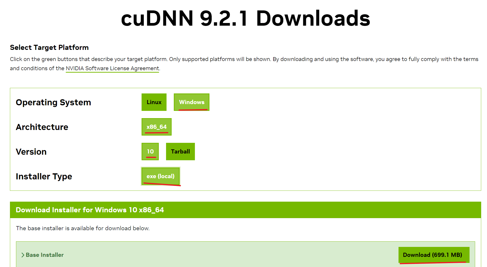

## 4.***Pytorch***

- ***PyTorch*** 是一个开源的Python机器学习库，基于Torch库，底层由C++实现，应用于人工智能领域，如计算机视觉和自然语言处理。(详见百科)
- 下载地址：https://pytorch.org/get-started/locally/

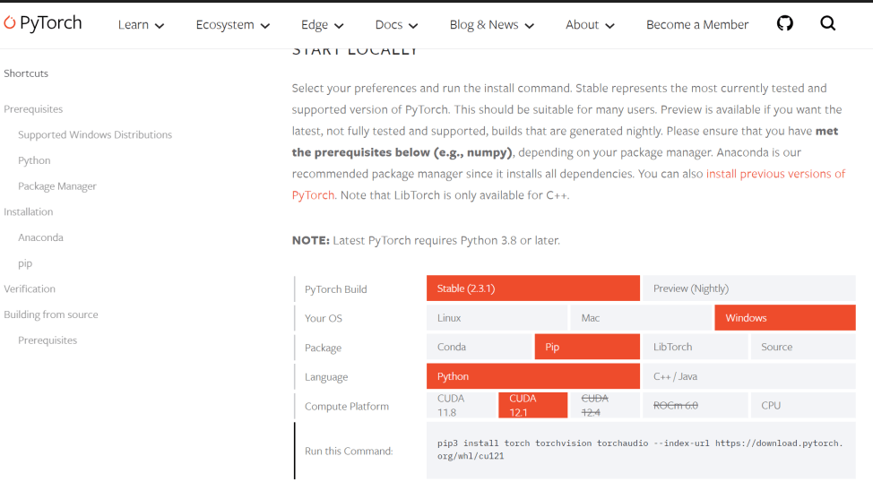

- ***Cuda*** 根据安装版本来选择，可以向下兼容。
- 复制给出的下载指令，例如这里给出的是：
- pip3 install torch torchvision torchaudio --index-url https://download.pytorch.org/whl/cu121
- 接下来在Windows搜索栏搜索 ***Anaconda Prompt*** 打开后将给出的下载指令输入进去。(此时的Pytorch就安装在了整个系统大环境下)

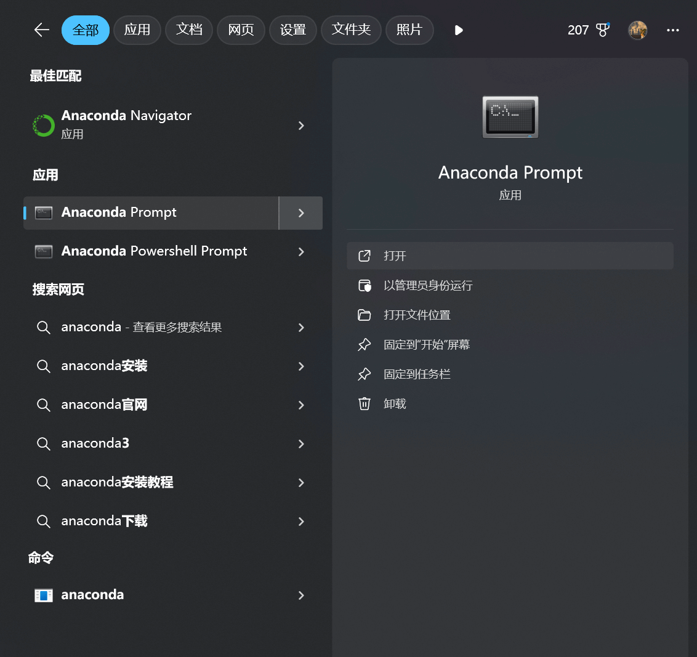
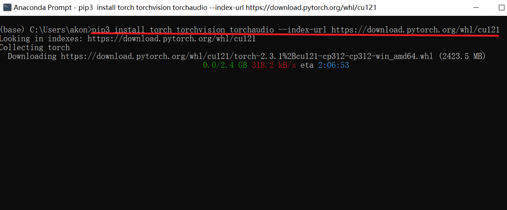

## 5.***VScode相关设置***

### 1. 安装python拓展：

- 打开VScode拓展，搜索python，安装

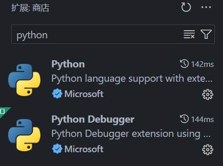

### 2. 设置python环境：

- 打开VScode设置，(左下角齿轮->选择设置settings)

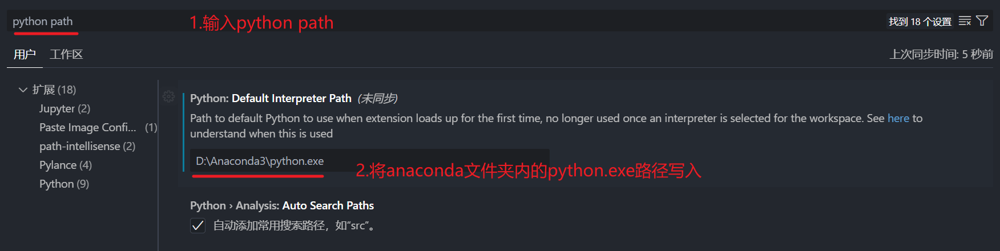
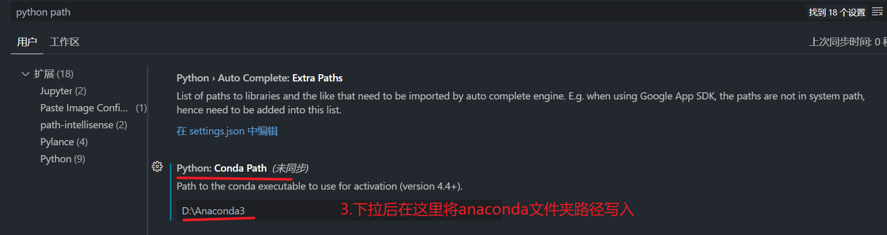

### 3. 设置python解释器：

- 任意打开一个python文件，例如test.py
- 其中编写代码 `print(123)`

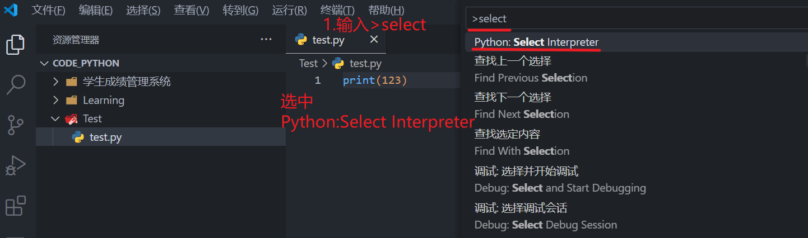

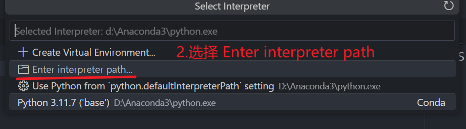

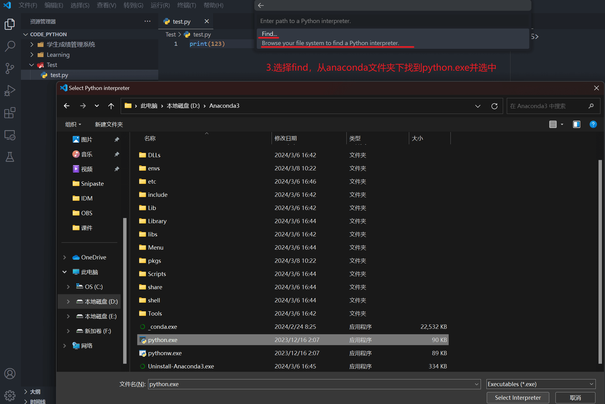

- 至此大功告成
