# 简介

Bilibili视频链接：[BV1n7C2BzE11](https://www.bilibili.com/video/BV1n7C2BzE11/)

在这篇文章中将一步步地帮助你完成：

- 找到 CFG 存储位置，定制个性化功能，编写 CFG 文件，并成功应用；
- 在必要时刻还原 CFG，避免操作不当产生的后果；
- 根据文件实时查看所更改设置的指令，辅助编写 CFG 文件；
- 在本人提供的预设 CFG 基础上，使用或魔改；
- 向本人联系，为你的预设添加进仓库，得到同步更新。

# CFG 简介

`CFG` 是 config(设置)的简写，能够以代码写入文件中，来保存游戏设置，在多账号和多设备登录情况下非常好用。

另外，一些特殊的指令，只有使用`CFG`才能在游戏中快速使用。

## CFG 存放位置

首先，`Steam云`是 Valve 帮助单机玩家保存存档备份的一项功能，但它也同样被运用到了`CS2`中。

由于国内裸连 Steam 甚至打不开商店和社区，所以`Steam云`的效果可想而知，特别是`CS2`在多次启动的情况下，会不断调用`Steam云`，如果某一时刻网络不佳，就会导致`同步失败`，进而影响游戏设置。

为了避免这种混乱，建议使用本地存档的位置来保存`CFG`，并禁用`CS2`的`Steam云`功能。

根据以上说明，那么`CFG`就会有两个位置：

- `游戏全局CFG`(上文中的`本地存档`)：`...\SteamLibrary\steamapps\common\Counter-Strike Global Offensive\game\csgo\cfg** 或 **...\Steam\steamapps\common\Counter-Strike Global Offensive\game\csgo\cfg`
- `个人用户CFG`(上文中`Steam云`保存的位置)：`...\Steam\userdata\123456789\730\local\cfg`

需要注意的是：

1. 根据游戏安装位置的不同，`游戏全局CFG`可能是在两种位置中的一种，
   - 根据`Steam`本体和游戏安装位置是否相同确认，如果你的游戏存放盘符与 `steam` 存放盘符不同，就参考前者，若相同，则后者。
   - 建议将要用的`CFG`文件放在`游戏全局CFG`位置。
2. `个人用户CFG`位置中的`123456789`为 `steamID`(同时也是文件夹名称)，可用于添加好友，如果你的 PC 上有多个 steam 账号登录过，那么在 `userdata` 文件夹中你会看到多个用户文件夹。
   - 请前往`Steam->好友->添加好友`处查看当前账号的`steamID`
   - 与`游戏全局CFG` 不同，`个人用户CFG`不止能设置`CFG`文件，还多了一个 `cs2_video.txt` 配置文件,它能够对游戏的画面设置进行设置，后文会提到。
   - `cs2_video.txt`的位置：`...\Steam\userdata\123456789\730\local\cfg\cs2_video.txt`

下面是使用`Steam`应用可视化查找`游戏全局CFG`位置的操作流程：

1. 打开 steam 库，找到 `Counter-Strike 2`，右击选择属性

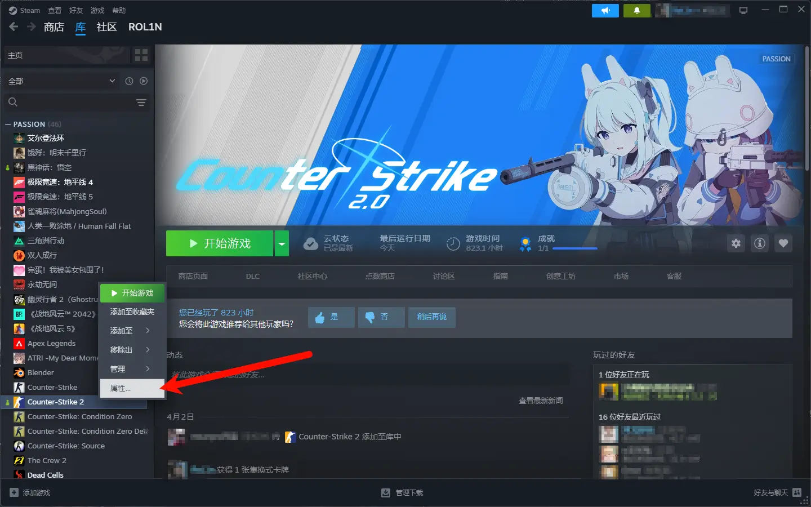

2. 选择“已安装文件”，点击浏览

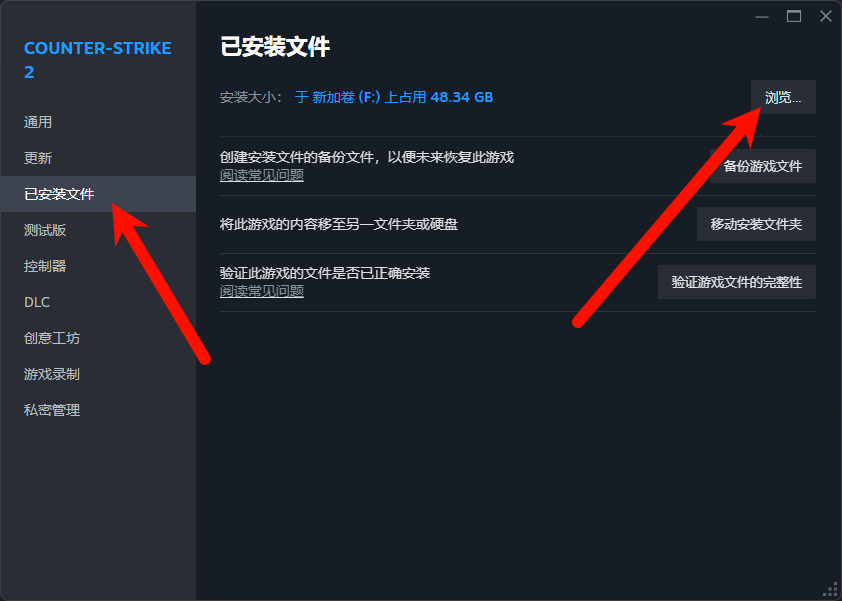

3. 进入“`game`”，进入“`csgo`”，选择“`cfg`”，该目录下就是存放 `cfg` 文件的位置

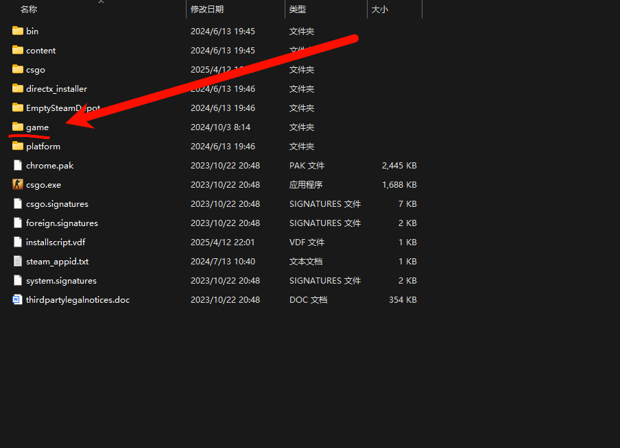

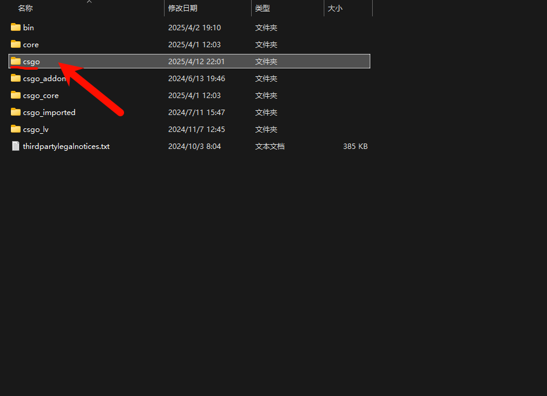

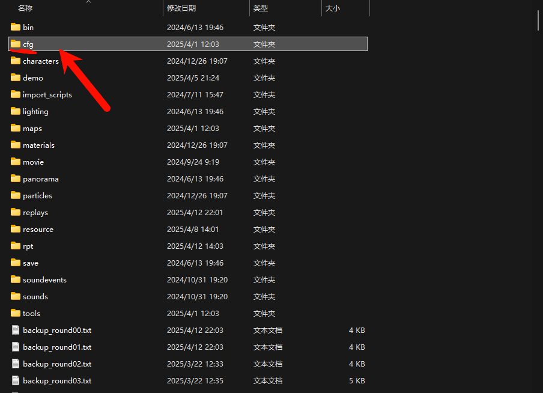

## 一个特殊的 CFG 模板

> `Steam启动项`是 steam 在启动游戏时自动为游戏执行的命令，位置依旧是在前文提到的`游戏属性`中。
> `exec`指令可以理解为`加载`的意思，例如`exec auto.cfg`就是加载`auto.cfg`这个文件，这样`CFG`的功能才能被启用。

在众多`CFG`文件中，有一个名为`autoexec.cfg`的文件是极其特殊的，无论你是否在`Steam`启动项中添加了`exec`指令，它都会被游戏启动时自动加载，因此它非常适合放一些基础功能。

这里给出`autoexec.cfg`的文件模板：

```ini
//键位
bind "w" "+forward" //前进
bind "s" "+back" //后退
bind "a" "+left" //向左
bind "d" "+right" //向右
bind "mouse1" "+attack" //左键攻击
bind "mouse2" "+attack2" //右键特殊攻击
bind "e" "+use" //使用
bind "f" "+lookatweapon" //检视
bind "space" "+jump"  //跳跃
bind "ctrl" "+duck"  //蹲下
bind "tab" "+showscores" //打开计分板
bind "g" "drop"   //丢弃装备
bind "m" "teammenu" //选择队伍
bind "shift" "+sprint" //静步
bind "b" "buymenu" //购买菜单
bind "z" "slot6" //雷
bind "x" "slot7" //闪
bind "c" "slot8" //烟
bind "6" "slot9" //诱饵弹
bind "v" "slot10" //火
bind "y" "+spray_menu" //打开涂鸦菜单
bind "i" "messagemode2"//团队聊天框
bind "u" "messagemode"//全局聊天框
bind "mouse4" "+voicerecord"//打开麦克风
bind "mouse5" "player_ping"//玩家示意标志
bind "mwheeldown" "+jump" //滚轮下跳
bind "mwheelup" "+jump"//滚轮上跳
bind "`" "toggleconsole"//打开控制台
bind "t" "switchhands"//切换左右手持枪
bind "h" "toggleradarscale" //切换小地图缩放
bind "ralt" "radio2;slot12" //无线电与X光

//准星
cl_crosshair_drawoutline "0" // 禁用十字准星的轮廓线
cl_crosshair_dynamic_maxdist_splitratio "1" // 动态十字准星的最大分离距离比例
cl_crosshair_dynamic_splitalpha_innermod "0" // 动态十字准星内部分离部分的透明度
cl_crosshair_dynamic_splitalpha_outermod "1" // 动态十字准星外部分离部分的透明度
cl_crosshair_dynamic_splitdist "3" // 动态十字准星的分离距离
cl_crosshair_friendly_warning "0" // 禁用对友军的十字准星警告
cl_crosshair_outlinethickness "1" // 十字准星轮廓线的厚度
cl_crosshair_sniper_show_normal_inaccuracy "0" // 禁用狙击枪十字准星显示正常不准确度
cl_crosshair_t "0" // 禁用T形十字准星
cl_crosshairalpha "255" // 十字准星的透明度（255为完全不透明）
cl_crosshaircolor 5 // 设置十字准星颜色为自定义（5表示自定义颜色）
cl_crosshaircolor_b "255" // 自定义十字准星的蓝色分量（255为最大）
cl_crosshaircolor_g "255" // 自定义十字准星的绿色分量（255为最大）
cl_crosshaircolor_r "0" // 自定义十字准星的红色分量（0为最小）
cl_crosshairdot "0" // 禁用十字准星中心点
cl_crosshairgap "-3.644676" // 设置十字准星的间隙（负值表示向内收缩）
cl_crosshairgap_useweaponvalue "0" // 禁用根据武器值调整十字准星间隙
cl_crosshairsize "0.901125" // 设置十字准星的大小
cl_crosshairstyle "4" // 设置十字准星样式为经典静态（4表示经典静态）
cl_crosshairthickness "0.961664" // 设置十字准星的厚度
cl_crosshairusealpha "1" // 启用十字准星的透明度设置

//狙击枪瞄准线宽度
cl_crosshair_sniper_width "2"

//鼠标灵敏度
sensitivity 0.50

//持枪视角
viewmodel_fov 68 // 设置第一人称视角的视野范围（FOV），值越大，视野越广
Viewmodel_offset_x 2.5 // 调整武器模型在水平方向（X轴）上的偏移，正值向右，负值向左
Viewmodel_offset_y 0 // 调整武器模型在垂直方向（Y轴）上的偏移，正值向上，负值向下
Viewmodel_offset_z -1.5 // 调整武器模型在深度方向（Z轴）上的偏移，正值向前，负值向后
viewmodel_presetpos 2 // 使用预设的武器模型位置（2表示经典位置）

//雷达
cl_radar_always_centered "0" // 禁用雷达始终以玩家为中心，雷达会显示地图的完整区域
cl_radar_scale "0.37" // 设置雷达的缩放比例，值越小，雷达显示的范围越大
cl_hud_radar_scale "1" // 设置HUD上雷达的缩放比例，1为默认大小
cl_teammate_colors_show 2 // 设置队友颜色显示模式，2表示显示队友的轮廓颜色
```

## 如何创建一个`CFG`文件

在接触`CFG`文件之前，我们似乎很少见到后缀为`.cfg`的文件，它是一种专为配置文件所产生的格式。

我们可以通过新建`.txt`文本格式文件，更改其后缀名为`.cfg`得到`CFG`文件：

1. 在桌面新建一个文本文档(也就是 `txt`)，可以直接在这个 `txt` 文件中编写配置(当然`.cfg`文件也可以用`记事本`打开并编辑)

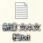

2. 编写完成后，找到这个文件，更改后缀为 `.cfg`。
   - 如果你无法显示后缀，请按照下面操作：

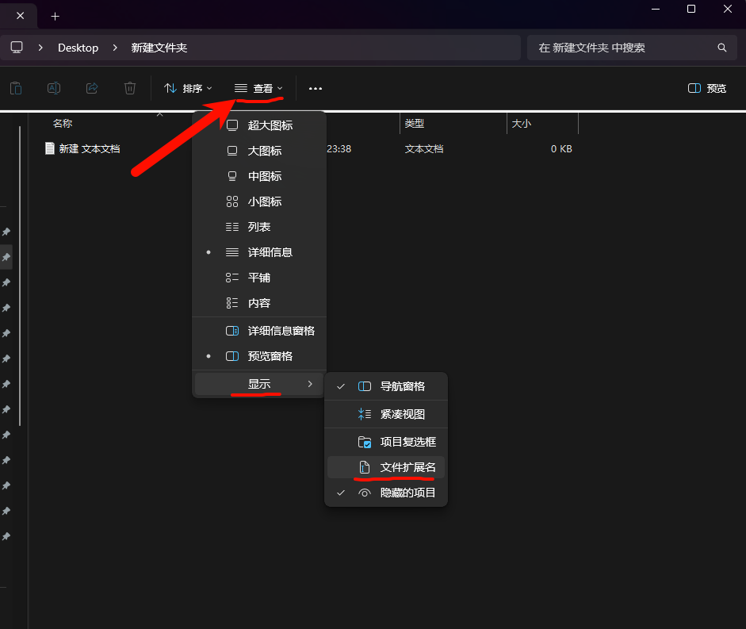

## 视频设置文件

虽然视频设置文件是以`.txt`格式保存的，但它也是一种`Config`也即`CFG`。

下面是一个`cs2_video.txt`文件的模板，需要注意的是：

- 所有的注释要删除掉，文件功能才能被正常启用。
- 该文件要放入`个人用户CFG`目录下：`...\Steam\userdata\123456789\730\local\cfg`

```ini
"video.cfg"
{
	"Version"		"16"  // 配置文件版本号
	"VendorID"		"4318"  // 显卡厂商识别码，此处为NVIDIA
	"DeviceID"		"10464"  // 显卡设备识别码，此处为RTX 4060
	"setting.cpu_level"		"3" // CPU 性能等级梯队
	"setting.gpu_mem_level"		"3" // GPU 显存性能等级梯队
	"setting.gpu_level"		"3" // GPU 性能等级梯队
	"setting.knowndevice"		"0" // 优先使用的GPU设备（0 为主显卡）
	"setting.monitor_index"		"0" // 显示器索引（0 为主显示器）
	"setting.defaultres"		"1280" // 分辨率宽度
	"setting.defaultresheight"		"960" // 分辨率高度
	"setting.aspectratiomode"		"0" // 宽高比模式（0 为自动，1 为 4:3，2 为 16:9）
	"setting.refreshrate_numerator"		"0" // 刷新率分子（0 表示使用默认值）
	"setting.refreshrate_denominator"		"0" // 刷新率分母（0 表示使用默认值）
	"setting.fullscreen"		"0" // 是否启用全屏模式（0 为否，1 为是）
	"setting.coop_fullscreen"		"1" // 合作模式是否启用全屏（1 为是）
	"setting.nowindowborder"		"1" // 是否启用无边框窗口模式（1 为是）
	"setting.fullscreen_min_on_focus_loss"		"0" // 失去焦点时是否最小化全屏窗口（0 为否）
	"setting.high_dpi"		"0" // 是否启用高 DPI 缩放（0 为否）
	"setting.mat_vsync"		"0" // V-sync 是否启用垂直同步（0 为否，1 为是）
	"setting.r_low_latency"		"0" // 是否启用低延迟模式（1 为是）
	"AutoConfig"		"2" // 自动配置等级（2 为自定义配置）
	"setting.msaa_samples"		"2" // 多重采样抗锯齿（MSAA）采样数（2 为 2x MSAA）
	"setting.r_csgo_cmaa_enable"		"1" // 是否启用 CMAA 抗锯齿（0 为否）
	"setting.videocfg_shadow_quality"		"3" // 全局阴影效果（0 为低，1 为中，2 为高，3 为非常高）
	"setting.videocfg_dynamic_shadows"		"1" // 动态阴影的启用（1 为是）
	"setting.videocfg_texture_detail"		"1" // 模型/贴图细节（0 为低，1 为中，2 为高）
	"setting.r_texturefilteringquality"		"3" // 贴图过滤模式（0-5，双线性、三线性、异项2X、4X、8X、16X）
	"setting.shaderquality"		"0" // 光影细节（0 为低，1 为高）
	"setting.videocfg_particle_detail"		"0" // 粒子细节（0 为低，1 为中，2 为高，3 为非常高）
	"setting.videocfg_ao_detail"		"0" // 环境光遮蔽（AO）细节（0 为禁用，2 为中，3 为高）
	"setting.videocfg_hdr_detail"		"3" // 高动态范围 （-1为品质，3为性能）
	"setting.videocfg_fsr_detail"		"0" // 超级分辨率FSR（0 为禁用，1、2、3、4分别为超高品质、品质、均衡、性能）
}
```

## 还原与备份

> 进入`CS2`游戏，在`设置`中将`启用控制台`选择为`是`，默认情况下可以按 `` ` ``来打开控制台
> 如果不行，请切换为`英文输入法`或者点击按键`CAPS`来切换`锁定大小写`，直到 `` ` `` 被游戏正确读取并打开控制台

如果你使用了网络上的`CFG`预设后按键不知道怎么恢复？或者应该如何试用他人的`CFG`预设？

让我们先进入游戏，打开`控制台`来解决这两个问题：

1. 输入 `host_writeconfig backup` 可生成 `backup.cfg`
   - 这是你当前按键绑定的一个备份，需要在`试用他人的CFG预设前`操作，可在必要时在控制台输入 `exec backup` 恢复原按键绑定设置
2. 输入 `binddefaults`后，将按键绑定改为默认按键。
   - 此时输入`key_listboundkeys` 可在控制台输出里查看所有的按键绑定功能

## 一些有趣的控制台指令

> 在[Vavle 开发者社区的 CS2 板块](https://developer.valvesoftware.com/wiki/List_of_Counter-Strike_2_console_commands_and_variables)找到所有控制台指令
> 也可以在游戏中输入`cvar list`，控制台则会输出全部的指令。

了解控制台指令功能，可以将其绑定在按键上，并写入 `CFG` 文件，实现一键功能。

```ini
sv_cheats 1 // 开启作弊模式，允许使用作弊命令
bot_kick // 踢出所有机器人
mp_buy_anywhere 1 // 允许在任意位置购买装备
mp_freezetime 0 // 设置赛前准备时间为0秒
mp_maxmoney 99999 // 设置最大金钱数为99999
mp_startmoney 99999 // 设置起始金钱数为99999
mp_buytime 99999 // 设置购买时间为99999秒
mp_ignore_round_win_conditions 1 // 回合永不结束
mp_respawn_on_death_ct 1 // CT阵营无限复活
mp_respawn_on_death_t 1 // T阵营无限复活
mp_friendlyfire 1 // 开启队友伤害
ammo_grenade_limit_total 6 // 设置手榴弹最大可携带数为6
mp_spectators_max 9 // 设置游戏观察者最大数为9
mp_autokick 0 // 禁用自动踢出服务器功能
mp_restartgame 1 // 在1秒后重启回合
sv_grenade_trajectory_prac_pipreview 1 // 启用手榴弹轨迹的预览
sv_grenade_trajectory_prac_trailtime 8 // 设置手榴弹轨迹可见时间为8秒
sv_infinite_ammo 2 // 设置无限弹药模式（道具无限），但仍需换弹夹
sv_showimpacts 1 // 开启弹痕显示
exec autoexec.cfg // 执行 autoexec.cfg 配置文件，加载自定义设置
key_listboundkeys // 列出所有已绑定的按键及其对应的命令
toggle cl_teamid_overhead_mode 1 3 // 切换队友头顶标识模式（1 为简单标识，3 为详细标识）
toggle cl_draw_only_deathnotices 1 0 // 切换是否仅显示死亡通知（1 为仅显示，0 为显示完整 HUD）
toggle cl_drawhud_force_radar 1 0 // 切换是否强制显示雷达（1 为强制显示，0 为正常显示）
cl_hud_color "11" // 设置 HUD 颜色为粉色
con_enable "1" // 启用控制台功能
fps_max 0 // 设置 FPS 无上限，允许游戏以最高帧率运行
cl_join_advertise "2" // 显示玩家计划加入反恐精英队的信息
cl_use_opens_buy_menu "0" // 禁用在靠近购买区域时按下使用键（E键）自动打开购买菜单的功能
cl_dm_buyrandomweapons 0 // 在死亡竞技模式中禁用自动购买随机武器
gameinstructor_enable "0" // 禁用游戏指导功能
cl_autohelp "false" // 禁用自动帮助提示
mm_dedicated_search_maxping "70" // 优先选择延迟在 70 毫秒以内的服务器
func_break_max_pieces 0 // 游戏会根据物体的属性生成默认数量的碎片
r_drawtracers_firstperson 1 // 开启第一人称视角中的子弹轨迹显示
r_fullscreen_gamma 3.0 // 调整游戏画面伽马值为 3.0
cl_teamid_overhead_mode 3 // 始终显示队友名称与装备信息
echo AutoConfig Enabled! // 在控制台打印 "AutoConfig Enabled!" 提示信息
mp_damage_headshot_only 1 // 仅爆头才能造成伤害，其他部位攻击无效
ent_create chicken // 在游戏中生成一只鸡（娱乐功能）
custom_bot_difficulty 5 // 设置自定义 BOT 难度为最高（5 为最高难度）
mp_plant_c4_anywhere 1 // 允许在任何位置安放 C4 炸弹
mp_c4timer 40 // 设置 C4 炸弹的倒计时为 40 秒
sv_regeneration_force_on 1 // 开启生命值自动回复功能
cl_showpos 1 // 在屏幕上显示玩家当前的位置、速度和角度信息
mp_weapons_glow_on_ground 1 // 开启地面武器的高亮显示功能
```

## 如何即时查看`CFG`的命令参数

> 我们知道既然游戏设置可以被`CFG`文件所`设置`，那么这些`游戏设置项`的参数也一定是被记录在了`文件`中，在这里我们就是要找到这样的`参数`，来辅助编写`CFG`文件。

场景一：使用`CFG`文件来配置准星

`CS2`提供的方式是使用`准星代码`导入导出来实现准星更改，但这样我们还是不知道哪条指令的哪个参数改变了该准星的样貌，并且`CFG`文件也并不能根据`准星代码`来设置准星；

如果你详细查看了前文的`autoexec.cfg`文件内容，不难发现我们是用`cl_crosshair_.. "0"`类似的指令来更改准星的，那么这些指令和参数在哪里找到？

场景二：目标功能为按下`C`键切换为烟雾弹，但是不知道什么指令是`切换为烟雾弹`，在哪里找？

虽然这一小节解决问题的方法是`即时查看所更改的设置`，但是场景二可以在[CS2BindGenerator](https://www.cs2bindsgenerator.com/)网站上自动生成对应指令。

场景三：游戏中有一个`快捷轮盘`功能，我想要自定义设置它每一个语音指令的位置，并且保存下来，它们的指令是什么？

针对以上三种场景，我们可以打开`即时保存设置`的文件来查看当我们在游戏中进行操作后，对应文件会有什么样的信息，来确定某项功能的对应指令：

1. 找到如下路径 `...\Steam\userdata\123456789\730\local\cfg` ,找到如下文件打开。

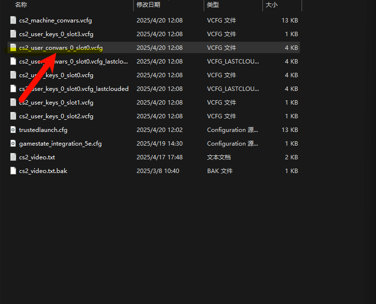

2. 这里的参数就是准星参数，在导入`准星代码`后，重新打开或刷新该文件，此部分参数就会更改，届时保存即可。

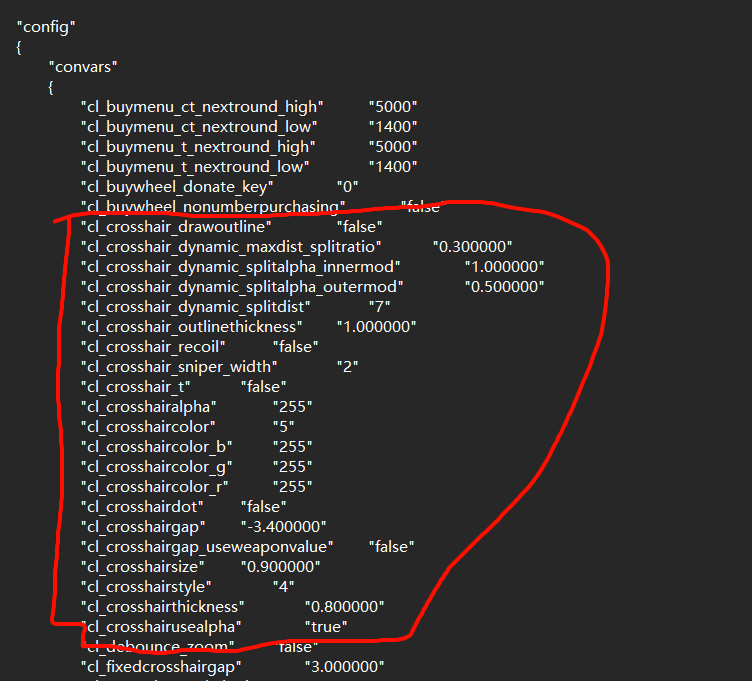

3. 下面这个文件里就是所有的按键绑定即时操作，可以查看所有刚刚更改的按键绑定。

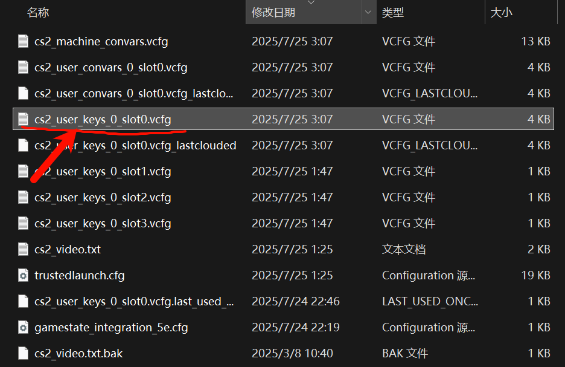

4. 下面这个文件为快捷轮盘`chatwheel`的各语音关键词代码：

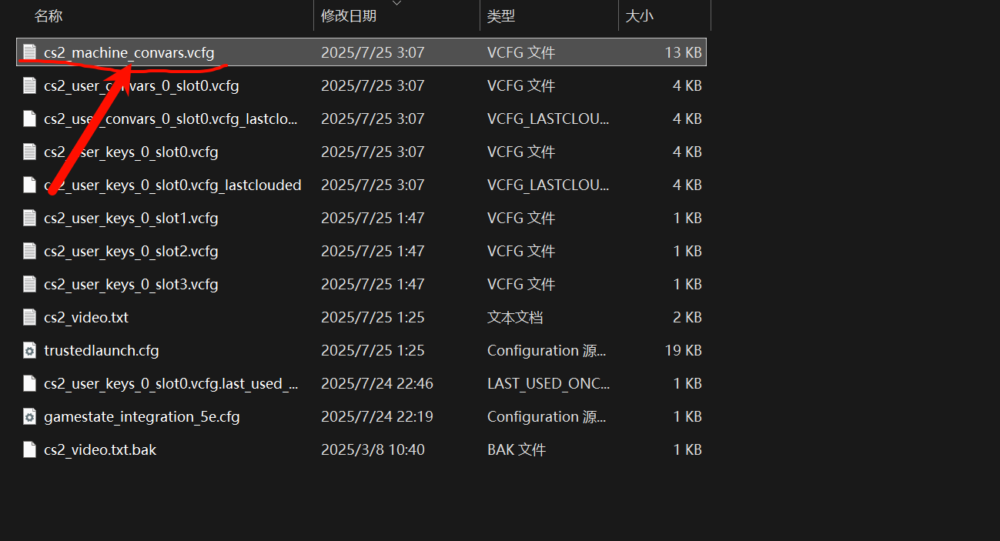

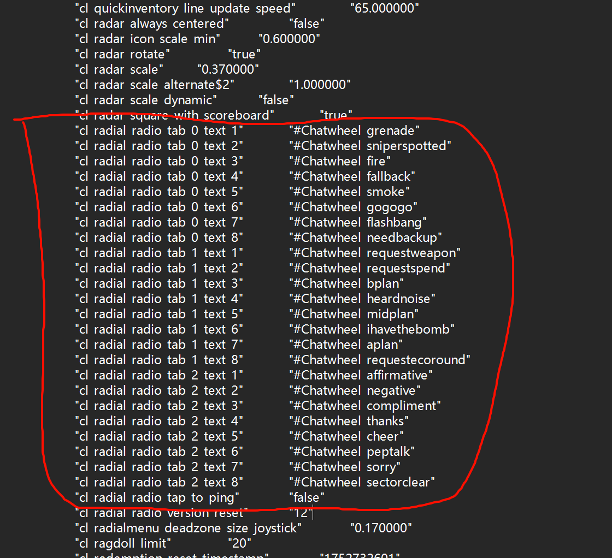

## 设置启动项

启动项是在游戏运行时即刻执行的命令，严格来说这也是一种`Config`配置

下面使一些常用启动项，需要注意的是：

- 每一条指令之间要有一个`空格`来分割。

```ini
-novid  //关闭过场动画,CS2中已失效
-high  //提高CSGO程序优先级，有可能负优化
-nojoy //关闭手柄相关，降低内存占用
-perfectworld  //直接进入国服
-worldwide  //直接进入国际服
-w 1920 -h 1080  //设置分辨率1920x1080
-noborder //无边框窗口化
+exec auto.cfg  //加载auto.cfg
+fps_max 300  //限制fps最大300
-allow_third_party_software  //允许OBS等第三方软件
-noreflex //取消游戏内的reflex功能，可以在NVIDIA控制面板中开启
```

下面是本人的启动项：

```ini
-allow_third_party_software -high -noreflex -noborder -worldwide
```

我所采用的游戏优化方案是`锁帧`，因此我在启动项中添加`-noreflex`禁用了游戏内的`NVIDIA低延迟策略`，并在`NVIDIA控制面板`中也禁用了`程序CS2`的`Reflex`功能。

启动项设置位置已在前文提出，下面是位置图例：

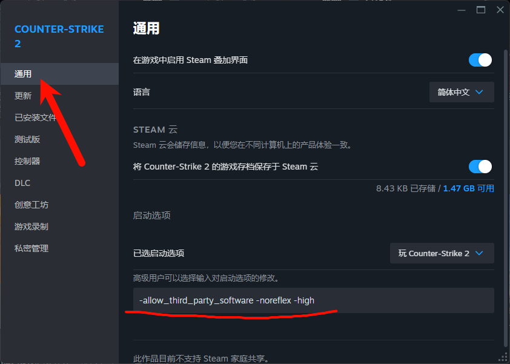

# SrP-CFG_ForCS2

> 本人的`CFG`预设文件已经在`GitHub仓库`[SrP-CFG_ForCS2](https://github.com/RolinShmily/SrP-CFG_ForCS2)中发布

这是本人所使用的一套`CFG`预设文件，包含了多个场景的`CFG`使用需求，且长期维护更新，保证有效可用。

::github{repo="RolinShmily/SrP-CFG_ForCS2"}


你会需要的链接：

- [项目说明书](https://doc.srprolin.top/posts/SrP-CFG_CS2/srpcfg-1.html) | 本项目的一些废话
- [下载地址](https://doc.srprolin.top/posts/SrP-CFG_CS2/srpcfg-2.html) | 顾名思义
- [使用指南](https://doc.srprolin.top/posts/SrP-CFG_CS2/srpcfg-3.html) | 按键、控制台命令功能表
- [更新日志](https://doc.srprolin.top/posts/SrP-CFG_CS2/srpcfg-4.html) | 查看最新更新

下面是一组图文教程，如何下载并使用该套`CFG`预设：

1. 打包下载目标文件夹。

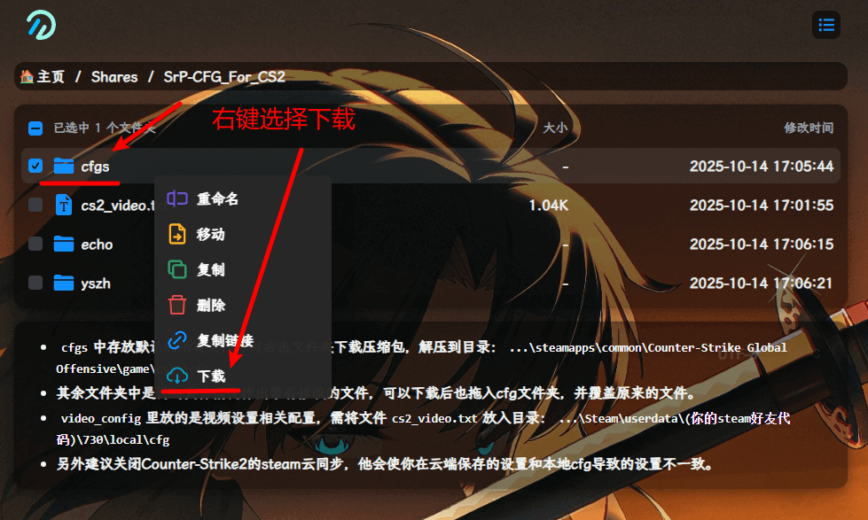

2. 进入`游戏全局CFG`文件夹，将压缩包解压。

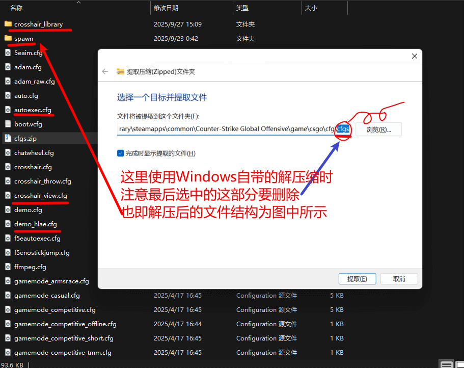
