# 使用场景与前言

构建虚拟局域网，主要是为了**内网**之间的设备互相访问。
在一般的家庭网络中，设备联网会经过同一个路由转发，此时的设备就在同一局域网中。举个例子，如果连接了同一个 WIFI，那么就可以在 Minecraft 多人游戏中自动显示**局域网世界**了。
搭建虚拟局域网，一般是为了异地组网，而又没有**公网 IP**的情况。
简单来说，拥有**公网 IP**的设备，可以被任何设备通过 IP 地址找到。
**公网 IP**又分为**IPv4**和**IPv6**。其中**IPv4**目前已经耗尽，其地址数量只有 2³² 个，地址格式为 32 位二进制，分为 4 组显示为点分十进制，例如：`192.168.1.1`；**IPv6**地址数量有 2¹²⁸，几乎趋近无限，地址格式为 128 位二进制，分为 8 组，显示为冒分十六进制，例如：`2001:0db8:85a3:0000:0000:8a2e:0370:7334`。
从安全性、路由效率和使用配置上，目前**IPv6**都比**IPv4**更具优势。
如果你拥有**公网 IP**，且安全性要求不是太大，组建虚拟局域网会显得多余。
但是虚拟局域网之间的设备是可以互相访问的，而在公网中，设备只能访问拥有**公网 IP**的设备。
举个例子，你在个人 PC 上的 25565 端口部署了一个服务，可以是一个 Minecraft 服务器，此时用你的这台 PC 访问该服务器，地址为`192.168.1.1:25565`或`localhost:25565`或`127.0.0.1:25565`，这三种都可以理解为本地地址，如果你的小伙伴想要进入这个服务器，显然这三种地址都不可行。如果你拥有公网 IP，那么他们的访问地址为`(公网IP):25565`；如果你搭建了虚拟局域网，那么访问地址为`(虚拟局域网IP):25565`。

# Zerotier 的基本框架

首先，zerotier 由三部分组成：**节点**、**根服务器**、**节点网络控制器**

- 节点：我们安装 zerotier 的设备，都会被分配一个十位 ID，此时我们的设备就是 zerotier 中的节点。
- 根服务器：zerotier 官方的根服务器叫做 planet，节点的 ID 是由根服务器分配的，在整个框架中起到中转桥梁作用。
- 节点网络控制器：用于创建网络，让各个节点设备通过 planet 加入到该网络，对各个节点进行授权，使得各个节点之间互相访问。授权过后，各个节点会得到该网络的 ID 标识被被分配的虚拟 IP 地址。
  zerotier 官方提供的控制器是与 planet 根服务器直连的，如果控制器创建了一个网络，那么 planet 也会得到该网络的 ID 标识，并得到节点被分配的虚拟 IP 地址。
  节点之间的首次连接，也是需要 planet 来做中间人，找到对应设备，并尝试加密直连。如果无法直连，流量则会经过 planet 来中转。
- 在安装 zerotier 后，UI 中体现的节点 ID (该 ID 可以进行更改)：
  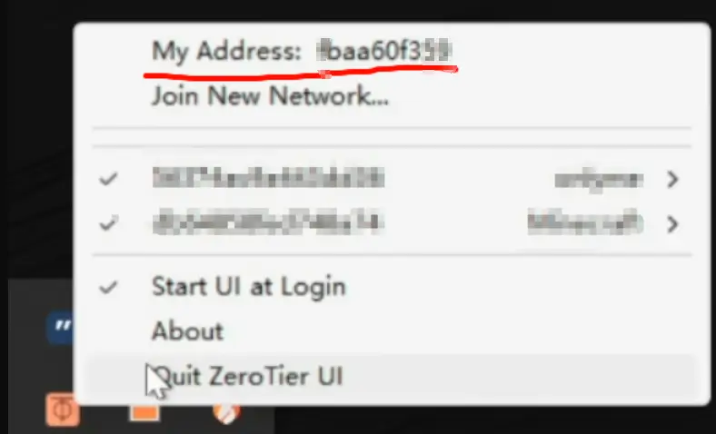
- 访问官方提供的[节点网络控制器](https://my.zerotier.com/)
  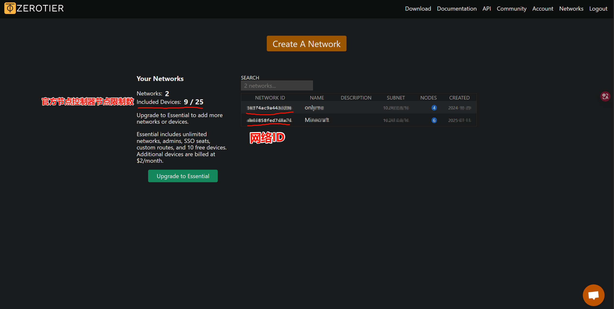

# Zerotier 的下载与使用

> - 我们使用的工具是 **_ZeroTier_** 一个专门用来建立点对点虚拟专用网(**_P2P VPN_**)
> - 以 **_Windows_** 系统为例

1. 下载地址：https://www.zerotier.com/


2. 点击 ***Download***

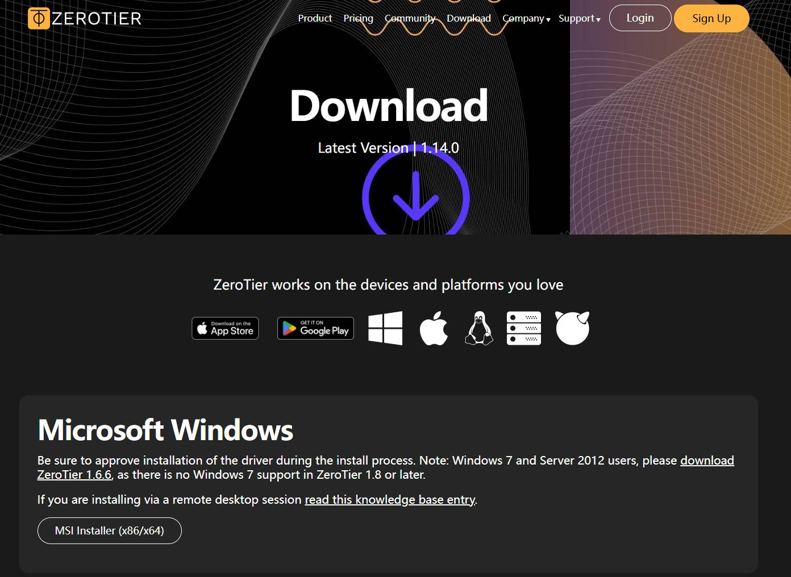

3. 一般情况下直接点击 ***MSI Installer (x86/x64)*** 下载完成如图

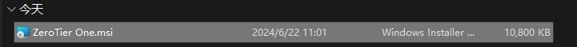

4. 安装前请把 ***杀毒软件*** 全部关闭，尽量不要出现被拦截的情况。
5. 双击进行安装后，在右下角 ***托盘*** 处，你会看到如图图标。

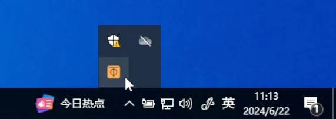

6. 回到 **_ZeroTier_** 官网：https://www.zerotier.com/
7. 选择 **_Sign Up_** 注册一个账号，然后 **_Log In_** 登录

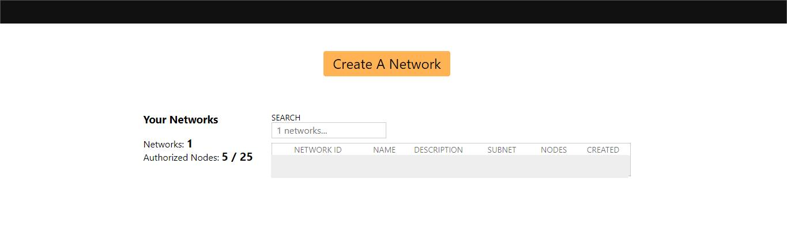

8. **_Create A Network_**，点击进一个 **_Network_** 中

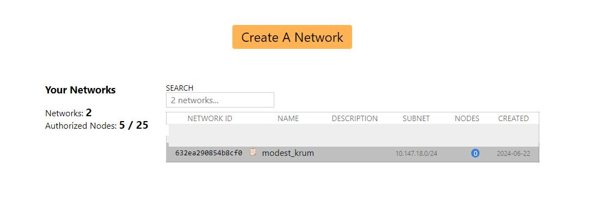

9. 复制 **_Network ID_** 给你的朋友

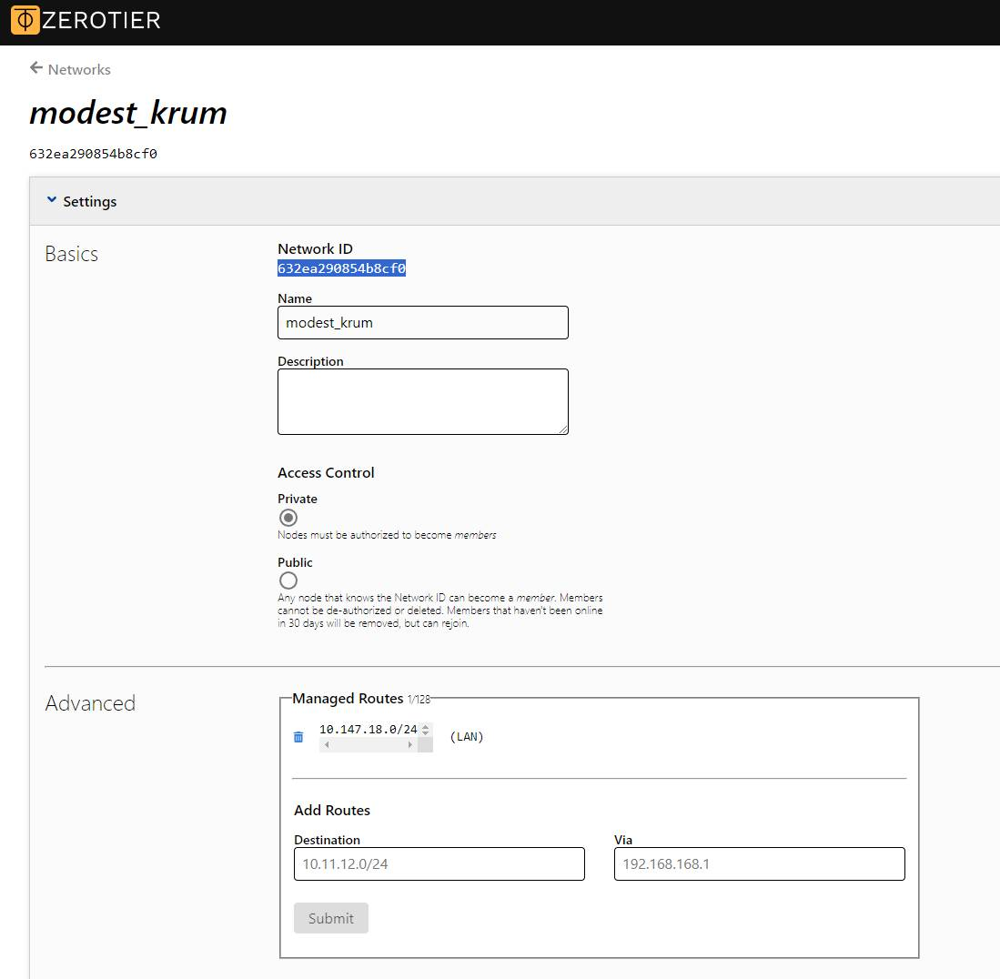

10. 等待朋友发来请求，下拉找到请求，**_勾选_**

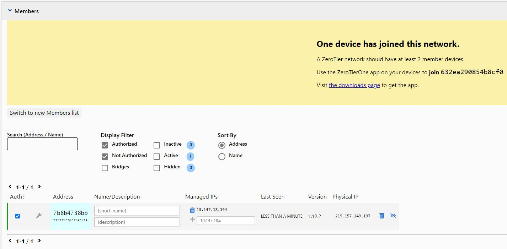

11. 点击托盘图标，点击 **_Join New Network_**

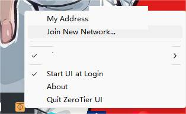

12. 将代码输入，点击 **_Join_**

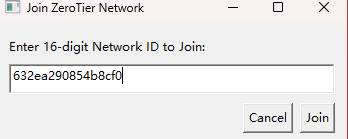

13. 等待创建者同意加入网络

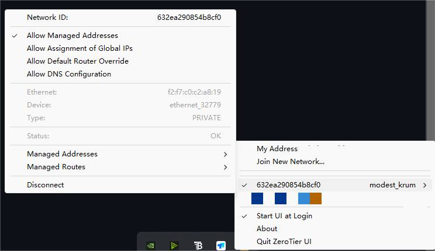

# Zerotier 的自托管服务

- 详细内容，请参考[官方文档](https://docs.zerotier.com/selfhost/)
  zerotier 提供的自托管服务有**节点网络控制器**和**根服务器**
  首先，**节点网络控制器**自建，主要是为了安全性和突破节点设备限制。
  而**根服务器**自建，这里主要是自建**moon 根服务器**，而非**planet**。
  简单地说，任意一个节点他都可以充当**节点网络控制器**，只不过官方没有提供 webUI，需要部署第三方的。而**moon 根服务器**本质上是**根服务器**，作用与**planet**是相同的，主要因为**planet**是部署在国外的，高标识的大流量经过会遭到长城防火墙的拦截，导致连接失败，因此**planet**如果作为中转流量的服务器，在 IPv4 环境下，基本不太行得通，这时候就需要搭建在国内的**moon**做中转了。
- **moon 根服务器**：(每个节点需要手动加入 moon 服务器)作为根服务器，基础作用就是用来识别节点 ID，并让节点设备之间互相建立连接的。但由于虚拟局域网的 IP 地址是由节点网络控制器授权后发放的，如果节点不能与 planet 进行连接，自然也无法通过 planet 来连接到官方的节点网络控制器，进而节点之间无法正常连接，moon 服务器的作用也被抹除。这时就需要自建节点网络控制器，并加入 moon 根服务器，通过自建的节点网络控制器来为节点分配虚拟 IP。至此，会发现这就相当于自建了一整个 zerotier，只不过 moon 服务器是需要手动加入的。

## moon 根服务器的建立与加入

首先，自建 moon 服务器，需要一台拥有公网 IP 的设备，这里推荐用 Linux 云服务器，以此为例。具体教程查看[官方文档](https://docs.zerotier.com/roots/)。
与云服务器建立 ssh 连接后，简要操作步骤如下： 0. 前往云服务器厂商的管理后台，开放服务器的 9993UDP 端口，以便 zerotier 服务正常运行。

1. 执行`curl -s https://install.zerotier.com | sudo bash`或者`sudo apt-get install zerotier-one`命令，安装 zerotier。此时在命令窗里会显示当前设备的节点 ID。
2. 执行`cd /var/lib/zerotier-one`进入 zerotier 的配置文件夹
3. 执行`zerotier-idtool initmoon identity.public >>moon.json`命令，导出 moon 配置文件。
4. 执行`nano moon.json`命令，使用 nano 编辑器编辑配置文件。

```moon.json
{
      "id": "deadbeef00",
      "objtype": "world",
      "roots": [
        {
          "identity": "deadbeef00:0:34031483094...",
          "stableEndpoints": ["10.0.0.2/9993","2001:abcd:abcd::1/9993"]
        }
      ],
      "signingKey": "b324d84cec708d1b51d5ac03e75afba501a12e2124705ec34a614bf8f9b2c800f44d9824ad3ab2e3da1ac52ecb39ac052ce3f54e58d8944b52632eb6d671d0e0",
      "signingKey_SECRET": "ffc5dd0b2baf1c9b220d1c9cb39633f9e2151cf350a6d0e67c913f8952bafaf3671d2226388e1406e7670dc645851bf7d3643da701fd4599fedb9914c3918db3",
      "updatesMustBeSignedBy": "b324d84cec708d1b51d5ac03e75afba501a12e2124705ec34a614bf8f9b2c800f44d9824ad3ab2e3da1ac52ecb39ac052ce3f54e58d8944b52632eb6d671d0e0",
      "worldType": "moon"
    }
```

- 在上述配置样例中，ID 应显示为你被分配的节点 ID；主要修改**stableEndpoints**里的内容，更改 IP 为该服务器的公网 IP，如果有 IPv6，可如实更改，没有则不填写，把它删掉。按照样例，没有的 IPv6 情况为`"stableEndpoints": ["公网IP/9993"]`.
- **nano 编辑器**的使用注意：完成编辑后，`ctrl+x`退出编辑器，命令窗提示是否保存，`Y`确定，最后`Enter`回车键，返回命令行。

5. 执行`zerotier-idtool genmoon moon.json`命令，生成`000000deadbeef00.moon`文件，其中**deadbeef00**应为你的服务器被分配的节点 ID。
6. 执行`mkdir /var/lib/zerotier-one/moons.d`在配置文件夹下创建`moons.d`文件夹，用于保存 moon 文件。此后执行`cp 000000deadbeef00.moon ./moons.d/`将生成的 moon 文件保存于`moods.d`文件夹下。
7. 执行`systemctl restart zerotier-one`重启 zerotier 服务，至此，moon 服务器创建完成。
8. 通过命令行加入 moon 服务器：在另一台想要加入 moon 服务器的设备上，执行`zerotier-cli orbit deadbeef00 deadbeef00`,其中**deadbeef00**应为 moon 服务器的节点 ID，此处仅为样例。然后执行`systemctl restart zerotier-one.service`重启 zerotier 服务，
9. 通过 moon 文件计入 moon 服务器：将 moon 服务器产生的`000000deadbeef00.moon`文件 copy 到对应系统的配置文件夹中。

- Linux:`/var/lib/zerotier-one/moons.d/`
- Windows:`C:\ProgramData\ZeroTier\One\moons.d\`
- MacOS:`/Library/Application Support/ZeroTier/One/zerotier-one/moons.d/`

## 通过 ztncui 自建节点网络控制器

详细教程参考[官方文档](https://key-networks.com/ztncui/#installation)
此处以 Ubuntu 系统为例进行安装。

1. 执行`curl -O https://s3-us-west-1.amazonaws.com/key-networks/deb/ztncui/1/x86_64/ztncui_0.8.14_amd64.deb`命令，从 AWS S3 存储桶下载 ZTNCUI 0.8.14 版本的.deb 安装包。
2. 执行`apt install ./ztncui_0.8.14_amd64.deb`命令，使用 apt 包管理器安装下载的 ZTNCUI 包。
3. 在云服务器厂商处开放 3443TCP 端口。
4. 执行`` sh -c "echo ZT_TOKEN=`sudo cat /var/lib/zerotier-one/authtoken.secret` > /opt/key-networks/ztncui/.env" ``命令，将 ZeroTier 的认证令牌写入 ZTNCUI 的环境配置文件。
5. 执行`sh -c "echo HTTPS_PORT=3443 >> /opt/key-networks/ztncui/.env"`命令，配置 ZTNCUI 监听 HTTPS 的端口为 3443。
6. 执行`sh -c "echo NODE_ENV=production >> /opt/key-networks/ztncui/.env"`命令，设置 Node.js 应用为生产环境，优化性能和安全性。
7. 执行`chmod 400 /opt/key-networks/ztncui/.env`命令，限制.env 文件仅所有者可读（防止敏感信息泄露）。
8. 执行`chown ztncui.ztncui /opt/key-networks/ztncui/.env`命令，将文件所有权交给 ztncui 用户和组。
9. 执行`systemctl enable ztncui`和`systemctl restart ztncui`命令，设置开机自启动并重启 ZTNCUI 服务，使新配置生效。
10. 通过`https://公网IP:3443`地址访问 ztncui 服务，可自行配置 SSL 证书。使用默认账号密码登录，即`admin/password`，然后重新设置密码。

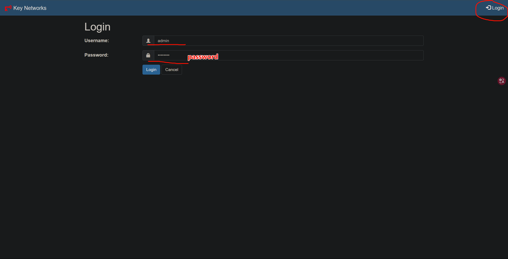

11. 点击**Add network**创建一个网络，再回到**Networks**，点击**Easy setup**进行虚拟网段分配，随后的使用便与官方的节点网络控制器相同了。

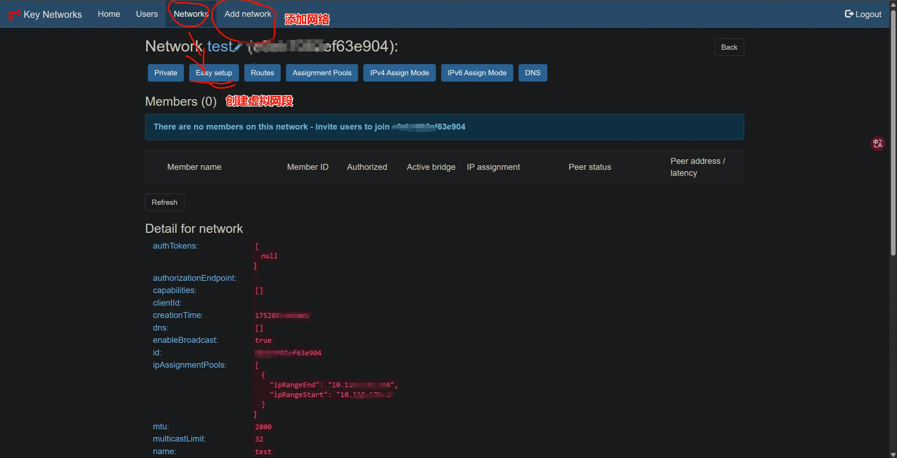

## ztncui 面板的安全访问方式

最简单的方式是为面板访问添加 SSL 证书。
而还有一种方法，能将面板完全与外网隔离，简单来说是将面板完全局限在自己创建的虚拟局域网里，具体方法如下：

1. 首先`zerotier-cli join 网络ID`加入 ztncui 创建的网络中，此时后台会为该设备分配虚拟网络 IP，我们就可以通过该 IP 和端口号访问面板。
2. 然后将自己的可信任设备也加入这个网络，并授权。
3. 随后在云服务器厂商处关闭 ztncui 服务的端口号 3000 和 3443，此后在外网中，便无论如何也无法访问该面板。只有 ztncui 网络中的可信任设备可以通过服务器被分配的虚拟 IP 和端口号来访问面板。

## zerotier 常用指令

- 查看节点 ID：`zerotier-cli info`

- 加入网络：`zerotier-cli join 网络ID`

- 离开网络: `zerotier-cli leave 网络ID`

- 网络状态: `zerotier-cli listnetworks`

- 查看节点状态: `zerotier-cli listpeers`

- 连接 moon: `zerotier-cli orbit Moon节点ID Moon节点ID`

- 退出 moon: `zerotier-cli deorbit Moon节点ID`

- Windows 重启 zerotier：`net stop zerotier-one && net start zerotier-one`

- 显示 moon 信息：`zerotier-cli listmoons`
