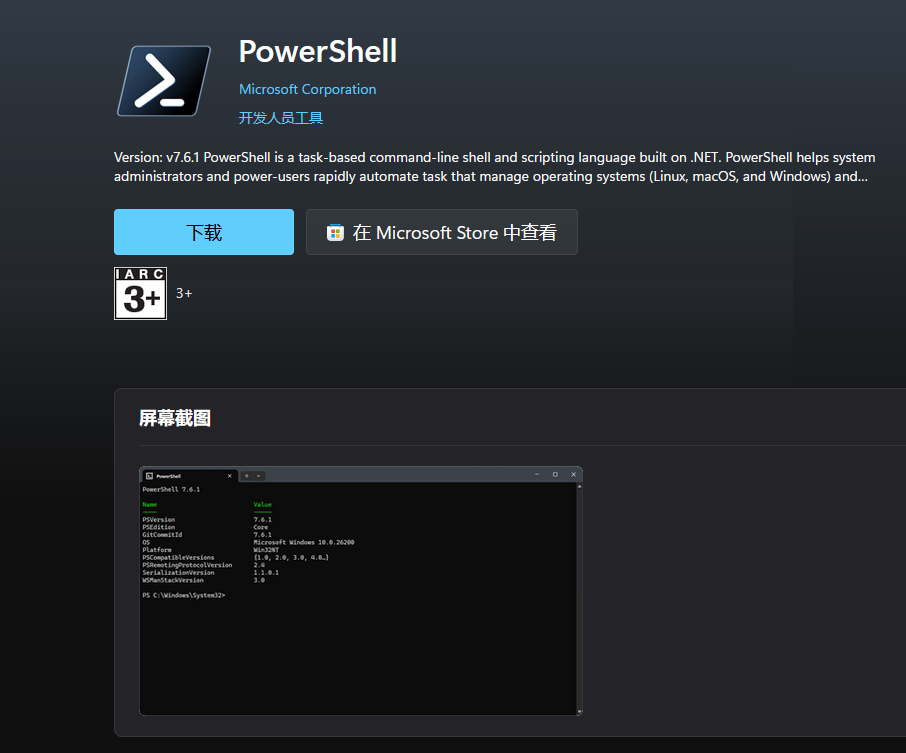
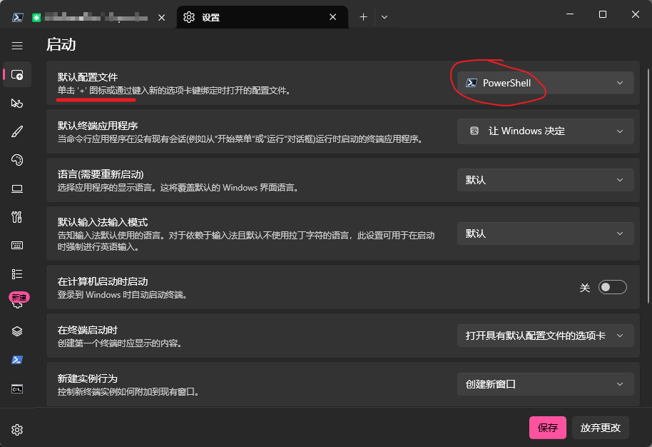
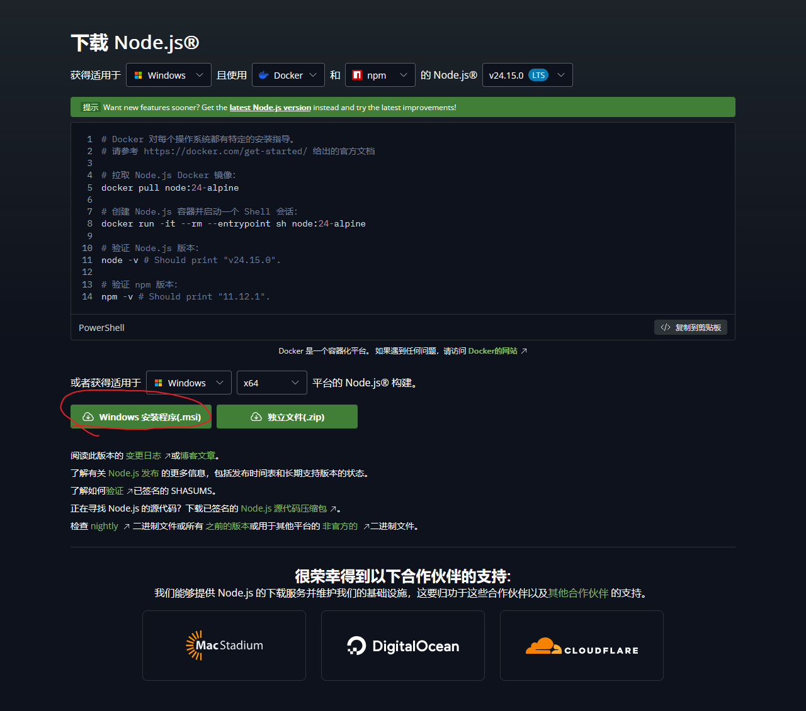
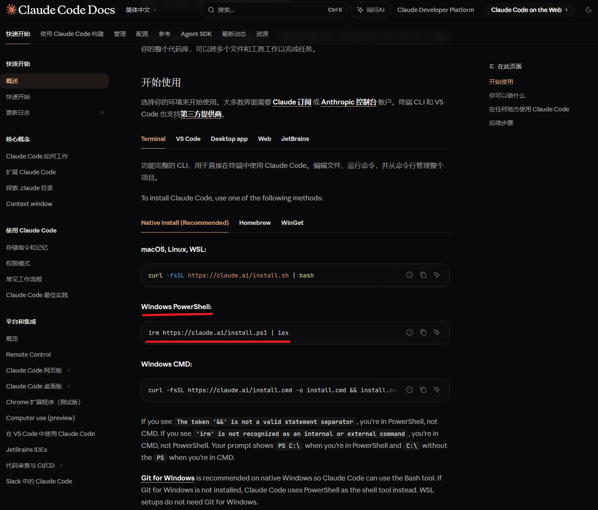
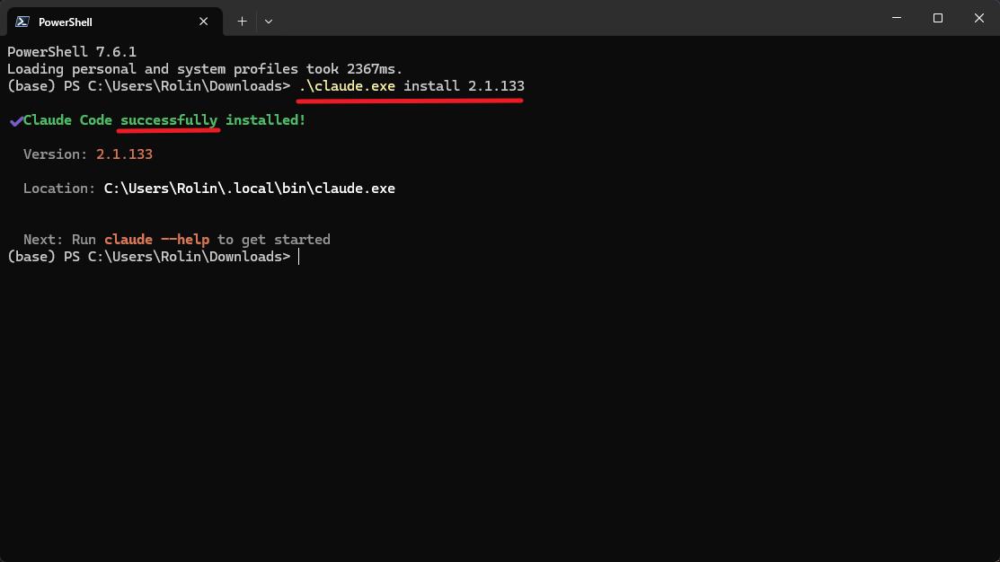
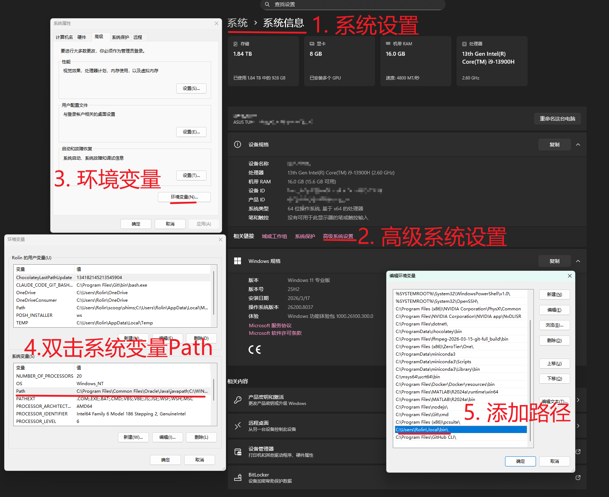
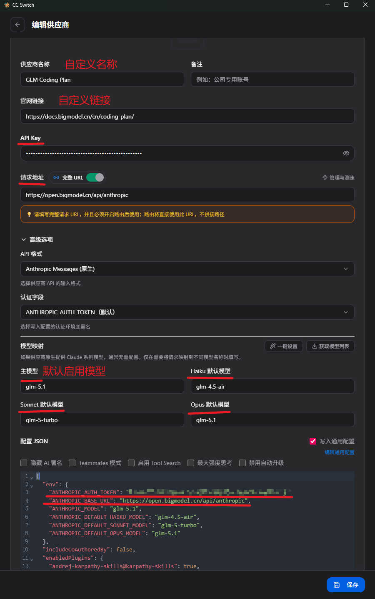
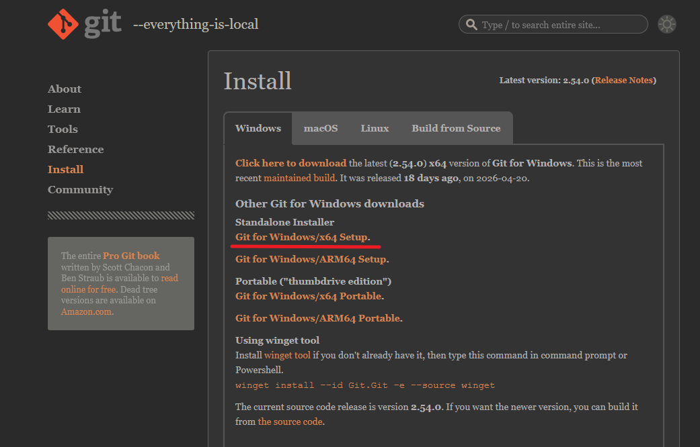

# 相关链接
- [Claude Code Docs 中文文档](https://code.claude.com/docs/zh-CN/overview)
- [Powershell - Microsoft Store](https://apps.microsoft.com/detail/9mz1snwt0n5d?hl=zh-CN&gl=SG)
- [Node.js](https://nodejs.org/zh-cn)
- [CC-Switch](https://ccswitch.ai/)
- [Git For Windows](https://git-scm.com/install/windows)
- [Git Book中文版](https://git-scm.com/book/zh/v2)

本系列基础平台以Windows操作系统为主。(WSL操作逻辑同Linux)
# Windows终端
按`win+x`组合键，点击**终端**会打开`Windows PowerShell`终端，但这是早期的`version5`版本，我们需要在[微软应用商店](https://apps.microsoft.com/)里下载`version7`版本，应用名称为`PowerShell`。




随后呼出终端，右键顶部选择设置，将默认终端选择为`PowerShell`，输入如下命令检查版本：
```bash
# 检查PowerShell版本
$PSVersionTable.PSVersion
```
# Node环境
前往[Node.js](https://nodejs.org/zh-cn)官网安装，此步会同步安装`npm`包管理器和`npx`快捷运行工具。



随后呼出终端，输入如下命令：
```bash
# 允许PowerShell运行本地脚本
Set-ExecutionPolicy RemoteSigned

# 检查node、npm是否安装成功
node -v
npm -v
npx -v
```
# ClaudeCode安装

在官方文档中，推荐的原生安装命令为：
```bash
irm https://claude.ai/install.ps1 | iex
```
但由于国内网络问题，通常是无法持续正常访问的，因此我对脚本进行了解耦：
```ps1
param(
    [Parameter(Position=0)]
    [ValidatePattern('^(stable|latest|\d+\.\d+\.\d+(-[^\s]+)?)$')]
    [string]$Target = "latest"
)

Set-StrictMode -Version Latest
$ErrorActionPreference = "Stop"
$ProgressPreference = 'SilentlyContinue'

# Check for 32-bit Windows
if (-not [Environment]::Is64BitProcess) {
    Write-Error "Claude Code does not support 32-bit Windows. Please use a 64-bit version of Windows."
    exit 1
}

$DOWNLOAD_BASE_URL = "https://downloads.claude.ai/claude-code-releases"
$DOWNLOAD_DIR = "$env:USERPROFILE\.claude\downloads"

# Use native ARM64 binary on ARM64 Windows, x64 otherwise
if ($env:PROCESSOR_ARCHITECTURE -eq "ARM64") {
    $platform = "win32-arm64"
} else {
    $platform = "win32-x64"
}
New-Item -ItemType Directory -Force -Path $DOWNLOAD_DIR | Out-Null

# Always download latest version (which has the most up-to-date installer)
try {
    $version = Invoke-RestMethod -Uri "$DOWNLOAD_BASE_URL/latest" -ErrorAction Stop
}
catch {
    Write-Error "Failed to get latest version: $_"
    exit 1
}

try {
    $manifest = Invoke-RestMethod -Uri "$DOWNLOAD_BASE_URL/$version/manifest.json" -ErrorAction Stop
    $checksum = $manifest.platforms.$platform.checksum

    if (-not $checksum) {
        Write-Error "Platform $platform not found in manifest"
        exit 1
    }
}
catch {
    Write-Error "Failed to get manifest: $_"
    exit 1
}

# Download and verify
$binaryPath = "$DOWNLOAD_DIR\claude-$version-$platform.exe"
try {
    Invoke-WebRequest -Uri "$DOWNLOAD_BASE_URL/$version/$platform/claude.exe" -OutFile $binaryPath -ErrorAction Stop
}
catch {
    Write-Error "Failed to download binary: $_"
    if (Test-Path $binaryPath) {
        Remove-Item -Force $binaryPath
    }
    exit 1
}

# Calculate checksum
$actualChecksum = (Get-FileHash -Path $binaryPath -Algorithm SHA256).Hash.ToLower()

if ($actualChecksum -ne $checksum) {
    Write-Error "Checksum verification failed"
    Remove-Item -Force $binaryPath
    exit 1
}

# Run claude install to set up launcher and shell integration
Write-Output "Setting up Claude Code..."
try {
    if ($Target) {
        & $binaryPath install $Target
    }
    else {
        & $binaryPath install
    }
}
finally {
    try {
        # Clean up downloaded file
        # Wait a moment for any file handles to be released
        Start-Sleep -Seconds 1
        Remove-Item -Force $binaryPath
    }
    catch {
        Write-Warning "Could not remove temporary file: $binaryPath"
    }
}

Write-Output ""
Write-Output "$([char]0x2705) Installation complete!"
Write-Output ""
```
根据脚本内容，我们先要获取版本号，访问`https://downloads.claude.ai/claude-code-releases/latest`即可。

然后获取`claude.exe`本体，下载链接(以x64平台为例)为`https://downloads.claude.ai/claude-code-releases/2.1.133/win32-x64/claude.exe`，如果后有更新，可以更改这里的版本号获取最新版。

随后指定版本号并执行程序即可：`.\claude.exe install 2.1.133`



这时，我们需要将Claude的程序目录`C:\Users\<yourname>\.local\bin\`添加进系统环境变量，以便于直接`claude`命令启动。



# CC-Switch应用
前往[CC-Switch](https://ccswitch.ai/)官网下载该应用，下面是该项目的简介：
> CC Switch 把供应商切换、MCP / Prompts / Skills、代理接管、会话检索和云同步收进同一个桌面应用，你不再需要反复手改 JSON、TOML 或 .env。



这里以`GLM Coding Plan`的配置为例，`API KEY`、**请求地址**和**主模型**是最重要的三个配置，这里也对应到`settings.json`文件中的配置，随后启动`ClaudeCode`就可以跳过登录了。
# ClaudeCode基础使用
```bash
# 进入项目文件夹
cd ./pjc1/

# 启动参数
# 新会话启动
claude
# 继续上次对话启动
claude -c
# 自动式(完全权限)启动
claude --dangerously-skip-permissions

# 使用过程中
# 检查安装情况
/doctor
# 加载之前的会话上下文
/resume
# 清除上下文
/clear
# 显示上下文占用
/context
# 适时压缩上下文
/compact
# 回滚历史会话与修改 (快捷键：两次Esc)
/rewind
# 审查做出的代码更改 (自动调优review)
/simplify
# 创建项目记忆文件 (CLAUDE.md)
/init
# 编辑记忆文件 (全局/项目/文件夹)
/memory
# 创建子agent (subagents)
/agent
# 指定文件
@anyfile.md
# 退出ClaudeCode会话 (快捷键：两次Ctrl+C)
/exit

# 命令帮助
/help
# 配置信息
/config
# 模型更改
/model
# Skill工具
/skills
# MCP工具
/mcp
# ClaudeCode插件
/plugin
```

| 快捷键 | 说明 |
|--------|------|
| `Shift+Tab` | 切换工作模式 |
| `Ctrl+Enter` | 换行 |
| `Esc` | 取消当前操作 / 退出 |
| `! <command>` | 直接执行 shell 命令并返回输出 |

# Git For Windows



请前往 [Git For Windows](https://git-scm.com/install/windows) 官网进行下载，关于`Git`相关的命令可以参考[Git Book中文版](https://git-scm.com/book/zh/v2)并结合`Agent`来学习应用。

首先，`Git`本身作为代码版本管理工具，具有非常大的作用，方便我们随时保存和恢复代码版本；

其次在Windows系统下，`Shell`工具只有`PowerShell`和`CMD`，像`Bash`工具就需要通过`WSL`在Linux子系统中使用；

但`Git Bash`随着`Git`安装也会被安装，这就很好的为`Agent`提供了良好的命令行`Shell`环境，这也是`ClaudeCode`官方文档中推荐安装的原因。 