# 前言

本文将 SMB、PostgreSQL 和达芬奇应用结合起来，实现了多人远程协同剪辑工作，案例平台均为 Windows，需要处于内网环境。

# SMB 文件共享

百度百科：

- SMB（全称是 Server Message Block）是一个网络协议名，它能被用于 Web 连接和客户端与服务器之间的信息沟通。SMB 最初是 IBM 的贝瑞·费根鲍姆（Barry Feigenbaum）研制的，其目的是将 DOS 操作系统中的本地文件接口“中断 13”改造为网络文件系统。

本文的 SMB 搭建参考自 [Windows SMB 正确安全的开启姿势](https://onianbai.com/list_49/137.html)

## 打开 SMB 共享功能

`Win+R`打开运行框，输入`optionalfeatures`打开 Windows 功能，勾选**SMB 直通**。

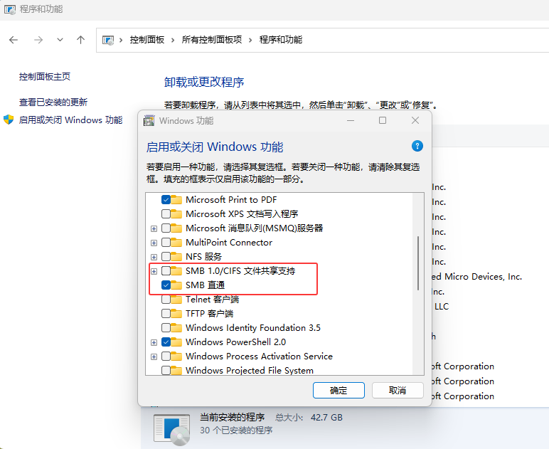

## 创建 SMB 专用用户

这里的用户名以`SMB`为例。

`Win+R`打开运行框，输入`compmgmt.msc`打开计算机管理。

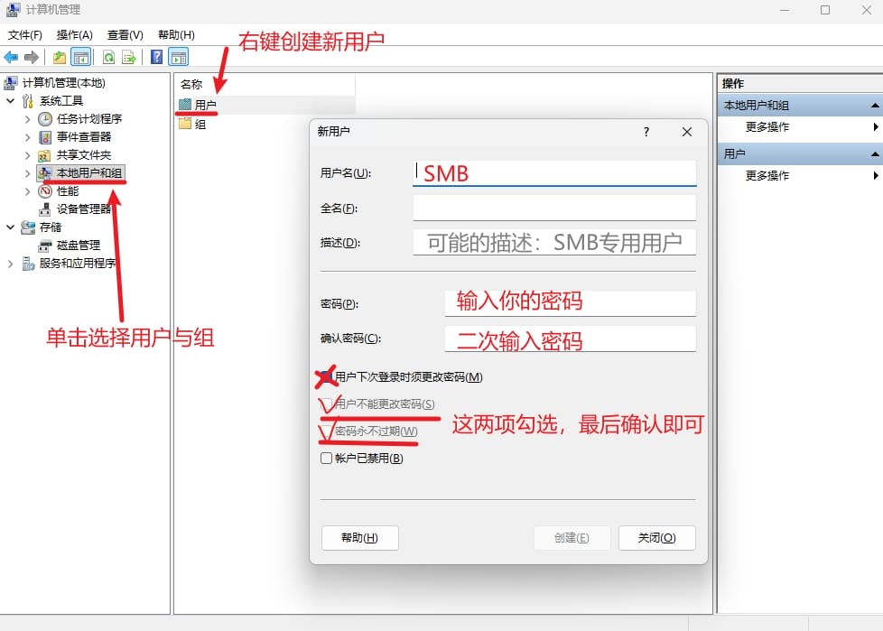

## 必要用户权限的限制与开放

`Win+R`打开运行框，输入`gpedit.msc`打开本地组策略。

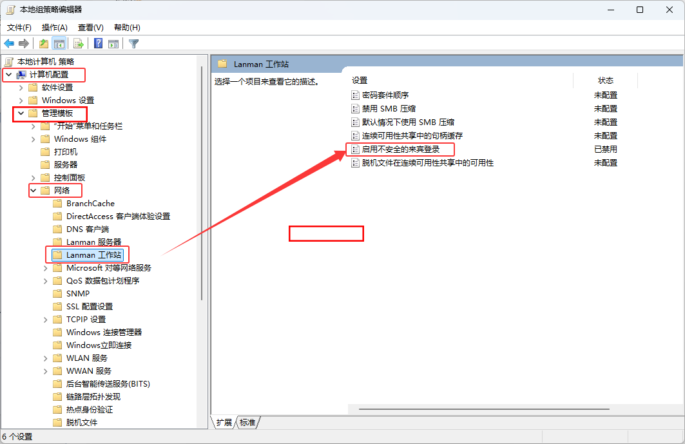

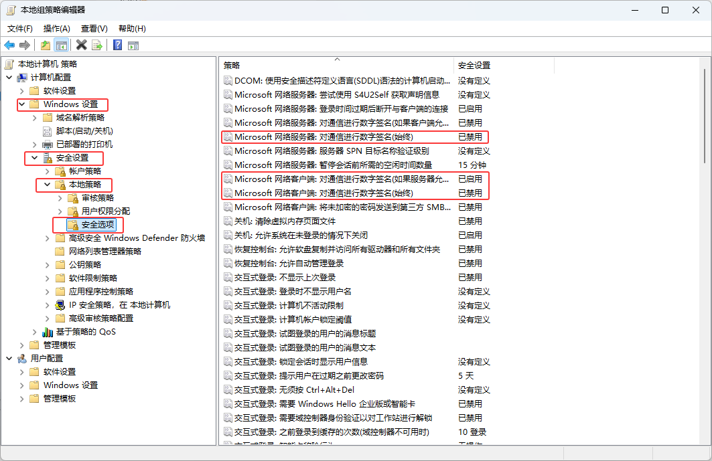

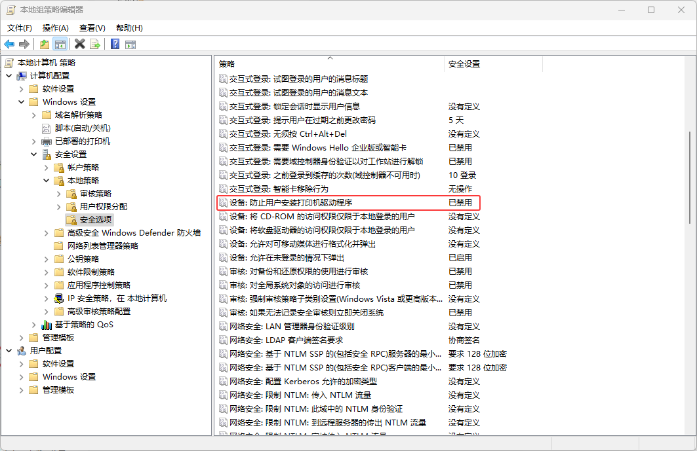

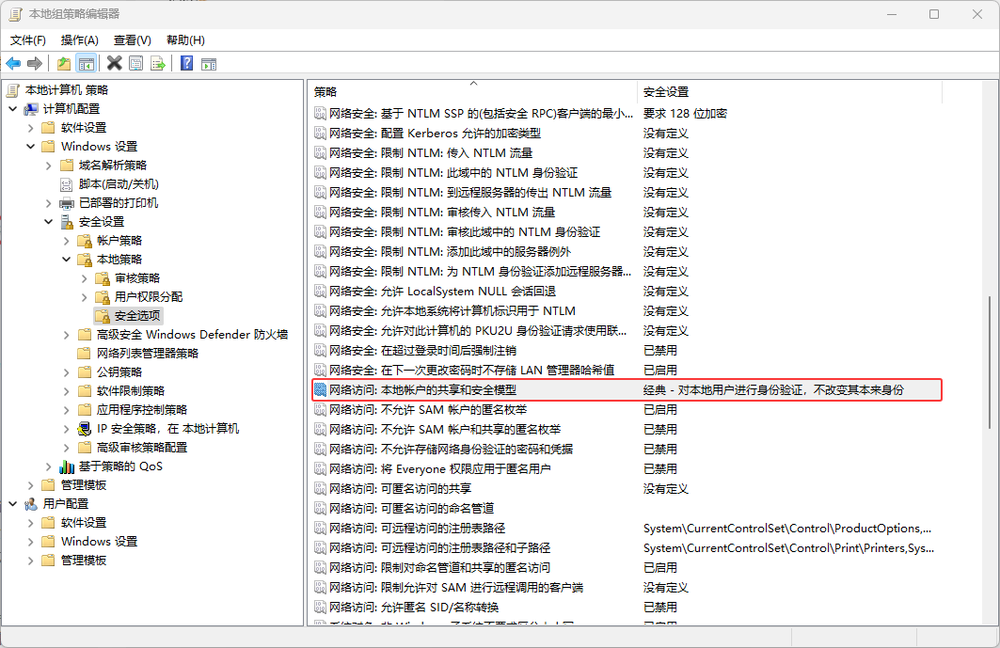

`Win+R`打开运行框，输入`secpol.msc`打开本地安全策略。

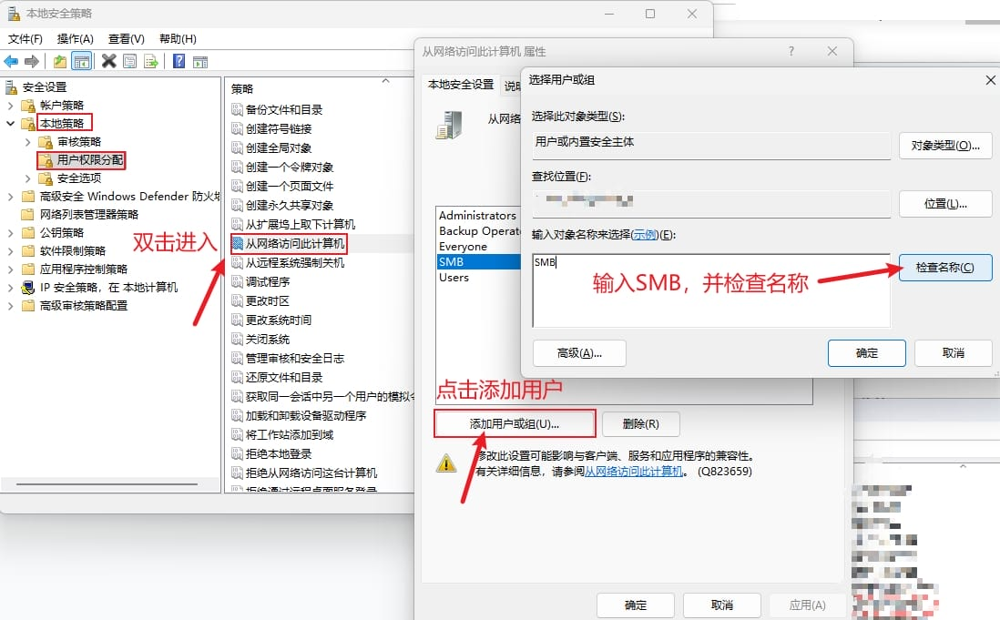

同样的操作应用于以下选项：

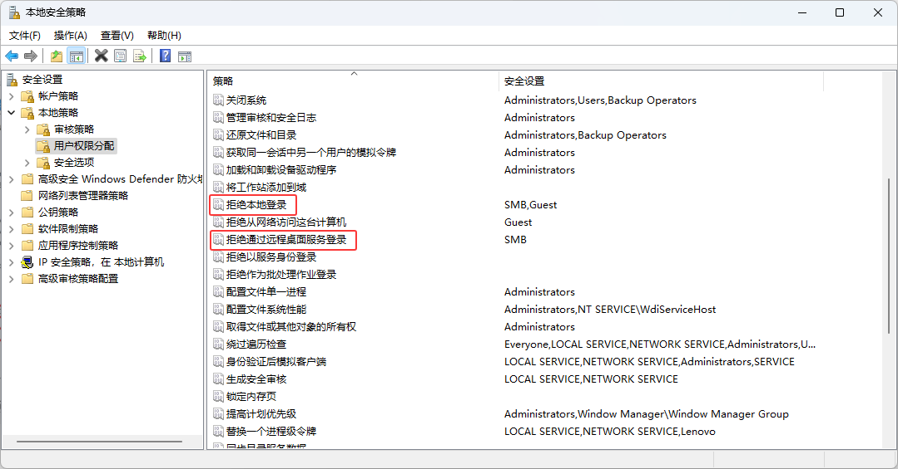

`Win+I`打开 Windows 设置，按照下图打开必要选项：

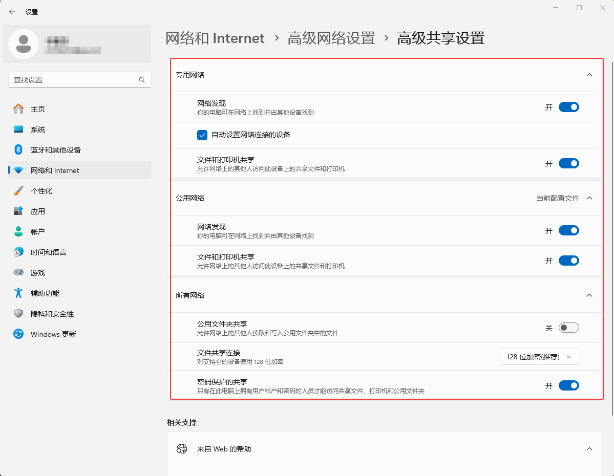

## 设置 SMB 共享文件夹

选择任意盘符，创建一个文件夹，名字以`SMB`为例。

随后打开 SMB 文件夹属性：

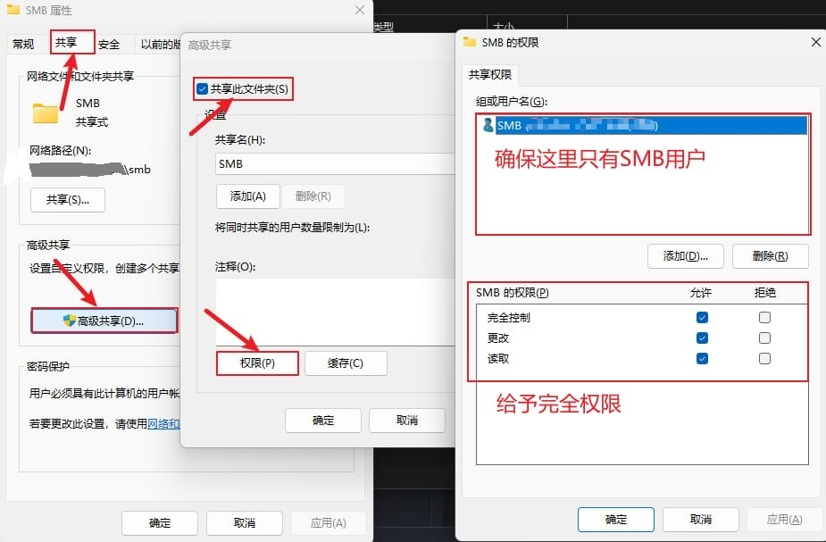

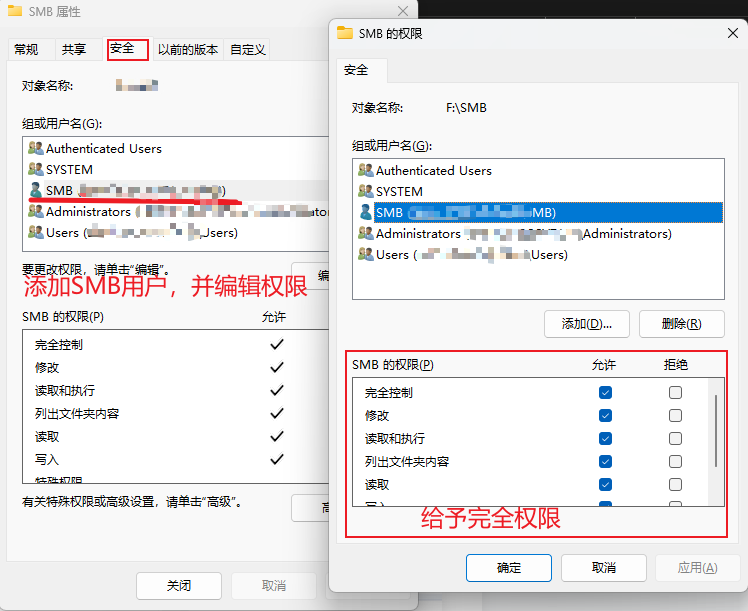

## 其他计算机设备的连接

现在在另一台设备上，`Win+E`打开资源管理器，选择**此电脑**，按照下列操作，即可获得一个**Z 盘**，里面是上文的**SMB**文件夹内容。

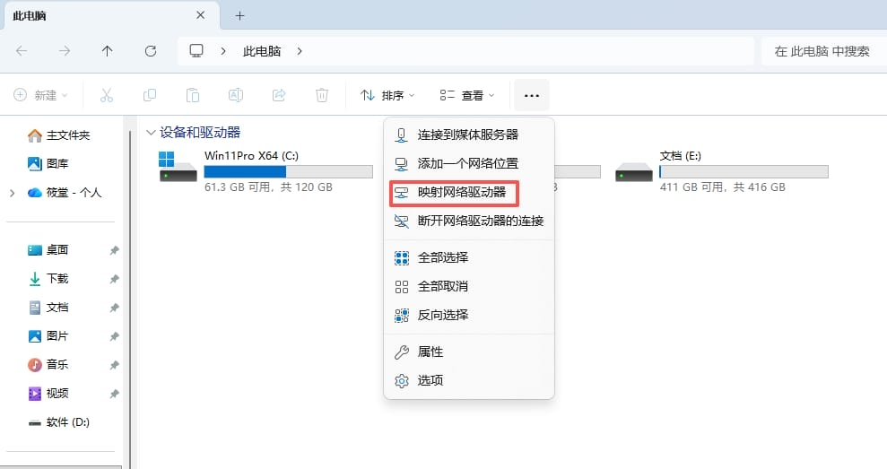

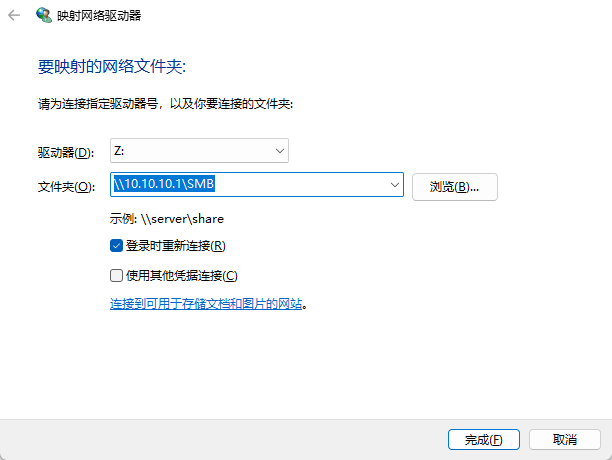

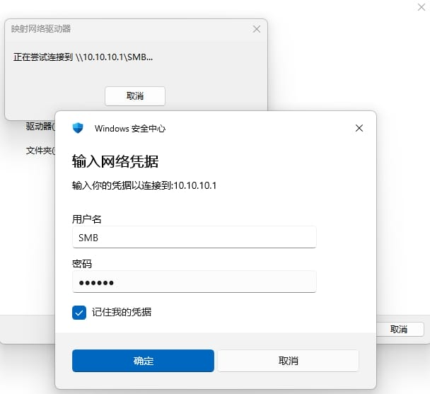

请注意：

- 这里的**文件夹**路径中的**10.10.10.1**为共享机的内网地址，**SMB**为共享文件夹名
- 网络凭据中用户名为上文中创建的`SMB`，密码也是上文创建用户时的密码

# PostgreSQL 数据库

[达芬奇官方支持中心](http://www.blackmagicdesign.com/cn/support/family/davinci-resolve-and-fusion)中的**DaVinci Resolve Project Server**本质上是一个 Postgre 数据库，我们可以完全不用这样一个软件，而用 Postgres 代替。

前往[Postgres 官方下载中心](https://www.postgresql.org/download/)，下载 Windows 版本安装包，在安装过程中会设置一个默认的数据库用户名和密码：

- 默认用户名：postgres
- (例)密码：password

现在可以`Win+R`打开运行框，输入`services.msc`并找到`postgres`相关服务，查看是否正在运行。

## 数据库连接权限

找到 PostgreSQL 的根目录，用记事本打开这个文件：`...\PostgreSQL\17\data\pg_hba.conf`

在末尾加上一段通行信息：

```conf
# Allow network access
host    all             all             10.10.10.0/24         scram-sha-256
```

这里的**10.10.10.0/24**对应上文中**10.10.10.1**的网段，这样位于该网段下的其余设备，才能通过**10.10.10.1**地址来连接到数据库

你需要查询自己的内网网段，替换掉**10.10.10.0/24**。

## 数据库可视化工具测试

这里推荐一款可视化数据库管理工具[DBeaver](https://dbeaver.io/download/)。

可以在**10.10.10.1**机器上，连接数据库时，测试地址**10.10.10.1**看是否能连接成功。

不过在一般情况下管理，直接用**localhost**或者**127.0.0.1**即可。

# Davinci 达芬奇协同设置

在**10.10.10.1**机器上，打开达芬奇软件，按下列操作：

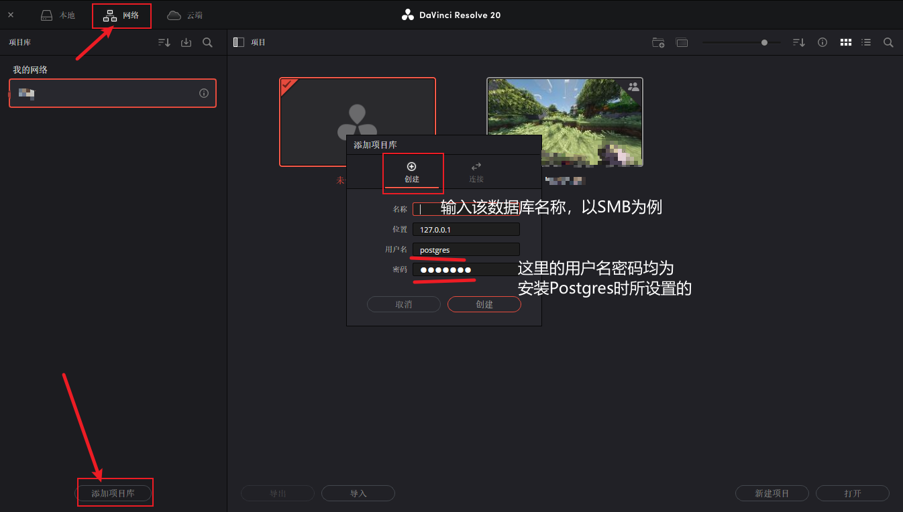

位置填写**10.10.10.1**可以保持统一。

在内网的其他机器上，只需要选择**连接**，填入相同内容即可。

## 项目文件夹设置

在**10.10.10.1**机器上，通过映射网络驱动器操作，获得相同的一个**Z盘**。

在网络数据库中创建一个新项目，前往项目设置：

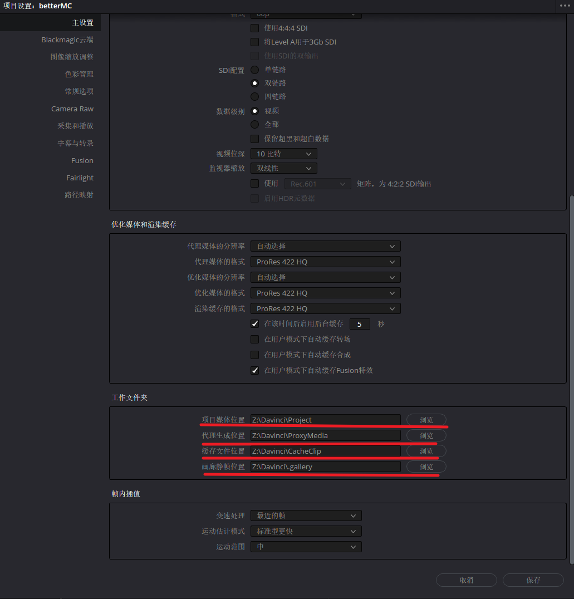

如图所示确保工作文件夹均在**Z盘**内。