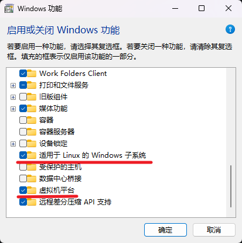
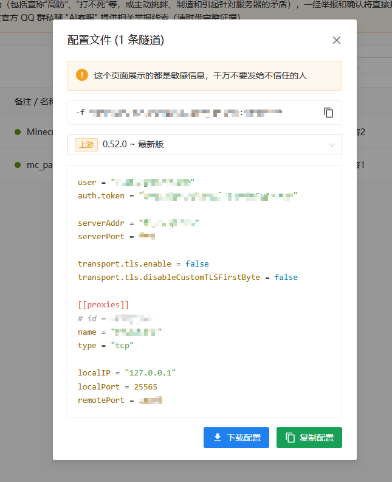

# 相关链接
- [DockerDesktop安装文档](https://docs.docker.com/desktop/setup/install/windows-install/)
- [get-docker脚本](https://get.docker.com/)
- [轩辕镜像](https://docker.xuanyuan.me/)
- [itzg/docker-minecraft-server](https://github.com/itzg/docker-minecraft-server)
- [minecraft-server文档](https://docker-minecraft-server.readthedocs.io/en/latest/)
- [樱花内网穿透](https://www.natfrp.com/?page=panel&module=addproxy)

# Docker的安装与配置

## 在Windows上安装docker

1. `Win`+`R`打开运行窗，输入`optionalfeatures`打开Windows功能面板，勾选 **适用于Linux的Windows子系统** 和 **虚拟机平台**：



2. 来到 [DockerDesktop安装文档](https://docs.docker.com/desktop/setup/install/windows-install/)，选择你的架构，Windows日用机一般为`x86_64`，你也可以在这里安装 **Linux** 和 **MacOS** 的桌面版。

随后在我们要使用docker命令时，需要保持 **DockerDesktop** 运行中。

## Debian系安装docker
```zsh
# 获取官方脚本
curl -fsSL https://get.docker.com -o install-docker.sh

# 执行安装脚本
sudo sh install-docker.sh

# 启动 Docker 服务
sudo systemctl start docker
```

阿里云服务器参考教程:
```zsh
#删除Docker相关源
sudo rm -f /etc/apt/sources.list.d/*docker*.list
#卸载Docker和相关的软件包
for pkg in docker.io docker-buildx-plugin docker-ce-cli docker-ce-rootless-extras docker-compose-plugin docker-doc docker-compose podman-docker containerd runc; do sudo apt-get remove -y $pkg; done

#添加 GPG 密钥
sudo apt update
sudo apt install ca-certificates curl
sudo install -m 0755 -d /etc/apt/keyrings
sudo curl -fsSL http://mirrors.cloud.aliyuncs.com/docker-ce/linux/debian/gpg -o /etc/apt/keyrings/docker.asc
sudo chmod a+r /etc/apt/keyrings/docker.asc
#将该软件源添加到 Apt 源列表中。
sudo tee /etc/apt/sources.list.d/docker.sources <<EOF
Types: deb
URIs: http://mirrors.cloud.aliyuncs.com/docker-ce/linux/debian
Suites: $(. /etc/os-release && echo "$VERSION_CODENAME")
Components: stable
Signed-By: /etc/apt/keyrings/docker.asc
EOF

sudo apt update
#安装Docker社区版本，容器运行时containerd.io，以及Docker构建和Compose插件
sudo apt install -y docker-ce docker-ce-cli containerd.io docker-buildx-plugin docker-compose-plugin

#启动Docker
sudo systemctl start docker
#设置Docker守护进程在系统启动时自动启动
sudo systemctl enable docker
```

## ArchLinux安装docker
```zsh
# 使用pacman直接安装
sudo pacman -S docker docker-compose

# 启动 Docker 服务
sudo systemctl start docker
```

## MacOS安装docker
```zsh
# 检查版本
brew --version

# (选)安装Homebrew
curl -o- https://raw.githubusercontent.com/Homebrew/install/HEAD/install.sh | bash

# 安装orbstack作为docker的运行平台，再安装docker和compose
brew install --cask orbstack docker docker-compose
```

**orbstack** 相关命令(使用docker时保持开启)：
```zsh
# 开机
orb start

# 状态
orb status

# 下机
orb stop

# 配置docker
orb config docker
```

## docker配置镜像源、开机自启动

```zsh
# 启用开机自启
sudo systemctl enable docker

# 查看状态
sudo systemctl status docker

# Linux手动配置镜像源
sudo nano /etc/docker/daemon.json

# MacOS基于orbstack配置镜像源
orb config docker

# Windows在文件资源管理器中输入以下地址
%USERPROFILE%\.docker\daemon.json
```

[轩辕镜像](https://docker.xuanyuan.me/) 一键配置脚本:
```zsh
bash <(wget -qO- https://xuanyuan.cloud/docker.sh)
```

镜像源配置示例：
```json
{
  "registry-mirrors": [
    "https://docker.m.daocloud.io",
    "https://docker.1panel.live/"
  ]
}
```

## 常用的docker命令
```zsh
  # 查看镜像列表
  docker image ls

  # 拉取镜像
  docker pull <镜像名>

  # 删除镜像
  docker rmi <镜像名>

  # 强制删除
  docker rmi -f <镜像名>

  # 查看运行中的容器
  docker ps

  # 查看所有容器（包括停止的）
  docker ps -a

  # 运行容器
  docker run -d --name <容器名> <镜像名>

  # 停止容器
  docker stop <容器名或ID>

  # 启动容器
  docker start <容器名或ID>

  # 删除容器
  docker rm <容器名或ID>

  # 强制删除运行中的容器
  docker rm -f <容器名或ID>

  # 查看容器日志
  docker logs <容器名>

  # 实时查看日志
  docker logs -f <容器名>

  # 进入容器内部
  docker exec -it <容器名> /bin/bash

  # 启动所有服务
  docker compose up -d

  # 停止所有服务
  docker compose down

  # 查看服务状态
  docker compose ps

  # 查看日志
  docker compose logs -f

  # 重启服务
  docker compose restart

  # 清理所有未使用的镜像
  docker image prune -a

  # 清理未使用的卷
  docker volume prune

  # 打包镜像文件为jar包离线使用
  docker save -o <文件名>.tar <镜像名>

  # 加载离线镜像jar包
  docker load -i <文件名>.tar
```

# minecraft-server镜像
[itzg/docker-minecraft-server](https://github.com/itzg/docker-minecraft-server) 是一个提供Minecraft镜像的一个仓库，我们只需根据 [minecraft-server文档](https://docker-minecraft-server.readthedocs.io/en/latest/)，选择合适的镜像和配置，即可完成一键启动Minecraft服务器。

根据 [Docker-Hub的镜像仓库](https://hub.docker.com/r/itzg/minecraft-server) 选择不同Java版本的镜像。本文将以 **Minecraft-Paper-1.21.4**  和 **BetterMCv54-Forge-1.20.1** 这两个服务器举例，并分别部署在 **ArchLinux** 和 **MacMini** 上，所选用的 **Java** 版本为 `java21`，作者还提供了一个用于备份的镜像 [mc-backup](https://hub.docker.com/r/itzg/mc-backup)，这里我选择使用`2026.3.2`版本。
```zsh
# 拉取docker镜像(必要时使用sudo)
docker pull itzg/minecraft-server:java21
docker pull itzg/mc-backup:2026.3.2
```

## BetterMCv54的compose配置
在作者的GitHub仓库中，提供了这么一个示例配置：[docker-compose-forge-bettermcplus](https://github.com/itzg/docker-minecraft-server/blob/master/examples/docker-compose-forge-bettermcplus)

笔者在此基础上结合[docker-mc-backup](https://github.com/itzg/docker-mc-backup)进行了进一步配置，请确保文件名为`docker-compose.yml`：
```yaml
services:

  # 备份预热:启动restore-tar-backup脚本，如果在backups目录中有备份tar包，便对data目录进行覆盖，并在执行后停止。
  restore-backup:
    image: itzg/mc-backup:2026.3.2   # 检查镜像名
    restart: "no"
    entrypoint: restore-tar-backup
    volumes:
      - ./minecraft-data:/data       # 服务器文件
      - ./mc-backups:/backups:ro     # 备份文件夹

  # 服务器本体容器
  mc_bmp:
    image: itzg/minecraft-server:java21-jdk  # 检查镜像名
    container_name: mc_bmp                   # 自定义容器显示名称
    healthcheck:                             # 容器健康检查
      interval: 30s                          # 多久检查一次
      timeout: 60s                           # 单次检查的超时时间
      retries: 10                            # 连续失败多少次算不健康
      start_period: 300s                     # 容器启动后多久才开始检查（等待启动时间）
    ports:
      - 25565:25565                          # 游戏连接端口
      - 2222:2222                            # SSH命令传入端口
    restart: unless-stopped
    environment:
      EULA: "true" 
      ENABLE_SSH: true                       # 开启SSH命令传入
      TYPE: FORGE                            # 游戏类型
      VERSION: 1.20.1                        # 游戏版本
      FORGE_VERSION: 47.4.10                 # Forge版本
      MEMORY: "8G"                           # 内存分配
      GENERIC_PACK: /modpacks/BMC4_Server_Pack_v54.zip   # (整合包)服务器压缩文件位置

      # JVM虚拟机优化参数
      JVM_OPTS: "-server"
      JVM_XX_OPTS: "-XX:+UseG1GC -XX:+ParallelRefProcEnabled -XX:MaxGCPauseMillis=200 -XX:+UnlockExperimentalVMOptions -XX:+DisableExplicitGC -XX:+AlwaysPreTouch -XX:G1NewSizePercent=20 -XX:G1MaxNewSizePercent=40 -XX:G1HeapRegionSize=16M -XX:G1ReservePercent=20 -XX:G1HeapWastePercent=5 -XX:G1MixedGCCountTarget=4 -XX:InitiatingHeapOccupancyPercent=15 -XX:G1MixedGCLiveThresholdPercent=90 -XX:SurvivorRatio=32 -XX:MaxTenuringThreshold=1 -XX:+UseStringDeduplication -XX:+UseCompressedOops -XX:+UseCompressedClassPointers"
      JVM_DD_OPTS: "-Dfml.readTimeout=180 -Dfml.debugRegistryEntries=true -Dfile.encoding=UTF-8"  
      
      TZ: "Asia/Shanghai"                    # 时区
      OVERRIDE_SERVER_PROPERTIES: "false"    # 是否覆盖Server_properties文件
      DIFFICULTY: "normal"                   # 游戏难度
      MAX_TICK_TIME: "-1"                       
      VIEW_DISTANCE: "6"                     # 视距
      ALLOW_FLIGHT: "true"                   # 是否允许飞行
      OPS: "RoL1n_SrP"                       # 管理员
      MAX_PLAYERS: 10                        # 最大玩家数
      PVP: "false"                           # 是否开启PVP
      LEVEL_TYPE: "biomesoplenty"                    
      RCON_PASSWORD: "yourpassword"          # Rcon、SSH共用密码
    volumes:
      - ./modpacks:/modpacks:ro              # 只读(整合包)服务器压缩文件
      - ./minecraft-data:/data               # 服务器游戏数据

    # 仅当备份预热脚本结束后才进行服务器加载
    depends_on:
      restore-backup:
        condition: service_completed_successfully
  
  # 常驻备份容器
  backups:
    image: itzg/mc-backup:2026.3.2           # 检查镜像名
    
    # 仅在 mc_bmp 容器健康运行后才运行此容器
    depends_on:
      mc_bmp:                                # 检查服务器容器名(Services名称)
        condition: service_healthy
    environment:
      BACKUP_INTERVAL: "2h"                  # 每2小时进行一次备份
      PRUNE_BACKUPS_COUNT: 8                 # 最大备份文件数量
      BACKUP_ON_STARTUP: true                # 是否在启动时进行备份
      RCON_HOST: mc_bmp                      # Rcon所连接的(服务器)容器名(Services名称)
      INITIAL_DELAY: 30m                     # 在启动后30min才执行计时/备份
      PAUSE_IF_NO_PLAYERS: false             # 是否在无玩家时暂停计时/备份
      PLAYERS_ONLINE_CHECK_INTERVAL: 5m      # 间隔5分钟检查服务器中是否有玩家
    volumes:
      - ./minecraft-data:/data:ro            # 只读服务器文件数据
      - ./mc-backups:/backups                # 备份文件目录
```

备份机制是这样的 (备份并不需要关闭服务器):
- 发送游戏指令`save-off`，禁用自动保存
- 执行`save-all`，将所有数据写入磁盘
- 对服务器目录进行全量打包，并备份至备份文件夹
- 发送指令`save-on`，开启自动保存

此外，betterMC是一款整合包，其他整合包作者也通常会发布 **服务端整合包**，你需要将`GENERIC_PACK: /modpacks/BMC4_Server_Pack_v54.zip`中的`BMC4_Server_Pack_v54.zip`改写为你所使用的服务端整合包名称，并在`docker-compose.yml`同目录下创建`modpacks`文件夹，来存放这个服务端整合包，这样docker容器在运行时才能生成正确的服务器文件。

## Paper插件服的compose配置

相比于 **BetterMC**，**Paper** 的配置会简单不少，因此笔者只对不同部分做注释：
```yaml
version: "3"
services:
  restore-backup:
    image: itzg/mc-backup:2026.3.2
    restart: "no"
    entrypoint: restore-tar-backup
    volumes:
      - ./minecraft-data:/data
      - ./mc-backups:/backups:ro
      
  mc_paper:                                 # 这里的服务名定义为 mc_paper
    image: itzg/minecraft-server:java21-jdk
    container_name: mc_paper                # 容器名也是 mc_paperr
    ports:
      - "25565:25565"
      - "2222:2222"
    environment:
      EULA: "TRUE"
      ENABLE_SSH: true
      TYPE: "PAPER"                         # 游戏类型为 Paper
      VERSION: "1.21.4"                     # 游戏版本
      VIEW_DISTANCE: 8         
      MEMORY: 4G
      ENABLE_WHITELIST: "FALSE"             # 是否启用白名单
      OPS: "RoL1n_SrP"
      ONLINE_MODE: "TRUE"                   # 是否开启正版验证
      SERVER_NAME: "SrP-Server"             # 服务器名称
      MOTD: "It's provided by RoL1n."       # 服务器列表欢迎语
      ICON: "/icon.png"                     # 这里可以自定义你的服务器图标(容器内路径)
      OVERRIDE_SERVER_PROPERTIES: "FALSE"
      RCON_PASSWORD: "yourpassword"
    tty: true
    stdin_open: true
    restart: unless-stopped
    volumes:
      - ./minecraft-data:/data
      - ./icon.png:/icon.png                # 需要在这里挂载上服务器图标位置(容器 "外->内" 路径映射)
    depends_on:
      restore-backup:
        condition: service_completed_successfully

  backups:
    image: itzg/mc-backup:2026.3.2
    depends_on:
      mc_paper:                             # 注意这里的服务名
        condition: service_healthy
    environment:
      BACKUP_INTERVAL: "2h"
      PRUNE_BACKUPS_COUNT: 8
      BACKUP_ON_STARTUP: true
      RCON_HOST: mc_paper                   # 这里也是服务名
      INITIAL_DELAY: 30m
      PAUSE_IF_NO_PLAYERS: false
      PLAYERS_ONLINE_CHECK_INTERVAL: 5m
    volumes:
      - ./minecraft-data:/data:ro
      - ./mc-backups:/backups
```

## Docker启动与命令通信
当一切准备就绪，就可以使用docker-compose命令来启动服务器了：
```zsh
# 进入docker-compose.yml所在目录
cd ...

# 启动容器链，并持久化运行(必要时sudo提权)
docker compose up -d
```
`itzg/minecraft-server`镜像默认有一个开启在`2222`端口上的SSH，直接连接到容器内部的游戏服务器，你可以通过ssh命令连接服务器，查看游戏实时日志并发送命令：
```zsh
# ssh命令标准
ssh <username>@<server_address> -p 2222

# 示例(如果是在本地运行的容器)
ssh root@127.0.0.1 -p 2222
# 输入在compose中的RCON_PASSWORD值(无键盘输入显示，需要盲打)
```

# 内网穿透Frp
如果你能够租到10M及以上带宽的云服务器，那么你可以使用自建内网穿透，否则还是直接使用 [樱花内网穿透](https://www.natfrp.com/?page=panel&module=addproxy) 服务吧。

在这里我们并不需要下载任何 [樱花内网穿透](https://www.natfrp.com/?page=panel&module=addproxy) 的软件，在Windows和Debian系Linux中，完全可以 [下载原版frp的对应版本](https://github.com/fatedier/frp/releases)，然后配置使用`frpc`即可，配置文件由 [隧道列表](https://www.natfrp.com/tunnel/) 提供：



手动下载Frp并配置，请参考笔者的往期文章: [内网穿透Frp搭建 ](https://blog.srprolin.top/posts/frp-1/#frpc-%E5%AE%A2%E6%88%B7%E7%AB%AF)

## Mac中安装frp与配置樱花映射
```zsh
# 使用brew安装
brew install frpc

# 查看安装位置与验证版本
which frpc
frpc --version

# 编辑配置文件(将获取到的配置粘贴至此)
sudo nano $(brew --prefix)/etc/frp/frpc.toml

# 启动服务
brew services start frpc

# 查看状态
brew services list
```

## ArchLinux中安装frp与配置樱花映射
```zsh
# 使用pacman安装
sudo pacman -S frpc

# 查看安装位置与验证版本
which frpc
frp --version

# 编辑配置文件
sudo nano /etc/frp/frpc.toml

# 启动服务
systemctl enable frpc
systemctl start frpc

# 查看状态
systemctl status frpc
```

