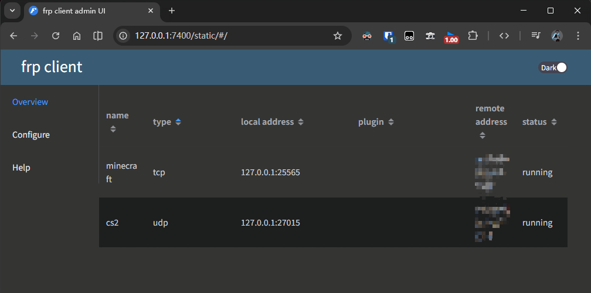
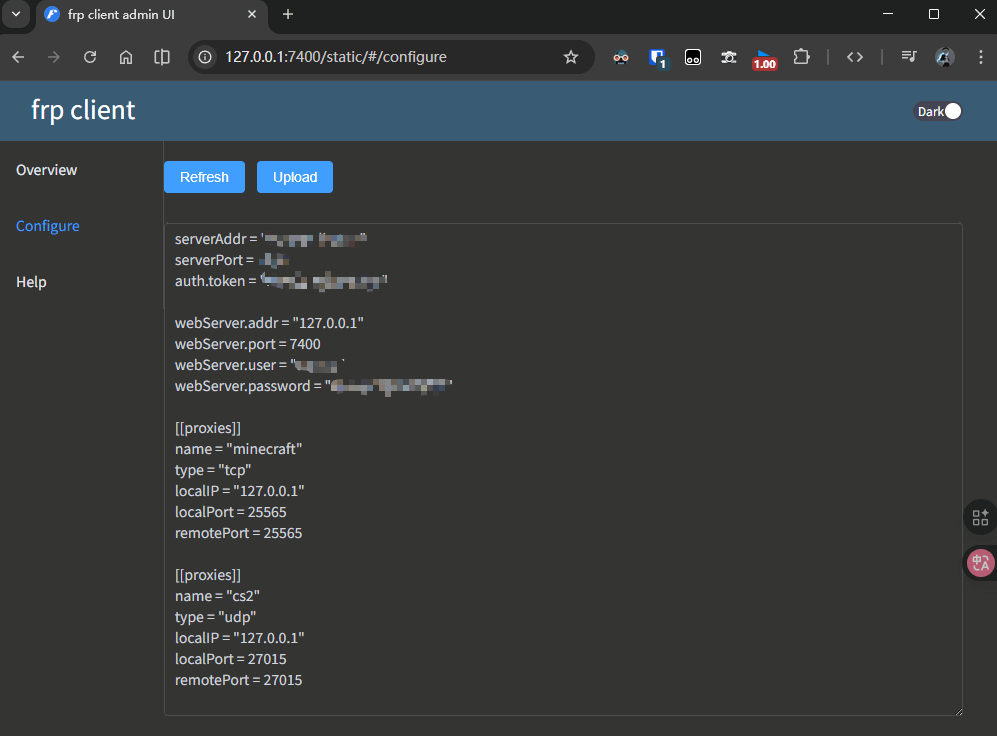

# 简介与摘要

[frp](https://github.com/fatedier/frp) 是一个专注于内网穿透的高性能的反向代理应用，支持 TCP、UDP、HTTP、HTTPS 等多种协议，且支持 P2P 通信。可以将内网服务以安全、便捷的方式通过具有公网 IP 节点的中转暴露到公网。

市面上的内网穿透服务[Sakura FRP](https://www.natfrp.com/?page=panel&module=download)也是基于此实现的。

本文将以 Ubuntu24 系统公网云服务器为例，Frp 官方压缩包版本为 v0.65.0，分享部署自用内网穿透服务的步骤。

文中未提到的多处细节，请参考[官方文档](https://gofrp.org/zh-cn/docs/)自行了解。

# Frp 部署

官方的 release 界面下载到的压缩包中，会包含 frpc 客户端和 frps 服务端两个程序，我们一般在服务器上保留 frps，在需要穿透的内网机器上保留 frpc，我将分别演示在服务端(Linux)和客户端(Windows)上的操作：

## Frps 服务端

分步总览：

- 下载官方压缩包并解压进入项目目录
- 删除有关客户端 frpc 的文件
- 编辑 frps.toml 以初始化服务端配置
- 为 frps 创建 systemd 后台服务文件
- 将 frps 归入系统后台服务并开机自启

命令行操作(关于`wget`网络问题，可以自行下载好压缩包之后，通过`sftp`上传至服务器)：

```
# 在用户目录下(不必使用sudo)，获取并解压官方amd64(服务器系统框架)版本最新压缩包：
cd ~
wget https://github.com/fatedier/frp/releases/download/v0.65.0/frp_0.65.0_linux_amd64.tar.gz
tar -xvf frp_0.65.0_linux_amd64.tar.gz

# 更名项目文件夹名,并进入项目目录
mv frp_0.65.0_linux_amd64 frps
cd frps/

# 删除客户端frpc相关文件
rm frpc
rm frpc.toml
```

现在我们需要编辑`frps.toml`文件内容，这里使用`nano`编辑器：`nano frps.toml`

文件内容大致如下：

```
# frps.toml

bindAddr = "0.0.0.0"

# 这里是frps服务端口，需要在云厂商安全组和系统防火墙中打开
bindPort = 7000

webServer.addr = "0.0.0.0"

# 这里是frps提供的web页面端口，同样需要开放
webServer.port = 7500

# 这是web页面的初始访问密码
webServer.user = "admin"

webServer.password = "admin"

# 这是用于连通客户端与服务端的凭证码，请设置复杂些
auth.token = "Jdag0XDeMnzcPI"
```

现在按照官方用法，只需要执行`./frps -c ./frps.toml`便可开启服务，并在 7500 端口查看 frps 的 web 页面。

但是此时该服务只能运行在 ssh 终端，也就是说关闭了 ssh 连接，frp 服务也将终止。

因此按照官方文档的推荐方法，可以将 frps 注册为 systemd 系统服务，跑在服务器后台。

```
# 安装systemd(一般会内置)
sudo apt install systemd

# 创建并编辑frps.service文件(需要sudo权限)
sudo nano /etc/systemd/system/frps.service
```

内容大致如下：

```
# frps.service

[Unit]
# 服务名称，可自定义
Description = frp server
After = network.target syslog.target
Wants = network.target

[Service]
Type = simple
# 启动frps的命令，需修改为您的frps的安装路径
ExecStart = /home/usrname/frps/frps -c /home/usrname/frps/frps.toml

[Install]
WantedBy = multi-user.target
```

随后通过`systemctl`启动`frps`服务(`systemctl`常用参数:`start`、`stop`、`restart`、`status`)：

```
# 启动frps，可访问7500端口或用status参数查看是否运行成功
sudo systemctl start frps

# 设置frps为自启动
sudo systemctl enable frps
```

## Frpc 客户端

分步总览：

- 下载并解压官方压缩包
- 删除 frps 相关文件
- 编辑`frpc.toml`配置初始化
- 编辑`bat`和`vbs`文件以达到后台效果
- 通过 web 界面编辑穿透服务

这里以 amd64 的 Windows 系统为例，[点击下载官方压缩包](https://github.com/fatedier/frp/releases/download/v0.65.0/frp_0.65.0_windows_amd64.zip)

以`C:\Program Files\frpc`目录为例，存放解压后的文件。

删除`frps.exe`和`frps.toml`两个文件。

编辑`frpc.toml`内容如下：

```
# frpc.toml

# 请写入你的服务器公网IP或者域名替换"<IP>"
serverAddr = "<IP>"

# 默认端口为7000
serverPort = 7000

# 这里填写刚才在frps.toml中填写的认证凭证token
auth.token = "Jdag0XDeMnzcPI"

# 默认Web界面使用本机7400端口
webServer.addr = "127.0.0.1"
webServer.port = 7400

# web界面初始用户名密码
webServer.user = "admin"
webServer.password = "admin"
```

此时我们双击运行`frpc.exe`文件就能运行该服务，但是它需要跑在终端里。

下面将使用`bat`脚本+`vbs`脚本的方式，让该服务跑在后台，不占用前台终端。

在该目录下创建`start_frpc.bat`文件，编辑内容如下：

```
@echo off
title FRP Client
echo starting frp client...
echo logs_output：
echo ==============================

:: 切换到frpc所在目录（请替换为实际路径）
cd /d C:\Program Files\frpc

:: 启动frpc并将日志输出到文件
frpc.exe -c frpc.toml> frpc_log.txt 2>&1

:: 如果启动失败，暂停显示错误信息
if %errorlevel% neq 0 (
    echo FRP Client start failed！
    echo error messages are saved in frpc_log.txt
    pause
)
```

创建`start_frpc.vbs`文件，编辑内容如下：

```
Set objShell = CreateObject("WScript.Shell")
objShell.Run "cmd /c start_frpc.bat", 0, False
```

随后为`start_frpc.vbs`创建一个桌面快捷方式，双击快捷方式即可在后台运行，可访问`http://127.0.0.1:7400`检查是否成功。

# Frp 示例 | 穿透本机游戏端口

在上面的教程中，只是成功部署了 frp 服务，我们部署 frpc 客户端也是为了显示本机应用端口的穿透，下面将演示 Minecraft_Java 游戏服务器和 CS2 游戏房间的穿透案例。

运行`start_frpc.vbs`启动客户端后，前往[web 页面](http://127.0.0.1:7400):



我这里是已经部署成功后的页面，点击左边`configure`可以实现在 web 页面编辑`frpc.toml`文件：



按照此格式写入后，点击`upload`即可更新配置文件，便可实现内网穿透：

```
[[proxies]]
name = "minecraft"
type = "tcp"
localIP = "127.0.0.1"
localPort = 25565
remotePort = 25565
```

参数说明：

- name：只用做服务标识，可以随便设置
- type：对于当前案例来说，多数网游使用`udp`，而 Minecraft_Java 版游戏使用`tcp`
- localIP：一般不用更改，127.0.0.1 表示本机。
- localPort：根据需要的服务端口而言，这里 Minecraft 服务器默认跑在 25565 端口，CS2 房间是跑在 27015 端口。
- remotePort：指的是别人需要通过远程服务器上的哪个端口来访问你本机的游戏服务器，该端口需要在云厂商安全组中放行，可与本地游戏服务端口不一致。

# 结语

本人对 Frp 的使用是非常有限的，实际上官方文档中对 Frp 的功能介绍远比我这里多得多，本文旨在展示这么一样东西，了解 Frp 的基础操作逻辑和参数说明，可以帮大家在使用比如 [Sakura FRP 樱花内网穿透](https://www.natfrp.com/?page=panel&module=download) 时，不那么茫然。
