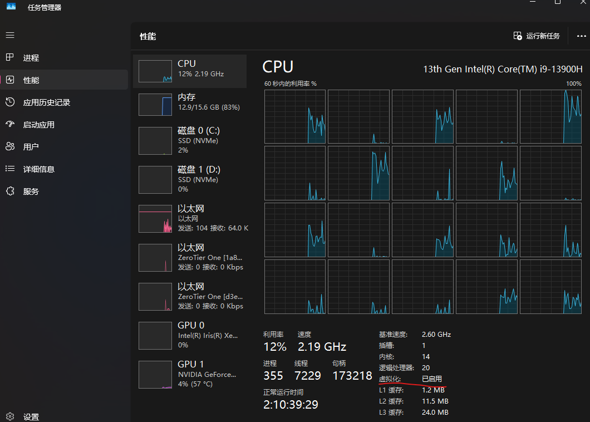
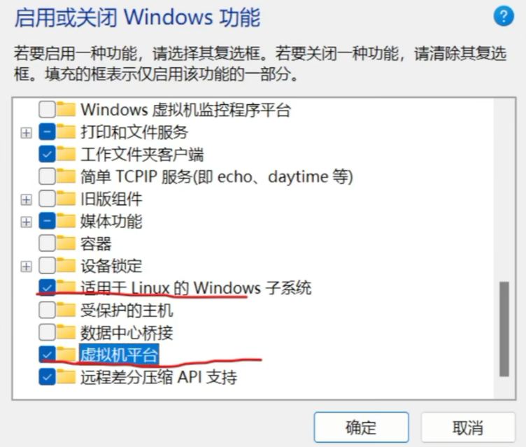

# 相关链接
- [如何使用 WSL 在 Windows 上安装 Linux](https://learn.microsoft.com/zh-cn/windows/wsl/install)
- [USTC Mirror Help - Debian](https://mirrors.ustc.edu.cn/help/debian.html)
- [ImmortalWrt Downloads](https://downloads.immortalwrt.org/)

# WSL的安装

## 前提条件

请确保开启了CPU虚拟化：


`Win+R`打开运行窗，输入`optionalfeatures`，打开Windows功能，确保勾选了这两项(一般安装过Docker的机器都已经开启了)：


也可以用以下指令，在powershell管理员中运行：
```bash
dism.exe /online /enable-feature /featurename:Microsoft-Windows-Subsystem-Linux /all /norestart
dism.exe /online /enable-feature /featurename:VirtualMachinePlatform /all /norestart
```

## 管理Linux发行版
`Win+X`打开终端(管理员)，这里需要确保打开的是`PowerShell`：

```bash
# 更新WSL，并把wsl版本设置为2
wsl --update
wsl --set-default-version 2
# 查看当前WSL已安装的子系统
wsl --list -v
# 查看WSL可安装的网络子系统
wsl --list -online
# 安装Debian，这里的名称就是online展示的,可选安装方式如下两种
wsl --install Debian
wsl --install -d Debian --location D:\WSL
# 切换默认子系统
wsl --set-default Debian
# 卸载子系统
wsl --unregister Debian
# 备份子系统
wsl --export Debian debian.tar
# 导入子系统
wsl --import <系统名称> <Windows存放系统目录> <备份文件> 
```

按照指令安装Debian即可。

# WSL安装编译工具

首先替换一下镜像源：
```bash
# 进入WSL子系统
wsl
# 使用中科大USTC的APT镜像源
sudo sed -i 's/deb.debian.org/mirrors.ustc.edu.cn/g' /etc/apt/sources.list
```

更新APT源，并安装编译工具：
```bash
sudo apt update && sudo apt upgrade -y
sudo apt install -y build-essential libncurses5-dev libncursesw5-dev zlib1g-dev gawk git gettext libssl-dev xsltproc rsync wget unzip qemu-utils zstd python3 python3-setuptools file genisoimage
```

# ImmortalWrt编译工具导入
可以到[ImmortalWrt-24.10.4-x86-64](https://downloads.immortalwrt.org/releases/24.10.4/targets/x86/64/)下载站看到，上方已经有官方编译好的原版固件了。

```bash
# 创建编译文件夹并进入
mkdir ~/builder && cd ~/builder
```

这里以immortalwrt-24.10.4版本为例，下载[immortalwrt-imagebuilder-24.10.4-x86-64](https://downloads.immortalwrt.org/releases/24.10.4/targets/x86/64/immortalwrt-imagebuilder-24.10.4-x86-64.Linux-x86_64.tar.zst),并打开 **Windows资源管理器** (`Win+E`)，将该文件复制给WSL的builder目录内。

这里可以在地址栏输入`\\wsl.localhost\Debian\home\<用户名>\builder`，(`<用户名>`是WSL初始化时定义的用户名)，即可快速定位目录。

```bash
# 解压并进入生成器目录
tar -I zstd -xf immortalwrt-imagebuilder-24.10.4-x86-64.Linux-x86_64.tar.zst
cd immortalwrt-imagebuilder-24.10.4-x86-64.Linux-x86_64
```

# OpenWrt | ImmortalWrt 编译组件

在编译时，还是需要拉取上游组件包的，虽然ImmortalWrt已经是国内友好了，但如果你有本地代理，确实还是可以更快速拉取，只需这样设置：
```bash
# 请将'<port>'改为本地代理的指定端口
export host_ip=$(ip route show | grep default | awk '{print $3}')
export http_proxy="http://${host_ip}:<port>"
export https_proxy="http://${host_ip}:<port>"
export ALL_PROXY="socks5://${host_ip}:<port>"
```

我这里编译的组件包如下：

| 功能大类 | 网页插件名称 (LuCI App) | 核心程序/驱动包 (Core/kmod) | 实际功能与应用场景 |
| --- | --- | --- | --- |
| **基础系统** | `luci` | `opkg`, `pciutils`, `usbutils` | 提供网页管理后台、软件包管理器，以及 `lspci` / `lsusb` 硬件检测工具。 |
| **USB 网络共享** | - | **`kmod-usb-net-rndis`**, **`kmod-usb-net-ipheth`**, **`usbmuxd`**, **`kmod-usb-net-cdc-ether`**, **`usb-modeswitch`** | **手机与 4G 随身 WiFi 共享上网套件**。涵盖安卓、iOS 及通用 4G 上网卡驱动。当主宽带断线时，通过 USB 接入手机开启共享，即可作为备用 WAN 口。 |
| **通用无线框架** | - | **`wpad-openssl`**, `wireless-regdb`, **`iw`**, **`iwinfo`** | 提供通用无线网络核心框架与 WPA2/WPA3 加密支持。确保开机直接显示无线网页菜单。*(具体网卡 kmod 按需用 opkg 在线安装)* |
| **网络代理** | `luci-app-v2raya` | `v2raya`, `xray-core` | 基于 **Xray 核心** 的轻量级透明代理，自带独立的现代化 Web 控制面板。 |
| **异地组网** | `luci-app-zerotier` | `zerotier` | 虚拟局域网 P2P 组网，用于远程安全访问软路由及内网设备。 |
| **内网穿透** | `luci-app-frpc`, `luci-app-frps` | `frpc`, `frps` | **FRP 穿透套件**。用于主动连接外网暴露内网设备，或将本路由作为服务端节点。 |
| **动态域名** | `luci-app-ddns` | `ddns-scripts` | **原生动态域名解析**。与系统网络热插拔（Hotplug）深度绑定，极速触发解析更新。 |
| **流量与限速** | `luci-app-eqos` | `eqos` | 用于 IP 级的应用限速。 |
| **NAT 穿透** | `luci-app-natmap` | `natmap` | 在 FullCone NAT 条件下后进行高效率端口映射。 |
| **脚本工具环境** | - | **`curl`**, **`lua`** | 编译时打包就绪，免除无网环境下离线装包的死结。 |

在WSL中继续执行：
```bash
# 净化 $PATH 环境变量，隔离 Windows 路径
export PATH=/usr/local/sbin:/usr/local/bin:/usr/sbin:/usr/bin:/sbin:/bin

# 进行一键编译
make image PROFILE=generic PACKAGES="opkg luci pciutils usbutils kmod-usb-net-rndis kmod-usb-net-ipheth usbmuxd kmod-usb-net-cdc-ether usb-modeswitch wpad-openssl wireless-regdb iw iwinfo luci-app-zerotier luci-app-eqos luci-app-v2raya v2raya xray-core luci-app-natmap curl lua v2ray-geoip v2ray-geosite luci-app-frpc luci-app-frps luci-app-ddns"

# 进入固件产出目录
cd bin/targets/x86/64/
ls

# 将img固件从WSL复制到D盘根目录
cp bin/targets/x86/64/*combined-efi.img.gz /mnt/d/
```

其实也可以通过 **资源管理器** 直接将所有固件从WSL复制到Windows指定文件夹。
