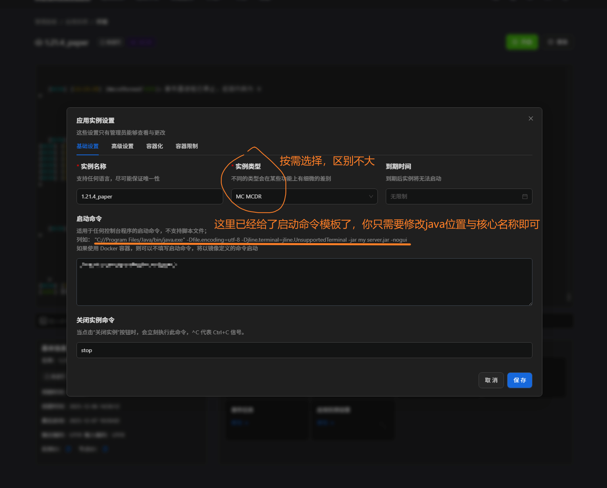
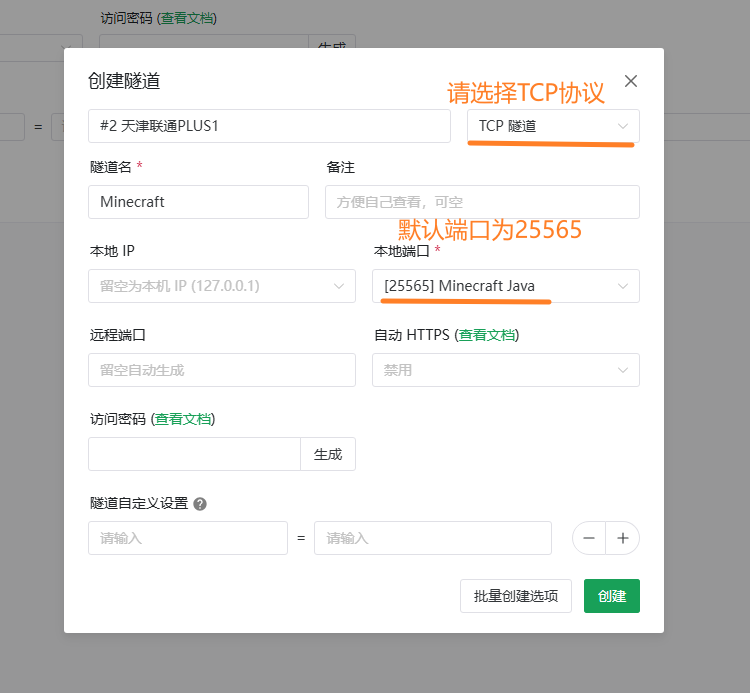
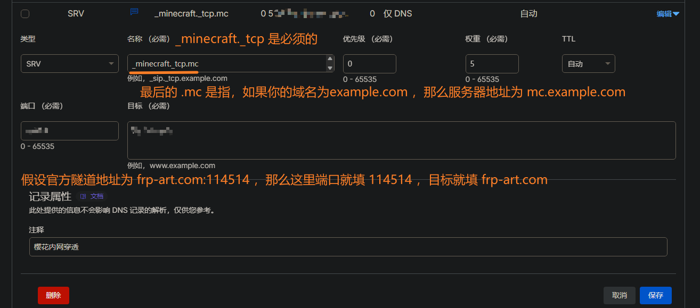

# 简介

本篇文章将从头手把手：

- 通过命令行搭建起 [mcsmanager](https://www.mcsmanager.com/) 服务器面板，依靠它作为服务器终端和文件管理；
- 使用 [樱花内网映射](https://www.natfrp.com/?page=panel&module=addproxy) 服务来做公网地址，仅使用其魔改版 frpc 客户端，通过启动脚本且仅需命令行无需 GUI 使用；
- 并结合自定义域名，设置 SRV 类型 DNS 记录，确定最终的服务器地址。

依据标题所说，目前搭建 Minecraft 服务器最推荐的设备就是 MacMini_M4 了，能耗比几乎拉满；因此本篇教程是针对 arm64 架构的 macOS 系统，且使用默认终端 shell-Zsh 的命令行，真正手把手跑后台，也避免了 GUI 使用不熟练的理解问题。

# MCSManager 面板安装

这是官方文档：[快速开始 | MCSmanager](https://docs.mcsmanager.com/zh_cn/)

官方文档并没有提供 MacOS 系统的教程，但是根据 up 主[一只会魔法的梨](https://space.bilibili.com/52833994) 所发布的视频 [【MC 开服】macOS 如何本地安装 MCSManager](https://www.bilibili.com/video/BV1ykVEzCEni/) 可知，macOS 本身提供了类似 Unix 的命令行环境，只需要提供 Darwin 内核依靠 arm64 的 M4 芯片所需要的依赖，便可以把 Linux 软件移植到 macOS_M4 运行。

下面将结合官方 Linux 教程，下载 arm64_macOS 所需依赖，安装 MCSManager。

## 运行时环境 nodeJS

MCSManager 所需的运行环境，用于构建 web 服务器，便于我们从浏览器操作服务器。

这里是[node 官方的下载页面](https://nodejs.org/en/download)，下面将先安装`Homebrew`：

```zsh
# 这里默认你的macOS没有任何命令行操作历史，因此先安装Homebrew工具
curl -o- https://raw.githubusercontent.com/Homebrew/install/HEAD/install.sh | bash

# 将homebrew添加进Zsh(默认终端)的PATH(环境变量)
echo 'eval "$(/opt/homebrew/bin/brew shellenv)"' >> ~/.zprofile && source ~/.zprofile

#  测试查看brew版本
brew --version
```

参数说明：

- `PATH`环境变量，是针对 macOS 的默认终端`Zsh`，你可以通过`echo $SHELL`来查看当前终端类型；
- `/opt/homebrew/bin/brew`是 M 系列芯片安装的默认位置，Intel 芯片位置可能不同，自行查询；
- `~`代表当前用户，也即此 PATH 只添加到当前用户的`Zsh`终端中

下面是安装 node(包含 npm 包管理器)：

```zsh
# 通过homebrew安装
brew install node@24

# 为node24添加软链接
brew link node@24

# 测试查看node版本
node -v
```

tips：这里已经确保`homebrew`添加进了 PATH 环境变量，由于安装的 node 是具体版本，所以需要手动创建软链接，以便于在终端中使用命令。

## 安装 Java

既然是搭建 Java 的 Minecraft 服务器，那当然需要 Java 了，在官方文档中也提出了某些 Java 版本对应的 Minecraft 版本，这里我只安装 Java17 和 Java21：

```zsh
# 通过brew安装openjdk17
brew install openjdk@17

# 添加软链接
brew link openjdk@17

# 检测版本
java -version

# 安装openjdk21
brew install openjdk@21

# 先取消旧链接，再添加新软链接
brew unlink openjdk@17
brew link openjdk@21

# 检测版本
java -version

# 查看当前Java的绝对路径
ls -l /opt/homebrew/bin/java
# 得到类似信息
lrwxr-xr-x  1 remote  admin  36 Dec  7 17:25 /opt/homebrew/bin/java -> ../Cellar/openjdk@21/21.0.9/bin/java
# 那么你的Java绝对路径为
/opt/homebrew/Cellar/openjdk@21/21.0.9/bin/java
```

学会查看 Java 的绝对路径，后面将使用绝对路径写启动脚本。

## MCSManager 本体

依照官方教程，获取安装包并执行安装脚本：

```zsh
# 前往用户家目录
cd ~

# 获取安装包并解压
curl -O https://github.com/MCSManager/MCSManager/releases/latest/download/mcsmanager_linux_release.tar.gz
tar -xzf mcsmanager_linux_release.tar.gz

# 删除压缩包，进入项目目录
rm mcsmanager_linux_release.tar.gz
cd mcsmanager/

# 为安装脚本授予完全权限并运行
chmod 775 ./install.sh
sh ./install.sh
```

接下来，就需要安装 macOS_M4 所需要的依赖[PTY](https://github.com/MCSManager/PTY)和[Zip-tools](https://github.com/MCSManager/Zip-Tools)：

```zsh
# 前往目标目录
cd ~/mcsmanager/daemon/lib/

# 安装arm64的pty
curl -O https://github.com/MCSManager/PTY/releases/download/latest/pty_darwin_arm64

# 安装arm64的zip-tools
curl -O https://github.com/MCSManager/Zip-Tools/releases/download/latest/file_zip_darwin_arm64
```

下面执行启动脚本，进行测试，(通过`Ctrl+C`来终止)：

- `./start-daemon.sh`
- `./start-web.sh`: 这是官方的 web 页面启动脚本。

由于有两个脚本，所以需要两个终端来执行，这也是官方文档中的最终使用教程。

下面我将两个脚本注册为 launchd 系统服务，长期保持在后台，且自动恢复，实现无痕长期运行。

## launchd 系统服务

我们需要先创建一个日志目录，用来存储脚本的运行消息：

```zsh
# 创建日志目录
mkdir -p ~/mcsmanager/logs

# 创建系统服务plist文件(使用nano编辑器)
sudo nano /Library/LaunchDaemons/com.mcsmanager.daemon.plist
```

`com.mcsmanager.daemon.plist`文件内容大致如下：

```plist
<?xml version="1.0" encoding="UTF-8"?>
<!DOCTYPE plist PUBLIC "-//Apple//DTD PLIST 1.0//EN" "http://www.apple.com/DTDs/PropertyList-1.0.dtd">
<plist version="1.0">
<dict>
    <key>Label</key>
    <string>com.mcsmanager.daemon</string>

    <key>ProgramArguments</key>
    <array>
        <string>这里填写你的start-daemon.sh脚本绝对路径</string>
    </array>

    <key>RunAtLoad</key>
    <true/>

    <key>KeepAlive</key>
    <true/>

    <key>WorkingDirectory</key>
    <string>这里填写你的mcsmanager绝对路径</string>

    <key>EnvironmentVariables</key>
    <dict>
        <key>PATH</key>
        <string>/opt/homebrew/bin:/usr/local/bin:/usr/bin:/bin:/usr/sbin:/sbin</string>
    </dict>

    <key>StandardOutPath</key>
    <string>这里填写你的daemon.log日志文件绝对路径</string>

    <key>StandardErrorPath</key>
    <string>这里填写你的daemon-error.log日志文件绝对路径</string>

    <key>UserName</key>
    <string>这里填写你的服务运行用户名</string>
</dict>
</plist>
```

参数说明(将文件中的中文改成所需参数)，假设我们的用户名是`test`：

- `start-daemon.sh`脚本绝对路径举例：`/Users/test/mcsmanager/start-daemon.sh`
- `mcsmanager`绝对路径举例：`/Users/test/mcsmanager/`
- `daemon.log`日志文件绝对路径举例(上文中已经创建了 logs 用来存储日志)：`/Users/test/mcsmanager/logs/daemon.log`
- `daemon-error.log`日志文件绝对路径举例：`/Users/test/mcsmanager/logs/daemon-error.log`
- 服务运行用户名举例：`test`

创建 web 界面脚本的 plist 服务文件：

```zsh
# 使用nano编辑器编辑文件
sudo nano /Library/LaunchDaemons/com.mcsmanager.web.plist
```

`com.mcsmanager.web.plist`文件内容大致如下，依据上文举例的以`test`用户名为例，请按需调整：

```plist
<?xml version="1.0" encoding="UTF-8"?>
<!DOCTYPE plist PUBLIC "-//Apple//DTD PLIST 1.0//EN" "http://www.apple.com/DTDs/PropertyList-1.0.dtd">
<plist version="1.0">
<dict>
    <key>Label</key>
    <string>com.mcsmanager.web</string>

    <key>ProgramArguments</key>
    <array>
        <string>/Users/test/mcsmanager/start-web.sh</string>
    </array>

    <key>RunAtLoad</key>
    <true/>

    <key>KeepAlive</key>
    <true/>

    <key>WorkingDirectory</key>
    <string>/Users/test/mcsmanager/</string>

    <key>EnvironmentVariables</key>
    <dict>
        <key>PATH</key>
        <string>/opt/homebrew/bin:/usr/local/bin:/usr/bin:/bin:/usr/sbin:/sbin</string>
    </dict>

    <key>StandardOutPath</key>
    <string>/Users/test/mcsmanager/logs/web.log</string>

    <key>StandardErrorPath</key>
    <string>/Users/test/mcsmanager/logs/web-error.log</string>

    <key>UserName</key>
    <string>test</string>
</dict>
</plist>
```

最后，确保服务文件属于 root，并加载配置，启动服务：

```zsh
# 文件所属
sudo chown root:wheel /Library/LaunchDaemons/com.mcsmanager.daemon.plist
sudo chown root:wheel /Library/LaunchDaemons/com.mcsmanager.web.plist

# 加载配置
sudo launchctl load /Library/LaunchDaemons/com.mcsmanager.daemon.plist
sudo launchctl load /Library/LaunchDaemons/com.mcsmanager.web.plist

# 启动服务
sudo launchctl start com.mcsmanager.daemon
sudo launchctl start com.mcsmanager.web

# 查看服务是否运行
sudo launchctl list | grep mcsmanager

# 查看日志
tail -f ~/mcsmanager/logs/daemon.log
tail -f ~/mcsmanager/logs/web.log
```

如果需要停止该服务，请按下列执行：

```zsh
# 先终止服务
sudo launchctl stop com.mcsmanager.daemon
sudo launchctl stop com.mcsmanager.web

# 卸载配置
sudo launchctl unload /Library/LaunchDaemons/com.mcsmanager.daemon.plist
sudo launchctl unload /Library/LaunchDaemons/com.mcsmanager.web.plist
```

## 使用面板搭建服务器

现在我们已经成功部署了 mcsmanager，如果你在使用 MacMini 的 GUI，也就是说你是本机，请在浏览器输入`http://127.0.0.1:23333`访问面板，如果你是远程环境，请自行解决内部网络问题。


在 web 页面内使用 Minecraft 模板创建服务器，都是懒人操作，这里不做详细步骤说明了。


现在假设你已经创建了一个实例并进入了 web 后台页面，你需要对服务器启动命令进行设置。



按照图中的例子，`1.21.4`的 Minecraft 需要`jdk21`版本来运行，内存限制为最小 2G 最高 4G，使用 UTF-8 编码输入输出，且我的服务端核心名为`paper-1.21.4-232.jar`，则启动命令为：
`/opt/homebrew/Cellar/openjdk@21/21.0.9/bin/java -Xms2G -Xmx4G -Dfile.encoding=utf-8 -Dstdout.encoding=utf-8 -Dstderr.encoding=utf-8 -Djline.terminal=jline.UnsupportedTerminal -jar paper-1.21.4-232.jar -nogui`

# 樱花内网穿透

如果你会使用 GUI 来运行官方的启动器客户端，是否有过要保持开启该软件的困扰？

这里将用 frpc 的方式来启用隧道，并将启动脚本注册为系统服务，实现无痕穿透。

这是官方的 frpc 下载页面：[软件下载 | SakuraFrp](https://www.natfrp.com/tunnel/download)

## 创建隧道

进入[官方隧道列表](https://www.natfrp.com/tunnel/)

选择创建隧道，任意选物理位置较近的节点，按照下面的配置：



Minecraft_Java 版服务器，是通过 TCP 协议通信的，比较特殊，端口不进行更改默认为 25565。

## sfrp 命令启用隧道

这里我们是 Mac_mini_M4 硬件，因此选择左侧`macOS Apple Silicon (arm64)`，复制下载链接。

```zsh
# 进入用户家目录，创建SakuraFrp文件夹并进入
cd ~
mkdir sakura_frp
cd sakura_frp/

# 下载樱花官方frpc
curl -O https://nya.globalslb.net/natfrp/client/frpc/0.51.0-sakura-12.3/frpc_darwin_arm64

# 授予执行权限
chmod +x frpc_darwin_arm64

# 添加软链接到Homebrew，注册名为sfrp
# 原因是brew已经在环境变量PATH里了
# 这里的test要替换成你的用户名
ln -s /Users/test/sakura_frp/frpc_darwin_arm64 /opt/homebrew/bin/sfrp

# 检测版本
sfrp -v
```

至此，已经可以使用官方提到的类似格式`frpc -f <访问密钥>:<隧道ID 1>[,隧道ID 2[,隧道ID 3...]]`来启动隧道。
而具体到我们现在的环境，举例密钥为`wdnmdtoken6666666`，隧道 ID1 为`114514`，隧道 ID2 为`114516`，则命令为：

```zsh
# 启用两个隧道
sfrp -f wdnmdtoken6666666:114514,114516
```

这样仍然不能解决该终端需要一直保持开启的痛点，下面将提供一个脚本`start_sfrp.sh`来保存配置，并注册至 launchd，在系统后台自动运行，且如果有新隧道或更换用户，只需要对`start_sfrp.sh`内容进行修改，重载服务配置即可。

## 樱花穿透 launchd 服务

```zsh
# 进入目标路径
cd ~/sakura_frp/

# 创建编辑start_sfrp.sh脚本
nano start_sfrp.sh
```

`start_sfrp.sh`脚本内容大致如下(注意替换`test`用户名)：

```sh
#!/bin/bash

FRPC_PATH="/Users/test/sakura_frp/frpc_darwin_arm64"

ACCESS_KEY="<key>"
TUNNEL_IDS="<tunnel_id>"

exec $FRPC_PATH -f $ACCESS_KEY:$TUNNEL_IDS
```

参数说明：

- `<key>`:替换为你的访问密钥，在[官方后台首页](https://www.natfrp.com/user/)可获得。
- `<tunnel_id>`：替换为你的隧道 ID，访问[官方隧道列表](https://www.natfrp.com/tunnel/)，无需复制，已经展示出来了，例如`114514`和`1114516`；如果你是单隧道，只填写数字即可，如果是多隧道，以英文`,`隔开，例如`TUNNEL_IDS="114514,114516"`。

```zsh
# 添加执行权限
chmod +x start_sfrp.sh

# 创建日志目录
mkdir log

# 创建服务plist文件
sudo nano /Library/LaunchDaemons/com.frp.sfrp.plist
```

`com.frp.sfrp.plist`文件内容大致如下(将`test`替换为你的用户名)：

```plist
<?xml version="1.0" encoding="UTF-8"?>
<!DOCTYPE plist PUBLIC "-//Apple//DTD PLIST 1.0//EN" "http://www.apple.com/DTDs/PropertyList-1.0.dtd">
<plist version="1.0">
<dict>
    <key>Label</key>
    <string>com.frp.sfrp</string>

    <key>ProgramArguments</key>
    <array>
        <string>/Users/test/sakura_frp/start_sfrp.sh</string>
    </array>

    <key>KeepAlive</key>
    <true/>

    <key>RunAtLoad</key>
    <true/>

    <key>StandardOutPath</key>
    <string>/Users/test/sakura_frp/log/sfrp_stdout.log</string>
    <key>StandardErrorPath</key>
    <string>/Users/test/sakura_frp/log/sfrp_stderr.log</string>

    </dict>
</plist>
```

```zsh
# 设置权限
sudo chown root:wheel /Library/LaunchDaemons/com.frp.sfrp.plist

# 加载服务并运行
sudo launchctl load /Library/LaunchDaemons/com.frp.sfrp.plist
sudo launchctl start com.frp.sfrp

# 查看日志
tail -f ~/sakura_frp/log/sfrp_stdout.log
tail -f ~/sakura_frp/log/sfrp_stderr.log
```

此时在[官方隧道列表](https://www.natfrp.com/tunnel/)，可以看到隧道已被启用。

如果你的脚本内容发生更改，请重载 launchd 服务：

```zsh
sudo launchctl stop com.frp.sfrp
sudo launchctl unload /Library/LaunchDaemons/com.frp.sfrp.plist
sudo launchctl load /Library/LaunchDaemons/com.frp.sfrp.plist
sudo launchctl start com.frp.sfrp
```

至此已经可以优雅地进行服务器地址的配置了。

## 服务器地址

使用樱花内网穿透，官方已经提供了一个访问地址了，在[官方隧道列表](https://www.natfrp.com/tunnel/)，点击那个数字，即可复制到服务器地址，类似`frp-art.com:114514`,这个地址已经可以用来连接到服务器了。

如果你拥有一个域名，那么你可以写一条 SRV 类型的 DNS 记录指向你的自定义域名，来作为服务器地址。

下面将以 Cloudflare 的 DNS 为例，创建自定义域名地址：



# 结语

至此，只要你的机器在运行，你随时可以通过 web 面板访问服务器终端，且服务器地址是一直生效的。

现在你就可以优雅地进行宣传服务器了。
