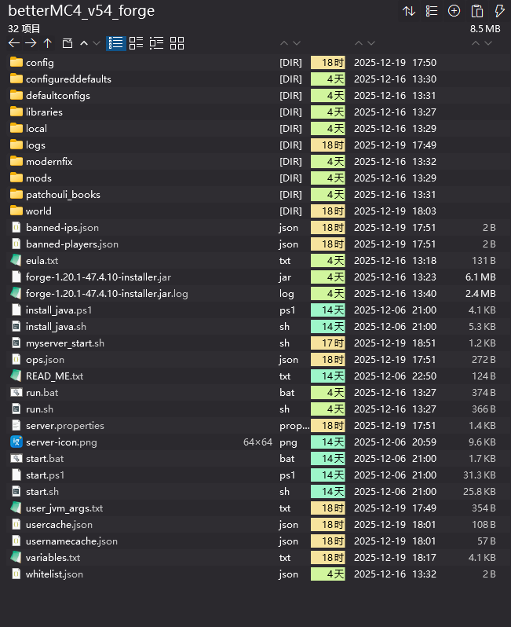

# 前言
之前发布过一篇在MacMini上借助mcsmanager管理Minecraft服务器的文章: [使用MacMini搭建Minecraft服务器](https://blog.srprolin.top/posts/mac-mc-1/) ，但是对于betterMC这样的大型forge整合包，通过JVM运行通常已经很吃内存了。

又因为实测下来mcsmanager的管理操作其实并不是很好用，他在指令层也会套一层壳，这导致我前段时间误判了服务端JVM已经关闭，但是其并没有释放，在查看硬件后台之后才发现同时运行了多个JVM，导致负载极高且卡顿。

鉴于mcsmanager的操作并不顺手，且Node.js的后端也同样吃不少内存(相对于要开服务器的16G丐版Mini)，且存在一定的内存泄漏风险，我决定放弃mcsmanager的方案。

这篇文章将Minecraft服务端启动脚本(自制)写入launchd守护进程，使用rcon远程控制台向服务器发送指令，一切行为经过命令行。

# BetterMC整合包
我们这里安装的服务端，可以说是私人型服务器，即对外不公开地址，仅朋友间游玩整合包使用，因此也选择了较为经典的原版增强型整合包，且使用forge核心，这是一个相当吃配置的选择，但也能印证方案可行性。

下面是一些相关链接：
- [BetterMC官方网站](https://better-mc.com/)
- [CurseForge描述页](https://www.curseforge.com/minecraft/modpacks/better-mc-forge-bmc4)
- [Modrinth描述页](https://modrinth.com/modpack/better-mc-forge-bmc4) | 这里目前只更新到v43,而最新版为v54
- [最新v54版本整合包客户端下载链接](https://www.curseforge.com/minecraft/modpacks/better-mc-forge-bmc4/files/7299697)
- [最新v54版本整合包服务端下载链接](https://www.curseforge.com/minecraft/modpacks/better-mc-forge-bmc4/files/7303630)

这里建议先用Windows下载一份服务端，至于客户端整合包导入这里不多赘述，会的都会了。

## 服务端初始化
该整合包的服务端是由[ServerPackCreator](https://serverpackcreator.de/#/)工具制作的，且mojang也不允许二次分发Minecraft相关文件，所以该服务端在初始启动时是需要下载模组等，客户端导入时同理。

这里建议将服务端先下载到PC，解压后进行初始化操作，由于模组源来自 curseforge ，因此需要自行解决网络环境。

解压后如图中所示：


根据 READ_ME 文件，我们可以找到官方向导地址：https://github.com/chorbintime/LPS-readme/wiki/1.20.1

官方提供了安装Java的脚本：`install_java.ps1`和`install_java.sh`

但相信大家都提前安装过了Java，所以我们打开`variables.txt`文件，将跳过Java版本检测设置为true并手动设置自己的Java路径。

文件在顶部注释中已经说明了Windows的路径写法，可参考如下文件：

```txt
    ###
    # Remember:
    #   Escape \ and : in your Java path on Windows with another \
    #   Example:
    #     From: C:\Program Files\Eclipse Adoptium\jdk-17.0.9.9-hotspot\bin\java.exe
    #     To:   C\:\\Program Files\\Eclipse Adoptium\\jdk-17.0.9.9-hotspot\\bin\\java.exe
    #   More on escape characters at https://en.wikipedia.org/wiki/Escape_character
    # ......
    ###
    MINECRAFT_VERSION=1.20.1
    MODLOADER=Forge
    MODLOADER_VERSION=47.4.10
    LEGACYFABRIC_INSTALLER_VERSION=1.1.0+1
    FABRIC_INSTALLER_VERSION=1.1.0
    QUILT_INSTALLER_VERSION=0.12.1
    RECOMMENDED_JAVA_VERSION=1.20.1
    JAVA_ARGS="-Xmx4G -Xms4G"
 -- JAVA="java"
 ++ JAVA=D:\\Program Files\\zulu17.62.17-ca-jdk17.0.17-win_x64\\bin\\java.exe
    WAIT_FOR_USER_INPUT=true
    ADDITIONAL_ARGS=-Dlog4j2.formatMsgNoLookups=true
    RESTART=false
 -- SKIP_JAVA_CHECK=false
 ++ SKIP_JAVA_CHECK=true
    JDK_VENDOR=graalvm
    JABBA_INSTALL_URL_SH=https://github.com/Jabba-Team/jabba/raw/main/install.sh
    JABBA_INSTALL_URL_PS=https://github.com/Jabba-Team/jabba/raw/main/install.ps1
    JABBA_INSTALL_VERSION=0.13.0
    SERVERSTARTERJAR_FORCE_FETCH=true
    SERVERSTARTERJAR_VERSION=latest
    USE_SSJ=true
```

随后在Windows环境下，直接双击`start.bat`启动脚本，进行初始化下载。

等待过后键入`list`命令看到如下输出，说明启动成功：
```zsh
> list
There are 0 of a max of 20 players online:
```

文件结构应当如下所示，`myserver_start.sh`是我们稍后要编写的启动脚本：



# 通过Launchd和rcon管理整合包服务器

官方启动脚本过于繁琐，有较多的检测机制，因此我只用于初始化安装必要的文件，而实际的启动用到更简洁的自编写脚本，`myserver_start.sh`(适用于Linux和macOS)，修改自[MineKuai_Wiki](https://docs.liuliyue.cn/games/mcje/introduction/server-jvm-optimization.html#%F0%9F%94%A7-forge-%E6%9C%8D%E5%8A%A1%E5%99%A8%E4%BC%98%E5%8C%96)：
```sh
#!/bin/bash

SERVER_DIR="your/server/path"
JAVA_EXEC="your/java/path"
MEMORY="8G"

JAVA_ARGS="-server -Xms${MEMORY} -Xmx${MEMORY} -XX:+UseG1GC -XX:+ParallelRefProcEnabled -XX:MaxGCPauseMillis=200 -XX:+UnlockExperimentalVMOptions -XX:+DisableExplicitGC -XX:+AlwaysPreTouch -XX:G1NewSizePercent=20 -XX:G1MaxNewSizePercent=40 -XX:G1HeapRegionSize=16M -XX:G1ReservePercent=20 -XX:G1HeapWastePercent=5 -XX:G1MixedGCCountTarget=4 -XX:InitiatingHeapOccupancyPercent=15 -XX:G1MixedGCLiveThresholdPercent=90 -XX:SurvivorRatio=32 -XX:MaxTenuringThreshold=1 -XX:+UseStringDeduplication -XX:+UseCompressedOops -XX:+UseCompressedClassPointers -Dfml.readTimeout=180 -Dfml.debugRegistryEntries=true -Dfile.encoding=UTF-8"

FORGE_UNIX_ARGS="libraries/net/minecraftforge/forge/1.20.1-47.4.10/unix_args.txt"

cd "${SERVER_DIR}" || exit 1
echo "Starting Minecraft server..."

exec "${JAVA_EXEC}" ${JAVA_ARGS} @"${FORGE_UNIX_ARGS}" nogui
```
注意：
- 请将SERVER_DIR变量更改为你的服务器目录值
- 请将JAVA_EXEC变量更改为你将使用的JAVA路径值
- JAVA的安装和路径查找请到上篇文章 [使用MacMini搭建Minecraft服务器](https://blog.srprolin.top/posts/mac-mc-1/) 中自行查找

随后我们可以将整个文件夹打包，上传至MacMini的SERVER_DIR目录并解压。

## launchd守护进程

我们这里选择使用系统服务，即在`/Library/LaunchDaemons/`下创建`com.betterMCv54.plist`文件：
```zsh
# 创建并编辑plist文件
sudo nano /Library/LaunchDaemons/com.betterMCv54.plist
```
文件内容大致如下：
```plist
<?xml version="1.0" encoding="UTF-8"?>
<!DOCTYPE plist PUBLIC "-//Apple//DTD PLIST 1.0//EN" "http://www.apple.com/DTDs/PropertyList-1.0.dtd">
<plist version="1.0">
<dict>
    <key>Label</key>
    <string>com.betterMCv54</string>

    <key>UserName</key>
    <string>YOUR_USERNAME</string>

    <key>ProgramArguments</key>
    <array>
        <string>/bin/bash</string>
        <string>/YOUR/PATH/TO/SERVER_DIR/myserver_start.sh</string>
    </array>

    <key>WorkingDirectory</key>
    <string>/YOUR/PATH/TO/SERVER_DIR</string>

    <key>RunAtLoad</key>
    <true/>

    <key>KeepAlive</key>
    <dict>
        <key>SuccessfulExit</key>
        <false/>
    </dict>

    <key>ProcessType</key>
    <string>Interactive</string>
</dict>
</plist>
```
请注意：
- 将`YOUR_USERNAME`替换为你的当前用户名
- 将`/YOUR/PATH/TO/SERVER_DIR`(文件中有两处)替换为你具体的`SERVER_DIR`的绝对路径

确保权限正确：
```zsh
sudo chown root:wheel /Library/LaunchDaemons/com.betterMCv54.plist
sudo chmod 644 /Library/LaunchDaemons/com.betterMCv54.plist
```

加载配置，并启用服务(即开服)：
```zsh
sudo launchctl load /Library/LaunchDaemons/com.betterMCv54.plist
sudo launchctl start com.betterMCv54

# 如果在启用服务后修改了配置文件，请确保游戏服务器停止后，停止服务，并重载配置
sudo launchctl stop com.betterMCv54
sudo launchctl unload /Library/LaunchDaemons/com.betterMCv54.plist
sudo launchctl load /Library/LaunchDaemons/com.betterMCv54.plist
```

## 使用rcon工具向服务器发送指令
Minecraft服务器默认不开启rcon功能，我们需要到`SERVER_DIR`的`server.properties`文件中修改，默认端口为25575：
```properties
    #Minecraft server properties
    #Mon Jun 03 21:13:36 CDT 2024
    allow-flight=true
    allow-nether=true
    broadcast-console-to-ops=true
    broadcast-rcon-to-ops=true
    difficulty=normal
    enable-command-block=true
    enable-jmx-monitoring=false
    enable-query=false
 -- enable-rcon=false
 ++ enable-rcon=true
    enable-status=true
    enforce-secure-profile=true
    enforce-whitelist=false
    entity-broadcast-range-percentage=100
    force-gamemode=false
    function-permission-level=2
    gamemode=survival
    generate-structures=true
    generator-settings={}
    hardcore=false
    hide-online-players=false
    initial-disabled-packs=
    initial-enabled-packs=vanilla
    level-name=world
    level-seed=
    level-type=bclib\:normal
    max-chained-neighbor-updates=1000000
    max-players=20
    max-tick-time=60000
    max-world-size=29999984
    motd=Better MC [FORGE] 1.20.1
    network-compression-threshold=256
    online-mode=true
    op-permission-level=4
    player-idle-timeout=0
    prevent-proxy-connections=false
    pvp=true
    query.port=25565
    rate-limit=0
 -- rcon.password=
 ++ rcon.password=yourpassword
    rcon.port=25575
    require-resource-pack=false
    resource-pack=
    resource-pack-prompt=
    resource-pack-sha1=
    server-ip=
    server-port=25565
    simulation-distance=10
    spawn-animals=true
    spawn-monsters=true
    spawn-npcs=true
    spawn-protection=16
    sync-chunk-writes=true
    text-filtering-config=
    use-native-transport=true
    view-distance=10
    white-list=false
```
请注意：
- 将`yourpassword`改为你的密码，确保不要泄露，下面的rcon-cli使用中，也替换为你的密码。

我们选择的远程控制台工具为[rcon-cli](https://github.com/gorcon/rcon-cli/releases)，一款命令行rcon工具。
```zsh
# 回到用户目录
cd ~

# 从GitHub下载rcon-cli并解压，简化路径
curl -O https://github.com/gorcon/rcon-cli/releases/download/v0.10.3/rcon-0.10.3-arm64_darwin.tar.gz
tar -zxvf rcon-0.10.3-arm64_darwin.tar.gz
mv rcon-0.10.3-arm64_darwin.tar.gz rcon

# 进入应用目录并添加环境变量
cd rcon
echo 'export PATH="$PATH:/Users/remote/rcon"' >> ~/.zprofile && source ~/.zprofile

# 检测版本，验证环境变量
rcon --version

# 单行使用
rcon -a localhost:25575 -p yourpassword
```

为了使用方便，我们可以编辑`rcon.yaml`文件，编写默认的主机地址和密码：
```zsh
# 前往rcon目录
cd ~/rcon/

# 编辑rcon.yaml
nano rcon.yaml
```
内容大致如下：
```yaml
default:
  address: "localhost:25575" # host:port, for example 127.0.0.1:16260
  password: "yourpassword"
  log: "rcon-default.log"
  type: "" # rcon, telnet, web.
  timeout: "10s"
```
这样设置后的使用流程就为：
```zsh
# 进入rcon目录，执行rcon命令即可进入rcon控制台
cd ~/rcon
rcon

# 使用举例
username@192 ~ % cd ~/rcon
username@192 rcon % rcon
Waiting commands for localhost:25575 (or type :q to exit)
> list
There are 0 of a max of 20 players online:
> :q
username@192 rcon %
```

## 服务器关服与重启

这里我们将MacMini作为服务器使用，那么硬件机器是长期保持运行的，而macOS的自动休眠机制经常会阻止这样的行为，因此我们使用caffeinate声称一个重要进程，进而阻止休眠。

依旧使用launchd守护进程：
```zsh
# 创建并编辑plist
sudo nano /Library/LaunchDaemons/local.caffeinate.plist
```
内容大致如下(参数选择为`-ims`这里不添加`-d`参数是防止显示器不会自动熄屏)：
```plist
<?xml version="1.0" encoding="UTF-8"?>
<!DOCTYPE plist PUBLIC "-//Apple//DTD PLIST 1.0//EN" "http://www.apple.com/DTDs/PropertyList-1.0.dtd">
<plist version="1.0">
<dict>
    <key>Label</key>
    <string>local.caffeinate</string>
    <key>ProgramArguments</key>
    <array>
        <string>/usr/bin/caffeinate</string>
        <string>-ims</string>
    </array>
    <key>RunAtLoad</key>
    <true/>
    <key>KeepAlive</key>
    <true/>
    <key>UserName</key>
    <string>root</string>
</dict>
</plist>
```
给予权限并加载运行：
```zsh
sudo chown root:wheel /Library/LaunchDaemons/local.caffeinate.plist
sudo chmod 644 /Library/LaunchDaemons/local.caffeinate.plist
sudo launchctl load /Library/LaunchDaemons/local.caffeinate.plist
sudo launchctl start local.caffeinate
```

对于长期运行的硬件而言，我们的`com.betterMCv54`服务也是一直存在的，除非我们`stop`这个服务(这里是针对launchd守护进程)。

正确的关服，只需要通过rcon向服务器发送`stop`指令，游戏服务器便会保存当前世界数据。

服务器重新启动，只需要在命令行唤醒服务，触发脚本即可：`sudo launchctl start com.betterMCv54`。