# 相关链接
- [MSYS2官方文档](https://www.msys2.org/)
- [VScode官网](https://code.visualstudio.com/)

# MSYS2+VScode安装与配置
前往[MSYS2官方文档](https://www.msys2.org/)和[VScode官网](https://code.visualstudio.com/)下载安装包，并进行安装(推荐安装路径均为默认)。

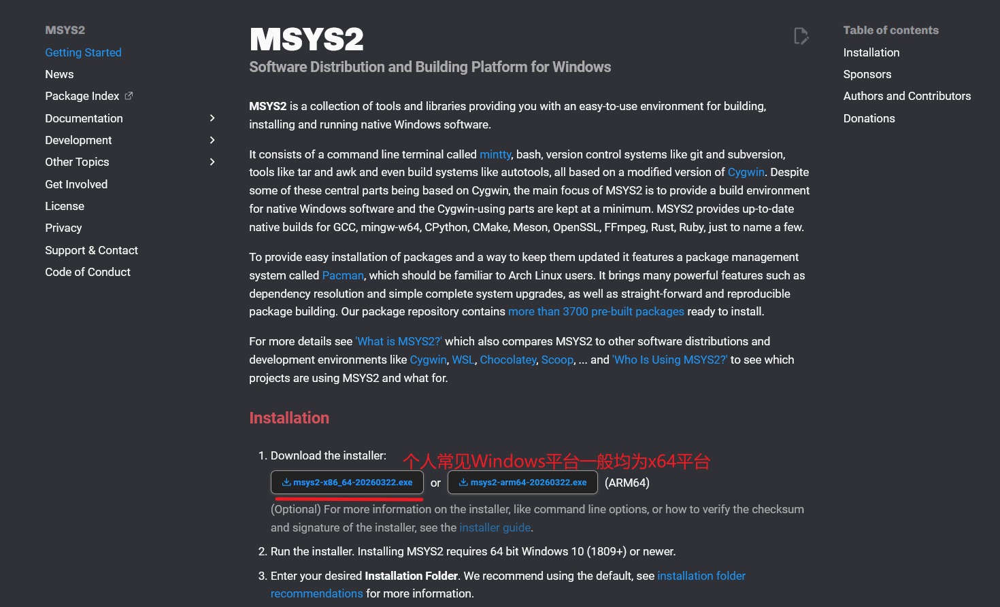

## VScode常用插件(拓展)与设置
建议登录一个Microsoft微软或GitHub账户，用于开启**同步设置**，并在**默认配置文件**或**新建配置文件**中进行常用设置，后面根据语言可以新建配置文件复制通用配置，再安装对应的拓展，进行拓展分离。

VScode设置(`settings.json`)文件内容：
```jsonc
{
  // 自动保存文件
  "files.autoSave": "afterDelay",
  // 自动猜测文件编码
  "files.autoGuessEncoding": true,
  // 列表、光标移动、编辑器、光标闪烁样式平滑
  "workbench.list.smoothScrolling": true,
  "editor.cursorSmoothCaretAnimation": "on",
  "editor.smoothScrolling": true,
  "editor.cursorBlinking": "smooth",
  // 按住 Ctrl 滚轮缩放编辑器字体
  "editor.mouseWheelZoom": true,
  // 粘贴、输入、保存时自动格式化
  "editor.formatOnPaste": true,
  "editor.formatOnType": true,
  "editor.formatOnSave": true,
  // 自动换行(避免横向滚动条)
  "editor.wordWrap": "on",
  // 括号配对引导线
  "editor.guides.bracketPairs": true,
  // 允许代码片段触发快速建议
  "editor.suggest.snippetsPreventQuickSuggestions": false,
  // 回车键智能接受建议（仅当没有其他文本建议时）
  "editor.acceptSuggestionOnEnter": "smart",
  // 建议列表优先显示最近使用的项
  "editor.suggestSelection": "recentlyUsed",
  // 使用自定义对话框样式
  "window.dialogStyle": "custom",
  // 在概览标尺中显示断点
  "debug.showBreakpointsInOverviewRuler": true,
}
```
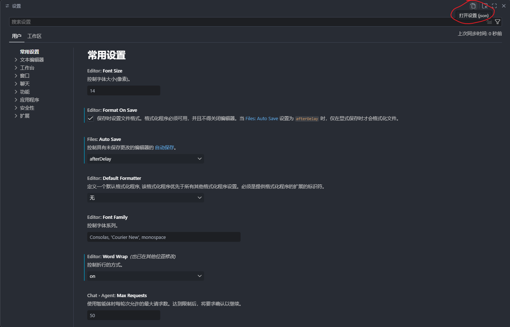

打开VScode设置(`Ctrl+,`)后，点击打开`json`文件，即可粘贴设置；下面是一些常用拓展：
1. [Chinese (Simplified) (简体中文) Language Pack for Visual Studio Code](https://marketplace.visualstudio.com/items?itemName=MS-CEINTL.vscode-language-pack-zh-hans)：简中语言包。
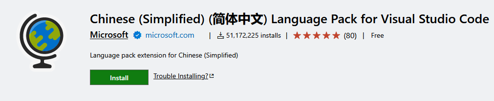
2. [Hex Editor](https://marketplace.visualstudio.com/items?itemName=ms-vscode.hexeditor)：16进制文件查看编辑器。

3. [Error Lens](https://marketplace.visualstudio.com/items?itemName=usernamehw.errorlens)：报错高亮。
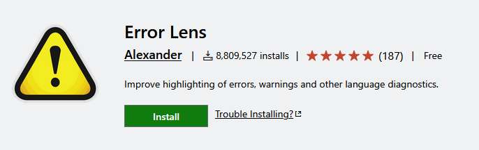
4. [GBK to UTF8 for vscode](https://marketplace.visualstudio.com/items?itemName=buuug7.GBK2UTF8)：编码格式快速转换。

5. [Doxygen Documentation Generator](https://marketplace.visualstudio.com/items?itemName=cschlosser.doxdocgen)：注释生成器。
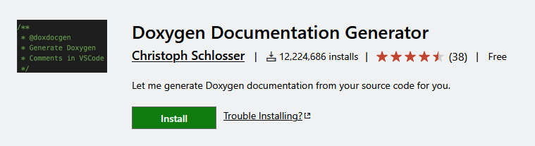
6. [Hungry Delete](https://marketplace.visualstudio.com/items?itemName=jasonlhy.hungry-delete)：快速删除空行、缩进。

7. [Image preview](https://marketplace.visualstudio.com/items?itemName=kisstkondoros.vscode-gutter-preview)：图片预览器。
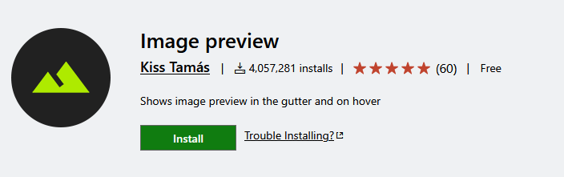
8. [Material Icon Theme](https://marketplace.visualstudio.com/items?itemName=PKief.material-icon-theme)：文件Icon主题美化。

9. [One Dark Pro](https://marketplace.visualstudio.com/items?itemName=zhuangtongfa.Material-theme)：VScode编辑器主题美化。
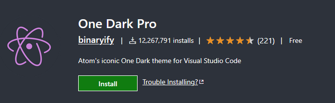
10. [Path Intellisense](https://marketplace.visualstudio.com/items?itemName=christian-kohler.path-intellisense)：路径补全。
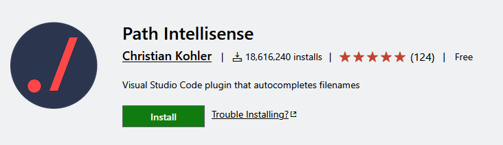
11. [Prettier - Code formatter](https://marketplace.visualstudio.com/items?itemName=esbenp.prettier-vscode)：代码格式自动优化。

12. [Remote - SSH](https://marketplace.visualstudio.com/items?itemName=ms-vscode-remote.remote-ssh)：SSH链接远程项目地址，似本地一般的编辑体验。
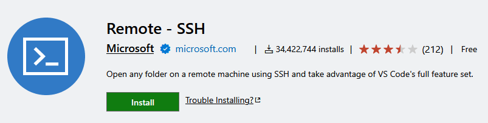
13. [WakaTime](https://marketplace.visualstudio.com/items?itemName=WakaTime.vscode-wakatime)：代码编辑时间统计，需要登录。


## MSYS2安装MinGW工具链

在[MSYS2文档中](https://www.msys2.org/docs/ides-editors/)，提供了将MSYS2终端集成到VScode的方法，便是在`settings.json`文件中添加如下字段：
```jsonc
// 注意最外层大括号已在settings.json中存在
// 注意该配置的路径为默认安装路径
{
    "terminal.integrated.profiles.windows": {
        "MSYS2 UCRT": {
            "path": "cmd.exe",
            "args": [
                "/c",
                "C:\\msys64\\msys2_shell.cmd -defterm -here -no-start -ucrt64"
            ]
        }
    }
}
```
随后便可在VScode中打开MSYS2终端, 除此之外也可以在Windows搜索中输入`ucrt`打开终端：

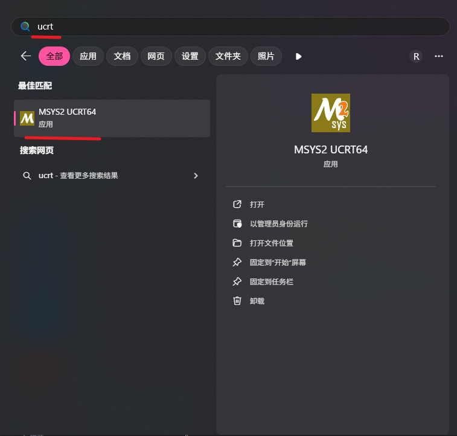

在终端中输入如下命令即可安装工具链：
```bash
# 下载安装
pacman -S mingw-w64-ucrt-x86_64-gcc mingw-w64-ucrt-x86_64-gdb mingw-w64-ucrt-x86_64-make mingw-w64-ucrt-x86_64-cmake ninja
# 版本检查
gcc -v
gdb -v
mingw32-make --version
cmake --version
ninja --version
```

# C/Cpp环境配置
打开VSCODE，创建配置文件，复制继承上文中的通用配置，随后激活后，在拓展中安装：
- [C/C++](https://marketplace.visualstudio.com/items?itemName=ms-vscode.cpptools)
- [C/C++ Extension Pack](https://marketplace.visualstudio.com/items?itemName=ms-vscode.cpptools-extension-pack)
- [C/C++ Themes](https://marketplace.visualstudio.com/items?itemName=ms-vscode.cpptools-themes)
- [C/C++ DevTools](https://marketplace.visualstudio.com/items?itemName=ms-vscode.cpp-devtools)
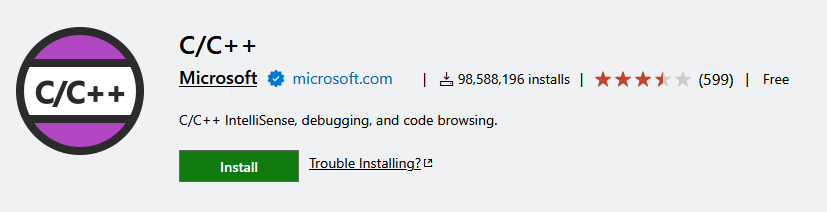
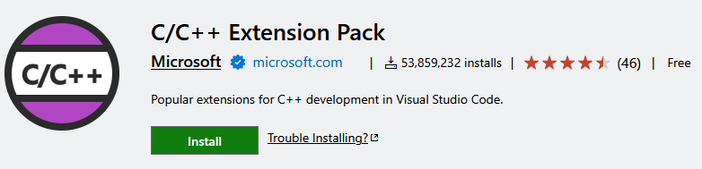
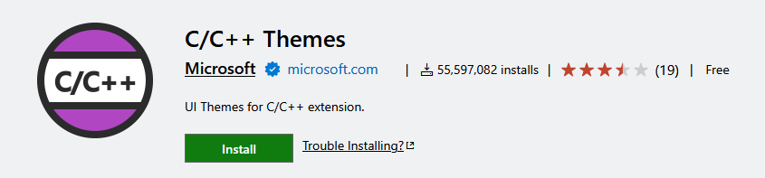


由于上文已经安装了MinGW工具链，因此拓展会自动寻找环境变量中的gcc编译器，MSYS2安装在默认位置下便无需手动配置路径了。

# Stm32环境配置
- [Stm32CubeIDE](https://www.st.com.cn/zh/development-tools/stm32cubeide.html#section-get-software-table)
- [Stm32CubeMX](https://www.st.com/en/development-tools/stm32cubemx.html#get-software)

一般来说，[Stm32CubeIDE](https://www.st.com.cn/zh/development-tools/stm32cubeide.html#section-get-software-table)已经为我们解决了所有环境问题，但现在，我们有了 [STM32CubeIDE-for-Visual-Studio-Code](https://marketplace.visualstudio.com/items?itemName=stmicroelectronics.stm32-vscode-extension)，这使得我们完全可以在VSCode中实现Stm32的开发调试烧录全流程，只需要安装这一套插件，再另外安装[Stm32CubeMX](https://www.st.com/en/development-tools/stm32cubemx.html#get-software)来创建工程即可。

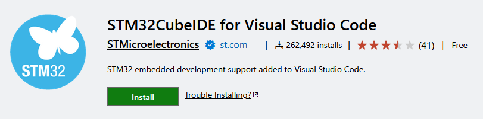

同样的，我们已在前文中配置好了gcc、cmake等工具链，拓展在安装完必要的组件后，会自行查找所需工具路径，现在点击左侧小蝴蝶，就能用上完全的Stm32CubeIDE功能了。
