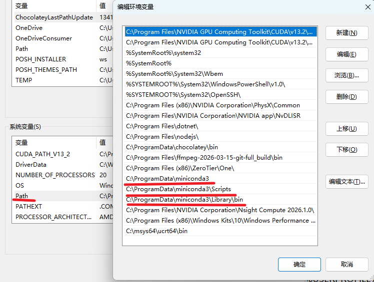
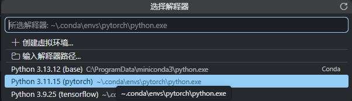
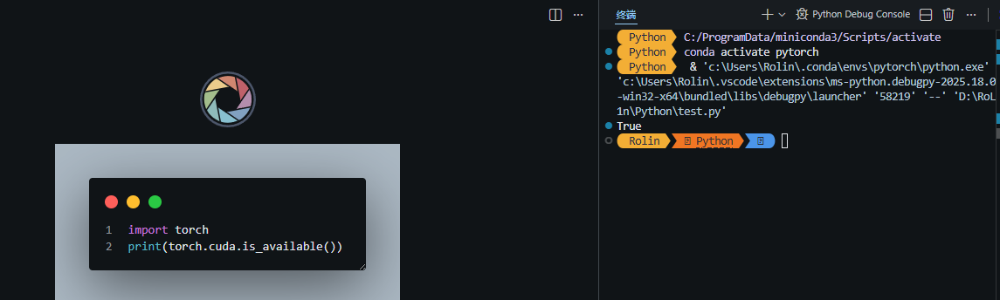
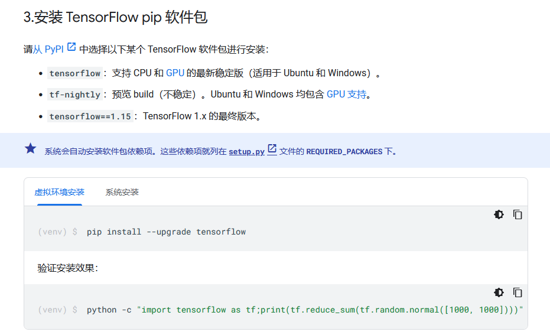
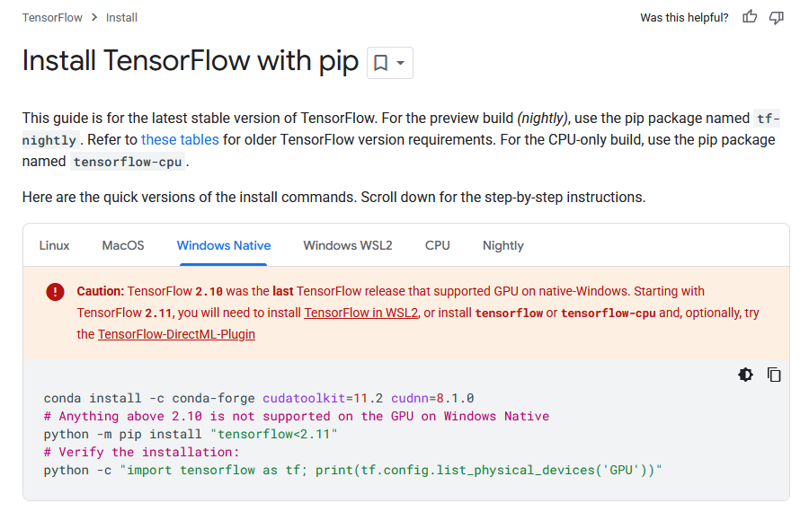

# 相关链接与前情提要
- [Anaconda](https://www.anaconda.com/download/success?reg=skipped)
- [Pytorch](https://pytorch.org/get-started/locally/)
- [Tensorflow](https://www.tensorflow.org/install/pip?hl=zh-cn#windows)

Pytorch是一个深度学习框架，一般使用Python语言进行调用；

Anaconda是一个Python版本、包管理工具，可以在一台机器上创建多个conda环境，每个conda环境使用不同的Python版本和包，而pytorch就是一个包；

Cuda是NVIDIA推出的并行计算平台和编程模型，安装NVIDIA显卡驱动，即可自带所支持的Cuda。对于pytorch等深度学习框架来说，就是可以加速计算、训练。
# 使用anaconda管理python版本

进入 [Anaconda下载地址](https://www.anaconda.com/download/success?reg=skipped)，这里下载miniconda即可，只是用到conda来管理环境，安装过后添加系统环境变量：



conda相关命令：
```pwsh
# 检查当前的conda环境(默认创建了base环境，搭配了最新版本的Python解释器)
conda env list
# 创建新的conda环境(以python3.11的"pytorch"环境为例)("pytorch"为conda环境名)
conda create -n pytorch python=3.11 -y
# 激活(进入)目标环境"pytorch"
conda activate pytorch
# 检查当前环境中的包、库(会列出通过conda、pip安装的包、库)
conda list
# 删除目标环境("pytorch"为例)
conda env remove -n pytorch
```

# Pytorch-GPU 安装
Pytorch-GPU版需要拥有NVIDIA支持Cuda的显卡，可以用该命令检查是否安装NVIDIA驱动和Cuda版本：`nvidia-smi`

进入[Pytorch快速开始页面](https://pytorch.org/get-started/locally/)，选择 **Stable**->**Windows**->**Pip**->**Python**->**(选择≤你的Cuda版本号)**，复制命令。

回到powershell终端，进入创建好的pytorch虚拟环境(`conda activate pytorch`)，输入命令安装即可(Cuda13为例)：`pip install torch torchvision --index-url https://download.pytorch.org/whl/cu130`

## 在Vscode中验证Pytorch-GPU可用性

编辑一个python文件(test.py)，根据VScode提示安装Python拓展包:
```py
import torch
print(torch.cuda.is_available())
```

按下`Ctrl`+`Shift`+`P`打开命令面板，输入`python: select interpreter`，选择到conda虚拟环境**pytorch**中的python3.11解释器。



按下`F5`，进行调试，或者`Ctrl`+`F5`直接运行，将看到如下结果，`True`即表明Pytorch-GPU安装成功。



# TensorFlow-GPU 安装
这里针对Windows Native的NVIDIA显卡版本的TensorFlow，幽默的是，在 [TensorFlow的中文安装页面](https://www.tensorflow.org/install/pip?hl=zh-cn#windows) 中，提示安装的TensorFlow2是CPU、GPU混合最新版本：`pip install --upgrade tensorflow`

而TensorFlow对Windows原生NVIDIA显卡支持的GPU版最终版本是TensorFlow2.10, 最新版本在笔者此时已经是2.21了，绝对不可能支持Cuda；但将该页面改为[英文指引](https://www.tensorflow.org/install/pip#windows-native)，却赫然写明了 **TensorFlow 2.10 was the last TensorFlow release that supported GPU on native-Windows.** 这让不少人踩了坑。





那么我们便按照 [英文指引](https://www.tensorflow.org/install/pip#windows-native) 来安装tensorflow-gpu版：
1. 创建conda环境：`conda create -n tf python=3.9 -y`
2. 激活conda环境：`conda activate tf`
3. 安装cuda和cuDNN：`conda install -c conda-forge cudatoolkit=11.2 cudnn=8.1.0`
4. 安装TensorFlow：`pip install "tensorflow<2.11" `
5. 验证CPU配置：`python -c "import tensorflow as tf; print(tf.reduce_sum(tf.random.normal([1000, 1000])))"
`
6. 验证GPU配置：`python -c "import tensorflow as tf; print(tf.config.list_physical_devices('GPU'))"
`

在验证安装环节，由于tensorflow2.10是使用的numpy1.x，而笔者此时miniconda自带的是numpy2.x，遇到报错，只需要对numpy进行降级：`pip install "numpy<2"`

下面给出笔者的验证响应，说明笔者已经成功安装：
```pwsh
# CPU配置
tf.Tensor(-1373.9692, shape=(), dtype=float32)
# GPU配置
[PhysicalDevice(name='/physical_device:GPU:0', device_type='GPU')]
```