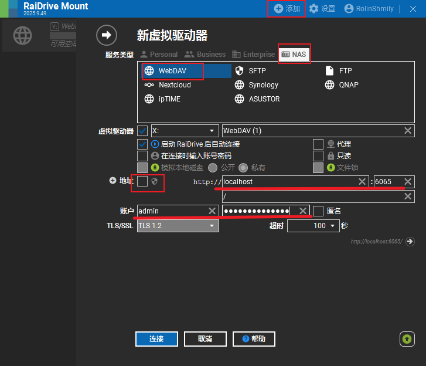

# 前言

这是继上一篇关于 SMB 的续集，因其仅内网性，而虚拟局域网的不稳定性，也促使我去选择另一种文件共享协议，即 webDAV。

可以借助 RaiDrive 实现挂载盘符，同时使用 GitHub 上的开源 webDAV 服务端，避免了 Windows 自带的 IIS 的繁琐配置。

使用到的外链：

- [RaiDrive 官网](https://www.raidrive.com/)
- [hacdias/webdav 项目](https://github.com/hacdias/webdav)

# webdav 服务端的安装与配置

前往 [hacdias/webdav 项目](https://github.com/hacdias/webdav) 的 Release 页，以 Windows 系统为例，安装对应的 amd64 版本。

演示安装目录：`E:\Program Files\webdav`

根据官方的 README 文件，需要自行创建`config.yaml`来进行配置，下面是官方配置的 AI 翻译版：

```yaml
# 监听地址：0.0.0.0 表示允许局域网或内网穿透流量访问
address: 0.0.0.0
# WebDAV 服务在本地运行的端口
port: 6065

# TLS 相关设置。如果你不配置域名证书，请保持 false
tls: false
cert: cert.pem
key: key.pem

# WebDAV 路径前缀。默认为 '/'。如果是 '/share'，访问地址需加上该后缀
prefix: /

# 是否启用调试日志。默认 'false'
debug: false

# 是否禁用探测文件内容类型。默认 'false'
noSniff: false

# 服务端是否运行在受信任的代理之后（如 Nginx）。
# 开启后将使用 X-Forwarded-For 记录真实的远程访问地址。
behindProxy: false

# 默认共享目录：当用户没有单独定义 directory 时使用此路径。
# '.' 代表当前可执行文件所在的目录。你可以改为具体路径，如 "D:/MyShare"
directory: .

# 默认权限设置（不区分大小写）。
# C (创建), R (读取), U (更新/修改), D (删除)。
# 如果只想让朋友看和下，设为 "R"；如果需要他能上传和改名，设为 "CRUD"。
permissions: R

# 默认权限规则。规则从下往上应用（最后一条匹配的规则生效）。
# 路径始终相对于用户的根目录。
rules: []

# 用户规则的叠加行为：
# - overwrite: 用户定义的规则将覆盖全局规则。
# - append: 用户的规则将附加在全局规则之后。
rulesBehavior: overwrite

# 日志配置
log:
  # 日志格式 ('console' 易读, 'json' 适合分析)。
  format: console
  # 是否开启彩色打印。
  colors: true
  # 日志输出位置，默认为标准错误流 'stderr'。
  outputs:
    - stderr

# CORS 跨域配置（如果你使用网页版客户端访问，需要开启）
cors:
  enabled: true
  credentials: true
  allowed_headers:
    - Depth
  allowed_hosts:
    - http://localhost:8080
  allowed_methods:
    - GET
  exposed_headers:
    - Content-Length
    - Content-Range

# 用户列表。如果列表为空，则不启用身份验证（不安全）。
# 否则，将自动配置基础身份验证 (Basic Auth)。
users:
  # 示例管理员账号 (明文密码)
  - username: admin
    password: YourStrongPassword # 建议修改此密码
    permissions: CRUD # 管理员通常拥有完全权限

  # 示例普通用户 'john'，使用了 bcrypt 加密密码，并指定了专属目录
  - username: john
    password: "{bcrypt}$2y$10$zEP6oofmXFeHaeMfBNLnP.DO8m.H.Mwhd24/TOX2MWLxAExXi4qgi"
    directory: D:/JohnsFiles # 这里必须是绝对路径或有效的相对路径

  # 从系统环境变量中读取用户名和密码的示例
  - username: "{env}ENV_USERNAME"
    password: "{env}ENV_PASSWORD"

  # 具有细分权限规则的用户示例
  - username: basic
    password: basic
    permissions: CRUD # 基础权限是全开
    rules:
      # 禁止该用户访问 /some/file 路径
      - path: /some/file
        permissions: none
      # 允许该用户在 /public/access/ 目录下进行增删改查
      - path: /public/access/
        permissions: CRUD
      # 允许该用户读取和更新所有以 .js 结尾的文件（使用正则表达式）
      - regex: "^.+.js$"
        permissions: RU
```

这里给到我的简易配置：

```yaml
address: 0.0.0.0
port: 6065
tls: false

cors:
  enabled: false

prefix: /
directory: ./MyShare

log:
  format: console
  colors: true
  outputs:
    - stderr

rulesBehavior: overwrite
users:
  # 管理员
  - username: admin
    password: password # 建议修改此密码
    permissions: CRUD # 管理员通常拥有完全权限
  # 其他用户
  - username: user
    password: user
    permissions: R
    directory: ./MyShare/User
```

注意：

- 确保你的根目录下有**MyShare**和**MyShare/User**文件夹，且该文件夹权限为全部(支持读写)。
- 请考虑修改你的管理员用户名和密码。

随后双击程序**webdav.exe**，可以通过`http://localhost:6065`检验是否成功运行。

为了无痛无感启动，可以编写一个`start_webdav.vbs`脚本：

```vbs
CreateObject("Wscript.Shell").Run "webdav.exe -c config.yaml", 0, True
```

这样启动脚本后，便不会有 cmd 命令窗，程序将静默后台运行。

随后为该脚本创建一个快捷方式，`Win+R`打开运行窗，输入`shell:startup`，会打开一个启动文件夹，将快捷方式拖入进去即可。

这样就获得了一个开机自启的 webdav 服务。

# RaiDrive 挂载器 | 客户端的安装与配置

前往 [RaiDrive 官网](https://www.raidrive.com/) 下载安装对应的 Windows_x64 版本。

我们可以先在自己启动 webdav 服务端的 PC 上，使用 RaiDrive 挂载一下本地的 MyShare 文件夹：



随后可以看到电脑中多了一个 X 盘，说明服务端配置成功。

# 结语

到这里，我们就可以利用各种内网穿透服务，通过获取的公网地址，来访问 WebDAV 服务器。
